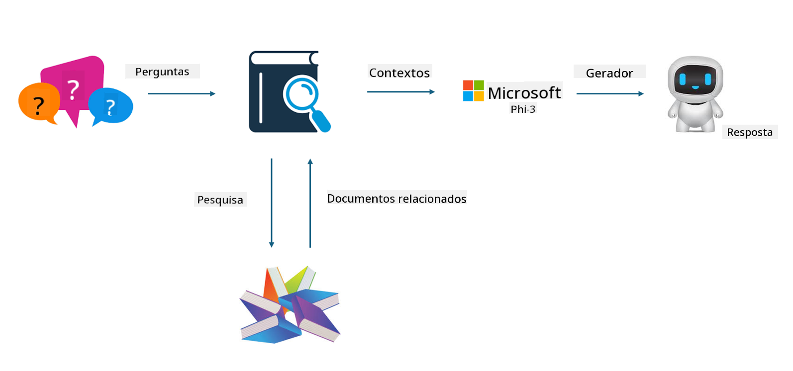

<!--
CO_OP_TRANSLATOR_METADATA:
{
  "original_hash": "e4e010400c2918557b36bb932a14004c",
  "translation_date": "2025-07-17T09:28:38+00:00",
  "source_file": "md/03.FineTuning/FineTuning_vs_RAG.md",
  "language_code": "pt"
}
-->
## Finetuning vs RAG

## Retrieval Augmented Generation

RAG é a combinação de recuperação de dados + geração de texto. Os dados estruturados e não estruturados da empresa são armazenados na base de dados vetorial. Ao procurar conteúdo relevante, é encontrado um resumo e conteúdo pertinentes para formar um contexto, e a capacidade de completamento de texto do LLM/SLM é usada para gerar o conteúdo.

## Processo RAG

## Fine-tuning
O fine-tuning baseia-se na melhoria de um determinado modelo. Não é necessário começar pelo algoritmo do modelo, mas é preciso acumular dados continuamente. Se quiser terminologia e expressões linguísticas mais precisas em aplicações industriais, o fine-tuning é a melhor opção. Contudo, se os seus dados mudam frequentemente, o fine-tuning pode tornar-se complicado.

## Como escolher
Se a nossa resposta requer a introdução de dados externos, o RAG é a melhor escolha.

Se precisa de fornecer conhecimento industrial estável e preciso, o fine-tuning será uma boa opção. O RAG privilegia a extração de conteúdo relevante, mas pode não captar sempre as nuances especializadas.

O fine-tuning exige um conjunto de dados de alta qualidade e, se for apenas um pequeno conjunto de dados, não fará grande diferença. O RAG é mais flexível.  
O fine-tuning é uma caixa preta, uma espécie de metafísica, e é difícil compreender o mecanismo interno. Mas o RAG facilita a identificação da origem dos dados, permitindo ajustar eficazmente alucinações ou erros de conteúdo e oferecendo melhor transparência.

**Aviso Legal**:  
Este documento foi traduzido utilizando o serviço de tradução automática [Co-op Translator](https://github.com/Azure/co-op-translator). Embora nos esforcemos por garantir a precisão, por favor tenha em conta que traduções automáticas podem conter erros ou imprecisões. O documento original na sua língua nativa deve ser considerado a fonte autorizada. Para informações críticas, recomenda-se tradução profissional humana. Não nos responsabilizamos por quaisquer mal-entendidos ou interpretações erradas decorrentes da utilização desta tradução.