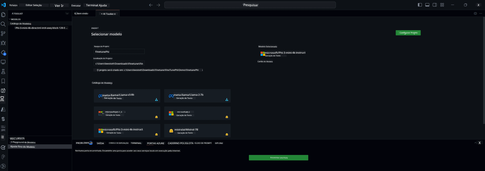

<!--
CO_OP_TRANSLATOR_METADATA:
{
  "original_hash": "c2bc0950f44919ac75a88c1a871680c2",
  "translation_date": "2025-07-17T09:09:20+00:00",
  "source_file": "md/03.FineTuning/Finetuning_VSCodeaitoolkit.md",
  "language_code": "pt"
}
-->
## Bem-vindo ao AI Toolkit para VS Code

[AI Toolkit para VS Code](https://github.com/microsoft/vscode-ai-toolkit/tree/main) reúne vários modelos do Azure AI Studio Catalog e outros catálogos como o Hugging Face. Esta ferramenta simplifica as tarefas comuns de desenvolvimento para criar aplicações de IA com ferramentas e modelos de IA generativa através de:
- Começar com a descoberta de modelos e playground.
- Ajuste fino e inferência de modelos usando recursos locais de computação.
- Ajuste fino e inferência remotos usando recursos Azure.

[Instalar AI Toolkit para VSCode](https://marketplace.visualstudio.com/items?itemName=ms-windows-ai-studio.windows-ai-studio)




**[Private Preview]** Provisionamento com um clique para Azure Container Apps para executar ajuste fino e inferência de modelos na cloud.

Vamos começar o desenvolvimento da sua aplicação de IA:

- [Bem-vindo ao AI Toolkit para VS Code](../../../../md/03.FineTuning)
- [Desenvolvimento Local](../../../../md/03.FineTuning)
  - [Preparações](../../../../md/03.FineTuning)
  - [Ativar Conda](../../../../md/03.FineTuning)
  - [Ajuste fino apenas do modelo base](../../../../md/03.FineTuning)
  - [Ajuste fino e inferência do modelo](../../../../md/03.FineTuning)
  - [Ajuste fino do modelo](../../../../md/03.FineTuning)
  - [Microsoft Olive](../../../../md/03.FineTuning)
  - [Exemplos e Recursos de Ajuste Fino](../../../../md/03.FineTuning)
- [**\[Private Preview\]** Desenvolvimento Remoto](../../../../md/03.FineTuning)
  - [Pré-requisitos](../../../../md/03.FineTuning)
  - [Configurar um Projeto de Desenvolvimento Remoto](../../../../md/03.FineTuning)
  - [Provisionar Recursos Azure](../../../../md/03.FineTuning)
  - [\[Opcional\] Adicionar Token Huggingface ao Segredo do Azure Container App](../../../../md/03.FineTuning)
  - [Executar Ajuste Fino](../../../../md/03.FineTuning)
  - [Provisionar Endpoint de Inferência](../../../../md/03.FineTuning)
  - [Desplegar o Endpoint de Inferência](../../../../md/03.FineTuning)
  - [Uso avançado](../../../../md/03.FineTuning)

## Desenvolvimento Local
### Preparações

1. Certifique-se de que o driver NVIDIA está instalado no host.
2. Execute `huggingface-cli login`, se estiver a usar HF para utilização de datasets.
3. Explicações das definições da chave `Olive` para qualquer configuração que modifique o uso de memória.

### Ativar Conda
Como estamos a usar o ambiente WSL e este é partilhado, precisa de ativar manualmente o ambiente conda. Após este passo, pode executar ajuste fino ou inferência.

```bash
conda activate [conda-env-name] 
```

### Ajuste fino apenas do modelo base
Para apenas experimentar o modelo base sem ajuste fino, pode executar este comando depois de ativar o conda.

```bash
cd inference

# Web browser interface allows to adjust a few parameters like max new token length, temperature and so on.
# User has to manually open the link (e.g. http://0.0.0.0:7860) in a browser after gradio initiates the connections.
python gradio_chat.py --baseonly
```

### Ajuste fino e inferência do modelo

Depois de abrir o workspace num dev container, abra um terminal (o caminho padrão é a raiz do projeto) e execute o comando abaixo para ajustar um LLM no dataset selecionado.

```bash
python finetuning/invoke_olive.py 
```

Os checkpoints e o modelo final serão guardados na pasta `models`.

De seguida, execute a inferência com o modelo ajustado através de chats numa `console`, `browser` ou `prompt flow`.

```bash
cd inference

# Console interface.
python console_chat.py

# Web browser interface allows to adjust a few parameters like max new token length, temperature and so on.
# User has to manually open the link (e.g. http://127.0.0.1:7860) in a browser after gradio initiates the connections.
python gradio_chat.py
```

Para usar o `prompt flow` no VS Code, consulte este [Quick Start](https://microsoft.github.io/promptflow/how-to-guides/quick-start.html).

### Ajuste fino do modelo

De seguida, faça o download do modelo adequado dependendo da disponibilidade de GPU no seu dispositivo.

Para iniciar a sessão local de ajuste fino usando QLoRA, selecione um modelo do nosso catálogo que deseja ajustar.
| Plataforma(s) | GPU disponível | Nome do modelo | Tamanho (GB) |
|---------|---------|--------|--------|
| Windows | Sim | Phi-3-mini-4k-**directml**-int4-awq-block-128-onnx | 2.13GB |
| Linux | Sim | Phi-3-mini-4k-**cuda**-int4-onnx | 2.30GB |
| Windows<br>Linux | Não | Phi-3-mini-4k-**cpu**-int4-rtn-block-32-acc-level-4-onnx | 2.72GB |

**_Nota_** Não precisa de uma conta Azure para descarregar os modelos.

O modelo Phi3-mini (int4) tem aproximadamente 2GB-3GB. Dependendo da velocidade da sua rede, o download pode demorar alguns minutos.

Comece por escolher um nome e localização para o projeto.
De seguida, selecione um modelo do catálogo. Será solicitado o download do template do projeto. Depois pode clicar em "Configurar Projeto" para ajustar várias definições.

### Microsoft Olive

Usamos [Olive](https://microsoft.github.io/Olive/why-olive.html) para executar o ajuste fino QLoRA num modelo PyTorch do nosso catálogo. Todas as definições estão pré-configuradas com valores padrão para otimizar a execução do ajuste fino localmente com uso otimizado de memória, mas podem ser ajustadas conforme o seu cenário.

### Exemplos e Recursos de Ajuste Fino

- [Guia de Introdução ao Ajuste Fino](https://learn.microsoft.com/windows/ai/toolkit/toolkit-fine-tune)
- [Ajuste fino com um Dataset HuggingFace](https://github.com/microsoft/vscode-ai-toolkit/blob/main/archive/walkthrough-hf-dataset.md)
- [Ajuste fino com Dataset Simples](https://github.com/microsoft/vscode-ai-toolkit/blob/main/archive/walkthrough-simple-dataset.md)

## **[Private Preview]** Desenvolvimento Remoto

### Pré-requisitos

1. Para executar o ajuste fino do modelo no seu ambiente remoto Azure Container App, certifique-se de que a sua subscrição tem capacidade GPU suficiente. Submeta um [ticket de suporte](https://azure.microsoft.com/support/create-ticket/) para solicitar a capacidade necessária para a sua aplicação. [Mais informações sobre capacidade GPU](https://learn.microsoft.com/azure/container-apps/workload-profiles-overview)
2. Se estiver a usar datasets privados no HuggingFace, certifique-se de que tem uma [conta HuggingFace](https://huggingface.co/?WT.mc_id=aiml-137032-kinfeylo) e [gere um token de acesso](https://huggingface.co/docs/hub/security-tokens?WT.mc_id=aiml-137032-kinfeylo)
3. Ative a flag de funcionalidade Remote Fine-tuning and Inference no AI Toolkit para VS Code
   1. Abra as Definições do VS Code selecionando *Ficheiro -> Preferências -> Definições*.
   2. Navegue até *Extensões* e selecione *AI Toolkit*.
   3. Selecione a opção *"Enable Remote Fine-tuning And Inference"*.
   4. Recarregue o VS Code para aplicar as alterações.

- [Ajuste fino remoto](https://github.com/microsoft/vscode-ai-toolkit/blob/main/archive/remote-finetuning.md)

### Configurar um Projeto de Desenvolvimento Remoto
1. Execute a paleta de comandos `AI Toolkit: Focus on Resource View`.
2. Navegue até *Model Fine-tuning* para aceder ao catálogo de modelos. Atribua um nome ao seu projeto e selecione a sua localização na máquina. Depois, clique no botão *"Configure Project"*.
3. Configuração do Projeto
    1. Evite ativar a opção *"Fine-tune locally"*.
    2. As definições de configuração do Olive aparecerão com valores padrão pré-definidos. Ajuste e preencha estas configurações conforme necessário.
    3. Prossiga para *Generate Project*. Esta etapa usa o WSL e envolve a criação de um novo ambiente Conda, preparando para futuras atualizações que incluirão Dev Containers.
4. Clique em *"Relaunch Window In Workspace"* para abrir o seu projeto de desenvolvimento remoto.

> **Nota:** O projeto funciona atualmente localmente ou remotamente dentro do AI Toolkit para VS Code. Se escolher *"Fine-tune locally"* durante a criação do projeto, este funcionará exclusivamente no WSL sem capacidades de desenvolvimento remoto. Por outro lado, se não ativar *"Fine-tune locally"*, o projeto ficará restrito ao ambiente remoto Azure Container App.

### Provisionar Recursos Azure
Para começar, precisa de provisionar o Recurso Azure para ajuste fino remoto. Faça isso executando o comando `AI Toolkit: Provision Azure Container Apps job for fine-tuning` na paleta de comandos.

Acompanhe o progresso do provisionamento através do link exibido no canal de saída.

### [Opcional] Adicionar Token Huggingface ao Segredo do Azure Container App
Se estiver a usar datasets privados HuggingFace, defina o seu token HuggingFace como uma variável de ambiente para evitar a necessidade de login manual no Hugging Face Hub.
Pode fazer isso usando o comando `AI Toolkit: Add Azure Container Apps Job secret for fine-tuning`. Com este comando, defina o nome do segredo como [`HF_TOKEN`](https://huggingface.co/docs/huggingface_hub/package_reference/environment_variables#hftoken) e use o seu token Hugging Face como valor do segredo.

### Executar Ajuste Fino
Para iniciar o trabalho de ajuste fino remoto, execute o comando `AI Toolkit: Run fine-tuning`.

Para ver os logs do sistema e da consola, pode visitar o portal Azure usando o link no painel de saída (mais passos em [Ver e Consultar Logs no Azure](https://aka.ms/ai-toolkit/remote-provision#view-and-query-logs-on-azure)). Ou pode ver os logs da consola diretamente no painel de saída do VSCode executando o comando `AI Toolkit: Show the running fine-tuning job streaming logs`.
> **Nota:** O trabalho pode estar em fila devido a recursos insuficientes. Se o log não for exibido, execute o comando `AI Toolkit: Show the running fine-tuning job streaming logs`, aguarde um pouco e execute novamente para reconectar ao streaming do log.

Durante este processo, será usado QLoRA para ajuste fino, que criará adaptadores LoRA para o modelo usar durante a inferência.
Os resultados do ajuste fino serão armazenados no Azure Files.

### Provisionar Endpoint de Inferência
Depois de os adaptadores serem treinados no ambiente remoto, use uma aplicação simples Gradio para interagir com o modelo.
Tal como no processo de ajuste fino, precisa de configurar os Recursos Azure para inferência remota executando o comando `AI Toolkit: Provision Azure Container Apps for inference` na paleta de comandos.

Por padrão, a subscrição e o grupo de recursos para inferência devem ser os mesmos usados para o ajuste fino. A inferência usará o mesmo ambiente Azure Container App e acederá ao modelo e adaptador de modelo armazenados no Azure Files, gerados durante o passo de ajuste fino.

### Desplegar o Endpoint de Inferência
Se desejar rever o código de inferência ou recarregar o modelo de inferência, execute o comando `AI Toolkit: Deploy for inference`. Isto sincronizará o seu código mais recente com o Azure Container App e reiniciará a réplica.

Após o sucesso do deployment, pode aceder à API de inferência clicando no botão "*Go to Inference Endpoint*" exibido na notificação do VSCode. Ou, o endpoint da API web pode ser encontrado em `ACA_APP_ENDPOINT` no ficheiro `./infra/inference.config.json` e no painel de saída. Está agora pronto para avaliar o modelo usando este endpoint.

### Uso avançado
Para mais informações sobre desenvolvimento remoto com AI Toolkit, consulte a documentação [Ajuste fino de modelos remotamente](https://aka.ms/ai-toolkit/remote-provision) e [Inferência com o modelo ajustado](https://aka.ms/ai-toolkit/remote-inference).

**Aviso Legal**:  
Este documento foi traduzido utilizando o serviço de tradução automática [Co-op Translator](https://github.com/Azure/co-op-translator). Embora nos esforcemos pela precisão, por favor tenha em conta que traduções automáticas podem conter erros ou imprecisões. O documento original na sua língua nativa deve ser considerado a fonte autorizada. Para informações críticas, recomenda-se tradução profissional humana. Não nos responsabilizamos por quaisquer mal-entendidos ou interpretações incorretas decorrentes da utilização desta tradução.