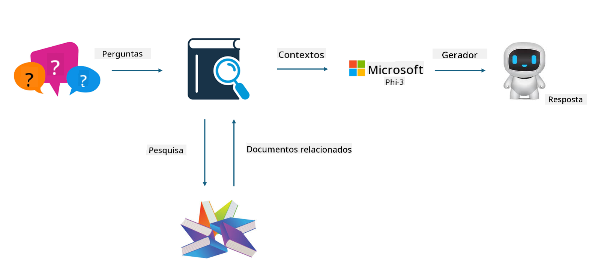

<!--
CO_OP_TRANSLATOR_METADATA:
{
  "original_hash": "743d7e9cb9c4e8ea642d77bee657a7fa",
  "translation_date": "2025-05-09T22:25:55+00:00",
  "source_file": "md/03.FineTuning/LetPhi3gotoIndustriy.md",
  "language_code": "pt"
}
-->
# **Deixe o Phi-3 se tornar um especialista da indústria**

Para aplicar o modelo Phi-3 em uma indústria, é necessário adicionar dados empresariais específicos da indústria ao modelo Phi-3. Temos duas opções diferentes: a primeira é RAG (Retrieval Augmented Generation) e a segunda é Fine Tuning.

## **RAG vs Fine-Tuning**

### **Retrieval Augmented Generation**

RAG é a combinação de recuperação de dados + geração de texto. Os dados estruturados e não estruturados da empresa são armazenados no banco de dados vetorial. Ao buscar conteúdo relevante, o resumo e o conteúdo relacionados são encontrados para formar um contexto, e a capacidade de completude de texto do LLM/SLM é combinada para gerar o conteúdo.

### **Fine-tuning**

Fine-tuning é baseado na melhoria de um determinado modelo. Não é necessário começar pelo algoritmo do modelo, mas os dados precisam ser acumulados continuamente. Se você deseja terminologia e expressões linguísticas mais precisas em aplicações industriais, fine-tuning é a melhor escolha. Porém, se seus dados mudam com frequência, fine-tuning pode se tornar complicado.

### **Como escolher**

1. Se a nossa resposta requer a introdução de dados externos, RAG é a melhor escolha

2. Se você precisa entregar conhecimento industrial estável e preciso, fine-tuning será uma boa escolha. RAG prioriza puxar conteúdo relevante, mas pode não captar sempre as nuances especializadas.

3. Fine-tuning exige um conjunto de dados de alta qualidade e, se for apenas uma pequena quantidade de dados, não fará muita diferença. RAG é mais flexível.

4. Fine-tuning é uma caixa preta, uma espécie de metafísica, e é difícil entender seu mecanismo interno. Já o RAG facilita encontrar a fonte dos dados, permitindo ajustar eficazmente alucinações ou erros de conteúdo e oferecendo melhor transparência.

### **Cenários**

1. Indústrias verticais que exigem vocabulário e expressões profissionais específicas, ***Fine-tuning*** será a melhor escolha

2. Sistemas de QA, que envolvem a síntese de diferentes pontos de conhecimento, ***RAG*** será a melhor escolha

3. A combinação de fluxo de negócios automatizado ***RAG + Fine-tuning*** é a melhor escolha

## **Como usar RAG**

Um banco de dados vetorial é uma coleção de dados armazenados em forma matemática. Bancos de dados vetoriais facilitam que modelos de machine learning lembrem entradas anteriores, permitindo que o machine learning apoie casos de uso como busca, recomendações e geração de texto. Os dados podem ser identificados com base em métricas de similaridade, em vez de correspondências exatas, permitindo que os modelos compreendam o contexto dos dados.

O banco de dados vetorial é a chave para realizar o RAG. Podemos converter dados em armazenamento vetorial através de modelos vetoriais como text-embedding-3, jina-ai-embedding, etc.

Saiba mais sobre como criar aplicações RAG em [https://github.com/microsoft/Phi-3CookBook](https://github.com/microsoft/Phi-3CookBook?WT.mc_id=aiml-138114-kinfeylo) 

## **Como usar Fine-tuning**

Os algoritmos mais usados em Fine-tuning são Lora e QLora. Como escolher?
- [Saiba mais com este notebook de exemplo](../../../../code/04.Finetuning/Phi_3_Inference_Finetuning.ipynb)
- [Exemplo de FineTuning em Python](../../../../code/04.Finetuning/FineTrainingScript.py)

### **Lora e QLora**

LoRA (Low-Rank Adaptation) e QLoRA (Quantized Low-Rank Adaptation) são técnicas usadas para fine-tuning de grandes modelos de linguagem (LLMs) utilizando Parameter Efficient Fine Tuning (PEFT). Técnicas PEFT são projetadas para treinar modelos de forma mais eficiente do que os métodos tradicionais.  
LoRA é uma técnica de fine-tuning independente que reduz o uso de memória aplicando uma aproximação de baixa ordem à matriz de atualização de pesos. Oferece tempos rápidos de treinamento e mantém desempenho próximo ao do fine-tuning tradicional.

QLoRA é uma versão estendida do LoRA que incorpora técnicas de quantização para reduzir ainda mais o uso de memória. QLoRA quantiza a precisão dos parâmetros de peso no LLM pré-treinado para precisão de 4 bits, o que é mais eficiente em memória do que LoRA. No entanto, o treinamento com QLoRA é cerca de 30% mais lento que o LoRA devido aos passos adicionais de quantização e desquantização.

QLoRA usa LoRA como um acessório para corrigir os erros introduzidos durante a quantização. QLoRA permite o fine-tuning de modelos massivos com bilhões de parâmetros em GPUs relativamente pequenas e disponíveis. Por exemplo, QLoRA pode fazer fine-tuning de um modelo com 70 bilhões de parâmetros que normalmente exigiria 36 GPUs com apenas 2 GPUs.

**Aviso Legal**:  
Este documento foi traduzido utilizando o serviço de tradução automática [Co-op Translator](https://github.com/Azure/co-op-translator). Embora nos esforcemos para garantir a precisão, esteja ciente de que traduções automáticas podem conter erros ou imprecisões. O documento original em seu idioma nativo deve ser considerado a fonte autorizada. Para informações críticas, recomenda-se a tradução profissional humana. Não nos responsabilizamos por quaisquer mal-entendidos ou interpretações incorretas decorrentes do uso desta tradução.