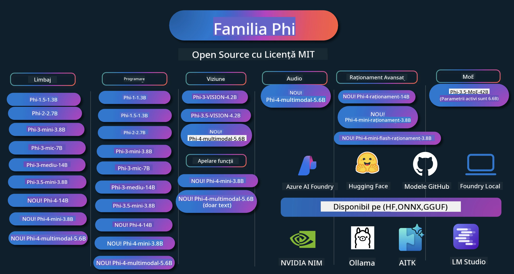

<!--
CO_OP_TRANSLATOR_METADATA:
{
  "original_hash": "c2e4b490f4bd424b095f21e38c6af33b",
  "translation_date": "2026-01-05T09:49:17+00:00",
  "source_file": "README.md",
  "language_code": "ro"
}
-->
# Phi Cookbook: Exemple practice cu modelele Phi de la Microsoft

[](https://codespaces.new/microsoft/phicookbook)
[](https://vscode.dev/redirect?url=vscode://ms-vscode-remote.remote-containers/cloneInVolume?url=https://github.com/microsoft/phicookbook)

[](https://GitHub.com/microsoft/phicookbook/graphs/contributors/?WT.mc_id=aiml-137032-kinfeylo)
[](https://GitHub.com/microsoft/phicookbook/issues/?WT.mc_id=aiml-137032-kinfeylo)
[](https://GitHub.com/microsoft/phicookbook/pulls/?WT.mc_id=aiml-137032-kinfeylo)
[](http://makeapullrequest.com?WT.mc_id=aiml-137032-kinfeylo)

[](https://GitHub.com/microsoft/phicookbook/watchers/?WT.mc_id=aiml-137032-kinfeylo)
[](https://GitHub.com/microsoft/phicookbook/network/?WT.mc_id=aiml-137032-kinfeylo)
[](https://GitHub.com/microsoft/phicookbook/stargazers/?WT.mc_id=aiml-137032-kinfeylo)

[](https://discord.com/invite/ByRwuEEgH4)

Phi este o serie de modele AI open source dezvoltate de Microsoft. 

În prezent, Phi este cel mai puternic și rentabil model mic de limbaj (SLM), având benchmark-uri foarte bune în multi-limbaj, raționament, generare de text/chat, programare, imagini, audio și alte scenarii.

Poți implementa Phi în cloud sau pe dispozitive edge și poți construi cu ușurință aplicații AI generative cu putere de calcul limitată.

Urmează acești pași pentru a începe să folosești aceste resurse:
1. **Fă Fork Repository-ului**: Click pe [](https://GitHub.com/microsoft/phicookbook/network/?WT.mc_id=aiml-137032-kinfeylo)
2. **Clonați Repository-ul**: `git clone https://github.com/microsoft/PhiCookBook.git`
3. [**Alătură-te comunității Microsoft AI pe Discord și întâlnește experți și dezvoltatori**](https://discord.com/invite/ByRwuEEgH4?WT.mc_id=aiml-137032-kinfeylo)



### 🌐 Suport Multi-Limbaj

#### Suportat prin GitHub Action (automatizat și mereu actualizat)

<!-- CO-OP TRANSLATOR LANGUAGES TABLE START -->
[Arabă](../ar/README.md) | [Bengaleză](../bn/README.md) | [Bulgară](../bg/README.md) | [Burmese (Myanmar)](../my/README.md) | [Chineză (simplificată)](../zh/README.md) | [Chineză (tradițională, Hong Kong)](../hk/README.md) | [Chineză (tradițională, Macau)](../mo/README.md) | [Chineză (tradițională, Taiwan)](../tw/README.md) | [Croată](../hr/README.md) | [Cehă](../cs/README.md) | [Daneză](../da/README.md) | [Olandeză](../nl/README.md) | [Estonă](../et/README.md) | [Finlandeză](../fi/README.md) | [Franceză](../fr/README.md) | [Germană](../de/README.md) | [Greacă](../el/README.md) | [Ebraică](../he/README.md) | [Hindi](../hi/README.md) | [Maghiară](../hu/README.md) | [Indoneziană](../id/README.md) | [Italiană](../it/README.md) | [Japoneză](../ja/README.md) | [Kannada](../kn/README.md) | [Coreeană](../ko/README.md) | [Lituaniană](../lt/README.md) | [Malaysiană](../ms/README.md) | [Malayalam](../ml/README.md) | [Marathi](../mr/README.md) | [Nepaleză](../ne/README.md) | [Pidgin Nigerian](../pcm/README.md) | [Norvegiană](../no/README.md) | [Persană (Farsi)](../fa/README.md) | [Poloneză](../pl/README.md) | [Portugheză (Brazilia)](../br/README.md) | [Portugheză (Portugalia)](../pt/README.md) | [Punjabi (Gurmukhi)](../pa/README.md) | [Română](./README.md) | [Rusă](../ru/README.md) | [Sârbă (chirilică)](../sr/README.md) | [Slovacă](../sk/README.md) | [Slovenă](../sl/README.md) | [Spaniolă](../es/README.md) | [Swahili](../sw/README.md) | [Suedeză](../sv/README.md) | [Tagalog (Filipineză)](../tl/README.md) | [Tamail](../ta/README.md) | [Telugu](../te/README.md) | [Thailandeză](../th/README.md) | [Turcă](../tr/README.md) | [Ucrainiană](../uk/README.md) | [Urdu](../ur/README.md) | [Vietnameză](../vi/README.md)

> **Preferi să clonezi local?**

> Acest repository include traduceri în peste 50 de limbi, ceea ce mărește semnificativ dimensiunea de descărcare. Pentru a clona fără traduceri, folosește sparse checkout:
> ```bash
> git clone --filter=blob:none --sparse https://github.com/microsoft/PhiCookBook.git
> cd PhiCookBook
> git sparse-checkout set --no-cone '/*' '!translations' '!translated_images'
> ```
> Aceasta îți oferă tot ce ai nevoie pentru a finaliza cursul cu o descărcare mult mai rapidă.
<!-- CO-OP TRANSLATOR LANGUAGES TABLE END -->

## Cuprins

- Introducere
  - [Bine ai venit în familia Phi](./md/01.Introduction/01/01.PhiFamily.md)
  - [Configurarea mediului](./md/01.Introduction/01/01.EnvironmentSetup.md)
  - [Înțelegerea tehnologiilor cheie](./md/01.Introduction/01/01.Understandingtech.md)
  - [Siguranța AI pentru modelele Phi](./md/01.Introduction/01/01.AISafety.md)
  - [Suport hardware pentru Phi](./md/01.Introduction/01/01.Hardwaresupport.md)
  - [Modelele Phi & Disponibilitate pe platforme](./md/01.Introduction/01/01.Edgeandcloud.md)
  - [Folosirea Guidance-ai și Phi](./md/01.Introduction/01/01.Guidance.md)
  - [Modele GitHub Marketplace](https://github.com/marketplace/models)
  - [Catalogul modelelor Azure AI](https://ai.azure.com)

- Inferență Phi în diverse medii
    -  [Hugging face](./md/01.Introduction/02/01.HF.md)
    -  [Modele GitHub](./md/01.Introduction/02/02.GitHubModel.md)
    -  [Catalogul modelelor Azure AI Foundry](./md/01.Introduction/02/03.AzureAIFoundry.md)
    -  [Ollama](./md/01.Introduction/02/04.Ollama.md)
    -  [AI Toolkit VSCode (AITK)](./md/01.Introduction/02/05.AITK.md)
    -  [NVIDIA NIM](./md/01.Introduction/02/06.NVIDIA.md)
    -  [Foundry Local](./md/01.Introduction/02/07.FoundryLocal.md)

- Inferență Phi Family
    - [Inferență Phi în iOS](./md/01.Introduction/03/iOS_Inference.md)
    - [Inferență Phi în Android](./md/01.Introduction/03/Android_Inference.md)
    - [Inferență Phi în Jetson](./md/01.Introduction/03/Jetson_Inference.md)
    - [Inferență Phi în AI PC](./md/01.Introduction/03/AIPC_Inference.md)
    - [Inferență Phi cu Apple MLX Framework](./md/01.Introduction/03/MLX_Inference.md)
    - [Inferență Phi în server local](./md/01.Introduction/03/Local_Server_Inference.md)
    - [Inferență Phi în server la distanță folosind AI Toolkit](./md/01.Introduction/03/Remote_Interence.md)
    - [Inferență Phi cu Rust](./md/01.Introduction/03/Rust_Inference.md)
    - [Inferență Phi--Vision în local](./md/01.Introduction/03/Vision_Inference.md)
    - [Inferență Phi cu Kaito AKS, Azure Containers (suport oficial)](./md/01.Introduction/03/Kaito_Inference.md)
-  [Cuantificarea familiei Phi](./md/01.Introduction/04/QuantifyingPhi.md)
    - [Cuantificare Phi-3.5 / 4 folosind llama.cpp](./md/01.Introduction/04/UsingLlamacppQuantifyingPhi.md)
    - [Cuantificare Phi-3.5 / 4 folosind extensii Generative AI pentru onnxruntime](./md/01.Introduction/04/UsingORTGenAIQuantifyingPhi.md)
    - [Cuantificare Phi-3.5 / 4 folosind Intel OpenVINO](./md/01.Introduction/04/UsingIntelOpenVINOQuantifyingPhi.md)
    - [Cuantificare Phi-3.5 / 4 folosind Apple MLX Framework](./md/01.Introduction/04/UsingAppleMLXQuantifyingPhi.md)

- Evaluare Phi
    - [AI Responsabil](./md/01.Introduction/05/ResponsibleAI.md)
    - [Azure AI Foundry pentru evaluare](./md/01.Introduction/05/AIFoundry.md)
    - [Folosirea Promptflow pentru evaluare](./md/01.Introduction/05/Promptflow.md)
 
- RAG cu Azure AI Search
    - [Cum să folosești Phi-4-mini și Phi-4-multimodal(RAG) cu Azure AI Search](https://github.com/microsoft/PhiCookBook/blob/main/code/06.E2E/E2E_Phi-4-RAG-Azure-AI-Search.ipynb)

- Exemple de dezvoltare aplicații Phi
  - Aplicații de text & chat
    - Exemple Phi-4 🆕
      - [📓] [Chat cu modelul Phi-4-mini ONNX](./md/02.Application/01.TextAndChat/Phi4/ChatWithPhi4ONNX/README.md)
      - [Chat cu model local Phi-4 ONNX .NET](../../md/04.HOL/dotnet/src/LabsPhi4-Chat-01OnnxRuntime)
      - [Aplicație console Chat .NET cu Phi-4 ONNX folosind Semantic Kernel](../../md/04.HOL/dotnet/src/LabsPhi4-Chat-02SK)
    - Exemple Phi-3 / 3.5
      - [Chatbot local în browser folosind Phi3, ONNX Runtime Web și WebGPU](https://github.com/microsoft/onnxruntime-inference-examples/tree/main/js/chat)
      - [Chat OpenVino](./md/02.Application/01.TextAndChat/Phi3/E2E_OpenVino_Chat.md)
      - [Model Multi - Phi-3-mini Interactiv și OpenAI Whisper](./md/02.Application/01.TextAndChat/Phi3/E2E_Phi-3-mini_with_whisper.md)
      - [MLFlow - Construirea unui wrapper și utilizarea Phi-3 cu MLFlow](./md//02.Application/01.TextAndChat/Phi3/E2E_Phi-3-MLflow.md)
      - [Optimizarea Modelului - Cum să optimizezi modelul Phi-3-min pentru ONNX Runtime Web cu Olive](https://github.com/microsoft/Olive/tree/main/examples/phi3)
      - [Aplicație WinUI3 cu Phi-3 mini-4k-instruct-onnx](https://github.com/microsoft/Phi3-Chat-WinUI3-Sample/)
      -[Exemplu Aplicație Note AI Multi Model WinUI3](https://github.com/microsoft/ai-powered-notes-winui3-sample)
      - [Fine-tune și Integrare modele custom Phi-3 cu Prompt flow](./md/02.Application/01.TextAndChat/Phi3/E2E_Phi-3-FineTuning_PromptFlow_Integration.md)
      - [Fine-tune și Integrare modele custom Phi-3 cu Prompt flow în Azure AI Foundry](./md/02.Application/01.TextAndChat/Phi3/E2E_Phi-3-FineTuning_PromptFlow_Integration_AIFoundry.md)
      - [Evaluarea modelului Phi-3 / Phi-3.5 fine-tuned în Azure AI Foundry concentrat pe principiile AI responsabile Microsoft](./md/02.Application/01.TextAndChat/Phi3/E2E_Phi-3-Evaluation_AIFoundry.md)
      - [📓] [Exemplu de predicție a limbajului Phi-3.5-mini-instruct (chineză/engleză)](./md/02.Application/01.TextAndChat/Phi3/phi3-instruct-demo.ipynb)
      - [Chatbot Phi-3.5-Instruct WebGPU RAG](./md/02.Application/01.TextAndChat/Phi3/WebGPUWithPhi35Readme.md)
      - [Utilizarea GPU Windows pentru crearea de soluții Prompt flow cu Phi-3.5-Instruct ONNX](./md/02.Application/01.TextAndChat/Phi3/UsingPromptFlowWithONNX.md)
      - [Folosește Microsoft Phi-3.5 tflite pentru a crea o aplicație Android](./md/02.Application/01.TextAndChat/Phi3/UsingPhi35TFLiteCreateAndroidApp.md)
      - [Exemplu Q&A .NET utilizând model local ONNX Phi-3 folosind Microsoft.ML.OnnxRuntime](../../md/04.HOL/dotnet/src/LabsPhi301)
      - [Aplicație chat consolă .NET cu Semantic Kernel și Phi-3](../../md/04.HOL/dotnet/src/LabsPhi302)

  - Exemple cod bazate pe Azure AI Inference SDK 
    - Exemple Phi-4 🆕
      - [📓] [Generarea codului proiectului folosind Phi-4-multimodal](./md/02.Application/02.Code/Phi4/GenProjectCode/README.md)
    - Exemple Phi-3 / 3.5
      - [Construiește propriul tău Visual Studio Code GitHub Copilot Chat cu familia Microsoft Phi-3](./md/02.Application/02.Code/Phi3/VSCodeExt/README.md)
      - [Creează propriul tău agent Visual Studio Code Chat Copilot cu Phi-3.5 folosind modelele GitHub](/md/02.Application/02.Code/Phi3/CreateVSCodeChatAgentWithGitHubModels.md)

  - Exemple Raționament Avansat
    - Exemple Phi-4 🆕
      - [📓] [Exemple Phi-4-mini-raționament sau Phi-4-raționament](./md/02.Application/03.AdvancedReasoning/Phi4/AdvancedResoningPhi4mini/README.md)
      - [📓] [Fine-tuning Phi-4-mini-raționament cu Microsoft Olive](./md/02.Application/03.AdvancedReasoning/Phi4/AdvancedResoningPhi4mini/olive_ft_phi_4_reasoning_with_medicaldata.ipynb)
      - [📓] [Fine-tuning Phi-4-mini-raționament cu Apple MLX](./md/02.Application/03.AdvancedReasoning/Phi4/AdvancedResoningPhi4mini/mlx_ft_phi_4_reasoning_with_medicaldata.ipynb)
      - [📓] [Phi-4-mini-raționament cu modelele GitHub](./md/02.Application/02.Code/Phi4r/github_models_inference.ipynb)
      - [📓] [Phi-4-mini-raționament cu modelele Azure AI Foundry](./md/02.Application/02.Code/Phi4r/azure_models_inference.ipynb)
  - Demos
      - [Demos Phi-4-mini găzduite pe Hugging Face Spaces](https://huggingface.co/spaces/microsoft/phi-4-mini?WT.mc_id=aiml-137032-kinfeylo)
      - [Demos Phi-4-multimodal găzduite pe Hugginge Face Spaces](https://huggingface.co/spaces/microsoft/phi-4-multimodal?WT.mc_id=aiml-137032-kinfeylo)
  - Exemple Vizuale
    - Exemple Phi-4 🆕
      - [📓] [Folosește Phi-4-multimodal pentru a citi imagini și a genera cod](./md/02.Application/04.Vision/Phi4/CreateFrontend/README.md) 
    - Exemple Phi-3 / 3.5
      -  [📓][Phi-3-vision text din imagine în text](./md/02.Application/04.Vision/Phi3/E2E_Phi-3-vision-image-text-to-text-online-endpoint.ipynb)
      - [Phi-3-vision-ONNX](https://onnxruntime.ai/docs/genai/tutorials/phi3-v.html)
      - [📓][Phi-3-vision CLIP Embedding](./md/02.Application/04.Vision/Phi3/E2E_Phi-3-vision-image-text-to-text-online-endpoint.ipynb)
      - [DEMO: Phi-3 Reciclare](https://github.com/jennifermarsman/PhiRecycling/)
      - [Phi-3-vision - Asistent vizual de limbaj - cu Phi3-Vision și OpenVINO](https://docs.openvino.ai/nightly/notebooks/phi-3-vision-with-output.html)
      - [Phi-3 Vision Nvidia NIM](./md/02.Application/04.Vision/Phi3/E2E_Nvidia_NIM_Vision.md)
      - [Phi-3 Vision OpenVino](./md/02.Application/04.Vision/Phi3/E2E_OpenVino_Phi3Vision.md)
      - [📓][Phi-3.5 Vision multi-frame sau multi-imagine exemplu](./md/02.Application/04.Vision/Phi3/phi3-vision-demo.ipynb)
      - [Model Local ONNX Phi-3 Vision folosind Microsoft.ML.OnnxRuntime .NET](../../md/04.HOL/dotnet/src/LabsPhi303)
      - [Model local PHP-3 Vision ONNX cu meniu folosind Microsoft.ML.OnnxRuntime .NET](../../md/04.HOL/dotnet/src/LabsPhi304)

  - Exemple Matematice
    -  Exemple Phi-4-Mini-Flash-Reasoning-Instruct 🆕 [Demo matematică cu Phi-4-Mini-Flash-Reasoning-Instruct](./md/02.Application/09.Math/MathDemo.ipynb)

  - Exemple Audio
    - Exemple Phi-4 🆕
      - [📓] [Extrage transcrieri audio folosind Phi-4-multimodal](./md/02.Application/05.Audio/Phi4/Transciption/README.md)
      - [📓] [Exemplu Audio Phi-4-multimodal](./md/02.Application/05.Audio/Phi4/Siri/demo.ipynb)
      - [📓] [Exemplu de traducere vocală Phi-4-multimodal](./md/02.Application/05.Audio/Phi4/Translate/demo.ipynb)
      - [Aplicație consolă .NET folosind Phi-4-multimodal Audio pentru a analiza un fișier audio și a genera transcriere](../../md/04.HOL/dotnet/src/LabsPhi4-MultiModal-02Audio)

  - Exemple MOE
    - Exemple Phi-3 / 3.5
      - [📓] [Modele Mixture of Experts (MoEs) Phi-3.5 exemplu Social Media](./md/02.Application/06.MoE/Phi3/phi3_moe_demo.ipynb)
      - [📓] [Construirea unui pipeline Retrieval-Augmented Generation (RAG) cu NVIDIA NIM Phi-3 MOE, Azure AI Search și LlamaIndex](./md/02.Application/06.MoE/Phi3/azure-ai-search-nvidia-rag.ipynb)
      - 
  - Exemple Funcții Calling
    - Exemple Phi-4 🆕
      -  [📓] [Utilizarea Function Calling cu Phi-4-mini](./md/02.Application/07.FunctionCalling/Phi4/FunctionCallingBasic/README.md)
      -  [📓] [Utilizarea Function Calling pentru a crea multi-agenti cu Phi-4-mini](./md/02.Application/07.FunctionCalling/Phi4/Multiagents/Phi_4_mini_multiagent.ipynb)
      -  [📓] [Utilizarea Function Calling cu Ollama](./md/02.Application/07.FunctionCalling/Phi4/Ollama/ollama_functioncalling.ipynb)
      -  [📓] [Utilizarea Function Calling cu ONNX](./md/02.Application/07.FunctionCalling/Phi4/ONNX/onnx_parallel_functioncalling.ipynb)
  - Exemple Mixare Multimodală
    - Exemple Phi-4 🆕
      -  [📓] [Utilizarea Phi-4-multimodal ca jurnalist tehnologic](./md/02.Application/08.Multimodel/Phi4/TechJournalist/phi_4_mm_audio_text_publish_news.ipynb)
      - [Aplicație consolă .NET care folosește Phi-4-multimodal pentru a analiza imagini](../../md/04.HOL/dotnet/src/LabsPhi4-MultiModal-01Images)

- Fine-tuning Modele Phi
  - [Scenarii Fine-tuning](./md/03.FineTuning/FineTuning_Scenarios.md)
  - [Fine-tuning vs RAG](./md/03.FineTuning/FineTuning_vs_RAG.md)
  - [Fine-tuning Lasă Phi-3 să devină expert în industrie](./md/03.FineTuning/LetPhi3gotoIndustriy.md)
  - [Fine-tuning Phi-3 cu AI Toolkit pentru VS Code](./md/03.FineTuning/Finetuning_VSCodeaitoolkit.md)
  - [Fine-tuning Phi-3 cu Azure Machine Learning Service](./md/03.FineTuning/Introduce_AzureML.md)
  - [Fine-tuning Phi-3 cu Lora](./md/03.FineTuning/FineTuning_Lora.md)
  - [Fine-tuning Phi-3 cu QLora](./md/03.FineTuning/FineTuning_Qlora.md)
  - [Fine-tuning Phi-3 cu Azure AI Foundry](./md/03.FineTuning/FineTuning_AIFoundry.md)
  - [Fine-tuning Phi-3 cu Azure ML CLI/SDK](./md/03.FineTuning/FineTuning_MLSDK.md)
  - [Fine-tuning cu Microsoft Olive](./md/03.FineTuning/FineTuning_MicrosoftOlive.md)
  - [Fine-tuning cu Microsoft Olive Hands-On Lab](./md/03.FineTuning/olive-lab/readme.md)
  - [Fine-tuning Phi-3-vision cu Weights and Bias](./md/03.FineTuning/FineTuning_Phi-3-visionWandB.md)
  - [Fine-tuning Phi-3 cu Apple MLX Framework](./md/03.FineTuning/FineTuning_MLX.md)
  - [Fine-tuning Phi-3-vision (suport oficial)](./md/03.FineTuning/FineTuning_Vision.md)
  - [Fine-Tuning Phi-3 cu Kaito AKS, containere Azure (suport oficial)](./md/03.FineTuning/FineTuning_Kaito.md)
  - [Fine-Tuning Phi-3 și 3.5 Vision](https://github.com/2U1/Phi3-Vision-Finetune)

- Laborator Practic
  - [Explorând modele de ultimă generație: LLM, SLM, dezvoltare locală și altele](https://github.com/microsoft/aitour-exploring-cutting-edge-models)
  - [Descoperă potențialul NLP: Fine-Tuning cu Microsoft Olive](https://github.com/azure/Ignite_FineTuning_workshop)

- Lucrări și publicații academice
  - [Manualele sunt tot ce ai nevoie II: raport tehnic phi-1.5](https://arxiv.org/abs/2309.05463)
  - [Raport tehnic Phi-3: un model de limbaj foarte capabil local pe telefonul tău](https://arxiv.org/abs/2404.14219)
  - [Raport tehnic Phi-4](https://arxiv.org/abs/2412.08905)
  - [Raport tehnic Phi-4-Mini: modele compacte dar puternice multimodale de limbaj prin amestec de LoRAs](https://arxiv.org/abs/2503.01743)
  - [Optimizarea modelelor mici de limbaj pentru apeluri funcționale în vehicul](https://arxiv.org/abs/2501.02342)
  - [(WhyPHI) Fine-Tuning PHI-3 pentru răspunsuri la întrebări cu alegere multiplă: metodologie, rezultate și provocări](https://arxiv.org/abs/2501.01588)
  - [Raport tehnic Phi-4-reasoning](https://www.microsoft.com/en-us/research/wp-content/uploads/2025/04/phi_4_reasoning.pdf)
  - [Raport tehnic Phi-4-mini-reasoning](https://huggingface.co/microsoft/Phi-4-mini-reasoning/blob/main/Phi-4-Mini-Reasoning.pdf)

## Utilizarea modelelor Phi

### Phi pe Azure AI Foundry

Puteți învăța cum să folosiți Microsoft Phi și cum să construiți soluții E2E pe diferite dispozitive hardware. Pentru a experimenta Phi pe cont propriu, începeți prin a testa modelele și personaliza Phi pentru scenariile dvs. folosind [Catalogul modelelor Azure AI Foundry](https://aka.ms/phi3-azure-ai). Puteți afla mai multe la Început cu [Azure AI Foundry](/md/02.QuickStart/AzureAIFoundry_QuickStart.md)

**Playground**  
Fiecare model are un playground dedicat pentru a testa modelul [Azure AI Playground](https://aka.ms/try-phi3).

### Phi pe modelele GitHub

Puteți învăța cum să folosiți Microsoft Phi și cum să construiți soluții E2E pe diferite dispozitive hardware. Pentru a experimenta Phi pe cont propriu, începeți prin a testa modelul și personaliza Phi pentru scenariile dvs. folosind [Catalogul modelelor GitHub](https://github.com/marketplace/models?WT.mc_id=aiml-137032-kinfeylo). Puteți afla mai multe la Început cu [Catalogul modelelor GitHub](/md/02.QuickStart/GitHubModel_QuickStart.md)

**Playground**  
Fiecare model are un [playground dedicat pentru a testa modelul](/md/02.QuickStart/GitHubModel_QuickStart.md).

### Phi pe Hugging Face

De asemenea, puteți găsi modelul pe [Hugging Face](https://huggingface.co/microsoft)

**Playground**  
[Hugging Chat playground](https://huggingface.co/chat/models/microsoft/Phi-3-mini-4k-instruct)

## 🎒 Alte cursuri

Echipa noastră produce și alte cursuri! Vezi:

<!-- CO-OP TRANSLATOR OTHER COURSES START -->
### LangChain  
[](https://aka.ms/langchain4j-for-beginners)  
[](https://aka.ms/langchainjs-for-beginners?WT.mc_id=m365-94501-dwahlin)

---

### Azure / Edge / MCP / Agenți  
[](https://github.com/microsoft/AZD-for-beginners?WT.mc_id=academic-105485-koreyst)  
[](https://github.com/microsoft/edgeai-for-beginners?WT.mc_id=academic-105485-koreyst)  
[](https://github.com/microsoft/mcp-for-beginners?WT.mc_id=academic-105485-koreyst)  
[](https://github.com/microsoft/ai-agents-for-beginners?WT.mc_id=academic-105485-koreyst)

---

### Seria Inteligență Artificială Generativă  
[](https://github.com/microsoft/generative-ai-for-beginners?WT.mc_id=academic-105485-koreyst)  
[-9333EA?style=for-the-badge&labelColor=E5E7EB&color=9333EA)](https://github.com/microsoft/Generative-AI-for-beginners-dotnet?WT.mc_id=academic-105485-koreyst)  
[-C084FC?style=for-the-badge&labelColor=E5E7EB&color=C084FC)](https://github.com/microsoft/generative-ai-for-beginners-java?WT.mc_id=academic-105485-koreyst)  
[-E879F9?style=for-the-badge&labelColor=E5E7EB&color=E879F9)](https://github.com/microsoft/generative-ai-with-javascript?WT.mc_id=academic-105485-koreyst)

---

### Învățare de bază  
[](https://aka.ms/ml-beginners?WT.mc_id=academic-105485-koreyst)  
[](https://aka.ms/datascience-beginners?WT.mc_id=academic-105485-koreyst)  
[](https://aka.ms/ai-beginners?WT.mc_id=academic-105485-koreyst)  
[](https://github.com/microsoft/Security-101?WT.mc_id=academic-96948-sayoung)  
[](https://aka.ms/webdev-beginners?WT.mc_id=academic-105485-koreyst)  
[](https://aka.ms/iot-beginners?WT.mc_id=academic-105485-koreyst)  
[](https://github.com/microsoft/xr-development-for-beginners?WT.mc_id=academic-105485-koreyst)

---

### Seria Copilot  
[](https://aka.ms/GitHubCopilotAI?WT.mc_id=academic-105485-koreyst)  
[](https://github.com/microsoft/mastering-github-copilot-for-dotnet-csharp-developers?WT.mc_id=academic-105485-koreyst)  
[](https://github.com/microsoft/CopilotAdventures?WT.mc_id=academic-105485-koreyst)  
<!-- CO-OP TRANSLATOR OTHER COURSES END -->

## Inteligență Artificială Responsabilă

Microsoft este dedicată să ajute clienții noștri să utilizeze responsabil produsele noastre AI, împărtășind experiențele noastre și construind parteneriate bazate pe încredere prin instrumente precum Notele de transparență și Evaluările de impact. Multe dintre aceste resurse pot fi găsite la [https://aka.ms/RAI](https://aka.ms/RAI).  
Abordarea Microsoft privind AI responsabilă se bazează pe principiile noastre AI de echitate, fiabilitate și siguranță, confidențialitate și securitate, incluziune, transparență și responsabilitate.

Modelele de limbaj natural, imagine și vorbire la scară largă – cum sunt cele utilizate în acest exemplu – pot avea potențial comportamente neechitabile, nesigure sau ofensatoare, cauzând astfel daune. Vă rugăm să consultați [Nota de transparență a serviciului Azure OpenAI](https://learn.microsoft.com/legal/cognitive-services/openai/transparency-note?tabs=text) pentru a vă informa despre riscuri și limitări.

Abordarea recomandată pentru a diminua aceste riscuri este includerea unui sistem de siguranță în arhitectura dvs. care poate detecta și preveni comportamentul dăunător. [Azure AI Content Safety](https://learn.microsoft.com/azure/ai-services/content-safety/overview) oferă un strat independent de protecție, capabil să detecteze conținut dăunător generat de utilizatori și de AI în aplicații și servicii. Azure AI Content Safety include API-uri pentru text și imagine care vă permit să detectați materiale dăunătoare. În cadrul Azure AI Foundry, serviciul Content Safety vă permite să vizualizați, să explorați și să încercați cod sursă exemplar pentru detectarea conținutului dăunător în diferite modalități. Următoarea [documentație quickstart](https://learn.microsoft.com/azure/ai-services/content-safety/quickstart-text?tabs=visual-studio%2Clinux&pivots=programming-language-rest) vă ghidează în realizarea solicitărilor către serviciu.

Un alt aspect de luat în considerare este performanța generală a aplicației. Pentru aplicațiile multimodale și multimodel, considerăm performanța ca fiind modul în care sistemul funcționează conform așteptărilor dvs. și ale utilizatorilor, inclusiv să nu genereze rezultate dăunătoare. Este important să evaluați performanța aplicației dvs. folosind [evaluatori de performanță, calitate și risc și siguranță](https://learn.microsoft.com/azure/ai-studio/concepts/evaluation-metrics-built-in). De asemenea, aveți posibilitatea să creați și să evaluați cu [evaluatori personalizați](https://learn.microsoft.com/azure/ai-studio/how-to/develop/evaluate-sdk#custom-evaluators).
Puteți evalua aplicația dvs. AI în mediul de dezvoltare folosind [Azure AI Evaluation SDK](https://microsoft.github.io/promptflow/index.html). Având fie un set de date de test, fie un țintă, generațiile aplicației dvs. AI generative sunt măsurate cantitativ cu evaluatori încorporați sau evaluatori personalizați la alegerea dvs. Pentru a începe cu azure ai evaluation sdk pentru a vă evalua sistemul, puteți urma [ghidul de început rapid](https://learn.microsoft.com/azure/ai-studio/how-to/develop/flow-evaluate-sdk). După ce executați o rulare de evaluare, puteți [vizualiza rezultatele în Azure AI Foundry](https://learn.microsoft.com/azure/ai-studio/how-to/evaluate-flow-results).

## Mărci înregistrate

Acest proiect poate conține mărci comerciale sau logo-uri pentru proiecte, produse sau servicii. Utilizarea autorizată a mărcilor comerciale sau a logo-urilor Microsoft este supusă și trebuie să respecte [Ghidurile privind mărcile comerciale și brandul Microsoft](https://www.microsoft.com/legal/intellectualproperty/trademarks/usage/general).
Utilizarea mărcilor comerciale sau a logo-urilor Microsoft în versiuni modificate ale acestui proiect nu trebuie să creeze confuzie sau să implice sponsorizarea Microsoft. Orice utilizare a mărcilor comerciale sau logo-urilor terților este supusă politicilor acelor terți.

## Obținerea ajutorului

Dacă vă blocați sau aveți întrebări despre construirea aplicațiilor AI, alăturați-vă:

[](https://aka.ms/foundry/discord)

Dacă aveți feedback despre produs sau erori în timpul construcției, vizitați:

[](https://aka.ms/foundry/forum)

---

<!-- CO-OP TRANSLATOR DISCLAIMER START -->
**Disclaimer**:
Acest document a fost tradus folosind serviciul de traducere AI [Co-op Translator](https://github.com/Azure/co-op-translator). Deși ne străduim pentru acuratețe, vă rugăm să rețineți că traducerile automate pot conține erori sau inexactități. Documentul original în limba sa nativă trebuie considerat sursa autoritară. Pentru informații critice, se recomandă traducerea profesională realizată de către un specialist uman. Nu ne asumăm responsabilitatea pentru orice neînțelegeri sau interpretări greșite ce pot apărea în urma utilizării acestei traduceri.
<!-- CO-OP TRANSLATOR DISCLAIMER END -->