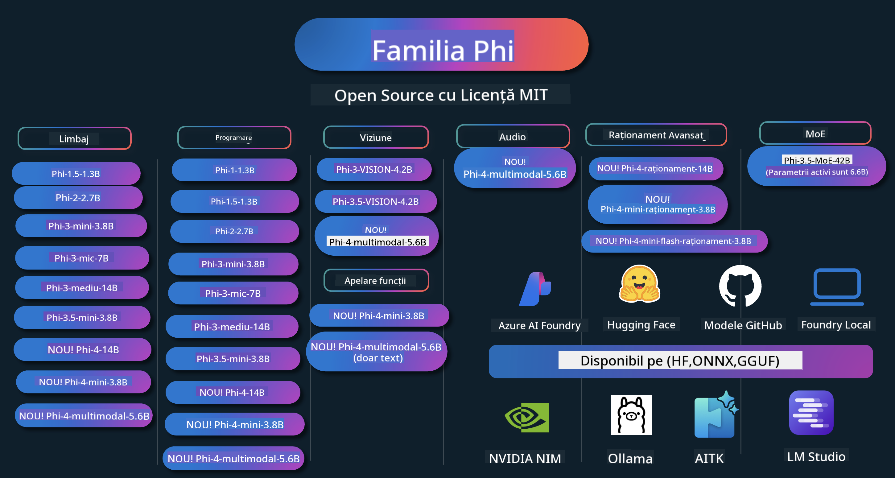

<!--
CO_OP_TRANSLATOR_METADATA:
{
  "original_hash": "ef3a50368712b1a7483d0def1f70c490",
  "translation_date": "2025-12-21T13:33:29+00:00",
  "source_file": "README.md",
  "language_code": "ro"
}
-->
# Phi Cookbook: Hands-On Examples with Microsoft's Phi Models

Phi este o serie de modele AI open-source dezvoltate de Microsoft. 

Phi este în prezent cel mai puternic și rentabil model lingvistic de dimensiuni mici (SLM), cu benchmark-uri foarte bune în multi-limbaj, raționament, generare text/chat, programare, imagini, audio și alte scenarii. 

Poți implementa Phi în cloud sau pe dispozitive edge și poți construi ușor aplicații generative AI cu resurse de calcul limitate.

Urmărește acești pași pentru a începe să folosești aceste resurse :
1. **Dă fork repository-ului**: Dă clic pe 
2. **Clonează repository-ul**:   `git clone https://github.com/microsoft/PhiCookBook.git`
3. [**Alătură-te comunității Microsoft AI Discord și întâlnește experți și alți dezvoltatori**](https://discord.com/invite/ByRwuEEgH4?WT.mc_id=aiml-137032-kinfeylo)

### 🌐 Suport multilingv

#### Suportat prin GitHub Action (Automatizat & Întotdeauna actualizat)

<!-- CO-OP TRANSLATOR LANGUAGES TABLE START -->
[Arabă](../ar/README.md) | [Bengaleza](../bn/README.md) | [Bulgara](../bg/README.md) | [Birmană (Myanmar)](../my/README.md) | [Chineză (Simplificat)](../zh/README.md) | [Chineză (Tradițională, Hong Kong)](../hk/README.md) | [Chineză (Tradițională, Macau)](../mo/README.md) | [Chineză (Tradițională, Taiwan)](../tw/README.md) | [Croată](../hr/README.md) | [Ceha](../cs/README.md) | [Daneză](../da/README.md) | [Olandeză](../nl/README.md) | [Estonă](../et/README.md) | [Finlandeză](../fi/README.md) | [Franceză](../fr/README.md) | [Germană](../de/README.md) | [Greacă](../el/README.md) | [Ebraică](../he/README.md) | [Hindi](../hi/README.md) | [Maghiară](../hu/README.md) | [Indoneziană](../id/README.md) | [Italiană](../it/README.md) | [Japanese](../ja/README.md) | [Kannada](../kn/README.md) | [Coreeană](../ko/README.md) | [Lituaniană](../lt/README.md) | [Malay](../ms/README.md) | [Malayalam](../ml/README.md) | [Marathi](../mr/README.md) | [Nepaleză](../ne/README.md) | [Pidgin nigerian](../pcm/README.md) | [Norvegiană](../no/README.md) | [Persană (Farsi)](../fa/README.md) | [Poloneză](../pl/README.md) | [Portugheză (Brazilia)](../br/README.md) | [Portugheză (Portugalia)](../pt/README.md) | [Punjabi (Gurmukhi)](../pa/README.md) | [Română](./README.md) | [Rusă](../ru/README.md) | [Sârbă (chirilică)](../sr/README.md) | [Slovacă](../sk/README.md) | [Slovenă](../sl/README.md) | [Spaniolă](../es/README.md) | [Swahili](../sw/README.md) | [Suedeză](../sv/README.md) | [Tagalog (Filipine)](../tl/README.md) | [Tamil](../ta/README.md) | [Telugu](../te/README.md) | [Thai](../th/README.md) | [Turcă](../tr/README.md) | [Ucraineană](../uk/README.md) | [Urdu](../ur/README.md) | [Vietnameză](../vi/README.md)
<!-- CO-OP TRANSLATOR LANGUAGES TABLE END -->

## Cuprins

- Introducere
  - [Bine ați venit în familia Phi](./md/01.Introduction/01/01.PhiFamily.md)
  - [Configurarea mediului dvs.](./md/01.Introduction/01/01.EnvironmentSetup.md)
  - [Înțelegerea tehnologiilor cheie](./md/01.Introduction/01/01.Understandingtech.md)
  - [Securitatea AI pentru modelele Phi](./md/01.Introduction/01/01.AISafety.md)
  - [Suport hardware pentru Phi](./md/01.Introduction/01/01.Hardwaresupport.md)
  - [Modele Phi și disponibilitate pe platforme](./md/01.Introduction/01/01.Edgeandcloud.md)
  - [Folosirea Guidance-ai și Phi](./md/01.Introduction/01/01.Guidance.md)
  - [Modele pe GitHub Marketplace](https://github.com/marketplace/models)
  - [Catalogul de modele Azure AI](https://ai.azure.com)

- Inferență Phi în medii diferite
    -  [Hugging face](./md/01.Introduction/02/01.HF.md)
    -  [GitHub Models](./md/01.Introduction/02/02.GitHubModel.md)
    -  [Azure AI Foundry Model Catalog](./md/01.Introduction/02/03.AzureAIFoundry.md)
    -  [Ollama](./md/01.Introduction/02/04.Ollama.md)
    -  [AI Toolkit VSCode (AITK)](./md/01.Introduction/02/05.AITK.md)
    -  [NVIDIA NIM](./md/01.Introduction/02/06.NVIDIA.md)
    -  [Foundry Local](./md/01.Introduction/02/07.FoundryLocal.md)

- Inferență în familia Phi
    - [Inferență Phi pe iOS](./md/01.Introduction/03/iOS_Inference.md)
    - [Inferență Phi pe Android](./md/01.Introduction/03/Android_Inference.md)
    - [Inferență Phi pe Jetson](./md/01.Introduction/03/Jetson_Inference.md)
    - [Inferență Phi pe AI PC](./md/01.Introduction/03/AIPC_Inference.md)
    - [Inferență Phi cu Apple MLX Framework](./md/01.Introduction/03/MLX_Inference.md)
    - [Inferență Phi pe server local](./md/01.Introduction/03/Local_Server_Inference.md)
    - [Inferență Phi pe server remote folosind AI Toolkit](./md/01.Introduction/03/Remote_Interence.md)
    - [Inferență Phi cu Rust](./md/01.Introduction/03/Rust_Inference.md)
    - [Inferență Phi — Viziune locală](./md/01.Introduction/03/Vision_Inference.md)
    - [Inferență Phi cu Kaito AKS, Azure Containers (suport oficial)](./md/01.Introduction/03/Kaito_Inference.md)
-  [Quantificarea familiei Phi](./md/01.Introduction/04/QuantifyingPhi.md)
    - [Quantizarea Phi-3.5 / 4 folosind llama.cpp](./md/01.Introduction/04/UsingLlamacppQuantifyingPhi.md)
    - [Quantizarea Phi-3.5 / 4 folosind extensiile Generative AI pentru onnxruntime](./md/01.Introduction/04/UsingORTGenAIQuantifyingPhi.md)
    - [Quantizarea Phi-3.5 / 4 folosind Intel OpenVINO](./md/01.Introduction/04/UsingIntelOpenVINOQuantifyingPhi.md)
    - [Quantizarea Phi-3.5 / 4 folosind Apple MLX Framework](./md/01.Introduction/04/UsingAppleMLXQuantifyingPhi.md)

-  Evaluarea Phi
    - [AI responsabilă](./md/01.Introduction/05/ResponsibleAI.md)
    - [Azure AI Foundry pentru evaluare](./md/01.Introduction/05/AIFoundry.md)
    - [Folosirea Promptflow pentru evaluare](./md/01.Introduction/05/Promptflow.md)
 
- RAG cu Azure AI Search
    - [Cum să folosești Phi-4-mini și Phi-4-multimodal(RAG) cu Azure AI Search](https://github.com/microsoft/PhiCookBook/blob/main/code/06.E2E/E2E_Phi-4-RAG-Azure-AI-Search.ipynb)

- Exemple de dezvoltare a aplicațiilor Phi
  - Aplicații Text și Chat
    - Phi-4 Exemple 🆕
      - [📓] [Chat cu modelul Phi-4-mini ONNX](./md/02.Application/01.TextAndChat/Phi4/ChatWithPhi4ONNX/README.md)
      - [Chat cu modelul ONNX Phi-4 local .NET](../../md/04.HOL/dotnet/src/LabsPhi4-Chat-01OnnxRuntime)
      - [Aplicație consolă .NET Chat cu Phi-4 ONNX folosind Sementic Kernel](../../md/04.HOL/dotnet/src/LabsPhi4-Chat-02SK)
    - Exemple Phi-3 / 3.5
      - [Chatbot local în browser folosind Phi3, ONNX Runtime Web și WebGPU](https://github.com/microsoft/onnxruntime-inference-examples/tree/main/js/chat)
      - [Chat OpenVino](./md/02.Application/01.TextAndChat/Phi3/E2E_OpenVino_Chat.md)
      - [Multi Model - Phi-3-mini interactiv și OpenAI Whisper](./md/02.Application/01.TextAndChat/Phi3/E2E_Phi-3-mini_with_whisper.md)
      - [MLFlow - Construirea unui wrapper și folosirea Phi-3 cu MLFlow](./md//02.Application/01.TextAndChat/Phi3/E2E_Phi-3-MLflow.md)
      - [Optimizare model - Cum să optimizezi modelul Phi-3-min pentru ONNX Runtime Web cu Olive](https://github.com/microsoft/Olive/tree/main/examples/phi3)
      - [Aplicație WinUI3 cu Phi-3 mini-4k-instruct-onnx](https://github.com/microsoft/Phi3-Chat-WinUI3-Sample/)
      -[Exemplu aplicație WinUI3 pentru notițe alimentată de AI Multi Model](https://github.com/microsoft/ai-powered-notes-winui3-sample)
      - [Antrenează fin și integrează modele Phi-3 personalizate cu Prompt flow](./md/02.Application/01.TextAndChat/Phi3/E2E_Phi-3-FineTuning_PromptFlow_Integration.md)
      - [Antrenează fin și integrează modele Phi-3 personalizate cu Prompt flow în Azure AI Foundry](./md/02.Application/01.TextAndChat/Phi3/E2E_Phi-3-FineTuning_PromptFlow_Integration_AIFoundry.md)
      - [Evaluează modelul Phi-3 / Phi-3.5 ajustat fin în Azure AI Foundry concentrându-se pe principiile AI responsabile ale Microsoft](./md/02.Application/01.TextAndChat/Phi3/E2E_Phi-3-Evaluation_AIFoundry.md)
      - [📓] [Exemplu de predicție a limbajului Phi-3.5-mini-instruct (chineză/engleză)](./md/02.Application/01.TextAndChat/Phi3/phi3-instruct-demo.ipynb)
      - [Chatbot RAG Phi-3.5-Instruct pentru WebGPU](./md/02.Application/01.TextAndChat/Phi3/WebGPUWithPhi35Readme.md)
      - [Utilizarea GPU-ului Windows pentru a crea o soluție Prompt flow cu Phi-3.5-Instruct ONNX](./md/02.Application/01.TextAndChat/Phi3/UsingPromptFlowWithONNX.md)
      - [Utilizarea Microsoft Phi-3.5 tflite pentru a crea o aplicație Android](./md/02.Application/01.TextAndChat/Phi3/UsingPhi35TFLiteCreateAndroidApp.md)
      - [Exemplu Q&A .NET folosind model ONNX Phi-3 local cu Microsoft.ML.OnnxRuntime](../../md/04.HOL/dotnet/src/LabsPhi301)
      - [Aplicație console chat .NET cu Semantic Kernel și Phi-3](../../md/04.HOL/dotnet/src/LabsPhi302)

  - Azure AI Inference SDK Code Based Samples 
    - Phi-4 Samples 🆕 -> Exemple Phi-4 🆕 
      - [📓] [Generează cod de proiect folosind Phi-4-multimodal](./md/02.Application/02.Code/Phi4/GenProjectCode/README.md)
    - Phi-3 / 3.5 Samples
      - [Construiește-ți propriul Visual Studio Code GitHub Copilot Chat cu familia Microsoft Phi-3](./md/02.Application/02.Code/Phi3/VSCodeExt/README.md)
      - [Creează-ți propriul agent Chat Copilot pentru Visual Studio Code cu Phi-3.5 de la GitHub Models](/md/02.Application/02.Code/Phi3/CreateVSCodeChatAgentWithGitHubModels.md)

  - Advanced Reasoning Samples -> Exemple de raționament avansat
    - Phi-4 Samples 🆕 -> Exemple Phi-4 🆕 
      - [📓] [Exemple Phi-4-mini-reasoning sau Phi-4-reasoning](./md/02.Application/03.AdvancedReasoning/Phi4/AdvancedResoningPhi4mini/README.md)
      - [📓] [Ajustare fină a Phi-4-mini-reasoning cu Microsoft Olive](./md/02.Application/03.AdvancedReasoning/Phi4/AdvancedResoningPhi4mini/olive_ft_phi_4_reasoning_with_medicaldata.ipynb)
      - [📓] [Ajustare fină a Phi-4-mini-reasoning cu Apple MLX](./md/02.Application/03.AdvancedReasoning/Phi4/AdvancedResoningPhi4mini/mlx_ft_phi_4_reasoning_with_medicaldata.ipynb)
      - [📓] [Phi-4-mini-reasoning cu GitHub Models](./md/02.Application/02.Code/Phi4r/github_models_inference.ipynb)
      - [📓] [Phi-4-mini-reasoning cu modele Azure AI Foundry](./md/02.Application/02.Code/Phi4r/azure_models_inference.ipynb)
  - Demos -> Demonstrații
      - [Demonstrații Phi-4-mini găzduite pe Hugging Face Spaces](https://huggingface.co/spaces/microsoft/phi-4-mini?WT.mc_id=aiml-137032-kinfeylo)
      - [Demonstrații Phi-4-multimodal găzduite pe Hugginge Face Spaces](https://huggingface.co/spaces/microsoft/phi-4-multimodal?WT.mc_id=aiml-137032-kinfeylo)
  - Vision Samples -> Exemple Viziune
    - Phi-4 Samples 🆕 -> Exemple Phi-4 🆕 
      - [📓] [Folosește Phi-4-multimodal pentru a citi imagini și a genera cod](./md/02.Application/04.Vision/Phi4/CreateFrontend/README.md) 
    - Phi-3 / 3.5 Samples -> Exemple Phi-3 / 3.5
      -  [📓][Phi-3-vision - Text din imagine în text](./md/02.Application/04.Vision/Phi3/E2E_Phi-3-vision-image-text-to-text-online-endpoint.ipynb)
      - [Phi-3-vision-ONNX](https://onnxruntime.ai/docs/genai/tutorials/phi3-v.html)
      - [📓][Phi-3-vision - Încorporare CLIP](./md/02.Application/04.Vision/Phi3/E2E_Phi-3-vision-image-text-to-text-online-endpoint.ipynb)
      - [DEMO: Phi-3 Reciclare](https://github.com/jennifermarsman/PhiRecycling/)
      - [Phi-3-vision - Asistent de limbaj vizual - cu Phi3-Vision și OpenVINO](https://docs.openvino.ai/nightly/notebooks/phi-3-vision-with-output.html)
      - [Phi-3 Vision Nvidia NIM](./md/02.Application/04.Vision/Phi3/E2E_Nvidia_NIM_Vision.md)
      - [Phi-3 Vision OpenVino](./md/02.Application/04.Vision/Phi3/E2E_OpenVino_Phi3Vision.md)
      - [📓][Exemplu Phi-3.5 Vision multi-frame sau multi-imagine](./md/02.Application/04.Vision/Phi3/phi3-vision-demo.ipynb)
      - [Model ONNX local Phi-3 Vision utilizând Microsoft.ML.OnnxRuntime .NET](../../md/04.HOL/dotnet/src/LabsPhi303)
      - [Model ONNX local Phi-3 Vision bazat pe meniu utilizând Microsoft.ML.OnnxRuntime .NET](../../md/04.HOL/dotnet/src/LabsPhi304)

  - Math Samples -> Exemple Matematică
    -  Phi-4-Mini-Flash-Reasoning-Instruct Samples 🆕 [Demonstrație matematică cu Phi-4-Mini-Flash-Reasoning-Instruct](./md/02.Application/09.Math/MathDemo.ipynb)

  - Audio Samples -> Exemple Audio
    - Phi-4 Samples 🆕 -> Exemple Phi-4 🆕 
      - [📓] [Extrage transcrieri audio folosind Phi-4-multimodal](./md/02.Application/05.Audio/Phi4/Transciption/README.md)
      - [📓] [Exemplu audio Phi-4-multimodal](./md/02.Application/05.Audio/Phi4/Siri/demo.ipynb)
      - [📓] [Exemplu de traducere a vorbirii cu Phi-4-multimodal](./md/02.Application/05.Audio/Phi4/Translate/demo.ipynb)
      - [Aplicație console .NET folosind Phi-4-multimodal Audio pentru a analiza un fișier audio și a genera transcriere](../../md/04.HOL/dotnet/src/LabsPhi4-MultiModal-02Audio)

  - MOE Samples -> Exemple MOE
    - Phi-3 / 3.5 Samples -> Exemple Phi-3 / 3.5
      - [📓] [Exemplu social media cu modele Phi-3.5 Mixture of Experts (MoEs)](./md/02.Application/06.MoE/Phi3/phi3_moe_demo.ipynb)
      - [📓] [Construirea unui pipeline Retrieval-Augmented Generation (RAG) cu NVIDIA NIM Phi-3 MOE, Azure AI Search, și LlamaIndex](./md/02.Application/06.MoE/Phi3/azure-ai-search-nvidia-rag.ipynb)
      - 
  - Function Calling Samples -> Exemple Apelare Funcții
    - Phi-4 Samples 🆕 -> Exemple Phi-4 🆕 
      -  [📓] [Folosirea apelării funcțiilor cu Phi-4-mini](./md/02.Application/07.FunctionCalling/Phi4/FunctionCallingBasic/README.md)
      -  [📓] [Folosirea apelării funcțiilor pentru a crea multi-agenți cu Phi-4-mini](./md/02.Application/07.FunctionCalling/Phi4/Multiagents/Phi_4_mini_multiagent.ipynb)
      -  [📓] [Folosirea apelării funcțiilor cu Ollama](./md/02.Application/07.FunctionCalling/Phi4/Ollama/ollama_functioncalling.ipynb)
      -  [📓] [Folosirea apelării funcțiilor cu ONNX](./md/02.Application/07.FunctionCalling/Phi4/ONNX/onnx_parallel_functioncalling.ipynb)
  - Multimodal Mixing Samples -> Exemple de mixare multimodală
    - Phi-4 Samples 🆕 -> Exemple Phi-4 🆕 
      -  [📓] [Folosirea Phi-4-multimodal ca jurnalist tehnologic](./md/02.Application/08.Multimodel/Phi4/TechJournalist/phi_4_mm_audio_text_publish_news.ipynb)
      - [.NET console application using Phi-4-multimodal to analyze images](../../md/04.HOL/dotnet/src/LabsPhi4-MultiModal-01Images)

- Fine-tuning Phi Samples -> Exemple de fine-tuning pentru Phi
  - [Scenarii de fine-tuning](./md/03.FineTuning/FineTuning_Scenarios.md)
  - [Fine-tuning vs RAG](./md/03.FineTuning/FineTuning_vs_RAG.md)
  - [Fine-tuning: Lasă Phi-3 să devină un expert în industrie](./md/03.FineTuning/LetPhi3gotoIndustriy.md)
  - [Fine-tuning Phi-3 cu AI Toolkit pentru VS Code](./md/03.FineTuning/Finetuning_VSCodeaitoolkit.md)
  - [Fine-tuning Phi-3 cu Azure Machine Learning Service](./md/03.FineTuning/Introduce_AzureML.md)
  - [Fine-tuning Phi-3 cu Lora](./md/03.FineTuning/FineTuning_Lora.md)
  - [Fine-tuning Phi-3 cu QLora](./md/03.FineTuning/FineTuning_Qlora.md)
  - [Fine-tuning Phi-3 cu Azure AI Foundry](./md/03.FineTuning/FineTuning_AIFoundry.md)
  - [Fine-tuning Phi-3 cu Azure ML CLI/SDK](./md/03.FineTuning/FineTuning_MLSDK.md)
  - [Fine-tuning cu Microsoft Olive](./md/03.FineTuning/FineTuning_MicrosoftOlive.md)
  - [Finetuning cu Microsoft Olive - laborator practic](./md/03.FineTuning/olive-lab/readme.md)
  - [Fine-tuning Phi-3-vision cu Weights and Bias](./md/03.FineTuning/FineTuning_Phi-3-visionWandB.md)
  - [Fine-tuning Phi-3 cu Apple MLX Framework](./md/03.FineTuning/FineTuning_MLX.md)
  - [Fine-tuning Phi-3-vision (suport oficial)](./md/03.FineTuning/FineTuning_Vision.md)
  - [Fine-tuning Phi-3 cu Kaito AKS , Azure Containers(suport oficial)](./md/03.FineTuning/FineTuning_Kaito.md)
  - [Fine-tuning Phi-3 și 3.5 Vision](https://github.com/2U1/Phi3-Vision-Finetune)

- Hands on Lab -> Laborator practic
  - [Explorarea modelelor de vârf: LLMs, SLMs, dezvoltare locală și altele](https://github.com/microsoft/aitour-exploring-cutting-edge-models)
  - [Descoperirea potențialului NLP: Fine-Tuning cu Microsoft Olive](https://github.com/azure/Ignite_FineTuning_workshop)

- Academic Research Papers and Publications -> Lucrări de cercetare academică și publicații
  - [Textbooks Are All You Need II: raport tehnic phi-1.5](https://arxiv.org/abs/2309.05463)
  - [Raport tehnic Phi-3: Un model de limbaj foarte capabil local pe telefonul tău](https://arxiv.org/abs/2404.14219)
  - [Raport tehnic Phi-4](https://arxiv.org/abs/2412.08905)
  - [Raport tehnic Phi-4-Mini: modele de limbaj multimodale compacte, dar puternice, prin Mixture-of-LoRAs](https://arxiv.org/abs/2503.01743)
  - [Optimizarea modelelor de limbaj mici pentru apelarea funcțiilor în vehicul](https://arxiv.org/abs/2501.02342)
  - [(WhyPHI) Ajustarea fină a PHI-3 pentru răspunsuri la întrebări cu alegere multiplă: metodologie, rezultate și provocări](https://arxiv.org/abs/2501.01588)
  - [Raport tehnic Phi-4-reasoning](https://www.microsoft.com/en-us/research/wp-content/uploads/2025/04/phi_4_reasoning.pdf)
  - [Raport tehnic Phi-4-mini-reasoning](https://huggingface.co/microsoft/Phi-4-mini-reasoning/blob/main/Phi-4-Mini-Reasoning.pdf)

## Utilizarea modelelor Phi

### Phi pe Azure AI Foundry

Poți învăța cum să folosești Microsoft Phi și cum să construiești soluții E2E pe diferitele tale dispozitive hardware. Pentru a experimenta Phi personal, începe prin a testa modelele și a personaliza Phi pentru scenariile tale folosind [Azure AI Foundry Azure AI Model Catalog](https://aka.ms/phi3-azure-ai). Poți afla mai multe în secțiunea Începeți cu [Azure AI Foundry](/md/02.QuickStart/AzureAIFoundry_QuickStart.md)

**Zona de testare**
Fiecare model are o zonă de testare dedicată pentru a testa modelul [Azure AI Playground](https://aka.ms/try-phi3).

### Phi pe GitHub Models

Poți învăța cum să folosești Microsoft Phi și cum să construiești soluții E2E pe diferitele tale dispozitive hardware. Pentru a experimenta Phi personal, începe prin a testa modelul și a personaliza Phi pentru scenariile tale folosind [GitHub Model Catalog](https://github.com/marketplace/models?WT.mc_id=aiml-137032-kinfeylo). Poți afla mai multe în secțiunea Începeți cu [GitHub Model Catalog](/md/02.QuickStart/GitHubModel_QuickStart.md)

**Zona de testare**
Fiecare model are un [spațiu de testare pentru model](/md/02.QuickStart/GitHubModel_QuickStart.md).

### Phi pe Hugging Face

De asemenea, poți găsi modelul pe [Hugging Face](https://huggingface.co/microsoft)

**Zona de testare**
 [Laborator Hugging Chat](https://huggingface.co/chat/models/microsoft/Phi-3-mini-4k-instruct)

 ## 🎒 Alte cursuri

Echipa noastră produce și alte cursuri! Descoperă:

<!-- CO-OP TRANSLATOR OTHER COURSES START -->
### LangChain

---

### Azure / Edge / MCP / Agenți

---
 
### Seria AI Generativă

[-9333EA?style=for-the-badge&labelColor=E5E7EB&color=9333EA)](https://github.com/microsoft/Generative-AI-for-beginners-dotnet?WT.mc_id=academic-105485-koreyst)
[-C084FC?style=for-the-badge&labelColor=E5E7EB&color=C084FC)](https://github.com/microsoft/generative-ai-for-beginners-java?WT.mc_id=academic-105485-koreyst)
[-E879F9?style=for-the-badge&labelColor=E5E7EB&color=E879F9)](https://github.com/microsoft/generative-ai-with-javascript?WT.mc_id=academic-105485-koreyst)

---
 
### Învățare de bază

---
 
### Seria Copilot

<!-- CO-OP TRANSLATOR OTHER COURSES END -->

## Inteligență artificială responsabilă

Microsoft se angajează să îi ajute pe clienții noștri să utilizeze responsabil produsele noastre AI, să împărtășească învățămintele noastre și să construiască parteneriate bazate pe încredere prin instrumente precum Transparency Notes și Impact Assessments. Multe dintre aceste resurse pot fi găsite la [https://aka.ms/RAI](https://aka.ms/RAI).
Abordarea Microsoft privind AI responsabil se bazează pe principiile noastre AI: echitate, fiabilitate și siguranță, confidențialitate și securitate, incluziune, transparență și responsabilitate.

Modelele la scară largă pentru limbaj natural, imagine și vorbire - precum cele folosite în acest exemplu - pot manifesta comportamente care sunt nedrepte, nesigure sau ofensatoare, cauzând astfel prejudicii. Vă rugăm să consultați [Azure OpenAI service Transparency note](https://learn.microsoft.com/legal/cognitive-services/openai/transparency-note?tabs=text) pentru a fi informat despre riscuri și limitări.

Abordarea recomandată pentru a atenua aceste riscuri este includerea unui sistem de siguranță în arhitectura dvs. care poate detecta și preveni comportamentele dăunătoare. [Azure AI Content Safety](https://learn.microsoft.com/azure/ai-services/content-safety/overview) oferă un strat independent de protecție, capabil să detecteze conținut generat de utilizatori și de AI care este dăunător în aplicații și servicii. Azure AI Content Safety include API-uri pentru text și imagine care vă permit să detectați materiale dăunătoare. În cadrul Azure AI Foundry, serviciul Content Safety vă permite să vizualizați, să explorați și să încercați exemple de cod pentru detectarea conținutului dăunător în diferite modalități. Următoarea [documentație quickstart](https://learn.microsoft.com/azure/ai-services/content-safety/quickstart-text?tabs=visual-studio%2Clinux&pivots=programming-language-rest) vă ghidează în efectuarea de cereri către serviciu.

Un alt aspect de luat în considerare este performanța generală a aplicației. Pentru aplicații multimodale și multi-model, considerăm performanța ca însemnând că sistemul funcționează așa cum vă așteptați dumneavoastră și utilizatorii, inclusiv prin faptul că nu generează rezultate dăunătoare. Este important să evaluați performanța aplicației dvs. generale folosind [Evaluatori de performanță și calitate și evaluatori de risc și siguranță](https://learn.microsoft.com/azure/ai-studio/concepts/evaluation-metrics-built-in). De asemenea, aveți posibilitatea de a crea și evalua folosind [evaluatori personalizați](https://learn.microsoft.com/azure/ai-studio/how-to/develop/evaluate-sdk#custom-evaluators).

Puteți evalua aplicația dvs. AI în mediul de dezvoltare folosind [Azure AI Evaluation SDK](https://microsoft.github.io/promptflow/index.html). Având fie un set de date de test, fie un obiectiv, generările aplicației dvs. AI generative sunt măsurate cantitativ cu evaluatori încorporați sau evaluatori personalizați la alegere. Pentru a începe cu Azure AI Evaluation SDK pentru a evalua sistemul, puteți urma [ghidul quickstart](https://learn.microsoft.com/azure/ai-studio/how-to/develop/flow-evaluate-sdk). După ce executați o rulare de evaluare, puteți [vizualiza rezultatele în Azure AI Foundry](https://learn.microsoft.com/azure/ai-studio/how-to/evaluate-flow-results). 

## Mărci comerciale
Acest proiect poate conține mărci comerciale sau sigle pentru proiecte, produse sau servicii. Utilizarea autorizată a mărcilor comerciale sau siglelor Microsoft este supusă și trebuie să respecte [Ghidul Microsoft privind mărci comerciale și brand](https://www.microsoft.com/legal/intellectualproperty/trademarks/usage/general).
Utilizarea mărcilor comerciale sau siglelor Microsoft în versiuni modificate ale acestui proiect nu trebuie să creeze confuzie sau să sugereze sponsorizarea de către Microsoft. Orice utilizare a mărcilor comerciale sau siglelor terților este supusă politicilor terților.

## Obține ajutor

Dacă întâmpini dificultăți sau ai întrebări despre crearea aplicațiilor AI, alătură-te:

Dacă ai feedback despre produs sau întâmpini erori în timpul dezvoltării, vizitează:

---

<!-- CO-OP TRANSLATOR DISCLAIMER START -->
Declinare de responsabilitate:
Acest document a fost tradus folosind serviciul de traducere AI [Co-op Translator](https://github.com/Azure/co-op-translator). Deși ne străduim pentru acuratețe, vă rugăm să rețineți că traducerile automate pot conține erori sau inexactități. Documentul original, în limba sa de origine, trebuie considerat sursa autorizată. Pentru informații critice, se recomandă traducerea profesională realizată de un traducător uman. Nu ne asumăm nicio răspundere pentru eventualele neînțelegeri sau interpretări eronate care decurg din utilizarea acestei traduceri.
<!-- CO-OP TRANSLATOR DISCLAIMER END -->