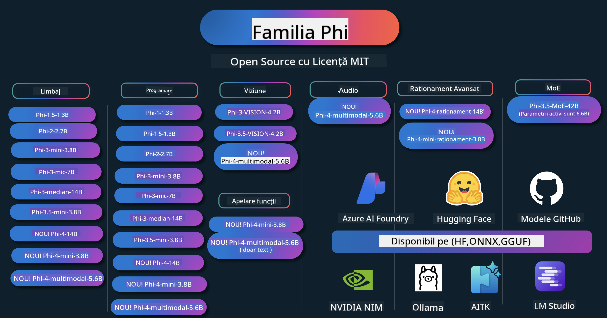

<!--
CO_OP_TRANSLATOR_METADATA:
{
  "original_hash": "1cab9282e04f2e1c388a38dca7763c16",
  "translation_date": "2025-05-09T04:12:20+00:00",
  "source_file": "README.md",
  "language_code": "ro"
}
-->
# Phi Cookbook: Exemple practice cu modelele Phi de la Microsoft

  

  
  
  

  
  

Phi este o serie de modele AI open source dezvoltate de Microsoft.

Phi este în prezent cel mai puternic și eficient model mic de limbaj (SLM), cu performanțe foarte bune în multiple limbi, raționament, generare de text/chat, programare, imagini, audio și alte scenarii.

Poți implementa Phi în cloud sau pe dispozitive edge și poți construi cu ușurință aplicații AI generative cu resurse limitate de calcul.

Urmărește acești pași pentru a începe să folosești aceste resurse:  
1. **Fă un Fork al Repozitoriului**: Click pe   
2. **Clonează Repozitoriul**: `git clone https://github.com/microsoft/PhiCookBook.git`  
3. [**Alătură-te Comunității Microsoft AI pe Discord și întâlnește experți și alți dezvoltatori**](https://discord.com/invite/ByRwuEEgH4?WT.mc_id=aiml-137032-kinfeylo)

## 🌐 Suport Multilingv

### Suportat prin GitHub Action (automatizat și mereu actualizat)

[Franceză](../fr/README.md) | [Spaniolă](../es/README.md) | [Germană](../de/README.md) | [Rusă](../ru/README.md) | [Arabă](../ar/README.md) | [Persană (Farsi)](../fa/README.md) | [Urdu](../ur/README.md) | [Chineză (Simplificată)](../zh/README.md) | [Chineză (Tradițională, Macau)](../mo/README.md) | [Chineză (Tradițională, Hong Kong)](../hk/README.md) | [Chineză (Tradițională, Taiwan)](../tw/README.md) | [Japoneză](../ja/README.md) | [Coreeană](../ko/README.md) | [Hindi](../hi/README.md)

### Suportat prin CLI
[Bengali](../bn/README.md) | [Marathi](../mr/README.md) | [Nepali](../ne/README.md) | [Punjabi (Gurmukhi)](../pa/README.md) | [Portuguese (Portugal)](../pt/README.md) | [Portuguese (Brazil)](../br/README.md) | [Italian](../it/README.md) | [Polish](../pl/README.md) | [Turkish](../tr/README.md) | [Greek](../el/README.md) | [Thai](../th/README.md) | [Swedish](../sv/README.md) | [Danish](../da/README.md) | [Norwegian](../no/README.md) | [Finnish](../fi/README.md) | [Dutch](../nl/README.md) | [Hebrew](../he/README.md) | [Vietnamese](../vi/README.md) | [Indonesian](../id/README.md) | [Malay](../ms/README.md) | [Tagalog (Filipino)](../tl/README.md) | [Swahili](../sw/README.md) | [Hungarian](../hu/README.md) | [Czech](../cs/README.md) | [Slovak](../sk/README.md) | [Romanian](./README.md) | [Bulgarian](../bg/README.md) | [Serbian (Cyrillic)](../sr/README.md) | [Croatian](../hr/README.md) | [Slovenian](../sl/README.md)

## Cuprins

- Introducere
- [Bine ați venit în familia Phi](./md/01.Introduction/01/01.PhiFamily.md)
  - [Configurarea mediului dvs.](./md/01.Introduction/01/01.EnvironmentSetup.md)
  - [Înțelegerea tehnologiilor cheie](./md/01.Introduction/01/01.Understandingtech.md)
  - [Siguranța AI pentru modelele Phi](./md/01.Introduction/01/01.AISafety.md)
  - [Suport hardware Phi](./md/01.Introduction/01/01.Hardwaresupport.md)
  - [Modelele Phi și disponibilitatea lor pe platforme](./md/01.Introduction/01/01.Edgeandcloud.md)
  - [Utilizarea Guidance-ai și Phi](./md/01.Introduction/01/01.Guidance.md)
  - [GitHub Marketplace Models](https://github.com/marketplace/models)
  - [Azure AI Model Catalog](https://ai.azure.com)

- Inferență Phi în medii diferite
    -  [Hugging face](./md/01.Introduction/02/01.HF.md)
    -  [GitHub Models](./md/01.Introduction/02/02.GitHubModel.md)
    -  [Azure AI Foundry Model Catalog](./md/01.Introduction/02/03.AzureAIFoundry.md)
    -  [Ollama](./md/01.Introduction/02/04.Ollama.md)
    -  [AI Toolkit VSCode (AITK)](./md/01.Introduction/02/05.AITK.md)
    -  [NVIDIA NIM](./md/01.Introduction/02/06.NVIDIA.md)

- Inferență Phi Family
    - [Inferență Phi pe iOS](./md/01.Introduction/03/iOS_Inference.md)
    - [Inferență Phi pe Android](./md/01.Introduction/03/Android_Inference.md)
    - [Inferență Phi pe Jetson](./md/01.Introduction/03/Jetson_Inference.md)
    - [Inferență Phi pe AI PC](./md/01.Introduction/03/AIPC_Inference.md)
    - [Inferență Phi cu Apple MLX Framework](./md/01.Introduction/03/MLX_Inference.md)
    - [Inferență Phi pe server local](./md/01.Introduction/03/Local_Server_Inference.md)
    - [Inferență Phi pe server la distanță folosind AI Toolkit](./md/01.Introduction/03/Remote_Interence.md)
    - [Inferență Phi cu Rust](./md/01.Introduction/03/Rust_Inference.md)
    - [Inferență Phi--Vision local](./md/01.Introduction/03/Vision_Inference.md)
    - [Inferență Phi cu Kaito AKS, Azure Containers (suport oficial)](./md/01.Introduction/03/Kaito_Inference.md)
-  [Cuantificarea Phi Family](./md/01.Introduction/04/QuantifyingPhi.md)
    - [Cuantificarea Phi-3.5 / 4 folosind llama.cpp](./md/01.Introduction/04/UsingLlamacppQuantifyingPhi.md)
    - [Cuantificarea Phi-3.5 / 4 folosind extensiile Generative AI pentru onnxruntime](./md/01.Introduction/04/UsingORTGenAIQuantifyingPhi.md)
    - [Cuantificarea Phi-3.5 / 4 folosind Intel OpenVINO](./md/01.Introduction/04/UsingIntelOpenVINOQuantifyingPhi.md)
    - [Cuantificarea Phi-3.5 / 4 folosind Apple MLX Framework](./md/01.Introduction/04/UsingAppleMLXQuantifyingPhi.md)

-  Evaluarea Phi
- [Response AI](./md/01.Introduction/05/ResponsibleAI.md)
    - [Azure AI Foundry pentru Evaluare](./md/01.Introduction/05/AIFoundry.md)
    - [Folosirea Promptflow pentru Evaluare](./md/01.Introduction/05/Promptflow.md)
 
- RAG cu Azure AI Search
    - [Cum să folosești Phi-4-mini și Phi-4-multimodal(RAG) cu Azure AI Search](https://github.com/microsoft/PhiCookBook/blob/main/code/06.E2E/E2E_Phi-4-RAG-Azure-AI-Search.ipynb)

- Exemple de dezvoltare aplicații Phi
  - Aplicații Text & Chat
    - Exemple Phi-4 🆕
      - [📓] [Conversație cu modelul Phi-4-mini ONNX](./md/02.Application/01.TextAndChat/Phi4/ChatWithPhi4ONNX/README.md)
      - [Chat cu model local Phi-4 ONNX în .NET](../../md/04.HOL/dotnet/src/LabsPhi4-Chat-01OnnxRuntime)
      - [Aplicație console chat .NET cu Phi-4 ONNX folosind Semantic Kernel](../../md/04.HOL/dotnet/src/LabsPhi4-Chat-02SK)
    - Exemple Phi-3 / 3.5
      - [Chatbot local în browser folosind Phi3, ONNX Runtime Web și WebGPU](https://github.com/microsoft/onnxruntime-inference-examples/tree/main/js/chat)
      - [Chat OpenVino](./md/02.Application/01.TextAndChat/Phi3/E2E_OpenVino_Chat.md)
      - [Model multiplu - Phi-3-mini interactiv și OpenAI Whisper](./md/02.Application/01.TextAndChat/Phi3/E2E_Phi-3-mini_with_whisper.md)
      - [MLFlow - Construirea unui wrapper și folosirea Phi-3 cu MLFlow](./md//02.Application/01.TextAndChat/Phi3/E2E_Phi-3-MLflow.md)
      - [Optimizarea modelului - Cum să optimizezi modelul Phi-3-mini pentru ONNX Runtime Web cu Olive](https://github.com/microsoft/Olive/tree/main/examples/phi3)
      - [Aplicație WinUI3 cu Phi-3 mini-4k-instruct-onnx](https://github.com/microsoft/Phi3-Chat-WinUI3-Sample/)
      - [Exemplu aplicație note alimentată de AI cu mai multe modele WinUI3](https://github.com/microsoft/ai-powered-notes-winui3-sample)
      - [Fine-tuning și integrare modele personalizate Phi-3 cu Prompt flow](./md/02.Application/01.TextAndChat/Phi3/E2E_Phi-3-FineTuning_PromptFlow_Integration.md)
      - [Fine-tuning și integrare modele personalizate Phi-3 cu Prompt flow în Azure AI Foundry](./md/02.Application/01.TextAndChat/Phi3/E2E_Phi-3-FineTuning_PromptFlow_Integration_AIFoundry.md)
      - [Evaluarea modelului Phi-3 / Phi-3.5 fine-tuned în Azure AI Foundry cu accent pe principiile Responsible AI ale Microsoft](./md/02.Application/01.TextAndChat/Phi3/E2E_Phi-3-Evaluation_AIFoundry.md)
      - [📓] [Exemplu predicție limbaj Phi-3.5-mini-instruct (chineză/engleză)](../../md/02.Application/01.TextAndChat/Phi3/phi3-instruct-demo.ipynb)
      - [Chatbot RAG Phi-3.5-Instruct WebGPU](./md/02.Application/01.TextAndChat/Phi3/WebGPUWithPhi35Readme.md)
      - [Folosirea GPU-ului Windows pentru a crea soluția Prompt flow cu Phi-3.5-Instruct ONNX](./md/02.Application/01.TextAndChat/Phi3/UsingPromptFlowWithONNX.md)
      - [Folosirea Microsoft Phi-3.5 tflite pentru a crea o aplicație Android](./md/02.Application/01.TextAndChat/Phi3/UsingPhi35TFLiteCreateAndroidApp.md)
      - [Exemplu Q&A .NET folosind model local ONNX Phi-3 cu Microsoft.ML.OnnxRuntime](../../md/04.HOL/dotnet/src/LabsPhi301)
      - [Aplicație console chat .NET cu Semantic Kernel și Phi-3](../../md/04.HOL/dotnet/src/LabsPhi302)

  - Exemple de cod SDK Azure AI Inference
    - Exemple Phi-4 🆕
      - [📓] [Generarea codului proiectului folosind Phi-4-multimodal](./md/02.Application/02.Code/Phi4/GenProjectCode/README.md)
    - Exemple Phi-3 / 3.5
      - [Construiește-ți propriul Visual Studio Code GitHub Copilot Chat cu familia Microsoft Phi-3](./md/02.Application/02.Code/Phi3/VSCodeExt/README.md)
      - [Creează-ți propriul agent Visual Studio Code Chat Copilot cu Phi-3.5 folosind modelele GitHub](/md/02.Application/02.Code/Phi3/CreateVSCodeChatAgentWithGitHubModels.md)

  - Exemple de raționament avansat
    - Exemple Phi-4 🆕
      - [📓] [Exemple Phi-4-mini-reasoning sau Phi-4-reasoning](./md/02.Application/03.AdvancedReasoning/Phi4/AdvancedResoningPhi4mini/README.md)
      - [📓] [Fine-tuning Phi-4-mini-reasoning cu Microsoft Olive](../../md/02.Application/03.AdvancedReasoning/Phi4/AdvancedResoningPhi4mini/olive_ft_phi_4_reasoning_with_medicaldata.ipynb)
      - [📓] [Fine-tuning Phi-4-mini-reasoning cu Apple MLX](../../md/02.Application/03.AdvancedReasoning/Phi4/AdvancedResoningPhi4mini/mlx_ft_phi_4_reasoning_with_medicaldata.ipynb)
      - [📓] [Phi-4-mini-reasoning cu modelele GitHub](../../md/02.Application/02.Code/Phi4r/github_models_inference.ipynb)
- [📓] [Phi-4-mini raționament cu modelele Azure AI Foundry](../../md/02.Application/02.Code/Phi4r/azure_models_inference.ipynb)
  - Demonstrații
      - [Demonstrații Phi-4-mini găzduite pe Hugging Face Spaces](https://huggingface.co/spaces/microsoft/phi-4-mini?WT.mc_id=aiml-137032-kinfeylo)
      - [Demonstrații Phi-4-multimodal găzduite pe Hugging Face Spaces](https://huggingface.co/spaces/microsoft/phi-4-multimodal?WT.mc_id=aiml-137032-kinfeylo)
  - Exemple Vision
    - Exemple Phi-4 🆕
      - [📓] [Folosirea Phi-4-multimodal pentru a citi imagini și a genera cod](./md/02.Application/04.Vision/Phi4/CreateFrontend/README.md) 
    - Exemple Phi-3 / 3.5
      -  [📓][Phi-3-vision-Imagine text în text](../../md/02.Application/04.Vision/Phi3/E2E_Phi-3-vision-image-text-to-text-online-endpoint.ipynb)
      - [Phi-3-vision-ONNX](https://onnxruntime.ai/docs/genai/tutorials/phi3-v.html)
      - [📓][Phi-3-vision CLIP Embedding](../../md/02.Application/04.Vision/Phi3/E2E_Phi-3-vision-image-text-to-text-online-endpoint.ipynb)
      - [DEMO: Phi-3 Recycling](https://github.com/jennifermarsman/PhiRecycling/)
      - [Phi-3-vision - Asistent vizual pentru limbaj - cu Phi3-Vision și OpenVINO](https://docs.openvino.ai/nightly/notebooks/phi-3-vision-with-output.html)
      - [Phi-3 Vision Nvidia NIM](./md/02.Application/04.Vision/Phi3/E2E_Nvidia_NIM_Vision.md)
      - [Phi-3 Vision OpenVino](./md/02.Application/04.Vision/Phi3/E2E_OpenVino_Phi3Vision.md)
      - [📓][Phi-3.5 Vision exemplu multi-frame sau multi-imagine](../../md/02.Application/04.Vision/Phi3/phi3-vision-demo.ipynb)
      - [Phi-3 Vision Model ONNX local folosind Microsoft.ML.OnnxRuntime .NET](../../md/04.HOL/dotnet/src/LabsPhi303)
      - [Model ONNX local Phi-3 Vision bazat pe meniu folosind Microsoft.ML.OnnxRuntime .NET](../../md/04.HOL/dotnet/src/LabsPhi304)

  - Exemple Audio
    - Exemple Phi-4 🆕
      - [📓] [Extrage transcrieri audio folosind Phi-4-multimodal](./md/02.Application/05.Audio/Phi4/Transciption/README.md)
      - [📓] [Exemplu audio Phi-4-multimodal](../../md/02.Application/05.Audio/Phi4/Siri/demo.ipynb)
      - [📓] [Exemplu de traducere a vorbirii cu Phi-4-multimodal](../../md/02.Application/05.Audio/Phi4/Translate/demo.ipynb)
      - [Aplicație console .NET folosind Phi-4-multimodal Audio pentru a analiza un fișier audio și a genera transcriere](../../md/04.HOL/dotnet/src/LabsPhi4-MultiModal-02Audio)

  - Exemple MOE
    - Exemple Phi-3 / 3.5
      - [📓] [Modele Phi-3.5 Mixture of Experts (MoEs) Exemplu Social Media](../../md/02.Application/06.MoE/Phi3/phi3_moe_demo.ipynb)
      - [📓] [Construirea unui pipeline Retrieval-Augmented Generation (RAG) cu NVIDIA NIM Phi-3 MOE, Azure AI Search și LlamaIndex](../../md/02.Application/06.MoE/Phi3/azure-ai-search-nvidia-rag.ipynb)
  - Exemple Function Calling
    - Exemple Phi-4 🆕
      -  [📓] [Folosirea Function Calling cu Phi-4-mini](./md/02.Application/07.FunctionCalling/Phi4/FunctionCallingBasic/README.md)
      -  [📓] [Folosirea Function Calling pentru a crea multi-agenti cu Phi-4-mini](../../md/02.Application/07.FunctionCalling/Phi4/Multiagents/Phi_4_mini_multiagent.ipynb)
      -  [📓] [Folosirea Function Calling cu Ollama](../../md/02.Application/07.FunctionCalling/Phi4/Ollama/ollama_functioncalling.ipynb)
  - Exemple Multimodal Mixing
    - Exemple Phi-4 🆕
      -  [📓] [Folosirea Phi-4-multimodal ca jurnalist de tehnologie](../../md/02.Application/08.Multimodel/Phi4/TechJournalist/phi_4_mm_audio_text_publish_news.ipynb)
      - [Aplicație console .NET folosind Phi-4-multimodal pentru a analiza imagini](../../md/04.HOL/dotnet/src/LabsPhi4-MultiModal-01Images)

- Fine-tuning Phi Exemple
  - [Scenarii de fine-tuning](./md/03.FineTuning/FineTuning_Scenarios.md)
  - [Fine-tuning vs RAG](./md/03.FineTuning/FineTuning_vs_RAG.md)
  - [Fine-tuning: Lasă Phi-3 să devină expert în industrie](./md/03.FineTuning/LetPhi3gotoIndustriy.md)
  - [Fine-tuning Phi-3 cu AI Toolkit pentru VS Code](./md/03.FineTuning/Finetuning_VSCodeaitoolkit.md)
  - [Fine-tuning Phi-3 cu Azure Machine Learning Service](./md/03.FineTuning/Introduce_AzureML.md)
- [Fine-tuning Phi-3 cu Lora](./md/03.FineTuning/FineTuning_Lora.md)
  - [Fine-tuning Phi-3 cu QLora](./md/03.FineTuning/FineTuning_Qlora.md)
  - [Fine-tuning Phi-3 cu Azure AI Foundry](./md/03.FineTuning/FineTuning_AIFoundry.md)
  - [Fine-tuning Phi-3 cu Azure ML CLI/SDK](./md/03.FineTuning/FineTuning_MLSDK.md)
  - [Fine-tuning cu Microsoft Olive](./md/03.FineTuning/FineTuning_MicrosoftOlive.md)
  - [Laborator practic de fine-tuning cu Microsoft Olive](./md/03.FineTuning/olive-lab/readme.md)
  - [Fine-tuning Phi-3-vision cu Weights and Bias](./md/03.FineTuning/FineTuning_Phi-3-visionWandB.md)
  - [Fine-tuning Phi-3 cu Apple MLX Framework](./md/03.FineTuning/FineTuning_MLX.md)
  - [Fine-tuning Phi-3-vision (suport oficial)](./md/03.FineTuning/FineTuning_Vision.md)
  - [Fine-Tuning Phi-3 cu Kaito AKS, Azure Containers (suport oficial)](./md/03.FineTuning/FineTuning_Kaito.md)
  - [Fine-Tuning Phi-3 și 3.5 Vision](https://github.com/2U1/Phi3-Vision-Finetune)

- Laborator Practic
  - [Explorarea modelelor de ultimă generație: LLMs, SLMs, dezvoltare locală și altele](https://github.com/microsoft/aitour-exploring-cutting-edge-models)
  - [Dezvăluirea potențialului NLP: Fine-Tuning cu Microsoft Olive](https://github.com/azure/Ignite_FineTuning_workshop)

- Articole și publicații academice
  - [Textbooks Are All You Need II: raport tehnic phi-1.5](https://arxiv.org/abs/2309.05463)
  - [Phi-3 Raport Tehnic: un model de limbaj foarte capabil local pe telefonul tău](https://arxiv.org/abs/2404.14219)
  - [Phi-4 Raport Tehnic](https://arxiv.org/abs/2412.08905)
  - [Phi-4-Mini Raport Tehnic: modele multimodale compacte dar puternice prin Mixture-of-LoRAs](https://arxiv.org/abs/2503.01743)
  - [Optimizarea modelelor mici de limbaj pentru apelarea funcțiilor în vehicul](https://arxiv.org/abs/2501.02342)
  - [(WhyPHI) Fine-Tuning PHI-3 pentru răspunsuri la întrebări cu alegere multiplă: metodologie, rezultate și provocări](https://arxiv.org/abs/2501.01588)
  - [Phi-4-reasoning Raport Tehnic](https://www.microsoft.com/en-us/research/wp-content/uploads/2025/04/phi_4_reasoning.pdf)
  - [Phi-4-mini-reasoning Raport Tehnic](https://huggingface.co/microsoft/Phi-4-mini-reasoning/blob/main/Phi-4-Mini-Reasoning.pdf)

## Utilizarea modelelor Phi

### Phi pe Azure AI Foundry

Poți învăța cum să folosești Microsoft Phi și cum să construiești soluții E2E pe diferitele tale dispozitive hardware. Pentru a experimenta Phi, începe prin a testa modelele și a personaliza Phi pentru scenariile tale folosind [Azure AI Foundry Azure AI Model Catalog](https://aka.ms/phi3-azure-ai). Poți afla mai multe la Începe cu [Azure AI Foundry](/md/02.QuickStart/AzureAIFoundry_QuickStart.md)

**Playground**  
Fiecare model are un spațiu dedicat pentru testare, [Azure AI Playground](https://aka.ms/try-phi3).

### Phi pe modelele GitHub

Poți învăța cum să folosești Microsoft Phi și cum să construiești soluții E2E pe diferitele tale dispozitive hardware. Pentru a experimenta Phi, începe prin a testa modelul și a personaliza Phi pentru scenariile tale folosind [GitHub Model Catalog](https://github.com/marketplace/models?WT.mc_id=aiml-137032-kinfeylo). Poți afla mai multe la Începe cu [GitHub Model Catalog](/md/02.QuickStart/GitHubModel_QuickStart.md)

**Playground**  
Fiecare model are un [spațiu dedicat pentru testare](/md/02.QuickStart/GitHubModel_QuickStart.md).

### Phi pe Hugging Face

De asemenea, poți găsi modelul pe [Hugging Face](https://huggingface.co/microsoft)

**Playground**  
[Hugging Chat playground](https://huggingface.co/chat/models/microsoft/Phi-3-mini-4k-instruct)

## AI Responsabil

Microsoft este dedicat să ajute clienții să folosească produsele noastre AI în mod responsabil, împărtășind experiențele noastre și construind parteneriate bazate pe încredere prin instrumente precum Transparency Notes și Impact Assessments. Multe dintre aceste resurse pot fi găsite la [https://aka.ms/RAI](https://aka.ms/RAI).  
Abordarea Microsoft privind AI responsabil se bazează pe principiile noastre AI de corectitudine, fiabilitate și siguranță, confidențialitate și securitate, incluziune, transparență și responsabilitate.
Modelele de limbaj natural, imagine și vorbire la scară largă - precum cele folosite în acest exemplu - pot avea comportamente nedrepte, nesigure sau ofensatoare, cauzând astfel daune. Vă rugăm să consultați [Azure OpenAI service Transparency note](https://learn.microsoft.com/legal/cognitive-services/openai/transparency-note?tabs=text) pentru a fi informat despre riscuri și limitări.

Abordarea recomandată pentru a atenua aceste riscuri este să includeți un sistem de siguranță în arhitectura dumneavoastră, care să poată detecta și preveni comportamentele dăunătoare. [Azure AI Content Safety](https://learn.microsoft.com/azure/ai-services/content-safety/overview) oferă un strat independent de protecție, capabil să detecteze conținut dăunător generat de utilizatori și de AI în aplicații și servicii. Azure AI Content Safety include API-uri pentru text și imagine care vă permit să identificați materialele dăunătoare. În cadrul Azure AI Foundry, serviciul Content Safety vă permite să vizualizați, să explorați și să testați cod exemplu pentru detectarea conținutului dăunător în diferite modalități. Următoarea [documentație quickstart](https://learn.microsoft.com/azure/ai-services/content-safety/quickstart-text?tabs=visual-studio%2Clinux&pivots=programming-language-rest) vă ghidează prin efectuarea cererilor către serviciu.

Un alt aspect de luat în considerare este performanța generală a aplicației. În cazul aplicațiilor multi-modale și multi-model, considerăm performanța ca fiind capacitatea sistemului de a funcționa conform așteptărilor dumneavoastră și ale utilizatorilor, inclusiv evitând generarea de rezultate dăunătoare. Este important să evaluați performanța aplicației dvs. folosind [evaluatori pentru Performanță și Calitate și Risc și Siguranță](https://learn.microsoft.com/azure/ai-studio/concepts/evaluation-metrics-built-in). De asemenea, aveți posibilitatea să creați și să evaluați cu [evaluatori personalizați](https://learn.microsoft.com/azure/ai-studio/how-to/develop/evaluate-sdk#custom-evaluators).

Puteți evalua aplicația AI în mediul dvs. de dezvoltare folosind [Azure AI Evaluation SDK](https://microsoft.github.io/promptflow/index.html). Având fie un set de date de testare, fie un obiectiv, generațiile aplicației dvs. AI generative sunt măsurate cantitativ cu evaluatori încorporați sau evaluatori personalizați la alegere. Pentru a începe să folosiți azure ai evaluation sdk pentru evaluarea sistemului, puteți urma [ghidul quickstart](https://learn.microsoft.com/azure/ai-studio/how-to/develop/flow-evaluate-sdk). Odată ce executați o rulare de evaluare, puteți [vizualiza rezultatele în Azure AI Foundry](https://learn.microsoft.com/azure/ai-studio/how-to/evaluate-flow-results).

## Trademarks

Acest proiect poate conține mărci comerciale sau logo-uri pentru proiecte, produse sau servicii. Utilizarea autorizată a mărcilor comerciale sau logo-urilor Microsoft este supusă și trebuie să respecte [Microsoft's Trademark & Brand Guidelines](https://www.microsoft.com/legal/intellectualproperty/trademarks/usage/general).  
Utilizarea mărcilor comerciale sau logo-urilor Microsoft în versiuni modificate ale acestui proiect nu trebuie să creeze confuzie sau să sugereze sponsorizarea Microsoft. Orice utilizare a mărcilor comerciale sau logo-urilor terților este supusă politicilor acelor terți.

**Declinare a responsabilității**:  
Acest document a fost tradus folosind serviciul de traducere AI [Co-op Translator](https://github.com/Azure/co-op-translator). Deși ne străduim pentru acuratețe, vă rugăm să rețineți că traducerile automate pot conține erori sau inexactități. Documentul original în limba sa nativă trebuie considerat sursa autoritară. Pentru informații critice, se recomandă traducerea profesională realizată de un specialist uman. Nu ne asumăm responsabilitatea pentru eventualele neînțelegeri sau interpretări greșite care pot rezulta din utilizarea acestei traduceri.