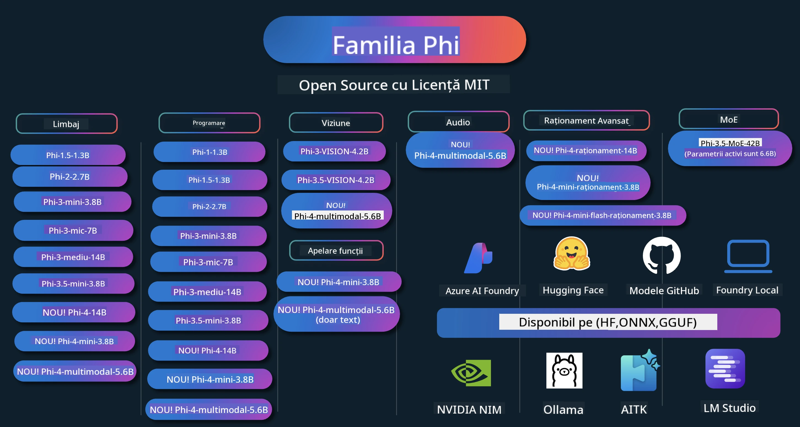

# Phi Cookbook: Exemple practice cu modelele Phi de la Microsoft

[](https://codespaces.new/microsoft/phicookbook)
[](https://vscode.dev/redirect?url=vscode://ms-vscode-remote.remote-containers/cloneInVolume?url=https://github.com/microsoft/phicookbook)

[](https://GitHub.com/microsoft/phicookbook/graphs/contributors/?WT.mc_id=aiml-137032-kinfeylo)
[](https://GitHub.com/microsoft/phicookbook/issues/?WT.mc_id=aiml-137032-kinfeylo)
[](https://GitHub.com/microsoft/phicookbook/pulls/?WT.mc_id=aiml-137032-kinfeylo)
[](http://makeapullrequest.com?WT.mc_id=aiml-137032-kinfeylo)

[](https://GitHub.com/microsoft/phicookbook/watchers/?WT.mc_id=aiml-137032-kinfeylo)
[](https://GitHub.com/microsoft/phicookbook/network/?WT.mc_id=aiml-137032-kinfeylo)
[](https://GitHub.com/microsoft/phicookbook/stargazers/?WT.mc_id=aiml-137032-kinfeylo)

[](https://discord.com/invite/ByRwuEEgH4)

Phi este o serie de modele AI open source dezvoltate de Microsoft.

Phi este în prezent cel mai puternic și rentabil model lingvistic mic (SLM), cu performanțe foarte bune în mai multe limbi, raționament, generare text/chat, codare, imagini, audio și alte scenarii.

Poți implementa Phi în cloud sau pe dispozitive edge și poți construi cu ușurință aplicații AI generative cu resurse limitate de calcul.

Urmează acești pași pentru a începe să folosești aceste resurse:
1. **Fork la Repository**: Click [](https://GitHub.com/microsoft/phicookbook/network/?WT.mc_id=aiml-137032-kinfeylo)
2. **Clonează Repository-ul**:   `git clone https://github.com/microsoft/PhiCookBook.git`
3. [**Alătură-te Comunității Microsoft AI pe Discord și întâlnește experți și dezvoltatori de seamă**](https://discord.com/invite/ByRwuEEgH4?WT.mc_id=aiml-137032-kinfeylo)



### 🌐 Suport multilingv

#### Susținut prin GitHub Action (Automatizat și Mereu Actualizat)

<!-- CO-OP TRANSLATOR LANGUAGES TABLE START -->
[Arabă](../ar/README.md) | [Bengaleză](../bn/README.md) | [Bulgară](../bg/README.md) | [Birmaneză (Myanmar)](../my/README.md) | [Chineză (Simplificată)](../zh-CN/README.md) | [Chineză (Tradițională, Hong Kong)](../zh-HK/README.md) | [Chineză (Tradițională, Macau)](../zh-MO/README.md) | [Chineză (Tradițională, Taiwan)](../zh-TW/README.md) | [Croată](../hr/README.md) | [Cehă](../cs/README.md) | [Daneză](../da/README.md) | [Olandeză](../nl/README.md) | [Estonă](../et/README.md) | [Finlandeză](../fi/README.md) | [Franceză](../fr/README.md) | [Germană](../de/README.md) | [Greacă](../el/README.md) | [Ebraică](../he/README.md) | [Hindi](../hi/README.md) | [Maghiară](../hu/README.md) | [Indoneziană](../id/README.md) | [Italiană](../it/README.md) | [Japoneză](../ja/README.md) | [Kannada](../kn/README.md) | [Coreeană](../ko/README.md) | [Lituaniană](../lt/README.md) | [Malay](../ms/README.md) | [Malayalam](../ml/README.md) | [Marathi](../mr/README.md) | [Nepaleză](../ne/README.md) | [Pidgin Nigerian](../pcm/README.md) | [Norvegiană](../no/README.md) | [Persană (Farsi)](../fa/README.md) | [Poloneză](../pl/README.md) | [Portugheză (Brazilia)](../pt-BR/README.md) | [Portugheză (Portugalia)](../pt-PT/README.md) | [Punjabi (Gurmukhi)](../pa/README.md) | [Română](./README.md) | [Rusă](../ru/README.md) | [Sârbă (Chirilică)](../sr/README.md) | [Slovacă](../sk/README.md) | [Slovenă](../sl/README.md) | [Spaniolă](../es/README.md) | [Swahili](../sw/README.md) | [Suedeză](../sv/README.md) | [Tagalog (Filipineză)](../tl/README.md) | [Tamil](../ta/README.md) | [Telugu](../te/README.md) | [Thailandeză](../th/README.md) | [Turcă](../tr/README.md) | [Ucraineană](../uk/README.md) | [Urdu](../ur/README.md) | [Vietnameză](../vi/README.md)

> **Preferi să clonezi local?**
>
> Acest repository include traduceri în peste 50 de limbi, ceea ce crește semnificativ dimensiunea descărcării. Pentru a clona fără traduceri, folosește sparse checkout:
>
> **Bash / macOS / Linux:**
> ```bash
> git clone --filter=blob:none --sparse https://github.com/microsoft/PhiCookBook.git
> cd PhiCookBook
> git sparse-checkout set --no-cone '/*' '!translations' '!translated_images'
> ```
>
> **CMD (Windows):**
> ```cmd
> git clone --filter=blob:none --sparse https://github.com/microsoft/PhiCookBook.git
> cd PhiCookBook
> git sparse-checkout set --no-cone "/*" "!translations" "!translated_images"
> ```
>
> Astfel primești tot ce ai nevoie pentru a parcurge cursul cu o descărcare mult mai rapidă.
<!-- CO-OP TRANSLATOR LANGUAGES TABLE END -->

## Cuprins

- Introducere
  - [Bine ați venit în familia Phi](./md/01.Introduction/01/01.PhiFamily.md)
  - [Configurarea mediului tău](./md/01.Introduction/01/01.EnvironmentSetup.md)
  - [Înțelegerea tehnologiilor cheie](./md/01.Introduction/01/01.Understandingtech.md)
  - [Siguranța AI pentru modelele Phi](./md/01.Introduction/01/01.AISafety.md)
  - [Suport hardware Phi](./md/01.Introduction/01/01.Hardwaresupport.md)
  - [Modele Phi & Disponibilitate pe platforme](./md/01.Introduction/01/01.Edgeandcloud.md)
  - [Folosind Guidance-ai și Phi](./md/01.Introduction/01/01.Guidance.md)
  - [Modele din GitHub Marketplace](https://github.com/marketplace/models)
  - [Catalog AI Azure](https://ai.azure.com)

- Inferență Phi în diferite medii
    -  [Hugging face](./md/01.Introduction/02/01.HF.md)
    -  [Modele GitHub](./md/01.Introduction/02/02.GitHubModel.md)
    -  [Catalog Model Microsoft Foundry](./md/01.Introduction/02/03.AzureAIFoundry.md)
    -  [Ollama](./md/01.Introduction/02/04.Ollama.md)
    -  [AI Toolkit VSCode (AITK)](./md/01.Introduction/02/05.AITK.md)
    -  [NVIDIA NIM](./md/01.Introduction/02/06.NVIDIA.md)
    -  [Foundry Local](./md/01.Introduction/02/07.FoundryLocal.md)

- Inferență Phi Family
    - [Inferență Phi pe iOS](./md/01.Introduction/03/iOS_Inference.md)
    - [Inferență Phi pe Android](./md/01.Introduction/03/Android_Inference.md)
    - [Inferență Phi pe Jetson](./md/01.Introduction/03/Jetson_Inference.md)
    - [Inferență Phi pe PC AI](./md/01.Introduction/03/AIPC_Inference.md)
    - [Inferență Phi cu Apple MLX Framework](./md/01.Introduction/03/MLX_Inference.md)
    - [Inferență Phi pe server local](./md/01.Introduction/03/Local_Server_Inference.md)
    - [Inferență Phi pe server la distanță folosind AI Toolkit](./md/01.Introduction/03/Remote_Interence.md)
    - [Inferență Phi cu Rust](./md/01.Introduction/03/Rust_Inference.md)
    - [Inferență Phi--Vision local](./md/01.Introduction/03/Vision_Inference.md)
    - [Inferență Phi cu Kaito AKS, Azure Containers(suport oficial)](./md/01.Introduction/03/Kaito_Inference.md)
-  [Cuantificarea Phi Family](./md/01.Introduction/04/QuantifyingPhi.md)
    - [Cuantificarea Phi-3.5 / 4 folosind llama.cpp](./md/01.Introduction/04/UsingLlamacppQuantifyingPhi.md)
    - [Cuantificarea Phi-3.5 / 4 folosind extensii AI generative pentru onnxruntime](./md/01.Introduction/04/UsingORTGenAIQuantifyingPhi.md)
    - [Cuantificarea Phi-3.5 / 4 folosind Intel OpenVINO](./md/01.Introduction/04/UsingIntelOpenVINOQuantifyingPhi.md)
    - [Cuantificarea Phi-3.5 / 4 folosind Apple MLX Framework](./md/01.Introduction/04/UsingAppleMLXQuantifyingPhi.md)

-  Evaluarea Phi
    - [AI Responsabil](./md/01.Introduction/05/ResponsibleAI.md)
    - [Microsoft Foundry pentru evaluare](./md/01.Introduction/05/AIFoundry.md)
    - [Folosind Promptflow pentru evaluare](./md/01.Introduction/05/Promptflow.md)
 
- RAG cu Azure AI Search
    - [Cum să folosești Phi-4-mini și Phi-4-multimodal(RAG) cu Azure AI Search](https://github.com/microsoft/PhiCookBook/blob/main/code/06.E2E/E2E_Phi-4-RAG-Azure-AI-Search.ipynb)

- Exemple de dezvoltare aplicații Phi
  - Aplicații text și chat
    - Exemple Phi-4  🆕
      - [📓] [Chat cu modelul Phi-4-mini ONNX](./md/02.Application/01.TextAndChat/Phi4/ChatWithPhi4ONNX/README.md)
      - [Chat cu model local Phi-4 ONNX .NET](../../md/04.HOL/dotnet/src/LabsPhi4-Chat-01OnnxRuntime)
      - [Aplicație consolă Chat .NET cu Phi-4 ONNX folosind Semantic Kernel](../../md/04.HOL/dotnet/src/LabsPhi4-Chat-02SK)
    - Exemple Phi-3 / 3.5
      - [Chatbot local în browser folosind Phi3, ONNX Runtime Web și WebGPU](https://github.com/microsoft/onnxruntime-inference-examples/tree/main/js/chat)
      - [Chat OpenVino](./md/02.Application/01.TextAndChat/Phi3/E2E_OpenVino_Chat.md)
      - [Model Multi - Interactiv Phi-3-mini și OpenAI Whisper](./md/02.Application/01.TextAndChat/Phi3/E2E_Phi-3-mini_with_whisper.md)
      - [MLFlow - Construirea unui wrapper și utilizarea Phi-3 cu MLFlow](./md//02.Application/01.TextAndChat/Phi3/E2E_Phi-3-MLflow.md)
      - [Optimizarea modelului - Cum să optimizezi modelul Phi-3-min pentru ONNX Runtime Web cu Olive](https://github.com/microsoft/Olive/tree/main/examples/phi3)
      - [Aplicație WinUI3 cu Phi-3 mini-4k-instruct-onnx](https://github.com/microsoft/Phi3-Chat-WinUI3-Sample/)
      -[Exemplu Aplicație WinUI3 Multi Model alimentată de AI](https://github.com/microsoft/ai-powered-notes-winui3-sample)
      - [Finisare și integrare modele personalizate Phi-3 cu Prompt flow](./md/02.Application/01.TextAndChat/Phi3/E2E_Phi-3-FineTuning_PromptFlow_Integration.md)
      - [Finisare și integrare modele personalizate Phi-3 cu Prompt flow în Microsoft Foundry](./md/02.Application/01.TextAndChat/Phi3/E2E_Phi-3-FineTuning_PromptFlow_Integration_AIFoundry.md)
      - [Evaluarea modelului Phi-3 / Phi-3.5 finisat în Microsoft Foundry concentrându-se pe principiile AI responsabile ale Microsoft](./md/02.Application/01.TextAndChat/Phi3/E2E_Phi-3-Evaluation_AIFoundry.md)
      - [📓] [Exemplu de predicție a limbajului Phi-3.5-mini-instruct (Chineză/Engleză)](./md/02.Application/01.TextAndChat/Phi3/phi3-instruct-demo.ipynb)
      - [Chatbot Phi-3.5-Instruct WebGPU RAG](./md/02.Application/01.TextAndChat/Phi3/WebGPUWithPhi35Readme.md)
      - [Folosind GPU Windows pentru a crea soluția Prompt flow cu Phi-3.5-Instruct ONNX](./md/02.Application/01.TextAndChat/Phi3/UsingPromptFlowWithONNX.md)
      - [Folosirea Microsoft Phi-3.5 tflite pentru a crea aplicație Android](./md/02.Application/01.TextAndChat/Phi3/UsingPhi35TFLiteCreateAndroidApp.md)
      - [Exemplu Q&A .NET folosind modelul local ONNX Phi-3 cu Microsoft.ML.OnnxRuntime](../../md/04.HOL/dotnet/src/LabsPhi301)
      - [Aplicație consolă chat .NET cu Semantic Kernel și Phi-3](../../md/04.HOL/dotnet/src/LabsPhi302)

  - Exemple Cod SDK Azure AI Inference 
    - Exemple Phi-4 🆕
      - [📓] [Generarea codului proiectului folosind Phi-4-multimodal](./md/02.Application/02.Code/Phi4/GenProjectCode/README.md)
    - Exemple Phi-3 / 3.5
      - [Construiește propriul tău Visual Studio Code GitHub Copilot Chat cu Microsoft Phi-3 Family](./md/02.Application/02.Code/Phi3/VSCodeExt/README.md)
      - [Creează-ți propriul agent Chat Copilot Visual Studio Code cu Phi-3.5 folosind modelele GitHub](/md/02.Application/02.Code/Phi3/CreateVSCodeChatAgentWithGitHubModels.md)

  - Exemple Raționamente Avansate
    - Exemple Phi-4 🆕
      - [📓] [Exemple Phi-4-mini-reasoning sau Phi-4-reasoning](./md/02.Application/03.AdvancedReasoning/Phi4/AdvancedResoningPhi4mini/README.md)
      - [📓] [Finisare Phi-4-mini-reasoning cu Microsoft Olive](./md/02.Application/03.AdvancedReasoning/Phi4/AdvancedResoningPhi4mini/olive_ft_phi_4_reasoning_with_medicaldata.ipynb)
      - [📓] [Finisare Phi-4-mini-reasoning cu Apple MLX](./md/02.Application/03.AdvancedReasoning/Phi4/AdvancedResoningPhi4mini/mlx_ft_phi_4_reasoning_with_medicaldata.ipynb)
      - [📓] [Phi-4-mini-reasoning cu modelele GitHub](./md/02.Application/02.Code/Phi4r/github_models_inference.ipynb)
      - [📓] [Phi-4-mini-reasoning cu modelele Microsoft Foundry](./md/02.Application/02.Code/Phi4r/azure_models_inference.ipynb)
  - Demonstrații
      - [Demonstrații Phi-4-mini găzduite pe Hugging Face Spaces](https://huggingface.co/spaces/microsoft/phi-4-mini?WT.mc_id=aiml-137032-kinfeylo)
      - [Demonstrații Phi-4-multimodal găzduite pe Hugging Face Spaces](https://huggingface.co/spaces/microsoft/phi-4-multimodal?WT.mc_id=aiml-137032-kinfeylo)
  - Exemple Viziune
    - Exemple Phi-4 🆕
      - [📓] [Folosește Phi-4-multimodal pentru a citi imagini și genera cod](./md/02.Application/04.Vision/Phi4/CreateFrontend/README.md) 
    - Exemple Phi-3 / 3.5
      -  [📓][Phi-3-vision-Imagine text la text](./md/02.Application/04.Vision/Phi3/E2E_Phi-3-vision-image-text-to-text-online-endpoint.ipynb)
      - [Phi-3-vision-ONNX](https://onnxruntime.ai/docs/genai/tutorials/phi3-v.html)
      - [📓][Phi-3-vision CLIP Embedding](./md/02.Application/04.Vision/Phi3/E2E_Phi-3-vision-image-text-to-text-online-endpoint.ipynb)
      - [DEMO: Phi-3 Reciclare](https://github.com/jennifermarsman/PhiRecycling/)
      - [Phi-3-vision - Asistent vizual lingvistic - cu Phi3-Vision și OpenVINO](https://docs.openvino.ai/nightly/notebooks/phi-3-vision-with-output.html)
      - [Phi-3 Vision Nvidia NIM](./md/02.Application/04.Vision/Phi3/E2E_Nvidia_NIM_Vision.md)
      - [Phi-3 Vision OpenVino](./md/02.Application/04.Vision/Phi3/E2E_OpenVino_Phi3Vision.md)
      - [📓][Phi-3.5 Vision exemplu multi-cadru sau multi-imagine](./md/02.Application/04.Vision/Phi3/phi3-vision-demo.ipynb)
      - [Phi-3 Vision Model Local ONNX folosind Microsoft.ML.OnnxRuntime .NET](../../md/04.HOL/dotnet/src/LabsPhi303)
      - [Model Local ONNX Phi-3 Vision bazat pe meniu folosind Microsoft.ML.OnnxRuntime .NET](../../md/04.HOL/dotnet/src/LabsPhi304)

  - Exemple Matematică
    -  Exemple Phi-4-Mini-Flash-Reasoning-Instruct 🆕 [Demo Matematică cu Phi-4-Mini-Flash-Reasoning-Instruct](./md/02.Application/09.Math/MathDemo.ipynb)

  - Exemple Audio
    - Exemple Phi-4 🆕
      - [📓] [Extrage transcrieri audio folosind Phi-4-multimodal](./md/02.Application/05.Audio/Phi4/Transciption/README.md)
      - [📓] [Exemplu Audio Phi-4-multimodal](./md/02.Application/05.Audio/Phi4/Siri/demo.ipynb)
      - [📓] [Exemplu traducere vorbire Phi-4-multimodal](./md/02.Application/05.Audio/Phi4/Translate/demo.ipynb)
      - [Aplicație consolă .NET folosind Phi-4-multimodal Audio pentru a analiza un fișier audio și a genera transcript](../../md/04.HOL/dotnet/src/LabsPhi4-MultiModal-02Audio)

  - Exemple MOE
    - Exemple Phi-3 / 3.5
      - [📓] [Modele Mixture of Experts Phi-3.5 (MoEs) Exemplu Social Media](./md/02.Application/06.MoE/Phi3/phi3_moe_demo.ipynb)
      - [📓] [Construirea unui pipeline de Generare Augmentată de Regăsire (RAG) cu NVIDIA NIM Phi-3 MOE, Azure AI Search și LlamaIndex](./md/02.Application/06.MoE/Phi3/azure-ai-search-nvidia-rag.ipynb)
      - 
  - Exemple Apelare Funcții
    - Exemple Phi-4 🆕
      -  [📓] [Folosirea apelării funcțiilor cu Phi-4-mini](./md/02.Application/07.FunctionCalling/Phi4/FunctionCallingBasic/README.md)
      -  [📓] [Folosirea apelării funcțiilor pentru a crea multi-agenti cu Phi-4-mini](./md/02.Application/07.FunctionCalling/Phi4/Multiagents/Phi_4_mini_multiagent.ipynb)
      -  [📓] [Folosirea apelării funcțiilor cu Ollama](./md/02.Application/07.FunctionCalling/Phi4/Ollama/ollama_functioncalling.ipynb)
      -  [📓] [Folosirea apelării funcțiilor cu ONNX](./md/02.Application/07.FunctionCalling/Phi4/ONNX/onnx_parallel_functioncalling.ipynb)
  - Exemple Amestec Multimodal
    - Exemple Phi-4 🆕
      -  [📓] [Folosind Phi-4-multimodal ca jurnalist de tehnologie](./md/02.Application/08.Multimodel/Phi4/TechJournalist/phi_4_mm_audio_text_publish_news.ipynb)
      - [Aplicație consolă .NET folosind Phi-4-multimodal pentru a analiza imagini](../../md/04.HOL/dotnet/src/LabsPhi4-MultiModal-01Images)

- Ajustări fine ale exemplarelor Phi
  - [Scenarii de ajustare fină](./md/03.FineTuning/FineTuning_Scenarios.md)
  - [Ajustare fină vs RAG](./md/03.FineTuning/FineTuning_vs_RAG.md)
  - [Ajustare fină pentru a transforma Phi-3 într-un expert în industrie](./md/03.FineTuning/LetPhi3gotoIndustriy.md)
  - [Ajustare fină Phi-3 cu AI Toolkit pentru VS Code](./md/03.FineTuning/Finetuning_VSCodeaitoolkit.md)
  - [Ajustare fină Phi-3 cu Azure Machine Learning Service](./md/03.FineTuning/Introduce_AzureML.md)
  - [Ajustare fină Phi-3 cu Lora](./md/03.FineTuning/FineTuning_Lora.md)
  - [Ajustare fină Phi-3 cu QLora](./md/03.FineTuning/FineTuning_Qlora.md)
  - [Ajustare fină Phi-3 cu Microsoft Foundry](./md/03.FineTuning/FineTuning_AIFoundry.md)
  - [Ajustare fină Phi-3 cu Azure ML CLI/SDK](./md/03.FineTuning/FineTuning_MLSDK.md)
  - [Ajustare fină cu Microsoft Olive](./md/03.FineTuning/FineTuning_MicrosoftOlive.md)
  - [Ajustare fină cu Microsoft Olive Hands-On Lab](./md/03.FineTuning/olive-lab/readme.md)
  - [Ajustare fină Phi-3-vision cu Weights and Bias](./md/03.FineTuning/FineTuning_Phi-3-visionWandB.md)
  - [Ajustare fină Phi-3 cu Apple MLX Framework](./md/03.FineTuning/FineTuning_MLX.md)
  - [Ajustare fină Phi-3-vision (suport oficial)](./md/03.FineTuning/FineTuning_Vision.md)
  - [Ajustare fină Phi-3 cu Kaito AKS , Azure Containers (suport oficial)](./md/03.FineTuning/FineTuning_Kaito.md)
  - [Ajustare fină Phi-3 și 3.5 Vision](https://github.com/2U1/Phi3-Vision-Finetune)

- Laborator Practic
  - [Explorarea modelelor de ultimă generație: LLMs, SLMs, dezvoltare locală și altele](https://github.com/microsoft/aitour-exploring-cutting-edge-models)
  - [Dezvoltarea potențialului NLP: ajustare fină cu Microsoft Olive](https://github.com/azure/Ignite_FineTuning_workshop)
- Lucrări și publicații academice de cercetare
  - [Manualele sunt tot ce ai nevoie II: raport tehnic phi-1.5](https://arxiv.org/abs/2309.05463)
  - [Raport tehnic Phi-3: un model lingvistic foarte capabil local pe telefonul tău](https://arxiv.org/abs/2404.14219)
  - [Raport tehnic Phi-4](https://arxiv.org/abs/2412.08905)
  - [Raport tehnic Phi-4-Mini: modele multilingvistice compacte dar puternice prin Mixture-of-LoRAs](https://arxiv.org/abs/2503.01743)
  - [Optimizarea modelelor lingvistice mici pentru apelarea funcțiilor în vehicul](https://arxiv.org/abs/2501.02342)
  - [(WhyPHI) Ajustarea fină a PHI-3 pentru răspunsuri la întrebări cu alegere multiplă: metodologie, rezultate și provocări](https://arxiv.org/abs/2501.01588)
  - [Raportul tehnic Phi-4-reasoning](https://www.microsoft.com/en-us/research/wp-content/uploads/2025/04/phi_4_reasoning.pdf)
  - [Raportul tehnic Phi-4-mini-reasoning](https://huggingface.co/microsoft/Phi-4-mini-reasoning/blob/main/Phi-4-Mini-Reasoning.pdf)

## Utilizarea modelelor Phi

### Phi pe Microsoft Foundry

Poți învăța cum să folosești Microsoft Phi și cum să construiești soluții E2E pe diferitele tale dispozitive hardware. Pentru a experimenta Phi personal, începe prin a te juca cu modelele și a personaliza Phi pentru scenariile tale folosind [Catalogul de modele Microsoft Foundry](https://aka.ms/phi3-azure-ai). Poți afla mai multe la Începerea utilizării [Microsoft Foundry](/md/02.QuickStart/AzureAIFoundry_QuickStart.md)

**Teren de joacă**  
Fiecărui model îi corespunde un teren de joacă dedicat pentru testarea modelului [Azure AI Playground](https://aka.ms/try-phi3).

### Phi pe modelele GitHub

Poți învăța cum să folosești Microsoft Phi și cum să construiești soluții E2E pe diferitele tale dispozitive hardware. Pentru a experimenta Phi personal, începe prin a te juca cu modelul și a personaliza Phi pentru scenariile tale folosind [Catalogul de modele GitHub](https://github.com/marketplace/models?WT.mc_id=aiml-137032-kinfeylo). Poți afla mai multe la Începerea utilizării [Catalogului de modele GitHub](/md/02.QuickStart/GitHubModel_QuickStart.md)

**Teren de joacă**  
Fiecărui model îi corespunde un [teren de joacă dedicat pentru testarea modelului](/md/02.QuickStart/GitHubModel_QuickStart.md).

### Phi pe Hugging Face

Poți găsi modelul și pe [Hugging Face](https://huggingface.co/microsoft)

**Teren de joacă**  
 [Terenul de joacă Hugging Chat](https://huggingface.co/chat/models/microsoft/Phi-3-mini-4k-instruct)

## 🎒 Alte cursuri

Echipa noastră produce și alte cursuri! Consultă-le:

<!-- CO-OP TRANSLATOR OTHER COURSES START -->
### LangChain
[](https://aka.ms/langchain4j-for-beginners)
[](https://aka.ms/langchainjs-for-beginners?WT.mc_id=m365-94501-dwahlin)
[](https://github.com/microsoft/langchain-for-beginners?WT.mc_id=m365-94501-dwahlin)
---

### Azure / Edge / MCP / Agenți
[](https://github.com/microsoft/AZD-for-beginners?WT.mc_id=academic-105485-koreyst)
[](https://github.com/microsoft/edgeai-for-beginners?WT.mc_id=academic-105485-koreyst)
[](https://github.com/microsoft/mcp-for-beginners?WT.mc_id=academic-105485-koreyst)
[](https://github.com/microsoft/ai-agents-for-beginners?WT.mc_id=academic-105485-koreyst)

---
 
### Seria de AI generativă
[](https://github.com/microsoft/generative-ai-for-beginners?WT.mc_id=academic-105485-koreyst)
[-9333EA?style=for-the-badge&labelColor=E5E7EB&color=9333EA)](https://github.com/microsoft/Generative-AI-for-beginners-dotnet?WT.mc_id=academic-105485-koreyst)
[-C084FC?style=for-the-badge&labelColor=E5E7EB&color=C084FC)](https://github.com/microsoft/generative-ai-for-beginners-java?WT.mc_id=academic-105485-koreyst)
[-E879F9?style=for-the-badge&labelColor=E5E7EB&color=E879F9)](https://github.com/microsoft/generative-ai-with-javascript?WT.mc_id=academic-105485-koreyst)

---
 
### Învățare de bază
[](https://aka.ms/ml-beginners?WT.mc_id=academic-105485-koreyst)
[](https://aka.ms/datascience-beginners?WT.mc_id=academic-105485-koreyst)
[](https://aka.ms/ai-beginners?WT.mc_id=academic-105485-koreyst)
[](https://github.com/microsoft/Security-101?WT.mc_id=academic-96948-sayoung)
[](https://aka.ms/webdev-beginners?WT.mc_id=academic-105485-koreyst)
[](https://aka.ms/iot-beginners?WT.mc_id=academic-105485-koreyst)
[](https://github.com/microsoft/xr-development-for-beginners?WT.mc_id=academic-105485-koreyst)

---
 
### Seria Copilot
[](https://aka.ms/GitHubCopilotAI?WT.mc_id=academic-105485-koreyst)
[](https://github.com/microsoft/mastering-github-copilot-for-dotnet-csharp-developers?WT.mc_id=academic-105485-koreyst)
[](https://github.com/microsoft/CopilotAdventures?WT.mc_id=academic-105485-koreyst)
<!-- CO-OP TRANSLATOR OTHER COURSES END -->

## AI Responsabilă

Microsoft este dedicat să ajute clienții să folosească produsele noastre AI în mod responsabil, împărtășind învățămintele noastre și construind parteneriate bazate pe încredere prin instrumente precum Notele de transparență și Evaluările de impact. Multe dintre aceste resurse pot fi găsite la [https://aka.ms/RAI](https://aka.ms/RAI).  
Abordarea Microsoft privind AI responsabilă se bazează pe principiile noastre AI de corectitudine, fiabilitate și siguranță, confidențialitate și securitate, incluzivitate, transparență și responsabilitate.

Modelele la scară largă pentru limbaj natural, imagine și voce - cum sunt cele folosite în acest exemplu - pot avea comportamente potențial nedrepte, nesigure sau ofensatoare, cauzând astfel prejudicii. Te rugăm să consulți [Nota de transparență a serviciului Azure OpenAI](https://learn.microsoft.com/legal/cognitive-services/openai/transparency-note?tabs=text) pentru a fi informat despre riscuri și limitări.

Abordarea recomandată pentru a atenua aceste riscuri este să incluzi un sistem de siguranță în arhitectura ta care să poată detecta și preveni comportamentul dăunător. [Azure AI Content Safety](https://learn.microsoft.com/azure/ai-services/content-safety/overview) oferă un strat independent de protecție, capabil să detecteze conținut dăunător generat de utilizatori și AI în aplicații și servicii. Azure AI Content Safety include API-uri pentru text și imagine care îți permit să detectezi materialele dăunătoare. În Microsoft Foundry, serviciul Content Safety îți permite să vizualizezi, explorezi și să încerci coduri de probă pentru detectarea conținutului dăunător în diferite modalități. Următoarea [documentație quickstart](https://learn.microsoft.com/azure/ai-services/content-safety/quickstart-text?tabs=visual-studio%2Clinux&pivots=programming-language-rest) te ghidează prin modul de efectuare a cererilor către serviciu.
Un alt aspect de luat în considerare este performanța generală a aplicației. În cazul aplicațiilor multi-modale și multi-modele, considerăm că performanța înseamnă că sistemul funcționează așa cum te aștepți tu și utilizatorii tăi, inclusiv să nu genereze rezultate dăunătoare. Este important să evaluezi performanța aplicației tale generale folosind [evaluatori de performanță, calitate, risc și siguranță](https://learn.microsoft.com/azure/ai-studio/concepts/evaluation-metrics-built-in). De asemenea, ai posibilitatea să creezi și să evaluezi folosind [evaluatori personalizați](https://learn.microsoft.com/azure/ai-studio/how-to/develop/evaluate-sdk#custom-evaluators).

Poți evalua aplicația ta AI în mediul tău de dezvoltare folosind [Azure AI Evaluation SDK](https://microsoft.github.io/promptflow/index.html). Având un set de date de test sau un obiectiv, generațiile aplicației tale AI generative sunt măsurate cantitativ cu evaluatori încorporați sau evaluatori personalizați după alegerea ta. Pentru a începe cu SDK-ul de evaluare azure ai pentru a-ți evalua sistemul, poți urma [ghidul rapid](https://learn.microsoft.com/azure/ai-studio/how-to/develop/flow-evaluate-sdk). Odată ce execuți o rulare de evaluare, poți [vizualiza rezultatele în Microsoft Foundry](https://learn.microsoft.com/azure/ai-studio/how-to/evaluate-flow-results). 

## Mărci comerciale

Acest proiect poate conține mărci comerciale sau logo-uri pentru proiecte, produse sau servicii. Utilizarea autorizată a mărcilor comerciale sau logo-urilor Microsoft este supusă și trebuie să respecte [Ghidurile pentru mărci comerciale și brand Microsoft](https://www.microsoft.com/legal/intellectualproperty/trademarks/usage/general).
Utilizarea mărcilor comerciale sau logo-urilor Microsoft în versiunile modificate ale acestui proiect nu trebuie să creeze confuzie sau să implice sponsorizarea Microsoft. Orice utilizare a mărcilor comerciale sau logo-urilor unor terțe părți este supusă politicilor acelor terțe părți.

## Obținerea de ajutor

Dacă întâmpini dificultăți sau ai întrebări despre construirea aplicațiilor AI, alătură-te:

[](https://aka.ms/foundry/discord)

Dacă ai feedback despre produs sau erori în timpul construirii, vizitează:

[](https://aka.ms/foundry/forum)

---

<!-- CO-OP TRANSLATOR DISCLAIMER START -->
**Declinare de responsabilitate**:
Acest document a fost tradus folosind serviciul de traducere AI [Co-op Translator](https://github.com/Azure/co-op-translator). Deși ne străduim pentru acuratețe, vă rugăm să rețineți că traducerile automate pot conține erori sau inexactități. Documentul original în limba sa de origine trebuie considerat sursa autorizată. Pentru informații critice, se recomandă traducerea profesională realizată de un specialist uman. Nu ne asumăm răspunderea pentru eventualele neînțelegeri sau interpretări greșite rezultate din utilizarea acestei traduceri.
<!-- CO-OP TRANSLATOR DISCLAIMER END -->