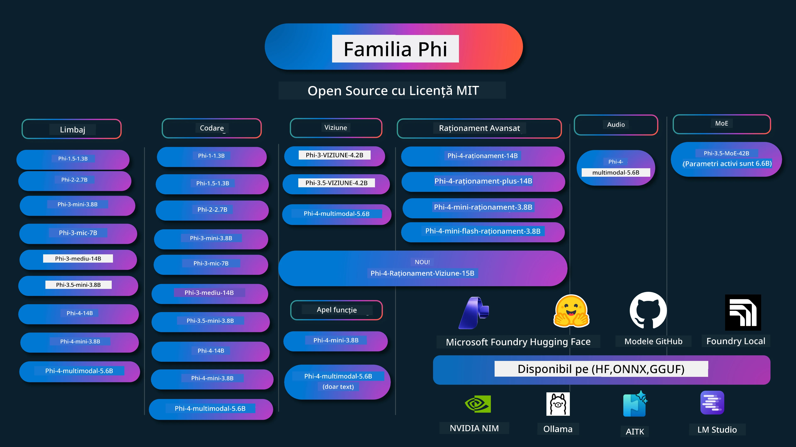

# Phi Cookbook: Exemple practice cu modelele Phi de la Microsoft

[](https://codespaces.new/microsoft/phicookbook)
[](https://vscode.dev/redirect?url=vscode://ms-vscode-remote.remote-containers/cloneInVolume?url=https://github.com/microsoft/phicookbook)

[](https://GitHub.com/microsoft/phicookbook/graphs/contributors/?WT.mc_id=aiml-137032-kinfeylo)
[](https://GitHub.com/microsoft/phicookbook/issues/?WT.mc_id=aiml-137032-kinfeylo)
[](https://GitHub.com/microsoft/phicookbook/pulls/?WT.mc_id=aiml-137032-kinfeylo)
[](http://makeapullrequest.com?WT.mc_id=aiml-137032-kinfeylo)

[](https://GitHub.com/microsoft/phicookbook/watchers/?WT.mc_id=aiml-137032-kinfeylo)
[](https://GitHub.com/microsoft/phicookbook/network/?WT.mc_id=aiml-137032-kinfeylo)
[](https://GitHub.com/microsoft/phicookbook/stargazers/?WT.mc_id=aiml-137032-kinfeylo)

[](https://discord.com/invite/ByRwuEEgH4)

Phi este o serie de modele AI open source dezvoltate de Microsoft.

Phi este în prezent cel mai puternic și eficient din punct de vedere al costurilor model mic de limbaj (SLM), cu benchmark-uri foarte bune în multi-limbaj, raționament, generare text/chat, codare, imagini, audio și alte scenarii.

Poți implementa Phi în cloud sau pe dispozitive edge și poți construi cu ușurință aplicații AI generative cu putere limitată de calcul.

Urmează acești pași pentru a începe să folosești aceste resurse:
1. **Fă fork acestui repositor**: Click [](https://GitHub.com/microsoft/phicookbook/network/?WT.mc_id=aiml-137032-kinfeylo)
2. **Clonează repositorul**: `git clone https://github.com/microsoft/PhiCookBook.git`
3. [**Alătură-te comunității Microsoft AI Discord și întâlnește experți și colegi dezvoltatori**](https://discord.com/invite/ByRwuEEgH4?WT.mc_id=aiml-137032-kinfeylo)



### 🌐 Suport multi-limbaj

#### Suportat prin GitHub Action (automatizat și mereu actualizat)

<!-- CO-OP TRANSLATOR LANGUAGES TABLE START -->
[Arabic](../ar/README.md) | [Bengali](../bn/README.md) | [Bulgarian](../bg/README.md) | [Burmese (Myanmar)](../my/README.md) | [Chinese (Simplified)](../zh-CN/README.md) | [Chinese (Traditional, Hong Kong)](../zh-HK/README.md) | [Chinese (Traditional, Macau)](../zh-MO/README.md) | [Chinese (Traditional, Taiwan)](../zh-TW/README.md) | [Croatian](../hr/README.md) | [Czech](../cs/README.md) | [Danish](../da/README.md) | [Dutch](../nl/README.md) | [Estonian](../et/README.md) | [Finnish](../fi/README.md) | [French](../fr/README.md) | [German](../de/README.md) | [Greek](../el/README.md) | [Hebrew](../he/README.md) | [Hindi](../hi/README.md) | [Hungarian](../hu/README.md) | [Indonesian](../id/README.md) | [Italian](../it/README.md) | [Japanese](../ja/README.md) | [Kannada](../kn/README.md) | [Khmer](../km/README.md) | [Korean](../ko/README.md) | [Lithuanian](../lt/README.md) | [Malay](../ms/README.md) | [Malayalam](../ml/README.md) | [Marathi](../mr/README.md) | [Nepali](../ne/README.md) | [Nigerian Pidgin](../pcm/README.md) | [Norwegian](../no/README.md) | [Persian (Farsi)](../fa/README.md) | [Polish](../pl/README.md) | [Portuguese (Brazil)](../pt-BR/README.md) | [Portuguese (Portugal)](../pt-PT/README.md) | [Punjabi (Gurmukhi)](../pa/README.md) | [Romanian](./README.md) | [Russian](../ru/README.md) | [Serbian (Cyrillic)](../sr/README.md) | [Slovak](../sk/README.md) | [Slovenian](../sl/README.md) | [Spanish](../es/README.md) | [Swahili](../sw/README.md) | [Swedish](../sv/README.md) | [Tagalog (Filipino)](../tl/README.md) | [Tamil](../ta/README.md) | [Telugu](../te/README.md) | [Thai](../th/README.md) | [Turkish](../tr/README.md) | [Ukrainian](../uk/README.md) | [Urdu](../ur/README.md) | [Vietnamese](../vi/README.md)

> **Preferi să clonezi local?**
>
> Acest repositor include traduceri în peste 50 de limbi, ceea ce mărește semnificativ mărimea descarcării. Pentru a clona fără traduceri, folosește sparse checkout:
>
> **Bash / macOS / Linux:**
> ```bash
> git clone --filter=blob:none --sparse https://github.com/microsoft/PhiCookBook.git
> cd PhiCookBook
> git sparse-checkout set --no-cone '/*' '!translations' '!translated_images'
> ```
>
> **CMD (Windows):**
> ```cmd
> git clone --filter=blob:none --sparse https://github.com/microsoft/PhiCookBook.git
> cd PhiCookBook
> git sparse-checkout set --no-cone "/*" "!translations" "!translated_images"
> ```
>
> Astfel primești tot ce ai nevoie pentru a finaliza cursul, cu o descărcare mult mai rapidă.
<!-- CO-OP TRANSLATOR LANGUAGES TABLE END -->

## Cuprins
- Introducere - [Bine ați venit în Familia Phi](./md/01.Introduction/01/01.PhiFamily.md) - [Configurarea mediului dvs.](./md/01.Introduction/01/01.EnvironmentSetup.md) - [Înțelegerea tehnologiilor cheie](./md/01.Introduction/01/01.Understandingtech.md) - [Siguranța AI pentru modelele Phi](./md/01.Introduction/01/01.AISafety.md) - [Suport hardware Phi](./md/01.Introduction/01/01.Hardwaresupport.md) - [Modele Phi și disponibilitate pe platforme](./md/01.Introduction/01/01.Edgeandcloud.md) - [Utilizarea Guidance-ai și Phi](./md/01.Introduction/01/01.Guidance.md) - [Modele GitHub Marketplace](https://github.com/marketplace/models) - [Catalog modele Azure AI](https://ai.azure.com) - Inference Phi în medii diferite - [Hugging face](./md/01.Introduction/02/01.HF.md) - [Modele GitHub](./md/01.Introduction/02/02.GitHubModel.md) - [Catalog modele Microsoft Foundry](./md/01.Introduction/02/03.AzureAIFoundry.md) - [Ollama](./md/01.Introduction/02/04.Ollama.md) - [AI Toolkit VSCode (AITK)](./md/01.Introduction/02/05.AITK.md) - [NVIDIA NIM](./md/01.Introduction/02/06.NVIDIA.md) - [Foundry Local](./md/01.Introduction/02/07.FoundryLocal.md) - Inference Phi Family - [Inference Phi pe iOS](./md/01.Introduction/03/iOS_Inference.md) - [Inference Phi pe Android](./md/01.Introduction/03/Android_Inference.md) - [Inference Phi pe Jetson](./md/01.Introduction/03/Jetson_Inference.md) - [Inference Phi pe AI PC](./md/01.Introduction/03/AIPC_Inference.md) - [Inference Phi cu Apple MLX Framework](./md/01.Introduction/03/MLX_Inference.md) - [Inference Phi pe server local](./md/01.Introduction/03/Local_Server_Inference.md) - [Inference Phi pe server la distanță folosind AI Toolkit](./md/01.Introduction/03/Remote_Interence.md) - [Inference Phi cu Rust](./md/01.Introduction/03/Rust_Inference.md) - [Inference Phi--Viziune local](./md/01.Introduction/03/Vision_Inference.md) - [Inference Phi cu Kaito AKS, Azure Containers (suport oficial)](./md/01.Introduction/03/Kaito_Inference.md) - [Cuantificarea familiei Phi](./md/01.Introduction/04/QuantifyingPhi.md) - [Cuantizarea Phi-3.5 / 4 folosind llama.cpp](./md/01.Introduction/04/UsingLlamacppQuantifyingPhi.md) - [Cuantizarea Phi-3.5 / 4 folosind extensiile AI Generative pentru onnxruntime](./md/01.Introduction/04/UsingORTGenAIQuantifyingPhi.md) - [Cuantizarea Phi-3.5 / 4 folosind Intel OpenVINO](./md/01.Introduction/04/UsingIntelOpenVINOQuantifyingPhi.md) - [Cuantizarea Phi-3.5 / 4 folosind Apple MLX Framework](./md/01.Introduction/04/UsingAppleMLXQuantifyingPhi.md) - Evaluarea Phi - [Inteligență Artificială responsabilă](./md/01.Introduction/05/ResponsibleAI.md) - [Microsoft Foundry pentru evaluare](./md/01.Introduction/05/AIFoundry.md) - [Utilizarea Promptflow pentru evaluare](./md/01.Introduction/05/Promptflow.md) - RAG cu Azure AI Search - [Cum să utilizați Phi-4-mini și Phi-4-multimodal (RAG) cu Azure AI Search](https://github.com/microsoft/PhiCookBook/blob/main/code/06.E2E/E2E_Phi-4-RAG-Azure-AI-Search.ipynb) - Exemple dezvoltare aplicații Phi - Aplicații text și chat - Exemple Phi-4 - [📓] [Chat cu modelul Phi-4-mini ONNX](./md/02.Application/01.TextAndChat/Phi4/ChatWithPhi4ONNX/README.md) - [Chat cu model local Phi-4 ONNX în .NET](../../md/04.HOL/dotnet/src/LabsPhi4-Chat-01OnnxRuntime) - [Chat aplicație console .NET cu Phi-4 ONNX folosind Semantic Kernel](../../md/04.HOL/dotnet/src/LabsPhi4-Chat-02SK) - Exemple Phi-3 / 3.5 - [Chatbot local în browser folosind Phi3, ONNX Runtime Web și WebGPU](https://github.com/microsoft/onnxruntime-inference-examples/tree/main/js/chat) - [Chat OpenVino](./md/02.Application/01.TextAndChat/Phi3/E2E_OpenVino_Chat.md) - [Model multilateral - Phi-3-mini interactiv și OpenAI Whisper](./md/02.Application/01.TextAndChat/Phi3/E2E_Phi-3-mini_with_whisper.md) - [MLFlow - Construirea unui wrapper și utilizarea Phi-3 cu MLFlow](./md//02.Application/01.TextAndChat/Phi3/E2E_Phi-3-MLflow.md) - [Optimizarea modelului - Cum să optimizați modelul Phi-3-min pentru ONNX Runtime Web cu Olive](https://github.com/microsoft/Olive/tree/main/examples/phi3) - [Aplicație WinUI3 cu Phi-3 mini-4k-instruct-onnx](https://github.com/microsoft/Phi3-Chat-WinUI3-Sample/) - [Exemplu aplicație Notițe AI alimentate WinUI3 Multi Model](https://github.com/microsoft/ai-powered-notes-winui3-sample) - [Ajustare fină și integrare modele personalizate Phi-3 cu Prompt flow](./md/02.Application/01.TextAndChat/Phi3/E2E_Phi-3-FineTuning_PromptFlow_Integration.md) - [Ajustare fină și integrare modele personalizate Phi-3 cu Prompt flow în Microsoft Foundry](./md/02.Application/01.TextAndChat/Phi3/E2E_Phi-3-FineTuning_PromptFlow_Integration_AIFoundry.md) - [Evaluarea modelului Phi-3 / Phi-3.5 ajustat fin în Microsoft Foundry cu focus pe principiile AI responsabile ale Microsoft](./md/02.Application/01.TextAndChat/Phi3/E2E_Phi-3-Evaluation_AIFoundry.md) - [📓] [Exemplu predicție limbaj Phi-3.5-mini-instruct (chineză/engleză)](./md/02.Application/01.TextAndChat/Phi3/phi3-instruct-demo.ipynb) - [Chatbot RAG WebGPU Phi-3.5-Instruct](./md/02.Application/01.TextAndChat/Phi3/WebGPUWithPhi35Readme.md) - [Utilizarea GPU Windows pentru a crea soluția Prompt flow cu Phi-3.5-Instruct ONNX](./md/02.Application/01.TextAndChat/Phi3/UsingPromptFlowWithONNX.md) - [Creare aplicație Android folosind Microsoft Phi-3.5 tflite](./md/02.Application/01.TextAndChat/Phi3/UsingPhi35TFLiteCreateAndroidApp.md) - [Exemplu Q&A .NET folosind model local ONNX Phi-3 și Microsoft.ML.OnnxRuntime](../../md/04.HOL/dotnet/src/LabsPhi301) - [Aplicație chat console .NET cu Semantic Kernel și Phi-3](../../md/04.HOL/dotnet/src/LabsPhi302) - Exemple cod SDK Inference Azure AI - Exemple Phi-4 - [📓] [Generare cod proiect folosind Phi-4-multimodal](./md/02.Application/02.Code/Phi4/GenProjectCode/README.md) - Exemple Phi-3 / 3.5 - [Construiește propriul tău GitHub Copilot Chat pentru Visual Studio Code cu familia Microsoft Phi-3](./md/02.Application/02.Code/Phi3/VSCodeExt/README.md) - [Crearea propriului agent de chat GitHub Copilot pentru Visual Studio Code cu Phi-3.5 prin modelele GitHub](/md/02.Application/02.Code/Phi3/CreateVSCodeChatAgentWithGitHubModels.md) - Exemple raționament avansat - Exemple Phi-4 - [📓] [Exemple de raționament Phi-4-mini sau Phi-4](./md/02.Application/03.AdvancedReasoning/Phi4/AdvancedResoningPhi4mini/README.md) - [📓] [Ajustare fină Phi-4-mini-reasoning cu Microsoft Olive](./md/02.Application/03.AdvancedReasoning/Phi4/AdvancedResoningPhi4mini/olive_ft_phi_4_reasoning_with_medicaldata.ipynb) - [📓] [Ajustare fină Phi-4-mini-reasoning cu Apple MLX](./md/02.Application/03.AdvancedReasoning/Phi4/AdvancedResoningPhi4mini/mlx_ft_phi_4_reasoning_with_medicaldata.ipynb) - [📓] [Phi-4-mini-reasoning cu modelele GitHub](./md/02.Application/02.Code/Phi4r/github_models_inference.ipynb) - [📓] [Phi-4-mini-reasoning cu modelele Microsoft Foundry](./md/02.Application/02.Code/Phi4r/azure_models_inference.ipynb) -
Demonstrații - [Demonstrații Phi-4-mini găzduite pe Hugging Face Spaces](https://huggingface.co/spaces/microsoft/phi-4-mini?WT.mc_id=aiml-137032-kinfeylo) - [Demonstrații Phi-4-multimodal găzduite pe Hugging Face Spaces](https://huggingface.co/spaces/microsoft/phi-4-multimodal?WT.mc_id=aiml-137032-kinfeylo) - Mostre Vizuale - Mostre Phi-4 - [📓] [Folosește Phi-4-multimodal pentru a citi imagini și a genera cod](./md/02.Application/04.Vision/Phi4/CreateFrontend/README.md) - Mostre Phi-3 / 3.5 - [📓][Phi-3-vision-Text din imagine în text](./md/02.Application/04.Vision/Phi3/E2E_Phi-3-vision-image-text-to-text-online-endpoint.ipynb) - [Phi-3-vision-ONNX](https://onnxruntime.ai/docs/genai/tutorials/phi3-v.html) - [📓][Phi-3-vision CLIP Embedding](./md/02.Application/04.Vision/Phi3/E2E_Phi-3-vision-image-text-to-text-online-endpoint.ipynb) - [DEMO: Phi-3 Recycling](https://github.com/jennifermarsman/PhiRecycling/) - [Phi-3-vision - Asistent vizual de limbaj - cu Phi3-Vision și OpenVINO](https://docs.openvino.ai/nightly/notebooks/phi-3-vision-with-output.html) - [Phi-3 Vision Nvidia NIM](./md/02.Application/04.Vision/Phi3/E2E_Nvidia_NIM_Vision.md) - [Phi-3 Vision OpenVino](./md/02.Application/04.Vision/Phi3/E2E_OpenVino_Phi3Vision.md) - [📓][Exemplu Phi-3.5 Vision multi-frame sau multi-imagine](./md/02.Application/04.Vision/Phi3/phi3-vision-demo.ipynb) - [Model local ONNX Phi-3 Vision folosind Microsoft.ML.OnnxRuntime .NET](../../md/04.HOL/dotnet/src/LabsPhi303) - [Model local ONNX Phi-3 Vision bazat pe meniu folosind Microsoft.ML.OnnxRuntime .NET](../../md/04.HOL/dotnet/src/LabsPhi304) - Mostre pentru Raționament și Viziune - Phi-4-Reasoning-Vision-15B - [📓] [Folosind Phi-4-Reasoning-Vision-15B pentru a detecta traversarea ilegală a străzii](./md/02.Application/10.ReasoningVision/Phi_4_reasoning_vision_15b_Jaywalking.ipynb) - [📓] [Folosind Phi-4-Reasoning-Vision-15B pentru matematică](./md/02.Application/10.ReasoningVision/Phi_4_reasoning_vision_15b_Math.ipynb) - [📓] [Folosind Phi-4-Reasoning-Vision-15B pentru detectarea UI](./md/02.Application/10.ReasoningVision/Phi_4_reasoning_vision_15b_ui.ipynb) - Mostre Matematice - Mostre Phi-4-Mini-Flash-Reasoning-Instruct [Demonstrație Matematică cu Phi-4-Mini-Flash-Reasoning-Instruct](./md/02.Application/09.Math/MathDemo.ipynb) - Mostre Audio - Mostre Phi-4 - [📓] [Extracția transcripțiilor audio folosind Phi-4-multimodal](./md/02.Application/05.Audio/Phi4/Transciption/README.md) - [📓] [Mostră audio Phi-4-multimodal](./md/02.Application/05.Audio/Phi4/Siri/demo.ipynb) - [📓] [Mostră de traducere vocală Phi-4-multimodal](./md/02.Application/05.Audio/Phi4/Translate/demo.ipynb) - [Aplicație consolă .NET folosind Phi-4-multimodal Audio pentru a analiza un fișier audio și a genera transcript](../../md/04.HOL/dotnet/src/LabsPhi4-MultiModal-02Audio) - Mostre MOE - Mostre Phi-3 / 3.5 - [📓] [Mostră Mixtură de Experți (MoEs) Phi-3.5 pentru social media](./md/02.Application/06.MoE/Phi3/phi3_moe_demo.ipynb) - [📓] [Construirea unui pipeline Retrieval-Augmented Generation (RAG) cu NVIDIA NIM Phi-3 MOE, Azure AI Search și LlamaIndex](./md/02.Application/06.MoE/Phi3/azure-ai-search-nvidia-rag.ipynb) - - Mostre Apelare Funcții - Mostre Phi-4 🆕 - [📓] [Folosirea Apelării Funcțiilor cu Phi-4-mini](./md/02.Application/07.FunctionCalling/Phi4/FunctionCallingBasic/README.md) - [📓] [Folosirea Apelării Funcțiilor pentru a crea multi-agenti cu Phi-4-mini](./md/02.Application/07.FunctionCalling/Phi4/Multiagents/Phi_4_mini_multiagent.ipynb) - [📓] [Folosirea Apelării Funcțiilor cu Ollama](./md/02.Application/07.FunctionCalling/Phi4/Ollama/ollama_functioncalling.ipynb) - [📓] [Folosirea Apelării Funcțiilor cu ONNX](./md/02.Application/07.FunctionCalling/Phi4/ONNX/onnx_parallel_functioncalling.ipynb) - Mostre de Amestec Multimodal - Mostre Phi-4 🆕 - [📓] [Folosirea Phi-4-multimodal ca jurnalist de tehnologie](./md/02.Application/08.Multimodel/Phi4/TechJournalist/phi_4_mm_audio_text_publish_news.ipynb) - [Aplicație consolă .NET folosind Phi-4-multimodal pentru a analiza imagini](../../md/04.HOL/dotnet/src/LabsPhi4-MultiModal-01Images) - Mostre Fine-tuning Phi - [Scenarii de fine-tuning](./md/03.FineTuning/FineTuning_Scenarios.md) - [Fine-tuning versus RAG](./md/03.FineTuning/FineTuning_vs_RAG.md) - [Fine-tuning Pentru a face din Phi-3 un expert în industrie](./md/03.FineTuning/LetPhi3gotoIndustriy.md) - [Fine-tuning Phi-3 cu AI Toolkit pentru VS Code](./md/03.FineTuning/Finetuning_VSCodeaitoolkit.md) - [Fine-tuning Phi-3 cu Azure Machine Learning Service](./md/03.FineTuning/Introduce_AzureML.md) - [Fine-tuning Phi-3 cu Lora](./md/03.FineTuning/FineTuning_Lora.md) - [Fine-tuning Phi-3 cu QLora](./md/03.FineTuning/FineTuning_Qlora.md) - [Fine-tuning Phi-3 cu Microsoft Foundry](./md/03.FineTuning/FineTuning_AIFoundry.md) - [Fine-tuning Phi-3 cu Azure ML CLI/SDK](./md/03.FineTuning/FineTuning_MLSDK.md) - [Fine-tuning cu Microsoft Olive](./md/03.FineTuning/FineTuning_MicrosoftOlive.md) - [Laborator Practic Fine-tuning cu Microsoft Olive](./md/03.FineTuning/olive-lab/readme.md) - [Fine-tuning Phi-3-vision cu Weights and Bias](./md/03.FineTuning/FineTuning_Phi-3-visionWandB.md) - [Fine-tuning Phi-3 cu Apple MLX Framework](./md/03.FineTuning/FineTuning_MLX.md) - [Fine-tuning Phi-3-vision (suport oficial)](./md/03.FineTuning/FineTuning_Vision.md) - [Fine-Tuning Phi-3 cu Kaito AKS, containere Azure (suport oficial)](./md/03.FineTuning/FineTuning_Kaito.md) - [Fine-Tuning Phi-3 și 3.5 Vision](https://github.com/2U1/Phi3-Vision-Finetune) - Laborator Practic - [Explorarea modelelor de ultimă generație: LLM-uri, SLM-uri, dezvoltare locală și altele](https://github.com/microsoft/aitour-exploring-cutting-edge-models) - [Dezvăluirea Potențialului NLP: Fine-Tuning cu Microsoft Olive](https://github.com/azure/Ignite_FineTuning_workshop) - Lucrări de Cercetare Academică și Publicații - [Textbooks Are All You Need II: raport tehnic phi-1.5](https://arxiv.org/abs/2309.05463) - [Raport tehnic Phi-3: Un model de limbaj foarte capabil local pe telefonul tău](https://arxiv.org/abs/2404.14219) - [Raport tehnic Phi-4](https://arxiv.org/abs/2412.08905) - [Raport tehnic Phi-4-Mini: Modele de limbaj multimodal compacte și puternice prin Mixture-of-LoRAs](https://arxiv.org/abs/2503.01743) - [Optimizarea modelelor mici de limbaj pentru apelarea funcțiilor în vehicul](https://arxiv.org/abs/2501.02342) - [(WhyPHI) Fine-tuning PHI-3 pentru întrebări cu alegere multiplă: metodologie, rezultate și provocări](https://arxiv.org/abs/2501.01588) - [Raport tehnic Phi-4-reasoning](https://www.microsoft.com/en-us/research/wp-content/uploads/2025/04/phi_4_reasoning.pdf)
- [Raport Tehnic Phi-4-mini-reasoning](https://huggingface.co/microsoft/Phi-4-mini-reasoning/blob/main/Phi-4-Mini-Reasoning.pdf)
# Phi Cookbook: Exemple practice cu modelele Phi de la Microsoft

[](https://codespaces.new/microsoft/phicookbook)
[](https://vscode.dev/redirect?url=vscode://ms-vscode-remote.remote-containers/cloneInVolume?url=https://github.com/microsoft/phicookbook)

[](https://GitHub.com/microsoft/phicookbook/graphs/contributors/?WT.mc_id=aiml-137032-kinfeylo)
[](https://GitHub.com/microsoft/phicookbook/issues/?WT.mc_id=aiml-137032-kinfeylo)
[](https://GitHub.com/microsoft/phicookbook/pulls/?WT.mc_id=aiml-137032-kinfeylo)
[](http://makeapullrequest.com?WT.mc_id=aiml-137032-kinfeylo)

[](https://GitHub.com/microsoft/phicookbook/watchers/?WT.mc_id=aiml-137032-kinfeylo)
[](https://GitHub.com/microsoft/phicookbook/network/?WT.mc_id=aiml-137032-kinfeylo)
[](https://GitHub.com/microsoft/phicookbook/stargazers/?WT.mc_id=aiml-137032-kinfeylo)

[](https://discord.com/invite/ByRwuEEgH4)

Phi este o serie de modele AI open source dezvoltate de Microsoft.

Phi este în prezent cel mai puternic și rentabil model mic de limbaj (SLM), cu benchmark-uri foarte bune în multilingvism, raționament, generare de text/chat, codare, imagini, audio și alte scenarii.

Poți implementa Phi în cloud sau pe dispozitive edge și poți construi cu ușurință aplicații AI generative cu resurse limitate de calcul.

Urmează acești pași pentru a începe să folosești aceste resurse:
1. **Fă fork la Repositoriu**: Click [](https://GitHub.com/microsoft/phicookbook/network/?WT.mc_id=aiml-137032-kinfeylo)
2. **Clonează Repositoriu**:   `git clone https://github.com/microsoft/PhiCookBook.git`
3. [**Alătură-te Comunității Microsoft AI pe Discord și întâlnește experți și alți dezvoltatori**](https://discord.com/invite/ByRwuEEgH4?WT.mc_id=aiml-137032-kinfeylo)


### 🌐 Suport Multilingv

#### Suportat prin GitHub Action (automatizat și mereu actualizat)

<!-- CO-OP TRANSLATOR LANGUAGES TABLE START -->
[Arabă](../ar/README.md) | [Bengaleză](../bn/README.md) | [Bulgară](../bg/README.md) | [Birmaneză (Myanmar)](../my/README.md) | [Chineză (Simplificată)](../zh-CN/README.md) | [Chineză (Tradițională, Hong Kong)](../zh-HK/README.md) | [Chineză (Tradițională, Macau)](../zh-MO/README.md) | [Chineză (Tradițională, Taiwan)](../zh-TW/README.md) | [Croată](../hr/README.md) | [Cehă](../cs/README.md) | [Daneză](../da/README.md) | [Olandeză](../nl/README.md) | [Estoniană](../et/README.md) | [Finlandeză](../fi/README.md) | [Franceză](../fr/README.md) | [Germană](../de/README.md) | [Greacă](../el/README.md) | [Ebraică](../he/README.md) | [Hindi](../hi/README.md) | [Maghiară](../hu/README.md) | [Indoneziană](../id/README.md) | [Italiană](../it/README.md) | [Japoneză](../ja/README.md) | [Kannada](../kn/README.md) | [Khmer](../km/README.md) | [Coreeană](../ko/README.md) | [Lituaniană](../lt/README.md) | [Malayeză](../ms/README.md) | [Malayalam](../ml/README.md) | [Marathi](../mr/README.md) | [Nepaleză](../ne/README.md) | [Pidgin Nigeriana](../pcm/README.md) | [Norvegiană](../no/README.md) | [Persană (Farsi)](../fa/README.md) | [Poloneză](../pl/README.md) | [Portugheză (Brazilia)](../pt-BR/README.md) | [Portugheză (Portugalia)](../pt-PT/README.md) | [Punjabi (Gurmukhi)](../pa/README.md) | [Română](./README.md) | [Rusă](../ru/README.md) | [Sârbă (Chirilică)](../sr/README.md) | [Slovacă](../sk/README.md) | [Slovenă](../sl/README.md) | [Spaniolă](../es/README.md) | [Swahili](../sw/README.md) | [Suedeză](../sv/README.md) | [Tagalog (Filipineză)](../tl/README.md) | [Tamil](../ta/README.md) | [Telugu](../te/README.md) | [Thailandeză](../th/README.md) | [Turcă](../tr/README.md) | [Ucrainiană](../uk/README.md) | [Urdu](../ur/README.md) | [Vietnameză](../vi/README.md)

> **Preferi să clonezi local?**
>
> Acest repository include traduceri în peste 50 de limbi, ceea ce mărește semnificativ mărimea de descărcare. Pentru a clona fără traduceri, folosește sparse checkout:
>
> **Bash / macOS / Linux:**
> ```bash
> git clone --filter=blob:none --sparse https://github.com/microsoft/PhiCookBook.git
> cd PhiCookBook
> git sparse-checkout set --no-cone '/*' '!translations' '!translated_images'
> ```
>
> **CMD (Windows):**
> ```cmd
> git clone --filter=blob:none --sparse https://github.com/microsoft/PhiCookBook.git
> cd PhiCookBook
> git sparse-checkout set --no-cone "/*" "!translations" "!translated_images"
> ```
>
> Aceasta îți oferă tot ce ai nevoie pentru a urma cursul cu o descărcare mult mai rapidă.
<!-- CO-OP TRANSLATOR LANGUAGES TABLE END -->

## Cuprins

## Utilizarea Modelelor Phi

### Phi pe Microsoft Foundry

Poți învăța cum să folosești Microsoft Phi și cum să construiești soluții E2E pe diversele tale dispozitive hardware. Pentru a experimenta Phi personal, începe prin a testa modelele și a personaliza Phi pentru scenariile tale folosind [Microsoft Foundry Azure AI Model Catalog](https://aka.ms/phi3-azure-ai). Poți afla mai multe la Începe cu [Microsoft Foundry](/md/02.QuickStart/AzureAIFoundry_QuickStart.md)

**Playground**
Fiecare model are un spațiu dedicat pentru testare [Azure AI Playground](https://aka.ms/try-phi3).

### Phi pe Modele GitHub

Poți învăța cum să folosești Microsoft Phi și cum să construiești soluții E2E pe diversele tale dispozitive hardware. Pentru a experimenta Phi pentru tine, începe prin a încerca modelul și a personaliza Phi pentru scenariile tale folosind [Catalogul de Modele GitHub](https://github.com/marketplace/models?WT.mc_id=aiml-137032-kinfeylo). Poți afla mai multe la Începe cu [Catalogul de Modele GitHub](/md/02.QuickStart/GitHubModel_QuickStart.md)

**Playground**
Fiecare model are un [spațiu dedicat pentru testare a modelului](/md/02.QuickStart/GitHubModel_QuickStart.md).

### Phi pe Hugging Face

De asemenea, poți găsi modelul pe [Hugging Face](https://huggingface.co/microsoft)

**Playground**
 [Spațiul de testare Hugging Chat](https://huggingface.co/chat/models/microsoft/Phi-3-mini-4k-instruct)

 ## 🎒 Alte Cursuri

Echipa noastră produce și alte cursuri! Vezi:

<!-- CO-OP TRANSLATOR OTHER COURSES START -->
### LangChain
[](https://aka.ms/langchain4j-for-beginners)
[](https://aka.ms/langchainjs-for-beginners?WT.mc_id=m365-94501-dwahlin)
[](https://github.com/microsoft/langchain-for-beginners?WT.mc_id=m365-94501-dwahlin)
---

### Azure / Edge / MCP / Agenți
[](https://github.com/microsoft/AZD-for-beginners?WT.mc_id=academic-105485-koreyst)
[](https://github.com/microsoft/edgeai-for-beginners?WT.mc_id=academic-105485-koreyst)
[](https://github.com/microsoft/mcp-for-beginners?WT.mc_id=academic-105485-koreyst)
[](https://github.com/microsoft/ai-agents-for-beginners?WT.mc_id=academic-105485-koreyst)

---
 
### Seria AI Generativă
[](https://github.com/microsoft/generative-ai-for-beginners?WT.mc_id=academic-105485-koreyst)
[-9333EA?style=for-the-badge&labelColor=E5E7EB&color=9333EA)](https://github.com/microsoft/Generative-AI-for-beginners-dotnet?WT.mc_id=academic-105485-koreyst)
[-C084FC?style=for-the-badge&labelColor=E5E7EB&color=C084FC)](https://github.com/microsoft/generative-ai-for-beginners-java?WT.mc_id=academic-105485-koreyst)
[-E879F9?style=for-the-badge&labelColor=E5E7EB&color=E879F9)](https://github.com/microsoft/generative-ai-with-javascript?WT.mc_id=academic-105485-koreyst)

---
 
### Învățare de bază
[](https://aka.ms/ml-beginners?WT.mc_id=academic-105485-koreyst)
[](https://aka.ms/datascience-beginners?WT.mc_id=academic-105485-koreyst)
[](https://aka.ms/ai-beginners?WT.mc_id=academic-105485-koreyst)
[](https://github.com/microsoft/Security-101?WT.mc_id=academic-96948-sayoung)
[](https://aka.ms/webdev-beginners?WT.mc_id=academic-105485-koreyst)
[](https://aka.ms/iot-beginners?WT.mc_id=academic-105485-koreyst)
[](https://github.com/microsoft/xr-development-for-beginners?WT.mc_id=academic-105485-koreyst)

---
 
### Seria Copilot
[](https://aka.ms/GitHubCopilotAI?WT.mc_id=academic-105485-koreyst)
[](https://github.com/microsoft/mastering-github-copilot-for-dotnet-csharp-developers?WT.mc_id=academic-105485-koreyst)
[](https://github.com/microsoft/CopilotAdventures?WT.mc_id=academic-105485-koreyst)
<!-- CO-OP TRANSLATOR OTHER COURSES END -->

## Inteligență Artificială Responsabilă

Microsoft este dedicată să ajute clienții să utilizeze produsele noastre AI în mod responsabil, să împărtășim experiențele noastre și să construim parteneriate bazate pe încredere prin instrumente precum Notele de Transparență și Evaluările Impactului. Multe din aceste resurse pot fi găsite la [https://aka.ms/RAI](https://aka.ms/RAI).
Abordarea Microsoft privind inteligența artificială responsabilă se bazează pe principiile noastre AI de echitate, fiabilitate și siguranță, confidențialitate și securitate, incluziune, transparență și responsabilitate.

Modelele la scară largă pentru limbaj natural, imagine și vorbire – cum sunt cele folosite în acest exemplu – pot avea în mod potențial comportamente nedrepte, nefiabile sau ofensatoare, cauzând astfel prejudicii. Vă rugăm să consultați [Nota de Transparență a serviciului Azure OpenAI](https://learn.microsoft.com/legal/cognitive-services/openai/transparency-note?tabs=text) pentru a fi informat despre riscuri și limitări.

Abordarea recomandată pentru a atenua aceste riscuri este să includeți un sistem de siguranță în arhitectura dvs. care să poată detecta și preveni comportamentul dăunător. [Azure AI Content Safety](https://learn.microsoft.com/azure/ai-services/content-safety/overview) oferă un strat independent de protecție, capabil să detecteze conținut dăunător generat de utilizatori și de AI în aplicații și servicii. Azure AI Content Safety include API-uri de text și imagine care permit detectarea materialului dăunător. În cadrul Microsoft Foundry, serviciul Content Safety vă permite să vizualizați, explorați și să încercați coduri de exemplu pentru detectarea conținutului dăunător în diverse modalități. Următoarea [documentație quickstart](https://learn.microsoft.com/azure/ai-services/content-safety/quickstart-text?tabs=visual-studio%2Clinux&pivots=programming-language-rest) vă ghidează prin efectuarea cererilor către serviciu.

Un alt aspect de avut în vedere este performanța generală a aplicației. Cu aplicații multi-modale și multi-modele, considerăm că performanța înseamnă că sistemul funcționează așa cum vă așteptați dumneavoastră și utilizatorii dvs., inclusiv că nu generează rezultate dăunătoare. Este important să evaluați performanța aplicației dvs. generale folosind [evaluatori de Performanță și Calitate și de Risc și Siguranță](https://learn.microsoft.com/azure/ai-studio/concepts/evaluation-metrics-built-in). De asemenea, aveți posibilitatea să creați și să evaluați cu [evaluatori personalizați](https://learn.microsoft.com/azure/ai-studio/how-to/develop/evaluate-sdk#custom-evaluators).

Puteți evalua aplicația dvs. AI în mediul de dezvoltare folosind [Azure AI Evaluation SDK](https://microsoft.github.io/promptflow/index.html). Având un set de date de test sau un obiectiv, generațiile aplicației dvs. AI generative sunt măsurate cantitativ cu evaluatori încorporați sau evaluatori personalizați la alegere. Pentru a începe cu SDK-ul Azure AI Evaluation pentru a vă evalua sistemul, puteți urma [ghidul quickstart](https://learn.microsoft.com/azure/ai-studio/how-to/develop/flow-evaluate-sdk). Odată ce executați o sesiune de evaluare, puteți [vizualiza rezultatele în Microsoft Foundry](https://learn.microsoft.com/azure/ai-studio/how-to/evaluate-flow-results).

## Mărci înregistrate

Acest proiect poate conține mărci comerciale sau logo-uri pentru proiecte, produse sau servicii. Utilizarea autorizată a mărcilor comerciale sau logo-urilor Microsoft este supusă și trebuie să urmeze [Ghidurile pentru Mărci Comerciale și Branduri Microsoft](https://www.microsoft.com/legal/intellectualproperty/trademarks/usage/general).
Utilizarea mărcilor comerciale sau logo-urilor Microsoft în versiunile modificate ale acestui proiect nu trebuie să creeze confuzie sau să sugereze sponsorizarea Microsoft. Orice utilizare a mărcilor comerciale sau logo-urilor terțe este supusă politicilor acelor terțe părți.

## Obținerea de ajutor

Dacă întâmpinați dificultăți sau aveți întrebări despre construirea aplicațiilor AI, alăturați-vă:

[](https://aka.ms/foundry/discord)

Dacă aveți feedback despre produs sau erori în timpul dezvoltării, vizitați:

[](https://aka.ms/foundry/forum)

---

<!-- CO-OP TRANSLATOR DISCLAIMER START -->
**Declinare a răspunderii**:  
Acest document a fost tradus folosind serviciul de traducere AI [Co-op Translator](https://github.com/Azure/co-op-translator). Deși ne străduim pentru acuratețe, vă rugăm să aveți în vedere că traducerile automate pot conține erori sau inexactități. Documentul original în limba sa nativă trebuie considerat sursa autorizată. Pentru informații critice, este recomandată o traducere profesională realizată de un traducător uman. Nu ne asumăm răspunderea pentru eventuale neînțelegeri sau interpretări greșite rezultate din utilizarea acestei traduceri.
<!-- CO-OP TRANSLATOR DISCLAIMER END -->