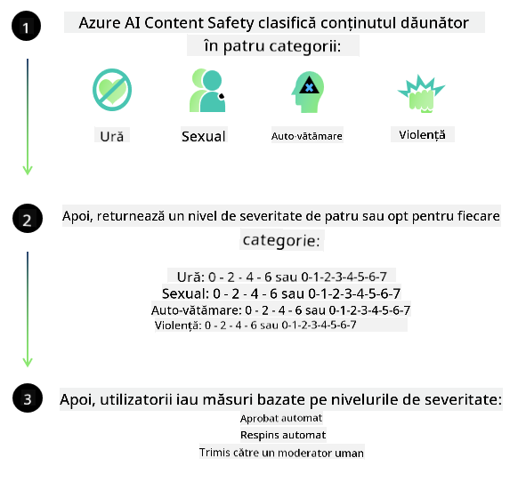

<!--
CO_OP_TRANSLATOR_METADATA:
{
  "original_hash": "c8273672cc57df2be675407a1383aaf0",
  "translation_date": "2025-07-16T17:53:03+00:00",
  "source_file": "md/01.Introduction/01/01.AISafety.md",
  "language_code": "ro"
}
-->
# Siguranța AI pentru modelele Phi  
Familia de modele Phi a fost dezvoltată în conformitate cu [Microsoft Responsible AI Standard](https://query.prod.cms.rt.microsoft.com/cms/api/am/binary/RE5cmFl), un set de cerințe la nivel de companie bazat pe următoarele șase principii: responsabilitate, transparență, echitate, fiabilitate și siguranță, confidențialitate și securitate, precum și incluziune, care formează [principiile Responsible AI ale Microsoft](https://www.microsoft.com/ai/responsible-ai).

La fel ca modelele Phi anterioare, s-a adoptat o evaluare multifacetată a siguranței și o abordare post-antrenament pentru siguranță, cu măsuri suplimentare pentru a ține cont de capabilitățile multilingve ale acestei versiuni. Abordarea noastră privind antrenamentul și evaluările de siguranță, inclusiv testarea în mai multe limbi și categorii de risc, este detaliată în [Phi Safety Post-Training Paper](https://arxiv.org/abs/2407.13833). Deși modelele Phi beneficiază de această abordare, dezvoltatorii ar trebui să aplice cele mai bune practici de AI responsabilă, inclusiv maparea, măsurarea și atenuarea riscurilor asociate cu cazul lor specific de utilizare și contextul cultural și lingvistic.

## Cele mai bune practici

Ca și alte modele, familia Phi poate avea comportamente care pot fi nedrepte, nesigure sau ofensatoare.

Unele dintre comportamentele limitative ale SLM și LLM de care trebuie să fiți conștienți includ:

- **Calitatea serviciului:** Modelele Phi sunt antrenate în principal pe texte în limba engleză. Limbile diferite de engleză vor avea performanțe mai slabe. Variantele limbii engleze cu o reprezentare mai redusă în datele de antrenament pot avea performanțe mai slabe decât engleza americană standard.  
- **Reprezentarea prejudiciilor și perpetuarea stereotipurilor:** Aceste modele pot supra- sau sub-reprezenta grupuri de persoane, pot șterge reprezentarea unor grupuri sau pot întări stereotipuri negative sau degradante. În ciuda antrenamentului post-siguranță, aceste limitări pot persista din cauza nivelurilor diferite de reprezentare a grupurilor sau a prevalenței exemplelor de stereotipuri negative în datele de antrenament, care reflectă tipare reale și prejudecăți sociale.  
- **Conținut inadecvat sau ofensator:** Modelele pot genera alte tipuri de conținut inadecvat sau ofensator, ceea ce poate face nepotrivită utilizarea lor în contexte sensibile fără măsuri suplimentare specifice cazului de utilizare.  
- **Fiabilitatea informațiilor:** Modelele de limbaj pot genera conținut lipsit de sens sau pot fabrica informații care par rezonabile, dar sunt inexacte sau depășite.  
- **Domeniu limitat pentru cod:** Majoritatea datelor de antrenament Phi-3 sunt bazate pe Python și folosesc pachete comune precum „typing, math, random, collections, datetime, itertools”. Dacă modelul generează scripturi Python care utilizează alte pachete sau scripturi în alte limbaje, recomandăm insistent verificarea manuală a tuturor utilizărilor API.

Dezvoltatorii trebuie să aplice cele mai bune practici de AI responsabilă și sunt responsabili să se asigure că un caz specific de utilizare respectă legile și reglementările relevante (ex: confidențialitate, comerț etc.).

## Considerații privind AI responsabilă

Ca și alte modele de limbaj, modelele din seria Phi pot avea comportamente nedrepte, nesigure sau ofensatoare. Unele dintre comportamentele limitative de care trebuie să țineți cont includ:

**Calitatea serviciului:** Modelele Phi sunt antrenate în principal pe texte în limba engleză. Limbile diferite de engleză vor avea performanțe mai slabe. Variantele limbii engleze cu o reprezentare mai redusă în datele de antrenament pot avea performanțe mai slabe decât engleza americană standard.

**Reprezentarea prejudiciilor și perpetuarea stereotipurilor:** Aceste modele pot supra- sau sub-reprezenta grupuri de persoane, pot șterge reprezentarea unor grupuri sau pot întări stereotipuri negative sau degradante. În ciuda antrenamentului post-siguranță, aceste limitări pot persista din cauza nivelurilor diferite de reprezentare a grupurilor sau a prevalenței exemplelor de stereotipuri negative în datele de antrenament, care reflectă tipare reale și prejudecăți sociale.

**Conținut inadecvat sau ofensator:** Modelele pot genera alte tipuri de conținut inadecvat sau ofensator, ceea ce poate face nepotrivită utilizarea lor în contexte sensibile fără măsuri suplimentare specifice cazului de utilizare.  
**Fiabilitatea informațiilor:** Modelele de limbaj pot genera conținut lipsit de sens sau pot fabrica informații care par rezonabile, dar sunt inexacte sau depășite.

**Domeniu limitat pentru cod:** Majoritatea datelor de antrenament Phi-3 sunt bazate pe Python și folosesc pachete comune precum „typing, math, random, collections, datetime, itertools”. Dacă modelul generează scripturi Python care utilizează alte pachete sau scripturi în alte limbaje, recomandăm insistent verificarea manuală a tuturor utilizărilor API.

Dezvoltatorii trebuie să aplice cele mai bune practici de AI responsabilă și sunt responsabili să se asigure că un caz specific de utilizare respectă legile și reglementările relevante (ex: confidențialitate, comerț etc.). Domenii importante de luat în considerare includ:

**Alocarea:** Modelele pot să nu fie potrivite pentru scenarii care pot avea un impact semnificativ asupra statutului legal sau alocării resurselor ori oportunităților de viață (ex: locuințe, angajare, credit etc.) fără evaluări suplimentare și tehnici adiționale de reducere a părtinirii.

**Scenarii cu risc ridicat:** Dezvoltatorii trebuie să evalueze dacă modelele sunt potrivite pentru scenarii cu risc ridicat, unde rezultate nedrepte, nesigure sau ofensatoare pot avea costuri foarte mari sau pot cauza prejudicii. Aceasta include oferirea de sfaturi în domenii sensibile sau specializate unde acuratețea și fiabilitatea sunt critice (ex: sfaturi juridice sau medicale). Măsuri suplimentare de protecție trebuie implementate la nivelul aplicației, în funcție de contextul de implementare.

**Dezinformare:** Modelele pot genera informații inexacte. Dezvoltatorii ar trebui să urmeze cele mai bune practici de transparență și să informeze utilizatorii finali că interacționează cu un sistem AI. La nivelul aplicației, dezvoltatorii pot construi mecanisme de feedback și fluxuri de lucru pentru a fundamenta răspunsurile pe informații contextuale și specifice cazului de utilizare, o tehnică cunoscută sub numele de Retrieval Augmented Generation (RAG).

**Generarea de conținut dăunător:** Dezvoltatorii trebuie să evalueze rezultatele în funcție de context și să folosească clasificatoare de siguranță disponibile sau soluții personalizate potrivite pentru cazul lor de utilizare.

**Utilizare abuzivă:** Alte forme de utilizare abuzivă, cum ar fi frauda, spam-ul sau producerea de malware, pot fi posibile, iar dezvoltatorii trebuie să se asigure că aplicațiile lor nu încalcă legile și reglementările aplicabile.

### Finetuning și siguranța conținutului AI

După ajustarea fină a unui model, recomandăm cu tărie utilizarea măsurilor [Azure AI Content Safety](https://learn.microsoft.com/azure/ai-services/content-safety/overview) pentru a monitoriza conținutul generat de modele, a identifica și bloca riscurile, amenințările și problemele de calitate potențiale.

[Azure AI Content Safety](https://learn.microsoft.com/azure/ai-services/content-safety/overview) suportă atât conținut text, cât și imagine. Poate fi implementat în cloud, containere deconectate și pe dispozitive edge/încorporate.

## Prezentare generală Azure AI Content Safety

Azure AI Content Safety nu este o soluție universală; poate fi personalizată pentru a se alinia politicilor specifice ale afacerilor. În plus, modelele sale multilingve îi permit să înțeleagă mai multe limbi simultan.

- **Azure AI Content Safety**  
- **Microsoft Developer**  
- **5 videoclipuri**

Serviciul Azure AI Content Safety detectează conținut dăunător generat de utilizatori și AI în aplicații și servicii. Include API-uri pentru text și imagine care permit detectarea materialelor dăunătoare sau inadecvate.

[AI Content Safety Playlist](https://www.youtube.com/playlist?list=PLlrxD0HtieHjaQ9bJjyp1T7FeCbmVcPkQ)

**Declinare a responsabilității**:  
Acest document a fost tradus folosind serviciul de traducere AI [Co-op Translator](https://github.com/Azure/co-op-translator). Deși ne străduim pentru acuratețe, vă rugăm să rețineți că traducerile automate pot conține erori sau inexactități. Documentul original în limba sa nativă trebuie considerat sursa autorizată. Pentru informații critice, se recomandă traducerea profesională realizată de un specialist uman. Nu ne asumăm răspunderea pentru eventualele neînțelegeri sau interpretări greșite rezultate din utilizarea acestei traduceri.