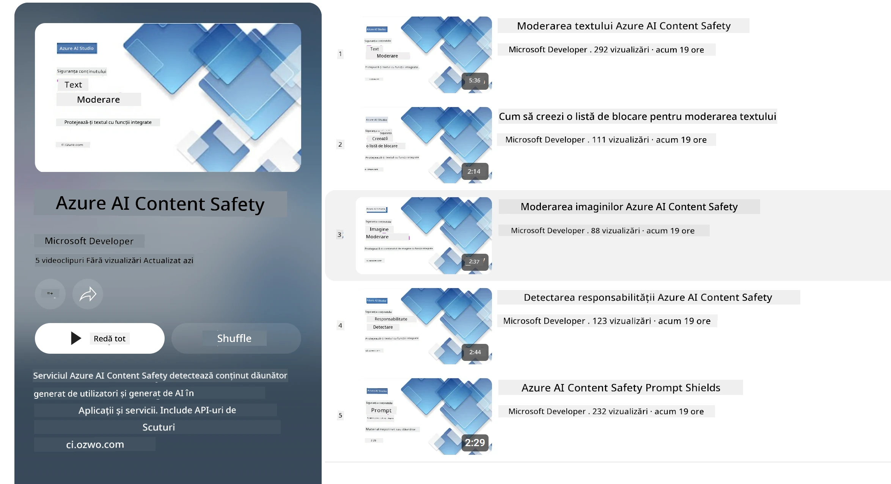

<!--
CO_OP_TRANSLATOR_METADATA:
{
  "original_hash": "839ccc4b3886ef10cfd4e64977f5792d",
  "translation_date": "2026-01-05T09:54:34+00:00",
  "source_file": "md/01.Introduction/01/01.AISafety.md",
  "language_code": "ro"
}
-->
# Siguranța AI pentru modelele Phi
Familia de modele Phi a fost dezvoltată în conformitate cu [Microsoft Responsible AI Standard](https://www.microsoft.com/ai/principles-and-approach#responsible-ai-standard), care este un set de cerințe la nivelul companiei, bazat pe următoarele șase principii: responsabilitate, transparență, corectitudine, fiabilitate și siguranță, confidențialitate și securitate, și incluziune, care formează [Principiile AI Responsabilă ale Microsoft](https://www.microsoft.com/ai/responsible-ai).

La fel ca modelele Phi anterioare, a fost adoptată o evaluare multifacetată a siguranței și o abordare de siguranță post-antrenament, cu măsuri suplimentare luate pentru a ține cont de capacitățile multilingve ale acestei versiuni. Abordarea noastră privind instruirea și evaluările de siguranță, inclusiv testarea în mai multe limbi și categorii de risc, este descrisă în [Phi Safety Post-Training Paper](https://arxiv.org/abs/2407.13833). În timp ce modelele Phi beneficiază de această abordare, dezvoltatorii ar trebui să aplice cele mai bune practici pentru AI responsabilă, inclusiv maparea, măsurarea și atenuarea riscurilor asociate cazului lor specific de utilizare și contextului cultural și lingvistic.

## Cele mai bune practici

La fel ca alte modele, familia Phi poate avea comportamente ce pot fi nedrepte, nesigure sau ofensatoare.

Unele dintre comportamentele limitative ale SLM și LLM de care trebuie să fiți conștienți includ:

- **Calitatea Serviciului:** Modelele Phi sunt antrenate în principal pe text în limba engleză. Limbile altele decât engleza vor înregistra performanțe mai slabe. Varietățile de limbă engleză cu mai puțină reprezentare în datele de antrenament ar putea înregistra performanțe mai slabe decât engleza americană standard.
- **Reprezentarea Dăunătoare & Perpetuarea Stereotipurilor:** Aceste modele pot supra- sau sub-reprezenta grupuri de oameni, pot șterge reprezentarea unor grupuri sau pot întări stereotipuri jignitoare sau negative. În ciuda procesului de siguranță post-antrenament, aceste limitări pot persista din cauza nivelurilor diferite de reprezentare ale grupurilor sau a prevalenței exemplelor de stereotipuri negative în datele de antrenament care reflectă tipare din lumea reală și prejudecăți sociale.
- **Conținut Inadecvat sau Ofensator:** Aceste modele pot genera alte tipuri de conținut inadecvat sau ofensator, ceea ce poate face inadecvată utilizarea lor în contexte sensibile fără măsuri suplimentare specifice cazului de utilizare.
- **Fiabilitatea Informației:** Modelele lingvistice pot genera conținut fără sens sau pot inventa conținut care poate părea rezonabil, dar este inexact sau depășit.
- **Domeniu Limitat pentru Cod:** Majoritatea datelor de antrenament Phi-3 sunt bazate pe Python și folosesc pachete comune precum "typing, math, random, collections, datetime, itertools". Dacă modelul generează scripturi Python care utilizează alte pachete sau scripturi în alte limbaje, recomandăm cu tărie utilizatorilor să verifice manual toate utilizările API.

Dezvoltatorii trebuie să aplice cele mai bune practici pentru AI responsabilă și sunt responsabili să se asigure că un caz specific de utilizare respectă legile și reglementările aplicabile (de ex. confidențialitate, comerț, etc.).

## Considerații privind AI responsabilă

La fel ca alte modele lingvistice, modelele din seria Phi pot avea comportamente care pot fi nedrepte, nesigure sau ofensatoare. Unele dintre comportamentele limitative de luat în considerare includ:

**Calitatea Serviciului:** Modelele Phi sunt antrenate în principal pe text în limba engleză. Limbile altele decât engleza vor avea performanțe mai slabe. Varietățile de limbă engleză cu mai puțină reprezentare în datele de antrenament ar putea avea performanțe mai slabe decât engleza americană standard.

**Reprezentarea Dăunătoare & Perpetuarea Stereotipurilor:** Aceste modele pot supra- sau sub-reprezenta grupuri, pot șterge reprezentarea unor grupuri sau pot întări stereotipuri jignitoare sau negative. În ciuda procesului de siguranță post-antrenament, aceste limitări pot persista din cauza nivelurilor diferite de reprezentare ale grupurilor sau a prevalenței stereotipurilor negative în datele de antrenament care reflectă tipare din lumea reală și prejudecăți sociale.

**Conținut Inadecvat sau Ofensator:** Aceste modele pot genera alte tipuri de conținut inadecvat sau ofensator, ceea ce poate face inadecvată utilizarea lor în contexte sensibile fără măsuri suplimentare specifice cazului de utilizare. Fiabilitatea Informației: Modelele lingvistice pot genera conținut fără sens sau pot inventa conținut care poate părea rezonabil, dar este inexact sau depășit.

**Domeniu Limitat pentru Cod:** Majoritatea datelor de antrenament Phi-3 se bazează pe Python și folosesc pachete comune precum "typing, math, random, collections, datetime, itertools". Dacă modelul generează scripturi Python care utilizează alte pachete sau scripturi în alte limbaje, recomandăm utilizatorilor să verifice manual toate utilizările API.

Dezvoltatorii trebuie să aplice cele mai bune practici pentru AI responsabilă și sunt responsabili să se asigure că un caz specific de utilizare respectă legislația și reglementările aplicabile (de ex. confidențialitate, comerț, etc.). Domenii importante de considerat includ:

**Alocarea:** Modelele pot să nu fie potrivite pentru scenarii ce pot avea un impact consecvent asupra statutului legal sau alocării resurselor sau oportunităților de viață (ex: locuințe, angajare, credit, etc.) fără evaluări suplimentare și tehnici adiționale de debiasare.

**Scenarii cu Risc Ridicat:** Dezvoltatorii ar trebui să evalueze potrivirea folosirii modelelor în scenarii cu risc ridicat unde rezultate nedrepte, nesigure sau ofensatoare pot avea costuri extrem de mari sau pot conduce la prejudicii. Aceasta include oferirea de sfaturi în domenii sensibile sau de expertiză unde acuratețea și fiabilitatea sunt critice (ex: sfaturi juridice sau medicale). Măsuri suplimentare de protecție ar trebui implementate la nivelul aplicației în funcție de contextul de implementare.

**Dezinformare:** Modelele pot produce informații inexacte. Dezvoltatorii ar trebui să urmeze cele mai bune practici de transparență și să informeze utilizatorii finali că interacționează cu un sistem AI. La nivelul aplicației, dezvoltatorii pot construi mecanisme de feedback și fluxuri pentru a baza răspunsurile pe informații contextuale specifice cazului de utilizare, o tehnică cunoscută sub numele de Retrieval Augmented Generation (RAG).

**Generarea de Conținut Dăunător:** Dezvoltatorii ar trebui să evalueze rezultatele în contextul lor și să utilizeze clasificatoare de siguranță disponibile sau soluții personalizate potrivite cazului lor.

**Utilizare Neadecvată:** Alte forme de utilizare neadecvată, cum ar fi frauda, spamul sau producția de malware, pot fi posibile, iar dezvoltatorii trebuie să se asigure că aplicațiile lor nu încalcă legile și reglementările aplicabile.

### Finetuning și Siguranța Conținutului AI

După ajustarea fină a unui model, recomandăm cu tărie utilizarea măsurilor [Azure AI Content Safety](https://learn.microsoft.com/azure/ai-services/content-safety/overview) pentru a monitoriza conținutul generat de modele, a identifica și bloca riscuri potențiale, amenințări și probleme de calitate.

[Azure AI Content Safety](https://learn.microsoft.com/azure/ai-services/content-safety/overview) sprijină atât conținutul text, cât și pe cel de imagine. Poate fi implementat în cloud, containere deconectate și pe dispozitive edge/embedded.

## Prezentare generală a Azure AI Content Safety

Azure AI Content Safety nu este o soluție universală; poate fi personalizată pentru a se alinia cu politicile specifice ale companiilor. De asemenea, modelele sale multilingve îi permit să înțeleagă mai multe limbi simultan.

- **Azure AI Content Safety**
- **Microsoft Developer**
- **5 videoclipuri**

Serviciul Azure AI Content Safety detectează conținut dăunător generat de utilizatori și de AI în aplicații și servicii. Include API-uri pentru text și imagine care permit detectarea materialelor dăunătoare sau inadecvate.

[Playlist AI Content Safety](https://www.youtube.com/playlist?list=PLlrxD0HtieHjaQ9bJjyp1T7FeCbmVcPkQ)

---

<!-- CO-OP TRANSLATOR DISCLAIMER START -->
**Declinare a responsabilității**:  
Acest document a fost tradus folosind serviciul de traducere AI [Co-op Translator](https://github.com/Azure/co-op-translator). Deși ne străduim pentru acuratețe, vă rugăm să rețineți că traducerile automate pot conține erori sau inexactități. Documentul original în limba sa nativă trebuie considerat sursa autoritară. Pentru informații critice, se recomandă traducerea profesională realizată de un specialist uman. Nu ne asumăm răspunderea pentru orice neînțelegeri sau interpretări greșite care ar putea rezulta din utilizarea acestei traduceri.
<!-- CO-OP TRANSLATOR DISCLAIMER END -->