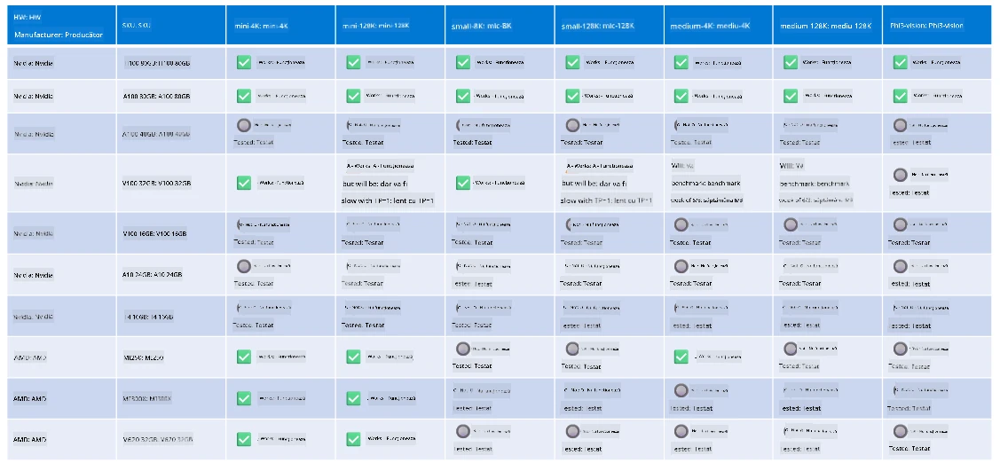

<!--
CO_OP_TRANSLATOR_METADATA:
{
  "original_hash": "8cdc17ce0f10535da30b53d23fe1a795",
  "translation_date": "2025-07-16T18:27:06+00:00",
  "source_file": "md/01.Introduction/01/01.Hardwaresupport.md",
  "language_code": "ro"
}
-->
# Suport Hardware Phi

Microsoft Phi a fost optimizat pentru ONNX Runtime și suportă Windows DirectML. Funcționează bine pe diverse tipuri de hardware, inclusiv GPU-uri, CPU-uri și chiar dispozitive mobile.

## Hardware-ul dispozitivului  
În mod specific, hardware-ul suportat include:

- GPU SKU: RTX 4090 (DirectML)
- GPU SKU: 1 A100 80GB (CUDA)
- CPU SKU: Standard F64s v2 (64 vCPU-uri, 128 GiB memorie)

## SKU mobil

- Android - Samsung Galaxy S21
- Apple iPhone 14 sau mai nou cu procesor A16/A17

## Specificații hardware Phi

- Configurația minimă necesară.
- Windows: GPU compatibil cu DirectX 12 și minimum 4GB memorie RAM combinată

CUDA: GPU NVIDIA cu Compute Capability >= 7.02



## Rularea onnxruntime pe mai multe GPU-uri

Modelele Phi ONNX disponibile în prezent sunt doar pentru 1 GPU. Este posibil să se suporte multi-GPU pentru modelul Phi, dar ORT cu 2 GPU-uri nu garantează un throughput mai mare comparativ cu 2 instanțe separate de ort. Pentru cele mai recente actualizări, consultați [ONNX Runtime](https://onnxruntime.ai/).

La [Build 2024 echipa GenAI ONNX](https://youtu.be/WLW4SE8M9i8?si=EtG04UwDvcjunyfC) a anunțat că au activat multi-instanta în loc de multi-GPU pentru modelele Phi.

În prezent, acest lucru vă permite să rulați o instanță onnxruntime sau onnxruntime-genai cu variabila de mediu CUDA_VISIBLE_DEVICES astfel.

```Python
CUDA_VISIBLE_DEVICES=0 python infer.py
CUDA_VISIBLE_DEVICES=1 python infer.py
```

Explorați mai departe Phi în [Azure AI Foundry](https://ai.azure.com)

**Declinare de responsabilitate**:  
Acest document a fost tradus folosind serviciul de traducere AI [Co-op Translator](https://github.com/Azure/co-op-translator). Deși ne străduim pentru acuratețe, vă rugăm să rețineți că traducerile automate pot conține erori sau inexactități. Documentul original în limba sa nativă trebuie considerat sursa autorizată. Pentru informații critice, se recomandă traducerea profesională realizată de un specialist uman. Nu ne asumăm răspunderea pentru eventualele neînțelegeri sau interpretări greșite rezultate din utilizarea acestei traduceri.