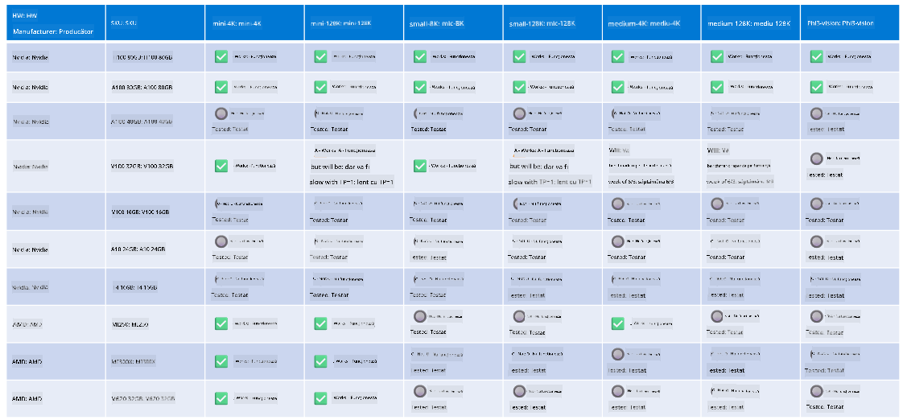

<!--
CO_OP_TRANSLATOR_METADATA:
{
  "original_hash": "8cdc17ce0f10535da30b53d23fe1a795",
  "translation_date": "2025-05-09T07:53:47+00:00",
  "source_file": "md/01.Introduction/01/01.Hardwaresupport.md",
  "language_code": "ro"
}
-->
# Suport hardware Phi

Microsoft Phi a fost optimizat pentru ONNX Runtime și suportă Windows DirectML. Funcționează bine pe diverse tipuri de hardware, inclusiv GPU-uri, CPU-uri și chiar dispozitive mobile.

## Hardware dispozitiv  
În mod specific, hardware-ul suportat include:

- GPU SKU: RTX 4090 (DirectML)  
- GPU SKU: 1 A100 80GB (CUDA)  
- CPU SKU: Standard F64s v2 (64 vCPU-uri, 128 GiB memorie)

## SKU mobil

- Android - Samsung Galaxy S21  
- Apple iPhone 14 sau mai nou, procesor A16/A17

## Specificații hardware Phi

- Configurație minimă necesară.  
- Windows: GPU compatibil DirectX 12 și cel puțin 4GB RAM combinat  

CUDA: GPU NVIDIA cu Compute Capability >= 7.02



## Rularea onnxruntime pe mai multe GPU-uri

Modelele Phi ONNX disponibile în prezent sunt doar pentru un singur GPU. Este posibil să se suporte multi-GPU pentru modelul Phi, dar ORT cu 2 GPU-uri nu garantează un randament mai mare comparativ cu 2 instanțe de ORT. Vă rugăm să consultați [ONNX Runtime](https://onnxruntime.ai/) pentru cele mai recente actualizări.

La [Build 2024 echipa GenAI ONNX](https://youtu.be/WLW4SE8M9i8?si=EtG04UwDvcjunyfC) a anunțat că au activat multi-instanta în loc de multi-GPU pentru modelele Phi.

În prezent, acest lucru vă permite să rulați o instanță onnxruntime sau onnxruntime-genai cu variabila de mediu CUDA_VISIBLE_DEVICES astfel.

```Python
CUDA_VISIBLE_DEVICES=0 python infer.py
CUDA_VISIBLE_DEVICES=1 python infer.py
```

Nu ezitați să explorați mai departe Phi în [Azure AI Foundry](https://ai.azure.com)

**Declinare a responsabilității**:  
Acest document a fost tradus folosind serviciul de traducere AI [Co-op Translator](https://github.com/Azure/co-op-translator). Deși ne străduim pentru acuratețe, vă rugăm să rețineți că traducerile automate pot conține erori sau inexactități. Documentul original în limba sa nativă trebuie considerat sursa autoritară. Pentru informații critice, se recomandă traducerea profesională realizată de un specialist uman. Nu ne asumăm responsabilitatea pentru eventualele neînțelegeri sau interpretări greșite care pot apărea din utilizarea acestei traduceri.