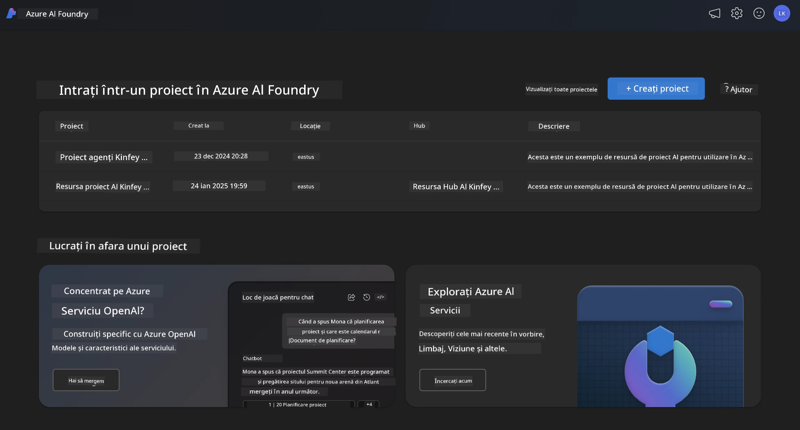
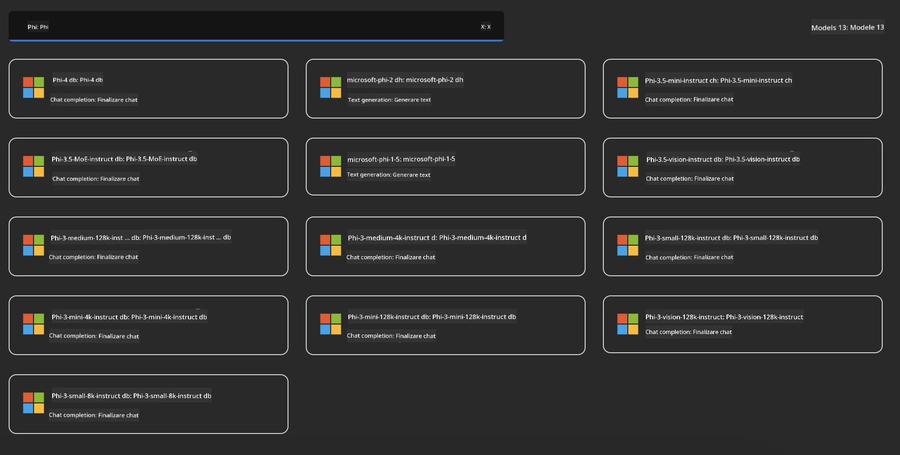
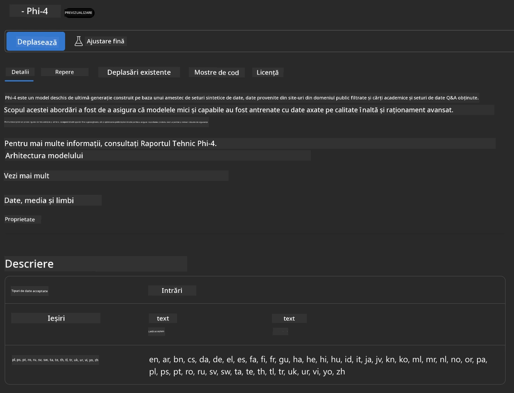
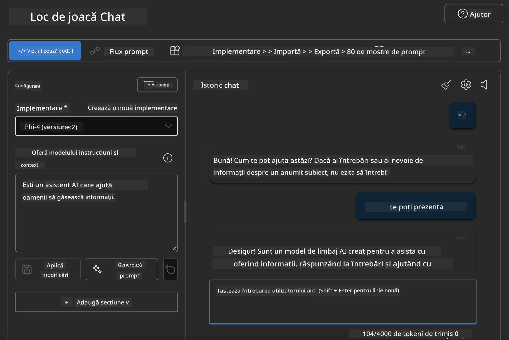

## Familia Phi în Azure AI Foundry

[Azure AI Foundry](https://ai.azure.com) este o platformă de încredere care oferă dezvoltatorilor puterea de a inova și de a modela viitorul cu AI într-un mod sigur, securizat și responsabil.

[Azure AI Foundry](https://ai.azure.com) este concepută pentru dezvoltatori pentru a:

- Construi aplicații AI generative pe o platformă de nivel enterprise.
- Explora, construi, testa și implementa folosind cele mai avansate instrumente AI și modele ML, bazate pe practici responsabile de AI.
- Colabora cu o echipă pe întreg ciclul de viață al dezvoltării aplicațiilor.

Cu Azure AI Foundry, poți explora o gamă largă de modele, servicii și capabilități și poți începe să construiești aplicații AI care să răspundă cel mai bine obiectivelor tale. Platforma Azure AI Foundry facilitează scalabilitatea pentru transformarea prototipurilor în aplicații de producție complete, cu ușurință. Monitorizarea continuă și rafinarea susțin succesul pe termen lung.



Pe lângă utilizarea serviciului Azure AOAI în Azure AI Foundry, poți folosi și modele terțe din Catalogul de modele Azure AI Foundry. Aceasta este o alegere bună dacă dorești să folosești Azure AI Foundry ca platformă pentru soluția ta AI.

Putem implementa rapid modelele din Familia Phi prin Catalogul de modele din Azure AI Foundry

[Microsoft Phi Models in Azure AI Foundry Models](https://ai.azure.com/explore/models/?selectedCollection=phi)



### **Implementarea Phi-4 în Azure AI Foundry**



### **Testarea Phi-4 în Azure AI Foundry Playground**



### **Executarea codului Python pentru a apela Azure AI Foundry Phi-4**

```python

import os  
import base64
from openai import AzureOpenAI  
from azure.identity import DefaultAzureCredential, get_bearer_token_provider  
        
endpoint = os.getenv("ENDPOINT_URL", "Your Azure AOAI Service Endpoint")  
deployment = os.getenv("DEPLOYMENT_NAME", "Phi-4")  
      
token_provider = get_bearer_token_provider(  
    DefaultAzureCredential(),  
    "https://cognitiveservices.azure.com/.default"  
)  
  
client = AzureOpenAI(  
    azure_endpoint=endpoint,  
    azure_ad_token_provider=token_provider,  
    api_version="2024-05-01-preview",  
)  
  

chat_prompt = [
    {
        "role": "system",
        "content": "You are an AI assistant that helps people find information."
    },
    {
        "role": "user",
        "content": "can you introduce yourself"
    }
] 
    
# Include speech result if speech is enabled  
messages = chat_prompt 

completion = client.chat.completions.create(  
    model=deployment,  
    messages=messages,
    max_tokens=800,  
    temperature=0.7,  
    top_p=0.95,  
    frequency_penalty=0,  
    presence_penalty=0,
    stop=None,  
    stream=False  
)  
  
print(completion.to_json())  

```

**Declinare de responsabilitate**:  
Acest document a fost tradus folosind serviciul de traducere AI [Co-op Translator](https://github.com/Azure/co-op-translator). Deși ne străduim pentru acuratețe, vă rugăm să rețineți că traducerile automate pot conține erori sau inexactități. Documentul original în limba sa nativă trebuie considerat sursa autorizată. Pentru informații critice, se recomandă traducerea profesională realizată de un specialist uman. Nu ne asumăm răspunderea pentru eventualele neînțelegeri sau interpretări greșite rezultate din utilizarea acestei traduceri.