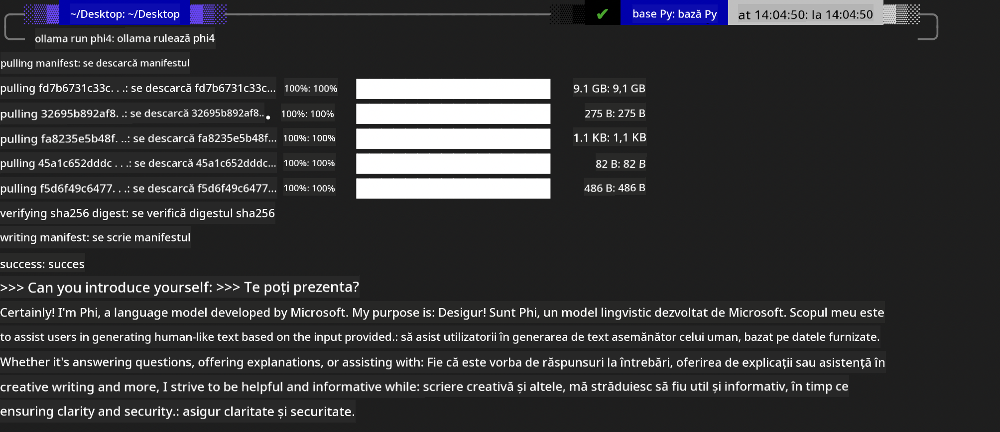

<!--
CO_OP_TRANSLATOR_METADATA:
{
  "original_hash": "2aa35f3c8b437fd5dc9995d53909d495",
  "translation_date": "2025-12-21T13:38:20+00:00",
  "source_file": "md/01.Introduction/02/04.Ollama.md",
  "language_code": "ro"
}
-->
## Familia Phi în Ollama


[Ollama](https://ollama.com) permite ca mai multe persoane să implementeze direct LLM-uri sau SLM-uri open source prin scripturi simple și poate, de asemenea, să construiască API-uri pentru a sprijini scenarii de aplicații Copilot locale.

## **1. Instalare**

Ollama acceptă rularea pe Windows, macOS și Linux. Puteți instala Ollama prin acest link ([https://ollama.com/download](https://ollama.com/download)). După instalarea cu succes, puteți folosi direct scriptul Ollama pentru a apela Phi-3 dintr-o fereastră de terminal. Puteți vedea toate [bibliotecile disponibile în Ollama](https://ollama.com/library). Dacă deschideți acest depozit în Codespace, va avea deja Ollama instalat.

```bash

ollama run phi4

```

> [!NOTE]
> Modelul va fi descărcat prima dată când îl rulați pentru prima dată. Desigur, puteți și să specificați direct modelul Phi-4 deja descărcat. Luăm WSL ca exemplu pentru a rula comanda. După ce modelul este descărcat cu succes, puteți interacționa direct în terminal.



## **2. Apelarea API-ului phi-4 din Ollama**

Dacă doriți să apelați API-ul Phi-4 generat de Ollama, puteți folosi această comandă în terminal pentru a porni serverul Ollama.

```bash

ollama serve

```

> [!NOTE]
> Dacă rulați macOS sau Linux, rețineți că este posibil să întâlniți următoarea eroare **"Error: listen tcp 127.0.0.1:11434: bind: address already in use"**. Este posibil să primiți această eroare când executați comanda. Puteți ignora această eroare, deoarece indică de obicei că serverul rulează deja, sau puteți opri și reporni Ollama:

**macOS**

```bash

brew services restart ollama

```

**Linux**

```bash

sudo systemctl stop ollama

```

Ollama acceptă două API-uri: generate și chat. Puteți apela API-ul modelului furnizat de Ollama în funcție de necesități, trimițând cereri către serviciul local care rulează pe portul 11434.

**Chat**

```bash

curl http://127.0.0.1:11434/api/chat -d '{
  "model": "phi3",
  "messages": [
    {
      "role": "system",
      "content": "Your are a python developer."
    },
    {
      "role": "user",
      "content": "Help me generate a bubble algorithm"
    }
  ],
  "stream": false
  
}'
```

Acesta este rezultatul în Postman


## Resurse suplimentare

Verificați lista modelelor disponibile în Ollama în [biblioteca lor](https://ollama.com/library).

Preluați modelul de pe serverul Ollama folosind această comandă

```bash
ollama pull phi4
```

Rulați modelul folosind această comandă

```bash
ollama run phi4
```

***Notă:*** Vizitați acest link [https://github.com/ollama/ollama/blob/main/docs/api.md](https://github.com/ollama/ollama/blob/main/docs/api.md) pentru a afla mai multe

## Apelarea Ollama din Python

Puteți folosi `requests` sau `urllib3` pentru a face cereri către endpoint-urile serverului local folosite mai sus. Totuși, o metodă populară de a folosi Ollama în Python este prin SDK-ul [openai](https://pypi.org/project/openai/), deoarece Ollama oferă și endpoint-uri de server compatibile OpenAI.

Iată un exemplu pentru phi3-mini:

```python
import openai

client = openai.OpenAI(
    base_url="http://localhost:11434/v1",
    api_key="nokeyneeded",
)

response = client.chat.completions.create(
    model="phi4",
    temperature=0.7,
    n=1,
    messages=[
        {"role": "system", "content": "You are a helpful assistant."},
        {"role": "user", "content": "Write a haiku about a hungry cat"},
    ],
)

print("Response:")
print(response.choices[0].message.content)
```

## Apelarea Ollama din JavaScript 

```javascript
// Exemplu de rezumare a unui fișier cu Phi-4
script({
    model: "ollama:phi4",
    title: "Summarize with Phi-4",
    system: ["system"],
})

// Exemplu de rezumare
const file = def("FILE", env.files)
$`Summarize ${file} in a single paragraph.`
```

## Apelarea Ollama din C#

Creați o nouă aplicație Console C# și adăugați următorul pachet NuGet:

```bash
dotnet add package Microsoft.SemanticKernel --version 1.34.0
```

Apoi înlocuiți acest cod în fișierul `Program.cs`

```csharp
using Microsoft.SemanticKernel;
using Microsoft.SemanticKernel.ChatCompletion;

// add chat completion service using the local ollama server endpoint
#pragma warning disable SKEXP0001, SKEXP0003, SKEXP0010, SKEXP0011, SKEXP0050, SKEXP0052
builder.AddOpenAIChatCompletion(
    modelId: "phi4",
    endpoint: new Uri("http://localhost:11434/"),
    apiKey: "non required");

// invoke a simple prompt to the chat service
string prompt = "Write a joke about kittens";
var response = await kernel.InvokePromptAsync(prompt);
Console.WriteLine(response.GetValue<string>());
```

Rulați aplicația cu comanda:

```bash
dotnet run
```

---

<!-- CO-OP TRANSLATOR DISCLAIMER START -->
Declinare de responsabilitate:
Acest document a fost tradus folosind serviciul de traducere AI [Co-op Translator](https://github.com/Azure/co-op-translator). Deși ne străduim pentru acuratețe, vă rugăm să rețineți că traducerile automate pot conține erori sau inexactități. Documentul original, în limba sa de origine, trebuie considerat sursa autoritară. Pentru informații critice se recomandă o traducere profesională realizată de un specialist uman. Nu ne asumăm răspunderea pentru eventualele neînțelegeri sau interpretări greșite care pot rezulta din utilizarea acestei traduceri.
<!-- CO-OP TRANSLATOR DISCLAIMER END -->