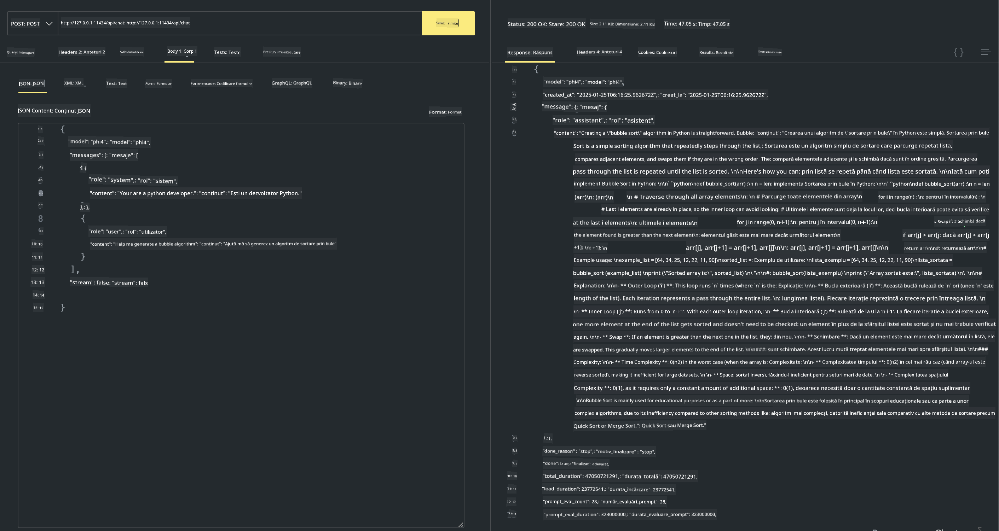

<!--
CO_OP_TRANSLATOR_METADATA:
{
  "original_hash": "0b38834693bb497f96bf53f0d941f9a1",
  "translation_date": "2025-07-16T19:18:53+00:00",
  "source_file": "md/01.Introduction/02/04.Ollama.md",
  "language_code": "ro"
}
-->
## Familia Phi în Ollama


[Ollama](https://ollama.com) permite mai multor persoane să implementeze direct LLM sau SLM open source prin scripturi simple și poate, de asemenea, să construiască API-uri pentru a sprijini scenarii locale de aplicații Copilot.

## **1. Instalare**

Ollama suportă rularea pe Windows, macOS și Linux. Poți instala Ollama prin acest link ([https://ollama.com/download](https://ollama.com/download)). După instalarea cu succes, poți folosi direct scriptul Ollama pentru a apela Phi-3 printr-o fereastră de terminal. Poți vedea toate [bibliotecile disponibile în Ollama](https://ollama.com/library). Dacă deschizi acest depozit în Codespace, Ollama va fi deja instalat.

```bash

ollama run phi4

```

> [!NOTE]
> Modelul va fi descărcat prima dată când îl rulezi. Desigur, poți specifica direct modelul Phi-4 descărcat. Luăm WSL ca exemplu pentru rularea comenzii. După ce modelul este descărcat cu succes, poți interacționa direct în terminal.


## **2. Apelarea API-ului phi-4 din Ollama**

Dacă vrei să apelezi API-ul Phi-4 generat de ollama, poți folosi această comandă în terminal pentru a porni serverul Ollama.

```bash

ollama serve

```

> [!NOTE]
> Dacă rulezi pe MacOS sau Linux, reține că s-ar putea să întâmpini următoarea eroare **"Error: listen tcp 127.0.0.1:11434: bind: address already in use"**. Această eroare poate apărea când rulezi comanda. Poți ignora această eroare, deoarece de obicei indică faptul că serverul este deja pornit, sau poți opri și reporni Ollama:

**macOS**

```bash

brew services restart ollama

```

**Linux**

```bash

sudo systemctl stop ollama

```

Ollama suportă două API-uri: generate și chat. Poți apela API-ul modelului oferit de Ollama în funcție de nevoile tale, trimițând cereri către serviciul local care rulează pe portul 11434.

**Chat**

```bash

curl http://127.0.0.1:11434/api/chat -d '{
  "model": "phi3",
  "messages": [
    {
      "role": "system",
      "content": "Your are a python developer."
    },
    {
      "role": "user",
      "content": "Help me generate a bubble algorithm"
    }
  ],
  "stream": false
  
}'

This is the result in Postman



## Additional Resources

Check the list of available models in Ollama in [their library](https://ollama.com/library).

Pull your model from the Ollama server using this command

```bash
ollama pull phi4
```

Run the model using this command

```bash
ollama run phi4
```

***Note:*** Visit this link [https://github.com/ollama/ollama/blob/main/docs/api.md](https://github.com/ollama/ollama/blob/main/docs/api.md) to learn more

## Calling Ollama from Python

You can use `requests` or `urllib3` to make requests to the local server endpoints used above. However, a popular way to use Ollama in Python is via the [openai](https://pypi.org/project/openai/) SDK, since Ollama provides OpenAI-compatible server endpoints as well.

Here is an example for phi3-mini:

```python
import openai

client = openai.OpenAI(
    base_url="http://localhost:11434/v1",
    api_key="nokeyneeded",
)

response = client.chat.completions.create(
    model="phi4",
    temperature=0.7,
    n=1,
    messages=[
        {"role": "system", "content": "You are a helpful assistant."},
        {"role": "user", "content": "Write a haiku about a hungry cat"},
    ],
)

print("Response:")
print(response.choices[0].message.content)
```

## Calling Ollama from JavaScript 

```javascript
// Exemplu de sumarizare a unui fișier cu Phi-4
script({
    model: "ollama:phi4",
    title: "Sumarizează cu Phi-4",
    system: ["system"],
})

// Exemplu de sumarizare
const file = def("FILE", env.files)
$`Summarize ${file} in a single paragraph.`
```

## Calling Ollama from C#

Create a new C# Console application and add the following NuGet package:

```bash
dotnet add package Microsoft.SemanticKernel --version 1.34.0
```

Then replace this code in the `Program.cs` file

```csharp
using Microsoft.SemanticKernel;
using Microsoft.SemanticKernel.ChatCompletion;

// adaugă serviciul de chat completion folosind endpoint-ul local al serverului ollama
#pragma warning disable SKEXP0001, SKEXP0003, SKEXP0010, SKEXP0011, SKEXP0050, SKEXP0052
builder.AddOpenAIChatCompletion(
    modelId: "phi4",
    endpoint: new Uri("http://localhost:11434/"),
    apiKey: "non required");

// apelează un prompt simplu către serviciul de chat
string prompt = "Write a joke about kittens";
var response = await kernel.InvokePromptAsync(prompt);
Console.WriteLine(response.GetValue<string>());
```

Run the app with the command:

```bash
dotnet run


**Declinare de responsabilitate**:  
Acest document a fost tradus folosind serviciul de traducere AI [Co-op Translator](https://github.com/Azure/co-op-translator). Deși ne străduim pentru acuratețe, vă rugăm să rețineți că traducerile automate pot conține erori sau inexactități. Documentul original în limba sa nativă trebuie considerat sursa autorizată. Pentru informații critice, se recomandă traducerea profesională realizată de un specialist uman. Nu ne asumăm răspunderea pentru eventualele neînțelegeri sau interpretări greșite rezultate din utilizarea acestei traduceri.