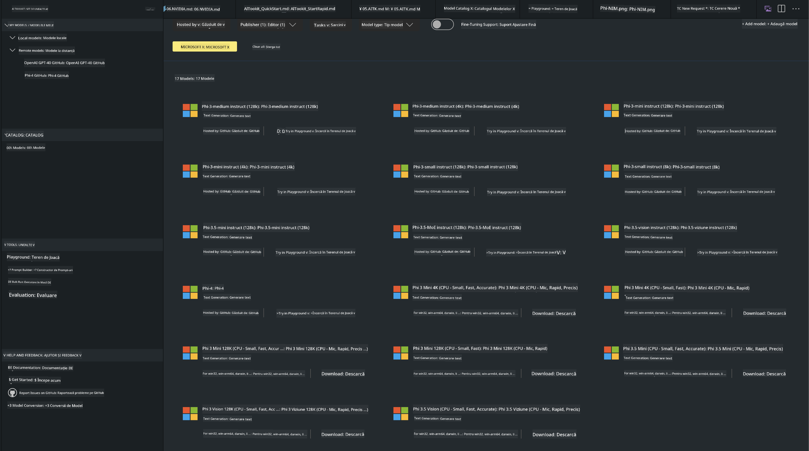
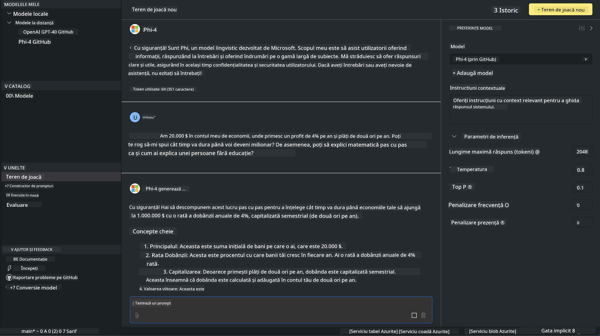

<!--
CO_OP_TRANSLATOR_METADATA:
{
  "original_hash": "4951d458c0b60c02cd1e751b40903877",
  "translation_date": "2025-05-09T09:45:33+00:00",
  "source_file": "md/01.Introduction/02/05.AITK.md",
  "language_code": "ro"
}
-->
# Familia Phi în AITK

[AI Toolkit pentru VS Code](https://marketplace.visualstudio.com/items?itemName=ms-windows-ai-studio.windows-ai-studio) simplifică dezvoltarea aplicațiilor AI generative prin reunirea celor mai noi instrumente și modele AI din Azure AI Foundry Catalog și alte cataloage precum Hugging Face. Veți putea naviga în catalogul de modele AI alimentat de GitHub Models și Azure AI Foundry Model Catalogs, să le descărcați local sau remote, să le ajustați fin, să le testați și să le folosiți în aplicația dumneavoastră.

AI Toolkit Preview va rula local. Inferența locală sau ajustarea fină depind de modelul selectat, iar pentru aceasta este posibil să aveți nevoie de un GPU precum NVIDIA CUDA GPU. Puteți rula modelele GitHub direct și cu AITK.

## Începutul lucrului

[Aflați mai multe despre cum să instalați subsistemul Windows pentru Linux](https://learn.microsoft.com/windows/wsl/install?WT.mc_id=aiml-137032-kinfeylo)

și [cum să schimbați distribuția implicită](https://learn.microsoft.com/windows/wsl/install#change-the-default-linux-distribution-installed).

[Repo GitHub AI Toolkit](https://github.com/microsoft/vscode-ai-toolkit/)

- Windows, Linux, macOS
  
- Pentru ajustare fină pe Windows și Linux, veți avea nevoie de un GPU Nvidia. În plus, **Windows** necesită subsistem pentru Linux cu distribuția Ubuntu 18.4 sau mai nouă. [Aflați mai multe despre cum să instalați subsistemul Windows pentru Linux](https://learn.microsoft.com/windows/wsl/install) și [cum să schimbați distribuția implicită](https://learn.microsoft.com/windows/wsl/install#change-the-default-linux-distribution-installed).

### Instalarea AI Toolkit

AI Toolkit este livrat ca o [extensie Visual Studio Code](https://code.visualstudio.com/docs/setup/additional-components#_vs-code-extensions), deci trebuie să instalați mai întâi [VS Code](https://code.visualstudio.com/docs/setup/windows?WT.mc_id=aiml-137032-kinfeylo) și să descărcați AI Toolkit din [VS Marketplace](https://marketplace.visualstudio.com/items?itemName=ms-windows-ai-studio.windows-ai-studio).
[AI Toolkit este disponibil în Visual Studio Marketplace](https://marketplace.visualstudio.com/items?itemName=ms-windows-ai-studio.windows-ai-studio) și poate fi instalat ca orice altă extensie VS Code.

Dacă nu sunteți familiarizat cu instalarea extensiilor VS Code, urmați acești pași:

### Autentificare

1. În bara de activități din VS Code selectați **Extensions**
1. În bara de căutare a extensiilor tastați „AI Toolkit”
1. Selectați „AI Toolkit for Visual Studio code”
1. Selectați **Install**

Acum sunteți gata să folosiți extensia!

Vi se va cere să vă autentificați pe GitHub, așa că faceți clic pe „Allow” pentru a continua. Veți fi redirecționat către pagina de autentificare GitHub.

Vă rugăm să vă autentificați și să urmați pașii procesului. După finalizarea cu succes, veți fi redirecționat înapoi în VS Code.

După instalarea extensiei, veți vedea pictograma AI Toolkit în bara de activități.

Să explorăm acțiunile disponibile!

### Acțiuni disponibile

Bara laterală principală a AI Toolkit este organizată în  

- **Models**
- **Resources**
- **Playground**  
- **Fine-tuning**
- **Evaluation**

Sunt disponibile în secțiunea Resources. Pentru a începe, selectați **Model Catalog**.

### Descărcarea unui model din catalog

La lansarea AI Toolkit din bara laterală VS Code, puteți selecta dintre următoarele opțiuni:



- Găsiți un model suportat din **Model Catalog** și descărcați-l local
- Testați inferența modelului în **Model Playground**
- Ajustați fin modelul local sau remote în **Model Fine-tuning**
- Implementați modelele ajustate fin în cloud prin paleta de comenzi pentru AI Toolkit
- Evaluarea modelelor

> [!NOTE]
>
> **GPU Vs CPU**
>
> Veți observa că fișele modelelor afișează dimensiunea modelului, platforma și tipul acceleratorului (CPU, GPU). Pentru performanțe optimizate pe **dispozitive Windows care au cel puțin un GPU**, selectați versiunile modelelor care vizează doar Windows.
>
> Aceasta asigură că aveți un model optimizat pentru acceleratorul DirectML.
>
> Numele modelelor au formatul
>
> - `{model_name}-{accelerator}-{quantization}-{format}`.
>
>Pentru a verifica dacă aveți un GPU pe dispozitivul Windows, deschideți **Task Manager** și apoi selectați fila **Performance**. Dacă aveți GPU-uri, acestea vor fi listate sub denumiri precum „GPU 0” sau „GPU 1”.

### Rularea modelului în playground

După ce toți parametrii sunt setați, faceți clic pe **Generate Project**.

După ce modelul s-a descărcat, selectați **Load in Playground** pe fișa modelului din catalog:

- Inițiați descărcarea modelului
- Instalați toate cerințele și dependențele
- Creați spațiul de lucru VS Code



### Folosirea REST API în aplicația dumneavoastră

AI Toolkit vine cu un server web local REST API **pe portul 5272** care folosește [formatul OpenAI chat completions](https://platform.openai.com/docs/api-reference/chat/create).

Aceasta vă permite să testați aplicația local fără a depinde de un serviciu AI în cloud. De exemplu, următorul fișier JSON arată cum să configurați corpul cererii:

```json
{
    "model": "Phi-4",
    "messages": [
        {
            "role": "user",
            "content": "what is the golden ratio?"
        }
    ],
    "temperature": 0.7,
    "top_p": 1,
    "top_k": 10,
    "max_tokens": 100,
    "stream": true
}
```

Puteți testa REST API folosind (de exemplu) [Postman](https://www.postman.com/) sau utilitarul CURL (Client URL):

```bash
curl -vX POST http://127.0.0.1:5272/v1/chat/completions -H 'Content-Type: application/json' -d @body.json
```

### Folosirea bibliotecii client OpenAI pentru Python

```python
from openai import OpenAI

client = OpenAI(
    base_url="http://127.0.0.1:5272/v1/", 
    api_key="x" # required for the API but not used
)

chat_completion = client.chat.completions.create(
    messages=[
        {
            "role": "user",
            "content": "what is the golden ratio?",
        }
    ],
    model="Phi-4",
)

print(chat_completion.choices[0].message.content)
```

### Folosirea bibliotecii client Azure OpenAI pentru .NET

Adăugați [biblioteca client Azure OpenAI pentru .NET](https://www.nuget.org/packages/Azure.AI.OpenAI/) în proiectul dumneavoastră folosind NuGet:

```bash
dotnet add {project_name} package Azure.AI.OpenAI --version 1.0.0-beta.17
```

Adăugați un fișier C# numit **OverridePolicy.cs** în proiect și lipiți următorul cod:

```csharp
// OverridePolicy.cs
using Azure.Core.Pipeline;
using Azure.Core;

internal partial class OverrideRequestUriPolicy(Uri overrideUri)
    : HttpPipelineSynchronousPolicy
{
    private readonly Uri _overrideUri = overrideUri;

    public override void OnSendingRequest(HttpMessage message)
    {
        message.Request.Uri.Reset(_overrideUri);
    }
}
```

Apoi, lipiți următorul cod în fișierul **Program.cs**:

```csharp
// Program.cs
using Azure.AI.OpenAI;

Uri localhostUri = new("http://localhost:5272/v1/chat/completions");

OpenAIClientOptions clientOptions = new();
clientOptions.AddPolicy(
    new OverrideRequestUriPolicy(localhostUri),
    Azure.Core.HttpPipelinePosition.BeforeTransport);
OpenAIClient client = new(openAIApiKey: "unused", clientOptions);

ChatCompletionsOptions options = new()
{
    DeploymentName = "Phi-4",
    Messages =
    {
        new ChatRequestSystemMessage("You are a helpful assistant. Be brief and succinct."),
        new ChatRequestUserMessage("What is the golden ratio?"),
    }
};

StreamingResponse<StreamingChatCompletionsUpdate> streamingChatResponse
    = await client.GetChatCompletionsStreamingAsync(options);

await foreach (StreamingChatCompletionsUpdate chatChunk in streamingChatResponse)
{
    Console.Write(chatChunk.ContentUpdate);
}
```


## Ajustare fină cu AI Toolkit

- Începeți cu descoperirea modelelor și playground.
- Ajustare fină și inferență folosind resurse locale de calcul.
- Ajustare fină și inferență remote folosind resurse Azure

[Fine Tuning with AI Toolkit](../../03.FineTuning/Finetuning_VSCodeaitoolkit.md)

## Resurse Q&A AI Toolkit

Vă rugăm să consultați [pagina noastră de întrebări și răspunsuri](https://github.com/microsoft/vscode-ai-toolkit/blob/main/archive/QA.md) pentru cele mai frecvente probleme și soluții

**Declinare a responsabilității**:  
Acest document a fost tradus folosind serviciul de traducere AI [Co-op Translator](https://github.com/Azure/co-op-translator). Deși ne străduim pentru acuratețe, vă rugăm să rețineți că traducerile automate pot conține erori sau inexactități. Documentul original în limba sa nativă trebuie considerat sursa autoritară. Pentru informații critice, se recomandă traducerea profesională realizată de un specialist uman. Nu ne asumăm răspunderea pentru eventualele neînțelegeri sau interpretări greșite care pot rezulta din utilizarea acestei traduceri.