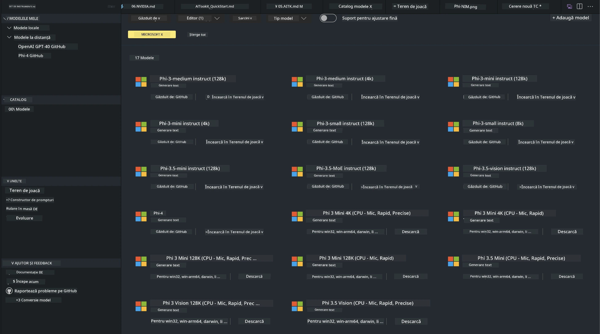
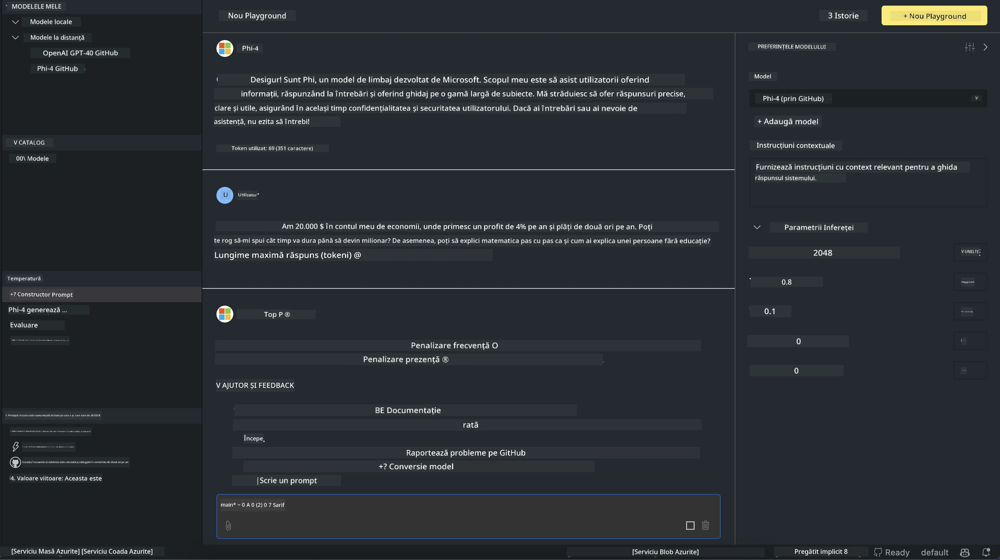

# Familia Phi în AITK

[AI Toolkit pentru VS Code](https://marketplace.visualstudio.com/items?itemName=ms-windows-ai-studio.windows-ai-studio) simplifică dezvoltarea aplicațiilor AI generative prin reunirea celor mai noi instrumente și modele AI din Azure AI Foundry Catalog și alte cataloage precum Hugging Face. Vei putea naviga prin catalogul de modele AI alimentat de GitHub Models și Azure AI Foundry Model Catalogs, să le descarci local sau remote, să le ajustezi fin, să le testezi și să le folosești în aplicația ta.

Preview-ul AI Toolkit va rula local. Inferența locală sau ajustarea fină depind de modelul ales, iar pentru aceasta poate fi necesar să ai un GPU, cum ar fi NVIDIA CUDA GPU. Poți rula direct și modelele GitHub cu AITK.

## Începutul

[Aflați mai multe despre cum să instalați Windows Subsystem for Linux](https://learn.microsoft.com/windows/wsl/install?WT.mc_id=aiml-137032-kinfeylo)

și [cum să schimbați distribuția implicită](https://learn.microsoft.com/windows/wsl/install#change-the-default-linux-distribution-installed).

[Repozitoriul AI Toolkit pe GitHub](https://github.com/microsoft/vscode-ai-toolkit/)

- Windows, Linux, macOS

- Pentru ajustarea fină pe Windows și Linux, vei avea nevoie de un GPU Nvidia. În plus, **Windows** necesită subsystem pentru Linux cu distribuția Ubuntu 18.4 sau mai nouă. [Aflați mai multe despre cum să instalați Windows Subsystem for Linux](https://learn.microsoft.com/windows/wsl/install) și [cum să schimbați distribuția implicită](https://learn.microsoft.com/windows/wsl/install#change-the-default-linux-distribution-installed).

### Instalarea AI Toolkit

AI Toolkit este livrat ca o [extensie Visual Studio Code](https://code.visualstudio.com/docs/setup/additional-components#_vs-code-extensions), așa că trebuie să instalezi mai întâi [VS Code](https://code.visualstudio.com/docs/setup/windows?WT.mc_id=aiml-137032-kinfeylo) și să descarci AI Toolkit din [VS Marketplace](https://marketplace.visualstudio.com/items?itemName=ms-windows-ai-studio.windows-ai-studio).  
[AI Toolkit este disponibil în Visual Studio Marketplace](https://marketplace.visualstudio.com/items?itemName=ms-windows-ai-studio.windows-ai-studio) și poate fi instalat ca orice altă extensie VS Code.

Dacă nu ești familiarizat cu instalarea extensiilor VS Code, urmează acești pași:

### Autentificare

1. În bara de activități din VS Code selectează **Extensions**  
1. În bara de căutare a extensiilor tastează „AI Toolkit”  
1. Selectează „AI Toolkit for Visual Studio code”  
1. Apasă pe **Install**

Acum ești gata să folosești extensia!

Ți se va cere să te autentifici pe GitHub, așa că apasă „Allow” pentru a continua. Vei fi redirecționat către pagina de autentificare GitHub.

Te rugăm să te autentifici și să urmezi pașii procesului. După finalizarea cu succes, vei fi redirecționat înapoi în VS Code.

Odată ce extensia este instalată, vei vedea pictograma AI Toolkit în bara ta de activități.

Hai să explorăm acțiunile disponibile!

### Acțiuni disponibile

Bara laterală principală a AI Toolkit este organizată în  

- **Models**  
- **Resources**  
- **Playground**  
- **Fine-tuning**  
- **Evaluation**

Acestea sunt disponibile în secțiunea Resources. Pentru a începe, selectează **Model Catalog**.

### Descarcă un model din catalog

La lansarea AI Toolkit din bara laterală VS Code, poți alege dintre următoarele opțiuni:



- Găsește un model suportat în **Model Catalog** și descarcă-l local  
- Testează inferența modelului în **Model Playground**  
- Ajustează fin modelul local sau remote în **Model Fine-tuning**  
- Publică modelele ajustate fin în cloud prin paleta de comenzi pentru AI Toolkit  
- Evaluează modelele

> [!NOTE]
>
> **GPU vs CPU**
>
> Vei observa că fișele modelelor afișează dimensiunea modelului, platforma și tipul acceleratorului (CPU, GPU). Pentru performanță optimizată pe **dispozitive Windows care au cel puțin un GPU**, alege versiuni de modele care vizează doar Windows.
>
> Astfel te asiguri că ai un model optimizat pentru acceleratorul DirectML.
>
> Numele modelelor au formatul
>
> - `{model_name}-{accelerator}-{quantization}-{format}`.
>
>Pentru a verifica dacă ai un GPU pe dispozitivul tău Windows, deschide **Task Manager** și selectează fila **Performance**. Dacă ai GPU-uri, acestea vor fi listate sub denumiri precum „GPU 0” sau „GPU 1”.

### Rulează modelul în playground

După ce ai setat toți parametrii, apasă pe **Generate Project**.

Odată ce modelul tău a fost descărcat, selectează **Load in Playground** pe fișa modelului din catalog:

- Inițiază descărcarea modelului  
- Instalează toate prerechizitele și dependențele  
- Creează un workspace în VS Code



### Folosește REST API în aplicația ta

AI Toolkit vine cu un server web REST API local **pe portul 5272** care folosește [formatul OpenAI chat completions](https://platform.openai.com/docs/api-reference/chat/create).

Acest lucru îți permite să testezi aplicația local fără să depinzi de un serviciu AI în cloud. De exemplu, următorul fișier JSON arată cum să configurezi corpul cererii:

```json
{
    "model": "Phi-4",
    "messages": [
        {
            "role": "user",
            "content": "what is the golden ratio?"
        }
    ],
    "temperature": 0.7,
    "top_p": 1,
    "top_k": 10,
    "max_tokens": 100,
    "stream": true
}
```

Poți testa REST API folosind (de exemplu) [Postman](https://www.postman.com/) sau utilitarul CURL (Client URL):

```bash
curl -vX POST http://127.0.0.1:5272/v1/chat/completions -H 'Content-Type: application/json' -d @body.json
```

### Folosind biblioteca client OpenAI pentru Python

```python
from openai import OpenAI

client = OpenAI(
    base_url="http://127.0.0.1:5272/v1/", 
    api_key="x" # required for the API but not used
)

chat_completion = client.chat.completions.create(
    messages=[
        {
            "role": "user",
            "content": "what is the golden ratio?",
        }
    ],
    model="Phi-4",
)

print(chat_completion.choices[0].message.content)
```

### Folosind biblioteca client Azure OpenAI pentru .NET

Adaugă [biblioteca client Azure OpenAI pentru .NET](https://www.nuget.org/packages/Azure.AI.OpenAI/) în proiectul tău folosind NuGet:

```bash
dotnet add {project_name} package Azure.AI.OpenAI --version 1.0.0-beta.17
```

Adaugă un fișier C# numit **OverridePolicy.cs** în proiect și lipește următorul cod:

```csharp
// OverridePolicy.cs
using Azure.Core.Pipeline;
using Azure.Core;

internal partial class OverrideRequestUriPolicy(Uri overrideUri)
    : HttpPipelineSynchronousPolicy
{
    private readonly Uri _overrideUri = overrideUri;

    public override void OnSendingRequest(HttpMessage message)
    {
        message.Request.Uri.Reset(_overrideUri);
    }
}
```

Apoi, lipește următorul cod în fișierul tău **Program.cs**:

```csharp
// Program.cs
using Azure.AI.OpenAI;

Uri localhostUri = new("http://localhost:5272/v1/chat/completions");

OpenAIClientOptions clientOptions = new();
clientOptions.AddPolicy(
    new OverrideRequestUriPolicy(localhostUri),
    Azure.Core.HttpPipelinePosition.BeforeTransport);
OpenAIClient client = new(openAIApiKey: "unused", clientOptions);

ChatCompletionsOptions options = new()
{
    DeploymentName = "Phi-4",
    Messages =
    {
        new ChatRequestSystemMessage("You are a helpful assistant. Be brief and succinct."),
        new ChatRequestUserMessage("What is the golden ratio?"),
    }
};

StreamingResponse<StreamingChatCompletionsUpdate> streamingChatResponse
    = await client.GetChatCompletionsStreamingAsync(options);

await foreach (StreamingChatCompletionsUpdate chatChunk in streamingChatResponse)
{
    Console.Write(chatChunk.ContentUpdate);
}
```


## Ajustarea fină cu AI Toolkit

- Începe cu descoperirea modelelor și playground-ul.  
- Ajustare fină și inferență folosind resurse locale de calcul.  
- Ajustare fină și inferență remote folosind resurse Azure.

[Ajustarea fină cu AI Toolkit](../../03.FineTuning/Finetuning_VSCodeaitoolkit.md)

## Resurse Q&A pentru AI Toolkit

Te rugăm să consulți [pagina noastră de întrebări și răspunsuri](https://github.com/microsoft/vscode-ai-toolkit/blob/main/archive/QA.md) pentru cele mai frecvente probleme și soluții.

**Declinare a responsabilității**:  
Acest document a fost tradus folosind serviciul de traducere AI [Co-op Translator](https://github.com/Azure/co-op-translator). Deși ne străduim pentru acuratețe, vă rugăm să rețineți că traducerile automate pot conține erori sau inexactități. Documentul original în limba sa nativă trebuie considerat sursa autorizată. Pentru informații critice, se recomandă traducerea profesională realizată de un specialist uman. Nu ne asumăm răspunderea pentru eventualele neînțelegeri sau interpretări greșite rezultate din utilizarea acestei traduceri.