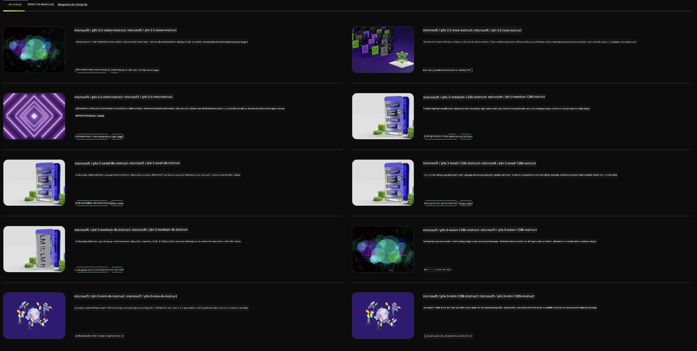

<!--
CO_OP_TRANSLATOR_METADATA:
{
  "original_hash": "7b08e277df2a9307f861ae54bc30c772",
  "translation_date": "2025-05-09T10:02:47+00:00",
  "source_file": "md/01.Introduction/02/06.NVIDIA.md",
  "language_code": "ro"
}
-->
## Familia Phi în NVIDIA NIM

NVIDIA NIM este un set de microservicii ușor de utilizat, concepute pentru a accelera implementarea modelelor generative AI în cloud, centre de date și stații de lucru. NIM-urile sunt organizate pe familii de modele și pe modele individuale. De exemplu, NVIDIA NIM pentru modelele mari de limbaj (LLMs) aduce puterea celor mai avansate LLM-uri în aplicațiile enterprise, oferind capacități neegalate de procesare și înțelegere a limbajului natural.

NIM facilitează echipelor IT și DevOps găzduirea locală a modelelor mari de limbaj (LLMs) în propriile medii gestionate, oferind în același timp dezvoltatorilor API-uri standard din industrie care le permit să creeze asistente inteligente, chatboți și copiloți puternici ce pot transforma afacerea. Profitând de accelerarea GPU de ultimă generație NVIDIA și de implementarea scalabilă, NIM oferă cea mai rapidă cale către inferență cu performanțe de neegalat.

Poți folosi NVIDIA NIM pentru a face inferență cu modelele din Familia Phi



### **Exemple - Phi-3-Vision în NVIDIA NIM**

Imaginează-ți că ai o imagine (`demo.png`) și vrei să generezi cod Python care să proceseze această imagine și să salveze o versiune nouă a ei (`phi-3-vision.jpg`).

Codul de mai sus automatizează acest proces prin:

1. Configurarea mediului și setările necesare.
2. Crearea unui prompt care instruiește modelul să genereze codul Python necesar.
3. Trimiterea promptului către model și colectarea codului generat.
4. Extrage și rulează codul generat.
5. Afișarea imaginilor originale și procesate.

Această abordare valorifică puterea AI pentru a automatiza sarcinile de procesare a imaginilor, făcându-le mai ușor și mai rapid de realizat.

[Exemplu Cod Soluție](../../../../../code/06.E2E/E2E_Nvidia_NIM_Phi3_Vision.ipynb)

Să analizăm pas cu pas ce face întregul cod:

1. **Instalarea pachetului necesar**:
    ```python
    !pip install langchain_nvidia_ai_endpoints -U
    ```  
    Această comandă instalează pachetul `langchain_nvidia_ai_endpoints`, asigurându-se că este versiunea cea mai recentă.

2. **Importarea modulelor necesare**:
    ```python
    from langchain_nvidia_ai_endpoints import ChatNVIDIA
    import getpass
    import os
    import base64
    ```  
    Aceste importuri aduc modulele necesare pentru interacțiunea cu endpoint-urile NVIDIA AI, gestionarea securizată a parolelor, interacțiunea cu sistemul de operare și codarea/decodarea datelor în format base64.

3. **Configurarea cheii API**:
    ```python
    if not os.getenv("NVIDIA_API_KEY"):
        os.environ["NVIDIA_API_KEY"] = getpass.getpass("Enter your NVIDIA API key: ")
    ```  
    Acest cod verifică dacă variabila de mediu `NVIDIA_API_KEY` este setată. Dacă nu, solicită utilizatorului să introducă cheia API în mod securizat.

4. **Definirea modelului și a căii către imagine**:
    ```python
    model = 'microsoft/phi-3-vision-128k-instruct'
    chat = ChatNVIDIA(model=model)
    img_path = './imgs/demo.png'
    ```  
    Se setează modelul ce va fi folosit, se creează o instanță `ChatNVIDIA` cu modelul specificat și se definește calea către fișierul imagine.

5. **Crearea promptului text**:
    ```python
    text = "Please create Python code for image, and use plt to save the new picture under imgs/ and name it phi-3-vision.jpg."
    ```  
    Se definește un prompt text care instruiește modelul să genereze cod Python pentru procesarea unei imagini.

6. **Codarea imaginii în base64**:
    ```python
    with open(img_path, "rb") as f:
        image_b64 = base64.b64encode(f.read()).decode()
    image = f''
    ```  
    Acest cod citește fișierul imagine, îl codifică în base64 și creează un tag HTML de imagine cu datele codificate.

7. **Combinarea textului și imaginii în prompt**:
    ```python
    prompt = f"{text} {image}"
    ```  
    Se combină promptul text și tag-ul HTML al imaginii într-un singur șir.

8. **Generarea codului folosind ChatNVIDIA**:
    ```python
    code = ""
    for chunk in chat.stream(prompt):
        print(chunk.content, end="")
        code += chunk.content
    ```  
    Acest cod trimite promptul către `ChatNVIDIA` model and collects the generated code in chunks, printing and appending each chunk to the `code` string.

9. **Extrage codul Python din conținutul generat**:
    ```python
    begin = code.index('```python') + 9  
    code = code[begin:]  
    end = code.index('```')
    code = code[:end]
    ```  
    Acest cod extrage efectiv codul Python din conținutul generat, eliminând formatările markdown.

10. **Rulează codul generat**:
    ```python
    import subprocess
    result = subprocess.run(["python", "-c", code], capture_output=True)
    ```  
    Acest cod rulează codul Python extras ca un subprocess și capturează rezultatul.

11. **Afișarea imaginilor**:
    ```python
    from IPython.display import Image, display
    display(Image(filename='./imgs/phi-3-vision.jpg'))
    display(Image(filename='./imgs/demo.png'))
    ```  
    Aceste linii afișează imaginile folosind modulul `IPython.display`.

**Declinare a responsabilității**:  
Acest document a fost tradus folosind serviciul de traducere AI [Co-op Translator](https://github.com/Azure/co-op-translator). Deși ne străduim pentru acuratețe, vă rugăm să rețineți că traducerile automate pot conține erori sau inexactități. Documentul original, în limba sa nativă, trebuie considerat sursa autoritară. Pentru informații critice, se recomandă traducerea profesională realizată de un specialist uman. Nu ne asumăm responsabilitatea pentru eventualele neînțelegeri sau interpretări greșite rezultate din utilizarea acestei traduceri.