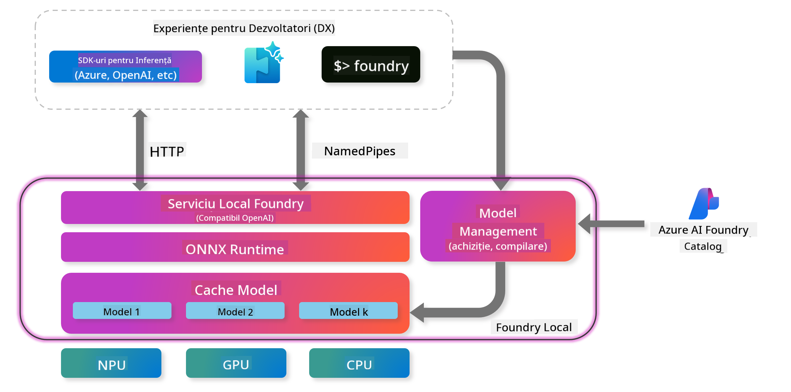
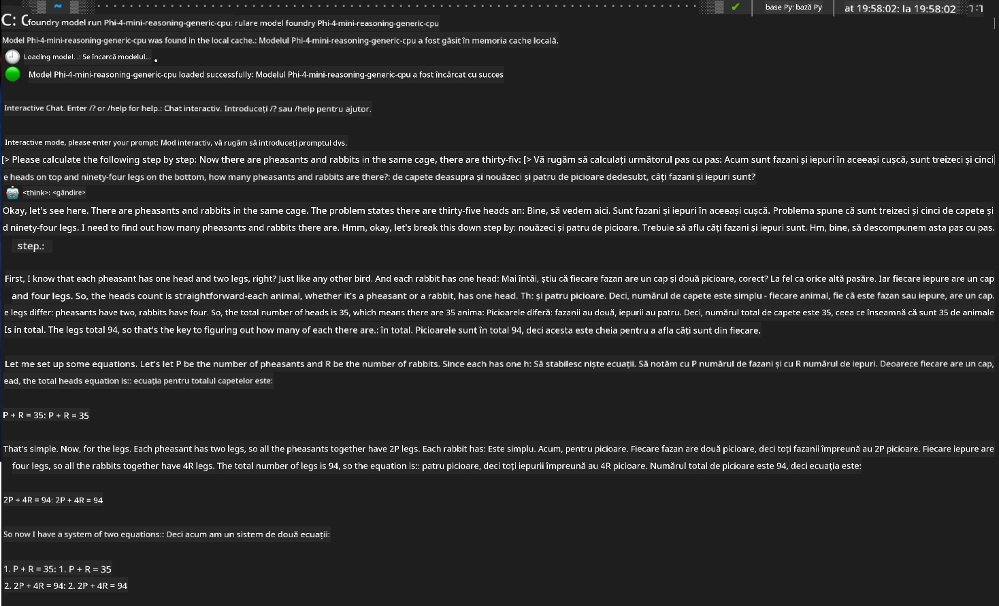

<!--
CO_OP_TRANSLATOR_METADATA:
{
  "original_hash": "52973a5680a65a810aa80b7036afd31f",
  "translation_date": "2025-07-16T19:50:51+00:00",
  "source_file": "md/01.Introduction/02/07.FoundryLocal.md",
  "language_code": "ro"
}
-->
## Începutul cu modelele Phi-Family în Foundry Local

### Introducere în Foundry Local

Foundry Local este o soluție puternică de inferență AI pe dispozitiv, care aduce capabilități AI de nivel enterprise direct pe hardware-ul tău local. Acest tutorial te va ghida prin configurarea și utilizarea modelelor Phi-Family cu Foundry Local, oferindu-ți control complet asupra sarcinilor AI, păstrând în același timp confidențialitatea și reducând costurile.

Foundry Local oferă avantaje în performanță, confidențialitate, personalizare și costuri prin rularea modelelor AI local, pe dispozitivul tău. Se integrează perfect în fluxurile și aplicațiile tale existente printr-un CLI intuitiv, SDK și REST API.




### De ce să alegi Foundry Local?

Înțelegerea beneficiilor Foundry Local te va ajuta să iei decizii informate privind strategia ta de implementare AI:

- **Inferență pe dispozitiv:** Rulează modelele local, pe hardware-ul tău, reducând costurile și păstrând toate datele pe dispozitivul tău.

- **Personalizarea modelelor:** Alege dintre modelele presetate sau folosește propriile modele pentru a satisface cerințe și cazuri de utilizare specifice.

- **Eficiență a costurilor:** Elimină costurile recurente ale serviciilor cloud folosind hardware-ul existent, făcând AI mai accesibil.

- **Integrare fără probleme:** Conectează-te cu aplicațiile tale prin SDK, endpoint-uri API sau CLI, cu scalare ușoară către Azure AI Foundry pe măsură ce nevoile tale cresc.

> **Notă pentru început:** Acest tutorial se concentrează pe utilizarea Foundry Local prin interfețele CLI și SDK. Vei învăța ambele metode pentru a alege cea mai potrivită pentru cazul tău.

## Partea 1: Configurarea Foundry Local CLI

### Pasul 1: Instalare

Foundry Local CLI este poarta ta de acces pentru gestionarea și rularea modelelor AI local. Să începem prin instalarea acestuia pe sistemul tău.

**Platforme suportate:** Windows și macOS

Pentru instrucțiuni detaliate de instalare, te rugăm să consulți [documentația oficială Foundry Local](https://github.com/microsoft/Foundry-Local/blob/main/README.md).

### Pasul 2: Explorarea modelelor disponibile

După ce ai instalat Foundry Local CLI, poți descoperi ce modele sunt disponibile pentru cazul tău de utilizare. Această comandă îți va arăta toate modelele suportate:


```bash
foundry model list
```

### Pasul 3: Înțelegerea modelelor Phi Family

Phi Family oferă o gamă de modele optimizate pentru diferite cazuri de utilizare și configurații hardware. Iată modelele Phi disponibile în Foundry Local:

**Modele Phi disponibile:** 

- **phi-3.5-mini** - Model compact pentru sarcini de bază
- **phi-3-mini-128k** - Versiune cu context extins pentru conversații mai lungi
- **phi-3-mini-4k** - Model cu context standard pentru utilizare generală
- **phi-4** - Model avansat cu capacități îmbunătățite
- **phi-4-mini** - Versiune ușoară a modelului Phi-4
- **phi-4-mini-reasoning** - Specializat pentru sarcini complexe de raționament

> **Compatibilitate hardware:** Fiecare model poate fi configurat pentru diferite tipuri de accelerare hardware (CPU, GPU) în funcție de capabilitățile sistemului tău.

### Pasul 4: Rularea primului model Phi

Să începem cu un exemplu practic. Vom rula modelul `phi-4-mini-reasoning`, care excelează în rezolvarea problemelor complexe pas cu pas.


**Comandă pentru rularea modelului:**

```bash
foundry model run Phi-4-mini-reasoning-generic-cpu
```

> **Configurare inițială:** La prima rulare a unui model, Foundry Local îl va descărca automat pe dispozitivul tău local. Timpul de descărcare variază în funcție de viteza rețelei, așa că te rugăm să ai răbdare în timpul configurării inițiale.

### Pasul 5: Testarea modelului cu o problemă reală

Acum să testăm modelul nostru cu o problemă clasică de logică pentru a vedea cum realizează raționamentul pas cu pas:

**Problema exemplu:**

```txt
Please calculate the following step by step: Now there are pheasants and rabbits in the same cage, there are thirty-five heads on top and ninety-four legs on the bottom, how many pheasants and rabbits are there?
```

**Comportament așteptat:** Modelul ar trebui să descompună problema în pași logici, folosind faptul că fazanii au 2 picioare, iar iepurii 4 picioare, pentru a rezolva sistemul de ecuații.

**Rezultate:**



## Partea 2: Construirea aplicațiilor cu Foundry Local SDK

### De ce să folosești SDK-ul?

Deși CLI este perfect pentru testare și interacțiuni rapide, SDK-ul îți permite să integrezi Foundry Local în aplicațiile tale programatic. Acest lucru deschide posibilități pentru:

- Construirea de aplicații personalizate alimentate de AI
- Crearea de fluxuri de lucru automate
- Integrarea capabilităților AI în sisteme existente
- Dezvoltarea de chatboți și instrumente interactive

### Limbaje de programare suportate

Foundry Local oferă suport SDK pentru mai multe limbaje de programare, adaptate preferințelor tale de dezvoltare:

**📦 SDK-uri disponibile:**

- **C# (.NET):** [Documentație și exemple SDK](https://github.com/microsoft/Foundry-Local/tree/main/sdk/cs)
- **Python:** [Documentație și exemple SDK](https://github.com/microsoft/Foundry-Local/tree/main/sdk/python)
- **JavaScript:** [Documentație și exemple SDK](https://github.com/microsoft/Foundry-Local/tree/main/sdk/js)
- **Rust:** [Documentație și exemple SDK](https://github.com/microsoft/Foundry-Local/tree/main/sdk/rust)

### Pașii următori

1. **Alege SDK-ul preferat** în funcție de mediul tău de dezvoltare
2. **Urmărește documentația specifică SDK-ului** pentru ghiduri detaliate de implementare
3. **Începe cu exemple simple** înainte de a construi aplicații complexe
4. **Explorează codul exemplu** oferit în fiecare depozit SDK

## Concluzie

Acum ai învățat cum să:
- ✅ Instalezi și configurezi Foundry Local CLI
- ✅ Descoperi și rulezi modelele Phi Family
- ✅ Testezi modelele cu probleme reale
- ✅ Înțelegi opțiunile SDK pentru dezvoltarea aplicațiilor

Foundry Local oferă o bază puternică pentru a aduce capabilitățile AI direct în mediul tău local, oferindu-ți control asupra performanței, confidențialității și costurilor, păstrând în același timp flexibilitatea de a scala către soluții cloud când este necesar.

**Declinare de responsabilitate**:  
Acest document a fost tradus folosind serviciul de traducere AI [Co-op Translator](https://github.com/Azure/co-op-translator). Deși ne străduim pentru acuratețe, vă rugăm să rețineți că traducerile automate pot conține erori sau inexactități. Documentul original în limba sa nativă trebuie considerat sursa autorizată. Pentru informații critice, se recomandă traducerea profesională realizată de un specialist uman. Nu ne asumăm răspunderea pentru eventualele neînțelegeri sau interpretări greșite rezultate din utilizarea acestei traduceri.