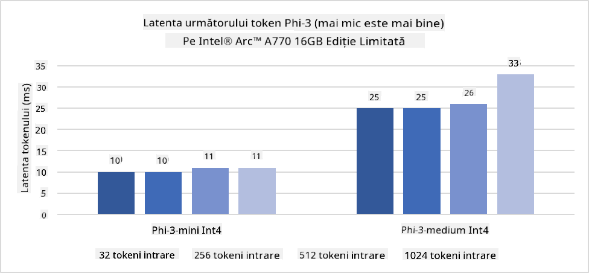
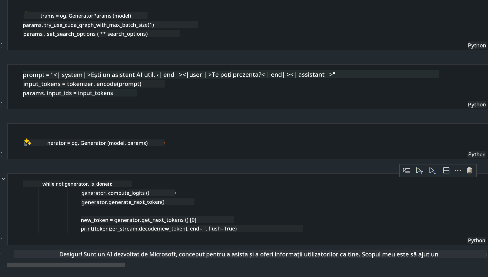

<!--
CO_OP_TRANSLATOR_METADATA:
{
  "original_hash": "e08ce816e23ad813244a09ca34ebb8ac",
  "translation_date": "2025-07-16T20:07:26+00:00",
  "source_file": "md/01.Introduction/03/AIPC_Inference.md",
  "language_code": "ro"
}
-->
# **Inferență Phi-3 pe AI PC**

Odată cu avansarea AI generative și îmbunătățirea capacităților hardware ale dispozitivelor edge, tot mai multe modele AI generative pot fi integrate acum în dispozitivele Bring Your Own Device (BYOD) ale utilizatorilor. AI PC-urile se numără printre aceste modele. Începând cu 2024, Intel, AMD și Qualcomm au colaborat cu producătorii de PC-uri pentru a introduce AI PC-uri care facilitează implementarea modelelor AI generative localizate prin modificări hardware. În această discuție, ne vom concentra pe AI PC-urile Intel și vom explora cum să implementăm Phi-3 pe un AI PC Intel.

### Ce este NPU

Un NPU (Neural Processing Unit) este un procesor dedicat sau o unitate de procesare integrată într-un SoC mai mare, proiectată special pentru accelerarea operațiunilor rețelelor neuronale și a sarcinilor AI. Spre deosebire de CPU-urile și GPU-urile generale, NPU-urile sunt optimizate pentru calcul paralel orientat pe date, ceea ce le face extrem de eficiente în procesarea unor volume mari de date multimedia, cum ar fi videoclipuri și imagini, precum și în procesarea datelor pentru rețele neuronale. Sunt deosebit de bune la gestionarea sarcinilor legate de AI, cum ar fi recunoașterea vocală, estomparea fundalului în apelurile video și procesele de editare foto sau video, cum ar fi detectarea obiectelor.

## NPU vs GPU

Deși multe sarcini AI și de învățare automată rulează pe GPU-uri, există o diferență esențială între GPU-uri și NPU-uri.  
GPU-urile sunt cunoscute pentru capacitățile lor de calcul paralel, dar nu toate GPU-urile sunt la fel de eficiente dincolo de procesarea grafică. NPU-urile, pe de altă parte, sunt construite special pentru calculele complexe implicate în operațiunile rețelelor neuronale, ceea ce le face extrem de eficiente pentru sarcinile AI.

Pe scurt, NPU-urile sunt experții matematici care accelerează calculele AI și joacă un rol cheie în era emergentă a AI PC-urilor!

***Acest exemplu se bazează pe cel mai recent procesor Intel Core Ultra***

## **1. Folosirea NPU pentru a rula modelul Phi-3**

Dispozitivul Intel® NPU este un accelerator de inferență AI integrat cu CPU-urile client Intel, începând cu generația Intel® Core™ Ultra (cunoscută anterior ca Meteor Lake). Acesta permite execuția eficientă din punct de vedere energetic a sarcinilor rețelelor neuronale artificiale.




**Intel NPU Acceleration Library**

Intel NPU Acceleration Library [https://github.com/intel/intel-npu-acceleration-library](https://github.com/intel/intel-npu-acceleration-library) este o bibliotecă Python concepută pentru a crește eficiența aplicațiilor tale prin valorificarea puterii Intel Neural Processing Unit (NPU) pentru a efectua calcule rapide pe hardware compatibil.

Exemplu de Phi-3-mini pe AI PC alimentat de procesoare Intel® Core™ Ultra.


Instalează biblioteca Python cu pip

```bash

   pip install intel-npu-acceleration-library

```

***Notă*** Proiectul este încă în dezvoltare, dar modelul de referință este deja foarte complet.

### **Rularea Phi-3 cu Intel NPU Acceleration Library**

Folosind accelerarea Intel NPU, această bibliotecă nu afectează procesul tradițional de codare. Trebuie doar să folosești această bibliotecă pentru a cuantiza modelul original Phi-3, cum ar fi FP16, INT8, INT4, de exemplu

```python
from transformers import AutoTokenizer, pipeline,TextStreamer
from intel_npu_acceleration_library import NPUModelForCausalLM, int4
from intel_npu_acceleration_library.compiler import CompilerConfig
import warnings

model_id = "microsoft/Phi-3-mini-4k-instruct"

compiler_conf = CompilerConfig(dtype=int4)
model = NPUModelForCausalLM.from_pretrained(
    model_id, use_cache=True, config=compiler_conf, attn_implementation="sdpa"
).eval()

tokenizer = AutoTokenizer.from_pretrained(model_id)

text_streamer = TextStreamer(tokenizer, skip_prompt=True)
```

După ce cuantificarea este reușită, continuă execuția pentru a apela NPU să ruleze modelul Phi-3.

```python
generation_args = {
   "max_new_tokens": 1024,
   "return_full_text": False,
   "temperature": 0.3,
   "do_sample": False,
   "streamer": text_streamer,
}

pipe = pipeline(
   "text-generation",
   model=model,
   tokenizer=tokenizer,
)

query = "<|system|>You are a helpful AI assistant.<|end|><|user|>Can you introduce yourself?<|end|><|assistant|>"

with warnings.catch_warnings():
    warnings.simplefilter("ignore")
    pipe(query, **generation_args)
```

În timpul execuției codului, putem vedea starea de funcționare a NPU-ului prin Managerul de activități


***Exemple*** : [AIPC_NPU_DEMO.ipynb](../../../../../code/03.Inference/AIPC/AIPC_NPU_DEMO.ipynb)

## **2. Folosirea DirectML + ONNX Runtime pentru a rula modelul Phi-3**

### **Ce este DirectML**

[DirectML](https://github.com/microsoft/DirectML) este o bibliotecă DirectX 12 accelerată hardware, de înaltă performanță, pentru învățarea automată. DirectML oferă accelerare GPU pentru sarcini comune de învățare automată pe o gamă largă de hardware și drivere suportate, inclusiv toate GPU-urile compatibile cu DirectX 12 de la furnizori precum AMD, Intel, NVIDIA și Qualcomm.

Când este folosit independent, API-ul DirectML este o bibliotecă DirectX 12 la nivel scăzut, potrivită pentru aplicații cu performanță ridicată și latență scăzută, cum ar fi framework-uri, jocuri și alte aplicații în timp real. Interoperabilitatea perfectă a DirectML cu Direct3D 12, precum și supravegherea redusă și conformitatea pe hardware, fac din DirectML o alegere ideală pentru accelerarea învățării automate atunci când se dorește atât performanță ridicată, cât și fiabilitatea și predictibilitatea rezultatelor pe diferite hardware-uri.

***Notă*** : Ultima versiune DirectML suportă deja NPU (https://devblogs.microsoft.com/directx/introducing-neural-processor-unit-npu-support-in-directml-developer-preview/)

### DirectML și CUDA în ceea ce privește capabilitățile și performanța:

**DirectML** este o bibliotecă de învățare automată dezvoltată de Microsoft. Este concepută pentru a accelera sarcinile de învățare automată pe dispozitive Windows, inclusiv desktopuri, laptopuri și dispozitive edge.  
- Bazat pe DX12: DirectML este construit peste DirectX 12 (DX12), care oferă suport larg pentru hardware pe GPU-uri, inclusiv NVIDIA și AMD.  
- Suport extins: Deoarece folosește DX12, DirectML poate funcționa cu orice GPU care suportă DX12, chiar și GPU-uri integrate.  
- Procesare imagini: DirectML procesează imagini și alte date folosind rețele neuronale, fiind potrivit pentru sarcini precum recunoașterea imaginilor, detectarea obiectelor și altele.  
- Ușurință în configurare: Configurarea DirectML este simplă și nu necesită SDK-uri sau biblioteci specifice de la producătorii de GPU-uri.  
- Performanță: În unele cazuri, DirectML oferă performanțe bune și poate fi mai rapid decât CUDA, în special pentru anumite sarcini.  
- Limitări: Totuși, există situații în care DirectML poate fi mai lent, în special pentru loturi mari de date în format float16.

**CUDA** este platforma de calcul paralel și modelul de programare al NVIDIA. Permite dezvoltatorilor să valorifice puterea GPU-urilor NVIDIA pentru calcul general, inclusiv învățare automată și simulări științifice.  
- Specific NVIDIA: CUDA este strâns integrat cu GPU-urile NVIDIA și este proiectat special pentru acestea.  
- Foarte optimizat: Oferă performanțe excelente pentru sarcini accelerate pe GPU, în special pe GPU-urile NVIDIA.  
- Folosit pe scară largă: Multe framework-uri și biblioteci de învățare automată (cum ar fi TensorFlow și PyTorch) au suport CUDA.  
- Personalizare: Dezvoltatorii pot ajusta setările CUDA pentru sarcini specifice, ceea ce poate duce la performanțe optime.  
- Limitări: Totuși, dependența CUDA de hardware-ul NVIDIA poate fi o limitare dacă dorești compatibilitate mai largă pe diferite GPU-uri.

### Alegerea între DirectML și CUDA

Alegerea între DirectML și CUDA depinde de cazul tău specific, disponibilitatea hardware-ului și preferințe.  
Dacă dorești compatibilitate mai largă și configurare ușoară, DirectML poate fi o alegere bună. Totuși, dacă ai GPU-uri NVIDIA și ai nevoie de performanțe foarte optimizate, CUDA rămâne o opțiune puternică. Pe scurt, ambele au avantaje și dezavantaje, așa că ia în considerare cerințele și hardware-ul disponibil înainte de a decide.

### **AI generativ cu ONNX Runtime**

În era AI, portabilitatea modelelor AI este foarte importantă. ONNX Runtime poate implementa cu ușurință modele antrenate pe diferite dispozitive. Dezvoltatorii nu trebuie să se preocupe de cadrul de inferență și pot folosi un API unificat pentru a realiza inferența modelului. În era AI generative, ONNX Runtime a realizat și optimizări de cod (https://onnxruntime.ai/docs/genai/). Prin ONNX Runtime optimizat, modelul AI generativ cuantificat poate fi inferat pe diferite terminale. În Generative AI cu ONNX Runtime, poți folosi API-ul modelului AI prin Python, C#, C/C++. Desigur, implementarea pe iPhone poate profita de API-ul Generative AI cu ONNX Runtime în C++.

[Cod exemplu](https://github.com/Azure-Samples/Phi-3MiniSamples/tree/main/onnx)

***compilare bibliotecă generativă AI cu ONNX Runtime***

```bash

winget install --id=Kitware.CMake  -e

git clone https://github.com/microsoft/onnxruntime.git

cd .\onnxruntime\

./build.bat --build_shared_lib --skip_tests --parallel --use_dml --config Release

cd ../

git clone https://github.com/microsoft/onnxruntime-genai.git

cd .\onnxruntime-genai\

mkdir ort

cd ort

mkdir include

mkdir lib

copy ..\onnxruntime\include\onnxruntime\core\providers\dml\dml_provider_factory.h ort\include

copy ..\onnxruntime\include\onnxruntime\core\session\onnxruntime_c_api.h ort\include

copy ..\onnxruntime\build\Windows\Release\Release\*.dll ort\lib

copy ..\onnxruntime\build\Windows\Release\Release\onnxruntime.lib ort\lib

python build.py --use_dml


```

**Instalare bibliotecă**

```bash

pip install .\onnxruntime_genai_directml-0.3.0.dev0-cp310-cp310-win_amd64.whl

```

Acesta este rezultatul rulării



***Exemple*** : [AIPC_DirectML_DEMO.ipynb](../../../../../code/03.Inference/AIPC/AIPC_DirectML_DEMO.ipynb)

## **3. Folosirea Intel OpenVino pentru a rula modelul Phi-3**

### **Ce este OpenVINO**

[OpenVINO](https://github.com/openvinotoolkit/openvino) este un toolkit open-source pentru optimizarea și implementarea modelelor de învățare profundă. Oferă performanțe îmbunătățite pentru modele de viziune, audio și limbaj din framework-uri populare precum TensorFlow, PyTorch și altele. Începe cu OpenVINO. OpenVINO poate fi folosit și în combinație cu CPU și GPU pentru a rula modelul Phi-3.

***Notă***: În prezent, OpenVINO nu suportă NPU.

### **Instalarea bibliotecii OpenVINO**

```bash

 pip install git+https://github.com/huggingface/optimum-intel.git

 pip install git+https://github.com/openvinotoolkit/nncf.git

 pip install openvino-nightly

```

### **Rularea Phi-3 cu OpenVINO**

La fel ca NPU, OpenVINO realizează apelul modelelor AI generative prin rularea modelelor cuantificate. Trebuie să cuantizăm mai întâi modelul Phi-3 și să finalizăm cuantificarea modelului din linia de comandă prin optimum-cli

**INT4**

```bash

optimum-cli export openvino --model "microsoft/Phi-3-mini-4k-instruct" --task text-generation-with-past --weight-format int4 --group-size 128 --ratio 0.6  --sym  --trust-remote-code ./openvinomodel/phi3/int4

```

**FP16**

```bash

optimum-cli export openvino --model "microsoft/Phi-3-mini-4k-instruct" --task text-generation-with-past --weight-format fp16 --trust-remote-code ./openvinomodel/phi3/fp16

```

formatul convertit, așa


Încarcă căile modelului (model_dir), configurațiile aferente (ov_config = {"PERFORMANCE_HINT": "LATENCY", "NUM_STREAMS": "1", "CACHE_DIR": ""}) și dispozitivele accelerate hardware (GPU.0) prin OVModelForCausalLM

```python

ov_model = OVModelForCausalLM.from_pretrained(
     model_dir,
     device='GPU.0',
     ov_config=ov_config,
     config=AutoConfig.from_pretrained(model_dir, trust_remote_code=True),
     trust_remote_code=True,
)

```

În timpul execuției codului, putem vedea starea de funcționare a GPU-ului prin Managerul de activități


***Exemple*** : [AIPC_OpenVino_Demo.ipynb](../../../../../code/03.Inference/AIPC/AIPC_OpenVino_Demo.ipynb)

### ***Notă*** : Cele trei metode de mai sus au fiecare avantajele lor, dar se recomandă folosirea accelerării NPU pentru inferența pe AI PC.

**Declinare de responsabilitate**:  
Acest document a fost tradus folosind serviciul de traducere AI [Co-op Translator](https://github.com/Azure/co-op-translator). Deși ne străduim pentru acuratețe, vă rugăm să rețineți că traducerile automate pot conține erori sau inexactități. Documentul original în limba sa nativă trebuie considerat sursa autorizată. Pentru informații critice, se recomandă traducerea profesională realizată de un specialist uman. Nu ne asumăm răspunderea pentru eventualele neînțelegeri sau interpretări greșite rezultate din utilizarea acestei traduceri.