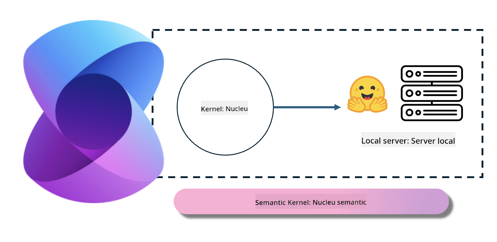
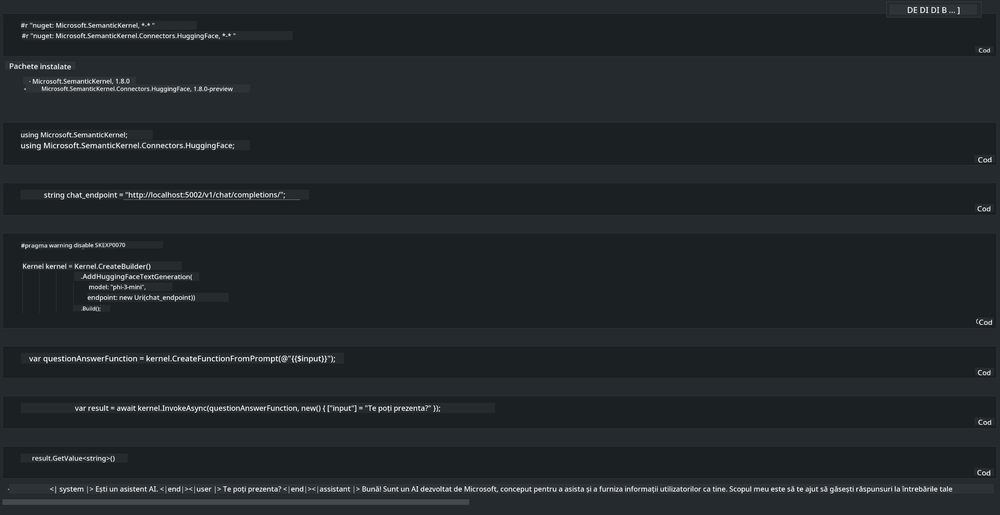

<!--
CO_OP_TRANSLATOR_METADATA:
{
  "original_hash": "bcf5dd7031db0031abdb9dd0c05ba118",
  "translation_date": "2025-05-09T12:08:59+00:00",
  "source_file": "md/01.Introduction/03/Local_Server_Inference.md",
  "language_code": "ro"
}
-->
# **Inferență Phi-3 pe Server Local**

Putem implementa Phi-3 pe un server local. Utilizatorii pot alege soluții precum [Ollama](https://ollama.com) sau [LM Studio](https://llamaedge.com), sau pot scrie propriul cod. Poți conecta serviciile locale Phi-3 prin [Semantic Kernel](https://github.com/microsoft/semantic-kernel?WT.mc_id=aiml-138114-kinfeylo) sau [Langchain](https://www.langchain.com/) pentru a construi aplicații Copilot.

## **Folosirea Semantic Kernel pentru a accesa Phi-3-mini**

În aplicația Copilot, creăm aplicații prin Semantic Kernel / LangChain. Acest tip de framework pentru aplicații este în general compatibil cu Azure OpenAI Service / modelele OpenAI și poate susține, de asemenea, modele open source de pe Hugging Face și modele locale. Ce trebuie să facem dacă vrem să folosim Semantic Kernel pentru a accesa Phi-3-mini? Folosind .NET ca exemplu, îl putem combina cu Hugging Face Connector din Semantic Kernel. Implicit, acesta corespunde modelului de pe Hugging Face (la prima utilizare, modelul va fi descărcat de pe Hugging Face, ceea ce durează destul de mult). De asemenea, poți conecta serviciul local construit. Comparativ cu cele două, recomandăm utilizarea celui din urmă deoarece oferă un grad mai mare de autonomie, mai ales în aplicațiile enterprise.

Din imagine, accesarea serviciilor locale prin Semantic Kernel poate conecta cu ușurință serverul modelului Phi-3-mini construit de tine. Iată rezultatul rulării

***Sample Code*** https://github.com/kinfey/Phi3MiniSamples/tree/main/semantickernel

**Declinare a responsabilității**:  
Acest document a fost tradus folosind serviciul de traducere AI [Co-op Translator](https://github.com/Azure/co-op-translator). Deși ne străduim pentru acuratețe, vă rugăm să rețineți că traducerile automate pot conține erori sau inexactități. Documentul original în limba sa nativă trebuie considerat sursa autorizată. Pentru informații critice, se recomandă traducerea profesională realizată de un traducător uman. Nu ne asumăm răspunderea pentru eventualele neînțelegeri sau interpretări greșite care pot rezulta din utilizarea acestei traduceri.