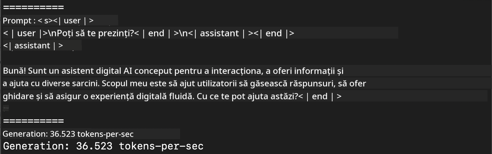

<!--
CO_OP_TRANSLATOR_METADATA:
{
  "original_hash": "dcb656f3d206fc4968e236deec5d4384",
  "translation_date": "2025-07-16T21:05:15+00:00",
  "source_file": "md/01.Introduction/03/MLX_Inference.md",
  "language_code": "ro"
}
-->
# **Inferență Phi-3 cu Apple MLX Framework**

## **Ce este MLX Framework**

MLX este un framework pentru cercetarea învățării automate pe siliciu Apple, dezvoltat de echipa de cercetare în învățare automată Apple.

MLX este creat de cercetători în învățare automată pentru cercetători în învățare automată. Framework-ul este conceput să fie ușor de utilizat, dar în același timp eficient pentru antrenarea și implementarea modelelor. Designul framework-ului este, de asemenea, simplu din punct de vedere conceptual. Ne propunem să facilităm extinderea și îmbunătățirea MLX de către cercetători, cu scopul de a explora rapid idei noi.

Modelele LLM pot fi accelerate pe dispozitivele Apple Silicon prin MLX, iar modelele pot fi rulate local foarte comod.

## **Folosirea MLX pentru inferența Phi-3-mini**

### **1. Configurează-ți mediul MLX**

1. Python 3.11.x  
2. Instalează biblioteca MLX

```bash

pip install mlx-lm

```

### **2. Rularea Phi-3-mini în Terminal cu MLX**

```bash

python -m mlx_lm.generate --model microsoft/Phi-3-mini-4k-instruct --max-token 2048 --prompt  "<|user|>\nCan you introduce yourself<|end|>\n<|assistant|>"

```

Rezultatul (mediul meu este Apple M1 Max, 64GB) este



### **3. Cuantizarea Phi-3-mini cu MLX în Terminal**

```bash

python -m mlx_lm.convert --hf-path microsoft/Phi-3-mini-4k-instruct

```

***Note:*** Modelul poate fi cuantizat prin mlx_lm.convert, iar cuantizarea implicită este INT4. Acest exemplu cuantizează Phi-3-mini în INT4.

Modelul poate fi cuantizat prin mlx_lm.convert, iar cuantizarea implicită este INT4. În acest exemplu, Phi-3-mini este cuantizat în INT4. După cuantizare, modelul va fi salvat în directorul implicit ./mlx_model

Putem testa modelul cuantizat cu MLX din terminal

```bash

python -m mlx_lm.generate --model ./mlx_model/ --max-token 2048 --prompt  "<|user|>\nCan you introduce yourself<|end|>\n<|assistant|>"

```

Rezultatul este


### **4. Rularea Phi-3-mini cu MLX în Jupyter Notebook**


***Note:*** Te rugăm să consulți acest exemplu [click aici](../../../../../code/03.Inference/MLX/MLX_DEMO.ipynb)

## **Resurse**

1. Află mai multe despre Apple MLX Framework [https://ml-explore.github.io](https://ml-explore.github.io/mlx/build/html/index.html)

2. Repozitoriu Apple MLX pe GitHub [https://github.com/ml-explore](https://github.com/ml-explore)

**Declinare de responsabilitate**:  
Acest document a fost tradus folosind serviciul de traducere AI [Co-op Translator](https://github.com/Azure/co-op-translator). Deși ne străduim pentru acuratețe, vă rugăm să rețineți că traducerile automate pot conține erori sau inexactități. Documentul original în limba sa nativă trebuie considerat sursa autorizată. Pentru informații critice, se recomandă traducerea profesională realizată de un specialist uman. Nu ne asumăm răspunderea pentru eventualele neînțelegeri sau interpretări greșite rezultate din utilizarea acestei traduceri.