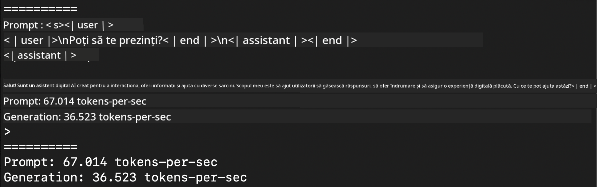
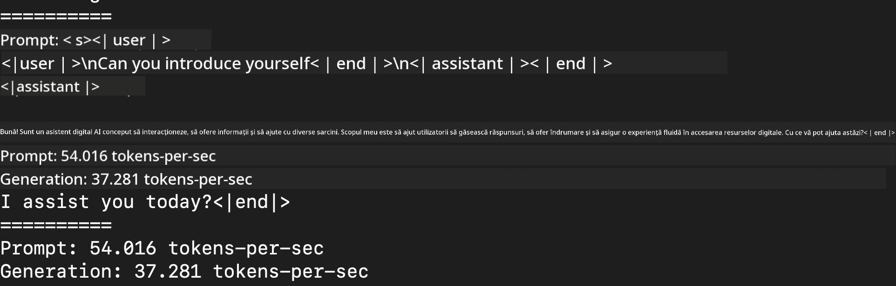
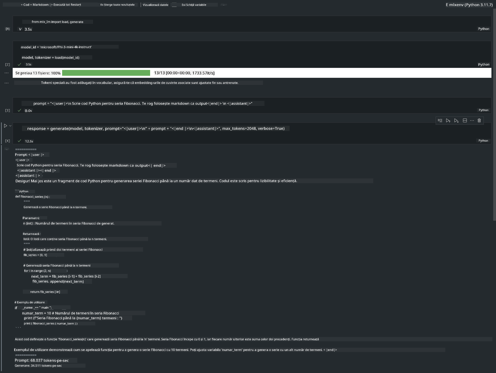

<!--
CO_OP_TRANSLATOR_METADATA:
{
  "original_hash": "dcb656f3d206fc4968e236deec5d4384",
  "translation_date": "2025-05-09T12:19:30+00:00",
  "source_file": "md/01.Introduction/03/MLX_Inference.md",
  "language_code": "ro"
}
-->
# **Inferență Phi-3 cu Apple MLX Framework**

## **Ce este MLX Framework**

MLX este un framework pentru array-uri destinat cercetării în machine learning pe Apple silicon, dezvoltat de echipa de cercetare Apple în machine learning.

MLX este creat de cercetători în machine learning pentru cercetători în machine learning. Framework-ul este conceput să fie prietenos cu utilizatorul, dar în același timp eficient pentru antrenarea și rularea modelelor. Designul framework-ului este și el simplu din punct de vedere conceptual. Ne propunem să îl facem ușor de extins și îmbunătățit de către cercetători, cu scopul de a explora rapid idei noi.

Modelele LLM pot fi accelerate pe dispozitive Apple Silicon prin MLX, iar modelele pot fi rulate local foarte convenabil.

## **Folosirea MLX pentru inferența Phi-3-mini**

### **1. Configurează-ți mediul MLX**

1. Python 3.11.x  
2. Instalează librăria MLX


```bash

pip install mlx-lm

```

### **2. Rulează Phi-3-mini în Terminal cu MLX**


```bash

python -m mlx_lm.generate --model microsoft/Phi-3-mini-4k-instruct --max-token 2048 --prompt  "<|user|>\nCan you introduce yourself<|end|>\n<|assistant|>"

```

Rezultatul (mediul meu este Apple M1 Max, 64GB) este



### **3. Quantizarea Phi-3-mini cu MLX în Terminal**


```bash

python -m mlx_lm.convert --hf-path microsoft/Phi-3-mini-4k-instruct

```

***Note:*** Modelul poate fi quantizat folosind mlx_lm.convert, iar quantizarea implicită este INT4. Acest exemplu quantizează Phi-3-mini la INT4.

Modelul poate fi quantizat prin mlx_lm.convert, iar quantizarea implicită este INT4. În acest exemplu se quantizează Phi-3-mini în INT4. După quantizare, modelul va fi salvat în directorul implicit ./mlx_model

Putem testa modelul quantizat cu MLX din terminal


```bash

python -m mlx_lm.generate --model ./mlx_model/ --max-token 2048 --prompt  "<|user|>\nCan you introduce yourself<|end|>\n<|assistant|>"

```

Rezultatul este




### **4. Rulează Phi-3-mini cu MLX în Jupyter Notebook**




***Note:*** Te rugăm să consulți acest exemplu [click this link](../../../../../code/03.Inference/MLX/MLX_DEMO.ipynb)


## **Resurse**

1. Află mai multe despre Apple MLX Framework [https://ml-explore.github.io](https://ml-explore.github.io/mlx/build/html/index.html)

2. Repozitoriu Apple MLX pe GitHub [https://github.com/ml-explore](https://github.com/ml-explore)

**Declinare a responsabilității**:  
Acest document a fost tradus folosind serviciul de traducere AI [Co-op Translator](https://github.com/Azure/co-op-translator). Deși ne străduim pentru acuratețe, vă rugăm să rețineți că traducerile automate pot conține erori sau inexactități. Documentul original, în limba sa nativă, trebuie considerat sursa autorizată. Pentru informații critice, se recomandă traducerea profesională realizată de un specialist uman. Nu ne asumăm răspunderea pentru eventualele neînțelegeri sau interpretări greșite care pot apărea în urma utilizării acestei traduceri.