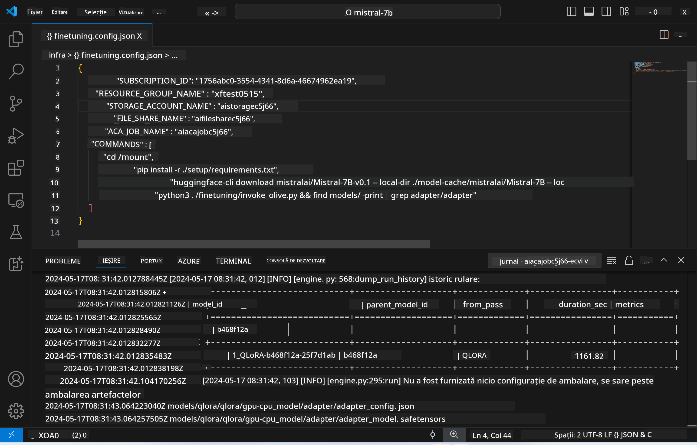
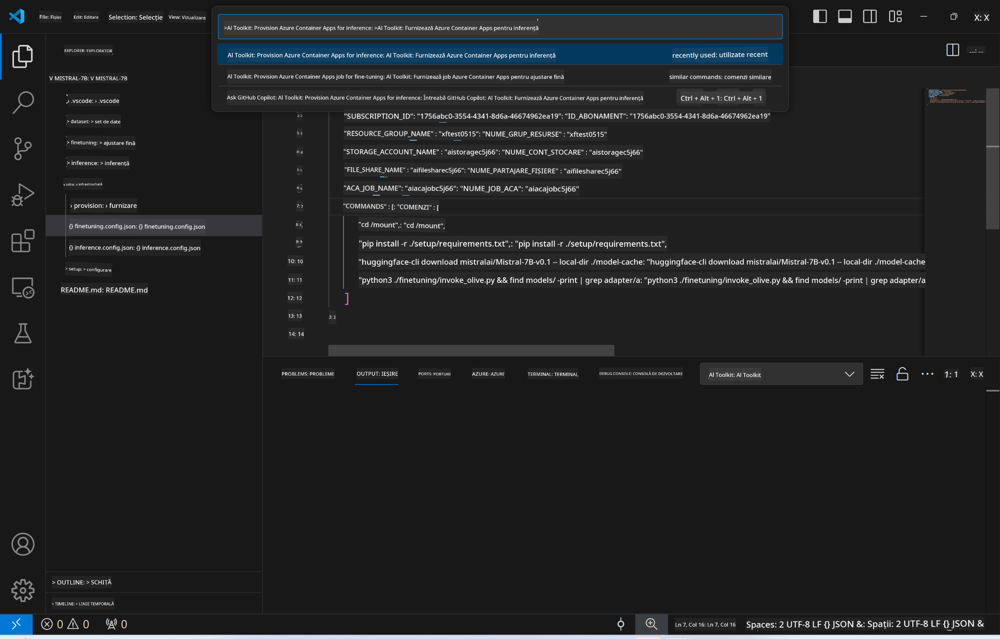
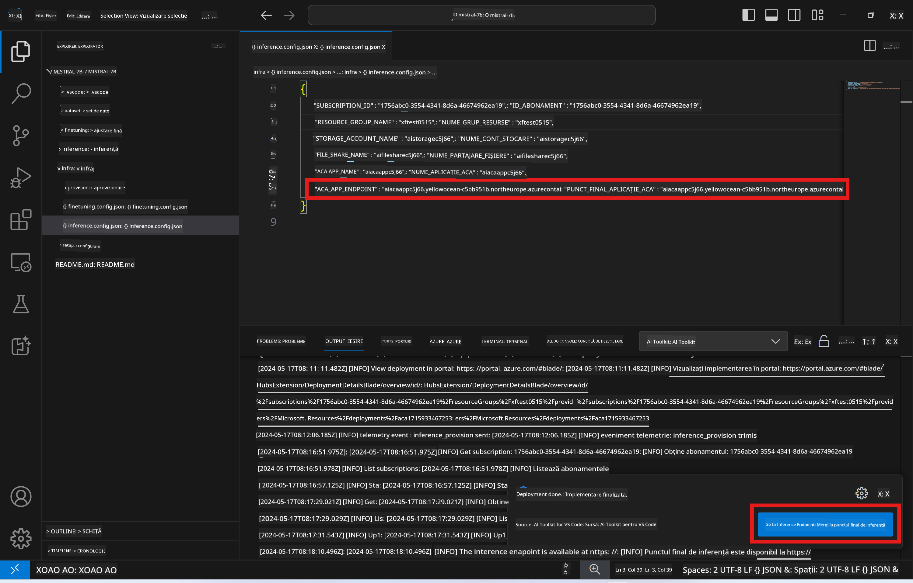

<!--
CO_OP_TRANSLATOR_METADATA:
{
  "original_hash": "a54cd3d65b6963e4e8ce21e143c3ab04",
  "translation_date": "2025-07-16T21:22:13+00:00",
  "source_file": "md/01.Introduction/03/Remote_Interence.md",
  "language_code": "ro"
}
-->
# Inferență la distanță cu modelul ajustat fin

După ce adaptoarele sunt antrenate în mediul la distanță, folosește o aplicație simplă Gradio pentru a interacționa cu modelul.



### Provisionarea resurselor Azure  
Trebuie să configurezi resursele Azure pentru inferență la distanță executând comanda `AI Toolkit: Provision Azure Container Apps for inference` din paleta de comenzi. În timpul acestei configurări, ți se va cere să selectezi abonamentul Azure și grupul de resurse.  

   
Implicit, abonamentul și grupul de resurse pentru inferență ar trebui să fie aceleași cu cele folosite pentru ajustarea fină. Inferența va folosi același mediu Azure Container App și va accesa modelul și adaptorul de model stocate în Azure Files, generate în timpul etapei de ajustare fină.

## Folosirea AI Toolkit

### Implementare pentru inferență  
Dacă dorești să modifici codul de inferență sau să reîncarci modelul de inferență, execută comanda `AI Toolkit: Deploy for inference`. Aceasta va sincroniza codul tău cel mai recent cu ACA și va reporni replica.


După finalizarea cu succes a implementării, modelul este gata pentru evaluare folosind acest endpoint.

### Accesarea API-ului de inferență

Poți accesa API-ul de inferență făcând clic pe butonul „*Go to Inference Endpoint*” afișat în notificarea VSCode. Alternativ, endpoint-ul web API poate fi găsit sub `ACA_APP_ENDPOINT` în fișierul `./infra/inference.config.json` și în panoul de ieșire.



> **Note:** Endpoint-ul de inferență poate dura câteva minute până devine complet operațional.

## Componentele de inferență incluse în șablon

| Folder | Conținut |
| ------ |--------- |
| `infra` | Conține toate configurațiile necesare pentru operațiuni la distanță. |
| `infra/provision/inference.parameters.json` | Conține parametrii pentru șabloanele bicep, folosiți pentru provisionarea resurselor Azure pentru inferență. |
| `infra/provision/inference.bicep` | Conține șabloanele pentru provisionarea resurselor Azure pentru inferență. |
| `infra/inference.config.json` | Fișierul de configurare, generat de comanda `AI Toolkit: Provision Azure Container Apps for inference`. Este folosit ca input pentru alte comenzi din paleta de comenzi la distanță. |

### Folosirea AI Toolkit pentru configurarea provisionării resurselor Azure  
Configurează [AI Toolkit](https://marketplace.visualstudio.com/items?itemName=ms-windows-ai-studio.windows-ai-studio)

Comanda `Provision Azure Container Apps for inference`.

Poți găsi parametrii de configurare în fișierul `./infra/provision/inference.parameters.json`. Iată detaliile:  
| Parametru | Descriere |
| --------- |------------ |
| `defaultCommands` | Comenzile pentru inițierea unui API web. |
| `maximumInstanceCount` | Setează capacitatea maximă a instanțelor GPU. |
| `location` | Locația unde sunt provisionate resursele Azure. Valoarea implicită este aceeași cu locația grupului de resurse ales. |
| `storageAccountName`, `fileShareName`, `acaEnvironmentName`, `acaEnvironmentStorageName`, `acaAppName`, `acaLogAnalyticsName` | Acești parametri sunt folosiți pentru denumirea resurselor Azure pentru provisionare. Implicit, vor fi aceleași cu numele resurselor folosite la ajustarea fină. Poți introduce un nume nou, neutilizat, pentru a crea resurse cu denumiri personalizate sau poți introduce numele unei resurse Azure existente dacă preferi să o folosești. Pentru detalii, consultă secțiunea [Using existing Azure Resources](../../../../../md/01.Introduction/03). |

### Folosirea resurselor Azure existente

Implicit, provisionarea pentru inferență folosește același mediu Azure Container App, cont de stocare, Azure File Share și Azure Log Analytics folosite la ajustarea fină. Se creează o Azure Container App separată doar pentru API-ul de inferență.

Dacă ai personalizat resursele Azure în timpul ajustării fine sau dorești să folosești propriile resurse Azure existente pentru inferență, specifică numele acestora în fișierul `./infra/inference.parameters.json`. Apoi, rulează comanda `AI Toolkit: Provision Azure Container Apps for inference` din paleta de comenzi. Aceasta va actualiza resursele specificate și va crea cele care lipsesc.

De exemplu, dacă ai un mediu Azure container existent, fișierul tău `./infra/finetuning.parameters.json` ar trebui să arate astfel:

```json
{
    "$schema": "https://schema.management.azure.com/schemas/2019-04-01/deploymentParameters.json#",
    "contentVersion": "1.0.0.0",
    "parameters": {
      ...
      "acaEnvironmentName": {
        "value": "<your-aca-env-name>"
      },
      "acaEnvironmentStorageName": {
        "value": null
      },
      ...
    }
  }
```

### Provisionare manuală  
Dacă preferi să configurezi manual resursele Azure, poți folosi fișierele bicep din folderele `./infra/provision`. Dacă ai configurat deja toate resursele Azure fără a folosi paleta de comenzi AI Toolkit, poți introduce pur și simplu numele resurselor în fișierul `inference.config.json`.

De exemplu:

```json
{
  "SUBSCRIPTION_ID": "<your-subscription-id>",
  "RESOURCE_GROUP_NAME": "<your-resource-group-name>",
  "STORAGE_ACCOUNT_NAME": "<your-storage-account-name>",
  "FILE_SHARE_NAME": "<your-file-share-name>",
  "ACA_APP_NAME": "<your-aca-name>",
  "ACA_APP_ENDPOINT": "<your-aca-endpoint>"
}
```

**Declinare a responsabilității**:  
Acest document a fost tradus folosind serviciul de traducere AI [Co-op Translator](https://github.com/Azure/co-op-translator). Deși ne străduim pentru acuratețe, vă rugăm să rețineți că traducerile automate pot conține erori sau inexactități. Documentul original în limba sa nativă trebuie considerat sursa autorizată. Pentru informații critice, se recomandă traducerea profesională realizată de un specialist uman. Nu ne asumăm răspunderea pentru eventualele neînțelegeri sau interpretări greșite rezultate din utilizarea acestei traduceri.