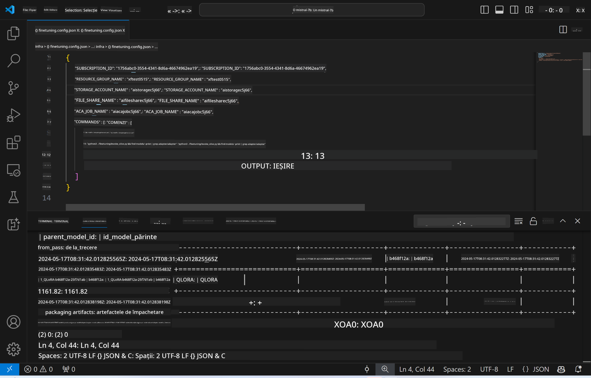
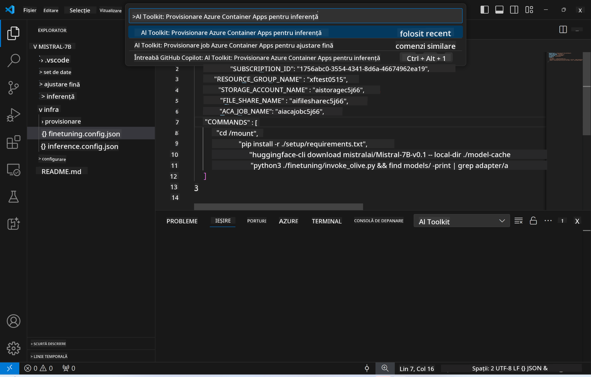
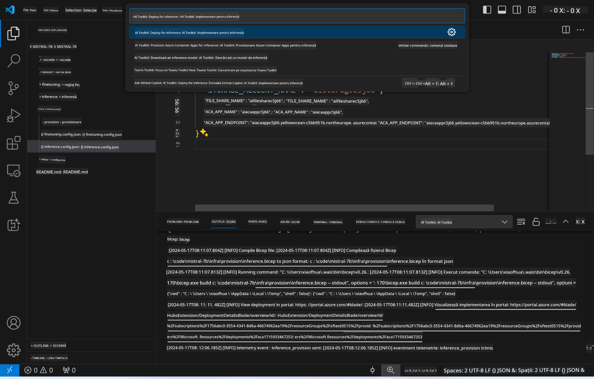

<!--
CO_OP_TRANSLATOR_METADATA:
{
  "original_hash": "a54cd3d65b6963e4e8ce21e143c3ab04",
  "translation_date": "2025-05-09T12:46:30+00:00",
  "source_file": "md/01.Introduction/03/Remote_Interence.md",
  "language_code": "ro"
}
-->
# Inferență la distanță cu modelul ajustat fin

După ce adaptoarele sunt antrenate în mediul remote, folosește o aplicație simplă Gradio pentru a interacționa cu modelul.



### Provisionarea resurselor Azure  
Trebuie să configurezi resursele Azure pentru inferență la distanță executând `AI Toolkit: Provision Azure Container Apps for inference` din paleta de comenzi. În timpul acestei configurări, ți se va cere să selectezi abonamentul Azure și grupul de resurse.  


Implicit, abonamentul și grupul de resurse pentru inferență ar trebui să fie aceleași ca cele folosite pentru fine-tuning. Inferența va folosi același Azure Container App Environment și va accesa modelul și adaptorul de model stocate în Azure Files, generate în timpul etapei de fine-tuning.

## Folosirea AI Toolkit

### Implementare pentru inferență  
Dacă dorești să modifici codul de inferență sau să reîncarci modelul de inferență, execută comanda `AI Toolkit: Deploy for inference`. Aceasta va sincroniza codul tău cel mai recent cu ACA și va reporni replica.



După finalizarea cu succes a implementării, modelul este gata pentru evaluare folosind acest endpoint.

### Accesarea API-ului de inferență

Poți accesa API-ul de inferență făcând clic pe butonul "*Go to Inference Endpoint*" afișat în notificarea VSCode. Alternativ, endpoint-ul web API poate fi găsit sub `ACA_APP_ENDPOINT` în `./infra/inference.config.json` și în panoul de ieșire.


> **Note:** Endpoint-ul de inferență poate necesita câteva minute pentru a deveni complet operațional.

## Componentele de inferență incluse în șablon

| Folder | Conținut |
| ------ |--------- |
| `infra` | Conține toate configurațiile necesare pentru operațiuni la distanță. |
| `infra/provision/inference.parameters.json` | Conține parametrii pentru șabloanele bicep, folosite pentru provisionarea resurselor Azure pentru inferență. |
| `infra/provision/inference.bicep` | Conține șabloanele pentru provisionarea resurselor Azure pentru inferență. |
| `infra/inference.config.json` | Fișierul de configurare, generat de comanda `AI Toolkit: Provision Azure Container Apps for inference`. Este folosit ca input pentru alte palete de comenzi remote. |

### Folosirea AI Toolkit pentru configurarea provisionării resurselor Azure  
Configurează [AI Toolkit](https://marketplace.visualstudio.com/items?itemName=ms-windows-ai-studio.windows-ai-studio)

Provisionează Azure Container Apps pentru inferență` command.

You can find configuration parameters in `./infra/provision/inference.parameters.json` file. Here are the details:
| Parameter | Description |
| --------- |------------ |
| `defaultCommands` | This is the commands to initiate a web API. |
| `maximumInstanceCount` | This parameter sets the maximum capacity of GPU instances. |
| `location` | This is the location where Azure resources are provisioned. The default value is the same as the chosen resource group's location. |
| `storageAccountName`, `fileShareName` `acaEnvironmentName`, `acaEnvironmentStorageName`, `acaAppName`,  `acaLogAnalyticsName` | These parameters are used to name the Azure resources for provision. By default, they will be same to the fine-tuning resource name. You can input a new, unused resource name to create your own custom-named resources, or you can input the name of an already existing Azure resource if you'd prefer to use that. For details, refer to the section [Using existing Azure Resources](../../../../../md/01.Introduction/03). |

### Using Existing Azure Resources

By default, the inference provision use the same Azure Container App Environment, Storage Account, Azure File Share, and Azure Log Analytics that were used for fine-tuning. A separate Azure Container App is created solely for the inference API. 

If you have customized the Azure resources during the fine-tuning step or want to use your own existing Azure resources for inference, specify their names in the `./infra/inference.parameters.json`. Apoi, rulează comanda `AI Toolkit: Provision Azure Container Apps for inference` din paleta de comenzi. Aceasta actualizează resursele specificate și creează cele care lipsesc.

De exemplu, dacă ai deja un mediu Azure container, fișierul tău `./infra/finetuning.parameters.json` ar trebui să arate astfel:

```json
{
    "$schema": "https://schema.management.azure.com/schemas/2019-04-01/deploymentParameters.json#",
    "contentVersion": "1.0.0.0",
    "parameters": {
      ...
      "acaEnvironmentName": {
        "value": "<your-aca-env-name>"
      },
      "acaEnvironmentStorageName": {
        "value": null
      },
      ...
    }
  }
```

### Provisionare manuală  
Dacă preferi să configurezi manual resursele Azure, poți folosi fișierele bicep furnizate în `./infra/provision` folders. If you have already set up and configured all the Azure resources without using the AI Toolkit command palette, you can simply enter the resource names in the `inference.config.json`.

De exemplu:

```json
{
  "SUBSCRIPTION_ID": "<your-subscription-id>",
  "RESOURCE_GROUP_NAME": "<your-resource-group-name>",
  "STORAGE_ACCOUNT_NAME": "<your-storage-account-name>",
  "FILE_SHARE_NAME": "<your-file-share-name>",
  "ACA_APP_NAME": "<your-aca-name>",
  "ACA_APP_ENDPOINT": "<your-aca-endpoint>"
}
```

**Declinare a responsabilității**:  
Acest document a fost tradus folosind serviciul de traducere AI [Co-op Translator](https://github.com/Azure/co-op-translator). Deși ne străduim pentru acuratețe, vă rugăm să rețineți că traducerile automate pot conține erori sau inexactități. Documentul original în limba sa nativă trebuie considerat sursa autoritară. Pentru informații critice, se recomandă traducerea profesională realizată de un specialist uman. Nu ne asumăm răspunderea pentru eventualele neînțelegeri sau interpretări greșite care pot rezulta din utilizarea acestei traduceri.