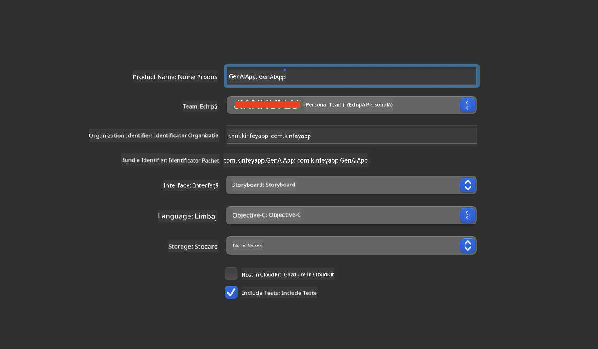
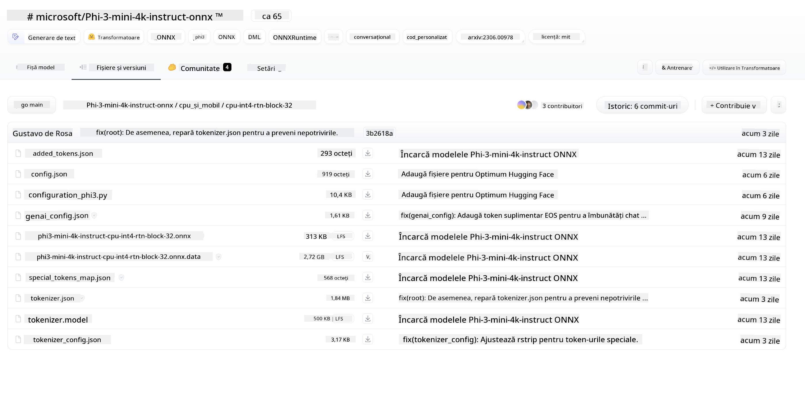
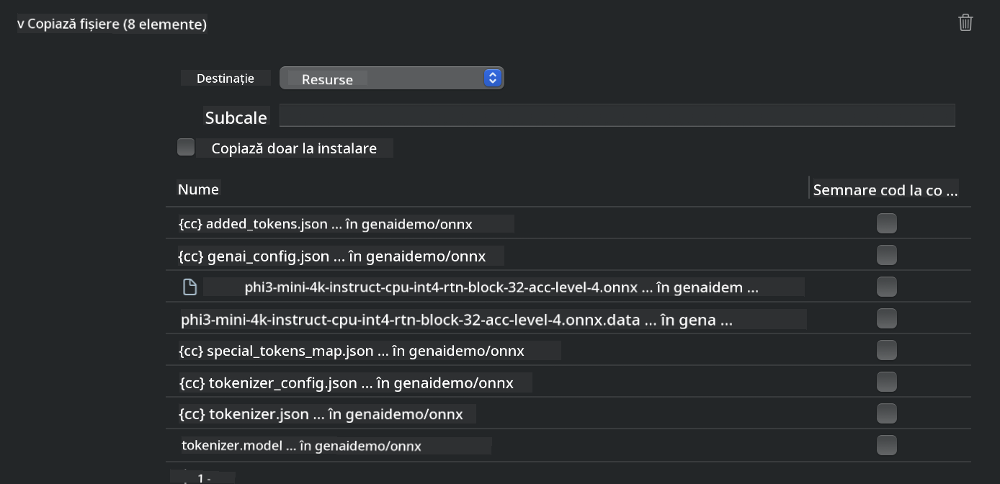
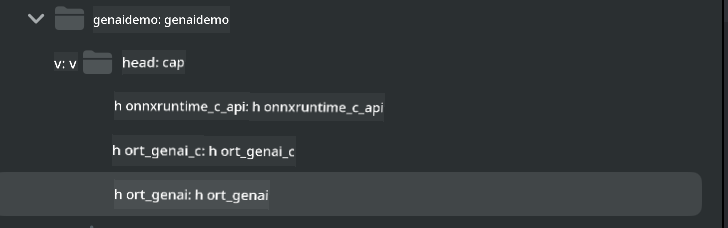
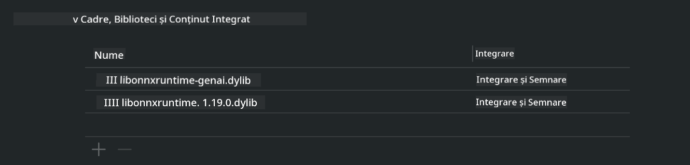
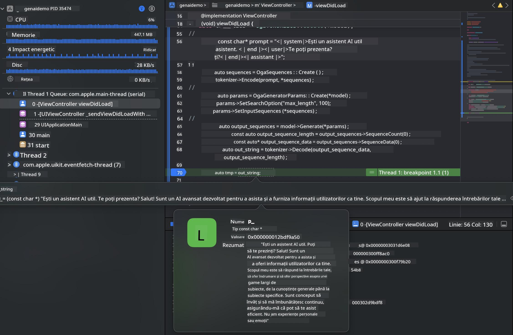

<!--
CO_OP_TRANSLATOR_METADATA:
{
  "original_hash": "82af197df38d25346a98f1f0e84d1698",
  "translation_date": "2025-05-09T11:06:03+00:00",
  "source_file": "md/01.Introduction/03/iOS_Inference.md",
  "language_code": "ro"
}
-->
# **Inferența Phi-3 pe iOS**

Phi-3-mini este o nouă serie de modele de la Microsoft care permite implementarea Large Language Models (LLMs) pe dispozitive edge și IoT. Phi-3-mini este disponibil pentru implementări pe iOS, Android și dispozitive Edge, permițând astfel utilizarea AI generativ în medii BYOD. Exemplul următor arată cum să implementezi Phi-3-mini pe iOS.

## **1. Pregătire**

- **a.** macOS 14+
- **b.** Xcode 15+
- **c.** iOS SDK 17.x (iPhone 14 A16 sau mai nou)
- **d.** Instalează Python 3.10+ (se recomandă Conda)
- **e.** Instalează biblioteca Python: `python-flatbuffers`
- **f.** Instalează CMake

### Semantic Kernel și Inferență

Semantic Kernel este un cadru de aplicații care permite crearea de aplicații compatibile cu Azure OpenAI Service, modelele OpenAI și chiar modele locale. Accesarea serviciilor locale prin Semantic Kernel facilitează integrarea cu serverul tău self-hosted pentru modelul Phi-3-mini.

### Apelarea modelelor cuantificate cu Ollama sau LlamaEdge

Mulți utilizatori preferă să folosească modele cuantificate pentru a rula modelele local. [Ollama](https://ollama.com) și [LlamaEdge](https://llamaedge.com) permit utilizatorilor să apeleze diferite modele cuantificate:

#### **Ollama**

Poți rula `ollama run phi3` direct sau îl poți configura offline. Creează un Modelfile cu calea către fișierul tău `gguf`. Cod exemplu pentru rularea modelului Phi-3-mini cuantificat:

```gguf
FROM {Add your gguf file path}
TEMPLATE \"\"\"<|user|> .Prompt<|end|> <|assistant|>\"\"\"
PARAMETER stop <|end|>
PARAMETER num_ctx 4096
```

#### **LlamaEdge**

Dacă vrei să folosești `gguf` atât în cloud, cât și pe dispozitive edge simultan, LlamaEdge este o opțiune excelentă.

## **2. Compilarea ONNX Runtime pentru iOS**

```bash

git clone https://github.com/microsoft/onnxruntime.git

cd onnxruntime

./build.sh --build_shared_lib --ios --skip_tests --parallel --build_dir ./build_ios --ios --apple_sysroot iphoneos --osx_arch arm64 --apple_deploy_target 17.5 --cmake_generator Xcode --config Release

cd ../

```

### **Notă**

- **a.** Înainte de compilare, asigură-te că Xcode este configurat corect și setează-l ca director activ pentru dezvoltare în terminal:

    ```bash
    sudo xcode-select -switch /Applications/Xcode.app/Contents/Developer
    ```

- **b.** ONNX Runtime trebuie compilat pentru diferite platforme. Pentru iOS, poți compila pentru `arm64` or `x86_64`.

- **c.** Se recomandă folosirea celei mai recente versiuni iOS SDK pentru compilare. Totuși, poți folosi și o versiune mai veche dacă ai nevoie de compatibilitate cu SDK-uri anterioare.

## **3. Compilarea Generative AI cu ONNX Runtime pentru iOS**

> **Notă:** Deoarece Generative AI cu ONNX Runtime este în stadiu de preview, te rugăm să fii conștient de posibile modificări.

```bash

git clone https://github.com/microsoft/onnxruntime-genai
 
cd onnxruntime-genai
 
mkdir ort
 
cd ort
 
mkdir include
 
mkdir lib
 
cd ../
 
cp ../onnxruntime/include/onnxruntime/core/session/onnxruntime_c_api.h ort/include
 
cp ../onnxruntime/build_ios/Release/Release-iphoneos/libonnxruntime*.dylib* ort/lib
 
export OPENCV_SKIP_XCODEBUILD_FORCE_TRYCOMPILE_DEBUG=1
 
python3 build.py --parallel --build_dir ./build_ios --ios --ios_sysroot iphoneos --ios_arch arm64 --ios_deployment_target 17.5 --cmake_generator Xcode --cmake_extra_defines CMAKE_XCODE_ATTRIBUTE_CODE_SIGNING_ALLOWED=NO

```

## **4. Crearea unei aplicații în Xcode**

Am ales Objective-C ca metodă de dezvoltare a aplicației, deoarece folosind Generative AI cu ONNX Runtime C++ API, Objective-C oferă o compatibilitate mai bună. Desigur, poți realiza apelurile aferente și prin bridging cu Swift.



## **5. Copierea modelului ONNX cuantificat INT4 în proiectul aplicației**

Trebuie să importăm modelul cuantificat INT4 în format ONNX, care trebuie descărcat în prealabil.



După descărcare, trebuie să îl adaugi în directorul Resources al proiectului din Xcode.



## **6. Adăugarea API-ului C++ în ViewControllers**

> **Notă:**

- **a.** Adaugă fișierele header C++ corespunzătoare în proiect.

  

- **b.** Include `onnxruntime-genai` dynamic library in Xcode.

  

- **c.** Use the C Samples code for testing. You can also add additional features like ChatUI for more functionality.

- **d.** Since you need to use C++ in your project, rename `ViewController.m` to `ViewController.mm` pentru a activa suportul Objective-C++.

```objc

    NSString *llmPath = [[NSBundle mainBundle] resourcePath];
    char const *modelPath = llmPath.cString;

    auto model =  OgaModel::Create(modelPath);

    auto tokenizer = OgaTokenizer::Create(*model);

    const char* prompt = "<|system|>You are a helpful AI assistant.<|end|><|user|>Can you introduce yourself?<|end|><|assistant|>";

    auto sequences = OgaSequences::Create();
    tokenizer->Encode(prompt, *sequences);

    auto params = OgaGeneratorParams::Create(*model);
    params->SetSearchOption("max_length", 100);
    params->SetInputSequences(*sequences);

    auto output_sequences = model->Generate(*params);
    const auto output_sequence_length = output_sequences->SequenceCount(0);
    const auto* output_sequence_data = output_sequences->SequenceData(0);
    auto out_string = tokenizer->Decode(output_sequence_data, output_sequence_length);
    
    auto tmp = out_string;

```

## **7. Rularea aplicației**

După ce configurarea este completă, poți rula aplicația pentru a vedea rezultatele inferenței modelului Phi-3-mini.



Pentru mai mult cod exemplu și instrucțiuni detaliate, vizitează [Phi-3 Mini Samples repository](https://github.com/Azure-Samples/Phi-3MiniSamples/tree/main/ios).

**Declinare a responsabilității**:  
Acest document a fost tradus folosind serviciul de traducere automată AI [Co-op Translator](https://github.com/Azure/co-op-translator). Deși ne străduim pentru acuratețe, vă rugăm să țineți cont că traducerile automate pot conține erori sau inexactități. Documentul original în limba sa nativă trebuie considerat sursa autoritară. Pentru informații critice, se recomandă traducerea profesională realizată de un specialist uman. Nu ne asumăm răspunderea pentru eventualele neînțelegeri sau interpretări greșite rezultate din utilizarea acestei traduceri.