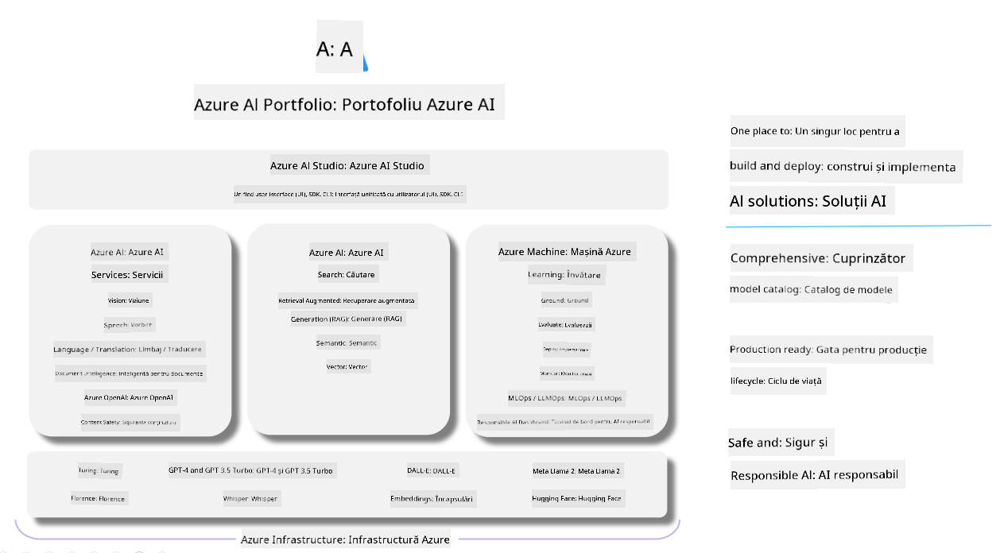

<!--
CO_OP_TRANSLATOR_METADATA:
{
  "original_hash": "7b4235159486df4000e16b7b46ddfec3",
  "translation_date": "2025-05-09T15:03:51+00:00",
  "source_file": "md/01.Introduction/05/AIFoundry.md",
  "language_code": "ro"
}
-->
# **Folosirea Azure AI Foundry pentru evaluare**

Cum să evaluezi aplicația ta generativă AI folosind [Azure AI Foundry](https://ai.azure.com?WT.mc_id=aiml-138114-kinfeylo). Indiferent dacă analizezi conversații cu un singur schimb sau cu mai multe schimburi, Azure AI Foundry oferă instrumente pentru evaluarea performanței și siguranței modelului.

## Cum să evaluezi aplicațiile generative AI cu Azure AI Foundry
Pentru instrucțiuni detaliate, consultă [Documentația Azure AI Foundry](https://learn.microsoft.com/azure/ai-studio/how-to/evaluate-generative-ai-app?WT.mc_id=aiml-138114-kinfeylo)

Iată pașii pentru a începe:

## Evaluarea modelelor Generative AI în Azure AI Foundry

**Prerechizite**

- Un set de date de test în format CSV sau JSON.
- Un model generativ AI implementat (cum ar fi Phi-3, GPT 3.5, GPT 4 sau modelele Davinci).
- Un runtime cu o instanță de calcul pentru a rula evaluarea.

## Metrici de evaluare încorporate

Azure AI Foundry îți permite să evaluezi atât conversații cu un singur schimb, cât și conversații complexe, cu mai multe schimburi.
Pentru scenariile Retrieval Augmented Generation (RAG), unde modelul se bazează pe date specifice, poți evalua performanța folosind metrici de evaluare încorporate.
De asemenea, poți evalua scenarii generale de răspuns la întrebări cu un singur schimb (non-RAG).

## Crearea unei rulări de evaluare

Din interfața Azure AI Foundry, navighează fie la pagina Evaluate, fie la pagina Prompt Flow.
Urmează expertul de creare a evaluării pentru a configura o rulare de evaluare. Poți oferi un nume opțional evaluării tale.
Selectează scenariul care se potrivește obiectivelor aplicației tale.
Alege unul sau mai mulți metrici de evaluare pentru a analiza rezultatul modelului.

## Flux de evaluare personalizat (Opțional)

Pentru o flexibilitate mai mare, poți crea un flux de evaluare personalizat. Personalizează procesul de evaluare în funcție de cerințele tale specifice.

## Vizualizarea rezultatelor

După rularea evaluării, înregistrează, vizualizează și analizează metrici detaliați în Azure AI Foundry. Obține informații despre capacitățile și limitările aplicației tale.

**Note** Azure AI Foundry este momentan în previzualizare publică, așa că folosește-l pentru experimente și dezvoltare. Pentru sarcini de producție, ia în considerare alte opțiuni. Explorează documentația oficială [AI Foundry](https://learn.microsoft.com/azure/ai-studio/?WT.mc_id=aiml-138114-kinfeylo) pentru mai multe detalii și instrucțiuni pas cu pas.

**Declinare a responsabilității**:  
Acest document a fost tradus folosind serviciul de traducere automată AI [Co-op Translator](https://github.com/Azure/co-op-translator). Deși ne străduim pentru acuratețe, vă rugăm să rețineți că traducerile automate pot conține erori sau inexactități. Documentul original în limba sa nativă trebuie considerat sursa autorizată. Pentru informații critice, se recomandă traducerea profesională realizată de un specialist uman. Nu ne asumăm responsabilitatea pentru eventualele neînțelegeri sau interpretări greșite care pot apărea în urma utilizării acestei traduceri.