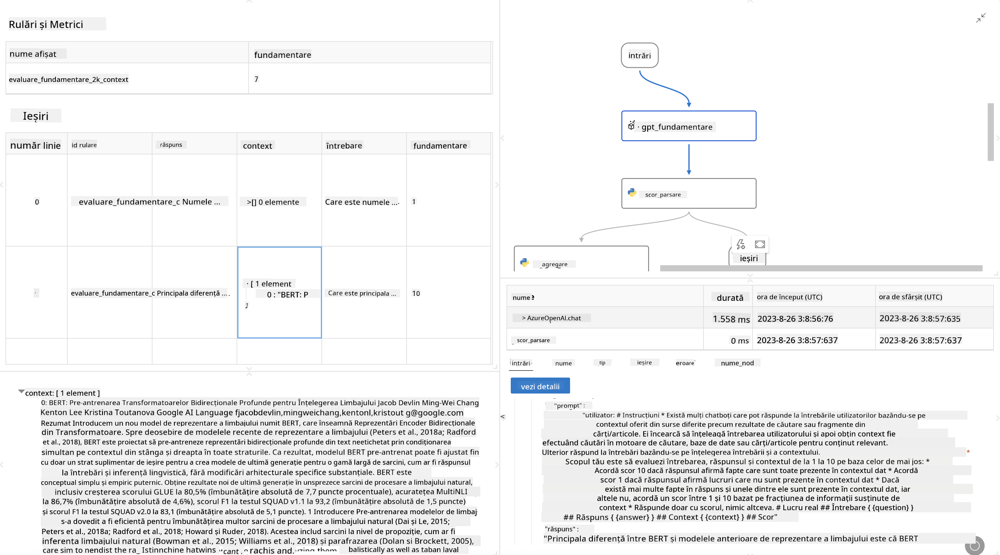

<!--
CO_OP_TRANSLATOR_METADATA:
{
  "original_hash": "3cbe7629d254f1043193b7fe22524d55",
  "translation_date": "2025-07-16T22:44:34+00:00",
  "source_file": "md/01.Introduction/05/Promptflow.md",
  "language_code": "ro"
}
-->
# **Introduceți Promptflow**

[Microsoft Prompt Flow](https://microsoft.github.io/promptflow/index.html?WT.mc_id=aiml-138114-kinfeylo) este un instrument vizual de automatizare a fluxurilor de lucru care permite utilizatorilor să creeze fluxuri automate folosind șabloane predefinite și conectori personalizați. Este conceput pentru a ajuta dezvoltatorii și analiștii de business să construiască rapid procese automate pentru sarcini precum gestionarea datelor, colaborarea și optimizarea proceselor. Cu Prompt Flow, utilizatorii pot conecta cu ușurință diferite servicii, aplicații și sisteme și pot automatiza procese de business complexe.

Microsoft Prompt Flow este proiectat să eficientizeze ciclul complet de dezvoltare a aplicațiilor AI bazate pe Large Language Models (LLMs). Indiferent dacă ideeați, prototipați, testați, evaluați sau implementați aplicații bazate pe LLM, Prompt Flow simplifică procesul și vă permite să construiți aplicații LLM de calitate pentru producție.

## Iată principalele caracteristici și beneficii ale utilizării Microsoft Prompt Flow:

**Experiență Interactivă de Autoriat**

Prompt Flow oferă o reprezentare vizuală a structurii fluxului dvs., facilitând înțelegerea și navigarea proiectelor.
Oferă o experiență de codare asemănătoare unui notebook pentru dezvoltarea și depanarea eficientă a fluxurilor.

**Variante de Prompt și Ajustare**

Creați și comparați mai multe variante de prompt pentru a facilita un proces iterativ de rafinare. Evaluați performanța diferitelor prompturi și alegeți cele mai eficiente.

**Fluxuri de Evaluare Încorporate**

Evaluați calitatea și eficiența prompturilor și fluxurilor folosind instrumentele de evaluare încorporate.
Înțelegeți cât de bine performează aplicațiile dvs. bazate pe LLM.

**Resurse Complete**

Prompt Flow include o bibliotecă de instrumente, exemple și șabloane încorporate. Aceste resurse servesc ca punct de plecare pentru dezvoltare, inspiră creativitatea și accelerează procesul.

**Colaborare și Pregătire pentru Mediul Enterprise**

Susține colaborarea în echipă permițând mai multor utilizatori să lucreze împreună la proiecte de inginerie a prompturilor.
Mențineți controlul versiunilor și partajați cunoștințe eficient. Simplificați întregul proces de inginerie a prompturilor, de la dezvoltare și evaluare până la implementare și monitorizare.

## Evaluarea în Prompt Flow

În Microsoft Prompt Flow, evaluarea joacă un rol esențial în aprecierea performanței modelelor AI. Să explorăm cum puteți personaliza fluxurile și metricile de evaluare în Prompt Flow:

**Înțelegerea Evaluării în Prompt Flow**

În Prompt Flow, un flux reprezintă o secvență de noduri care procesează intrarea și generează ieșirea. Fluxurile de evaluare sunt tipuri speciale de fluxuri concepute pentru a aprecia performanța unei execuții pe baza unor criterii și obiective specifice.

**Caracteristici cheie ale fluxurilor de evaluare**

De obicei, acestea rulează după fluxul testat, folosind ieșirile acestuia. Calculează scoruri sau metrici pentru a măsura performanța fluxului testat. Metricile pot include acuratețe, scoruri de relevanță sau alte măsuri relevante.

### Personalizarea Fluxurilor de Evaluare

**Definirea Intrărilor**

Fluxurile de evaluare trebuie să primească ieșirile execuției testate. Definiți intrările similar cu fluxurile standard.
De exemplu, dacă evaluați un flux QnA, denumiți o intrare „answer”. Dacă evaluați un flux de clasificare, denumiți o intrare „category”. Pot fi necesare și intrări cu adevărul de bază (de exemplu, etichete reale).

**Ieșiri și Metrici**

Fluxurile de evaluare produc rezultate care măsoară performanța fluxului testat. Metricile pot fi calculate folosind Python sau LLM. Folosiți funcția log_metric() pentru a înregistra metricile relevante.

**Utilizarea Fluxurilor de Evaluare Personalizate**

Dezvoltați propriul flux de evaluare adaptat sarcinilor și obiectivelor dvs. personalizați metricile în funcție de scopurile evaluării.
Aplicați acest flux de evaluare personalizat pentru rulări în loturi, pentru testări la scară largă.

## Metode de Evaluare Încorporate

Prompt Flow oferă și metode de evaluare încorporate.
Puteți trimite rulări în lot și folosi aceste metode pentru a evalua cât de bine performează fluxul dvs. cu seturi mari de date.
Vizualizați rezultatele evaluării, comparați metricile și iterați după necesitate.
Rețineți că evaluarea este esențială pentru a vă asigura că modelele AI îndeplinesc criteriile și obiectivele dorite. Explorați documentația oficială pentru instrucțiuni detaliate despre dezvoltarea și utilizarea fluxurilor de evaluare în Microsoft Prompt Flow.

Pe scurt, Microsoft Prompt Flow oferă dezvoltatorilor posibilitatea de a crea aplicații LLM de înaltă calitate, simplificând ingineria prompturilor și oferind un mediu robust de dezvoltare. Dacă lucrați cu LLM-uri, Prompt Flow este un instrument valoros de explorat. Consultați [Prompt Flow Evaluation Documents](https://learn.microsoft.com/azure/machine-learning/prompt-flow/how-to-develop-an-evaluation-flow?view=azureml-api-2?WT.mc_id=aiml-138114-kinfeylo) pentru instrucțiuni detaliate despre dezvoltarea și utilizarea fluxurilor de evaluare în Microsoft Prompt Flow.

**Declinare de responsabilitate**:  
Acest document a fost tradus folosind serviciul de traducere AI [Co-op Translator](https://github.com/Azure/co-op-translator). Deși ne străduim pentru acuratețe, vă rugăm să rețineți că traducerile automate pot conține erori sau inexactități. Documentul original în limba sa nativă trebuie considerat sursa autorizată. Pentru informații critice, se recomandă traducerea profesională realizată de un specialist uman. Nu ne asumăm răspunderea pentru eventualele neînțelegeri sau interpretări greșite rezultate din utilizarea acestei traduceri.