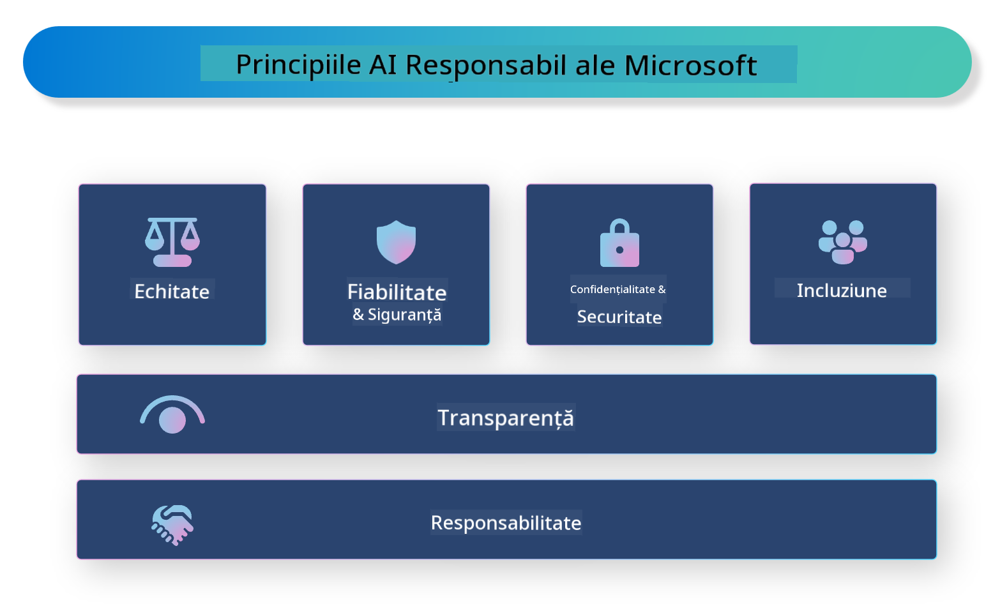

<!--
CO_OP_TRANSLATOR_METADATA:
{
  "original_hash": "805b96b20152936d8f4c587d90d6e06e",
  "translation_date": "2025-07-16T22:58:01+00:00",
  "source_file": "md/01.Introduction/05/ResponsibleAI.md",
  "language_code": "ro"
}
-->
# **Introducere în Responsible AI**

[Microsoft Responsible AI](https://www.microsoft.com/ai/responsible-ai?WT.mc_id=aiml-138114-kinfeylo) este o inițiativă care își propune să ajute dezvoltatorii și organizațiile să construiască sisteme AI transparente, de încredere și responsabile. Inițiativa oferă ghiduri și resurse pentru dezvoltarea soluțiilor AI responsabile, care respectă principii etice precum confidențialitatea, echitatea și transparența. Vom explora, de asemenea, unele dintre provocările și bunele practici asociate construirii sistemelor AI responsabile.

## Prezentare generală a Microsoft Responsible AI

**Principii etice**

Microsoft Responsible AI se bazează pe un set de principii etice, cum ar fi confidențialitatea, echitatea, transparența, responsabilitatea și siguranța. Aceste principii sunt concepute pentru a asigura că sistemele AI sunt dezvoltate într-un mod etic și responsabil.

**AI transparent**

Microsoft Responsible AI pune accent pe importanța transparenței în sistemele AI. Aceasta include oferirea de explicații clare despre modul în care funcționează modelele AI, precum și asigurarea că sursele de date și algoritmii sunt disponibile public.

**AI responsabil**

[Microsoft Responsible AI](https://www.microsoft.com/ai/responsible-ai?WT.mc_id=aiml-138114-kinfeylo) promovează dezvoltarea sistemelor AI responsabile, care pot oferi informații despre modul în care modelele AI iau decizii. Acest lucru poate ajuta utilizatorii să înțeleagă și să aibă încredere în rezultatele sistemelor AI.

**Incluziune**

Sistemele AI ar trebui să fie concepute pentru a aduce beneficii tuturor. Microsoft își propune să creeze AI incluzivă, care să ia în considerare perspective diverse și să evite prejudecățile sau discriminarea.

**Fiabilitate și siguranță**

Asigurarea faptului că sistemele AI sunt fiabile și sigure este esențială. Microsoft se concentrează pe construirea de modele robuste, care să funcționeze constant și să evite rezultate dăunătoare.

**Echitate în AI**

Microsoft Responsible AI recunoaște că sistemele AI pot perpetua prejudecăți dacă sunt antrenate pe date sau algoritmi părtinitori. Inițiativa oferă ghiduri pentru dezvoltarea unor sisteme AI echitabile, care să nu discrimineze pe baza unor factori precum rasa, genul sau vârsta.

**Confidențialitate și securitate**

Microsoft Responsible AI subliniază importanța protejării confidențialității utilizatorilor și a securității datelor în sistemele AI. Aceasta include implementarea unor metode puternice de criptare a datelor și controale de acces, precum și audituri regulate ale sistemelor AI pentru identificarea vulnerabilităților.

**Responsabilitate și răspundere**

Microsoft Responsible AI promovează responsabilitatea și răspunderea în dezvoltarea și implementarea AI. Aceasta presupune ca dezvoltatorii și organizațiile să fie conștienți de riscurile potențiale asociate sistemelor AI și să ia măsuri pentru a le reduce.

## Bune practici pentru construirea sistemelor AI responsabile

**Dezvoltă modele AI folosind seturi de date diverse**

Pentru a evita părtinirile în sistemele AI, este important să folosești seturi de date diverse, care să reprezinte o gamă largă de perspective și experiențe.

**Folosește tehnici de AI explicabilă**

Tehnicile de AI explicabilă pot ajuta utilizatorii să înțeleagă modul în care modelele AI iau decizii, ceea ce poate crește încrederea în sistem.

**Audită regulat sistemele AI pentru vulnerabilități**

Auditările regulate ale sistemelor AI pot ajuta la identificarea riscurilor și vulnerabilităților care trebuie abordate.

**Implementarea criptării puternice a datelor și a controalelor de acces**

Criptarea datelor și controalele de acces pot proteja confidențialitatea și securitatea utilizatorilor în sistemele AI.

**Respectă principiile etice în dezvoltarea AI**

Respectarea principiilor etice, cum ar fi echitatea, transparența și responsabilitatea, poate contribui la construirea încrederii în sistemele AI și la asigurarea dezvoltării lor responsabile.

## Utilizarea AI Foundry pentru Responsible AI

[Azure AI Foundry](https://ai.azure.com?WT.mc_id=aiml-138114-kinfeylo) este o platformă puternică care permite dezvoltatorilor și organizațiilor să creeze rapid aplicații inteligente, de ultimă generație, gata pentru piață și responsabile. Iată câteva caracteristici și capabilități cheie ale Azure AI Foundry:

**API-uri și modele gata de utilizare**

Azure AI Foundry oferă API-uri și modele predefinite și personalizabile. Acestea acoperă o gamă largă de sarcini AI, inclusiv AI generativ, procesarea limbajului natural pentru conversații, căutare, monitorizare, traducere, vorbire, viziune și luarea deciziilor.

**Prompt Flow**

Prompt flow în Azure AI Foundry îți permite să creezi experiențe AI conversaționale. Poți proiecta și gestiona fluxuri conversaționale, facilitând construirea de chatboți, asistenți virtuali și alte aplicații interactive.

**Retrieval Augmented Generation (RAG)**

RAG este o tehnică care combină abordările bazate pe recuperare și generare. Aceasta îmbunătățește calitatea răspunsurilor generate prin valorificarea atât a cunoștințelor preexistente (recuperare), cât și a generării creative (generare).

**Metrice de evaluare și monitorizare pentru AI generativ**

Azure AI Foundry oferă instrumente pentru evaluarea și monitorizarea modelelor AI generative. Poți evalua performanța, echitatea și alte metrice importante pentru a asigura o implementare responsabilă. În plus, dacă ai creat un dashboard, poți folosi interfața no-code din Azure Machine Learning Studio pentru a personaliza și genera un Responsible AI Dashboard și un scorecard asociat, bazat pe [Responsible AI Toolbox](https://responsibleaitoolbox.ai/?WT.mc_id=aiml-138114-kinfeylo) Python Libraries. Acest scorecard te ajută să împărtășești informații cheie legate de echitate, importanța caracteristicilor și alte aspecte ale implementării responsabile, atât cu părțile tehnice, cât și cu cele non-tehnice.

Pentru a folosi AI Foundry în contextul Responsible AI, poți urma aceste bune practici:

**Definește problema și obiectivele sistemului tău AI**

Înainte de a începe procesul de dezvoltare, este important să definești clar problema sau obiectivul pe care sistemul tău AI îl urmărește. Acest lucru te va ajuta să identifici datele, algoritmii și resursele necesare pentru a construi un model eficient.

**Colectează și preprocesează date relevante**

Calitatea și cantitatea datelor folosite pentru antrenarea unui sistem AI pot influența semnificativ performanța acestuia. Prin urmare, este important să colectezi date relevante, să le cureți, să le preprocesezi și să te asiguri că acestea sunt reprezentative pentru populația sau problema pe care încerci să o rezolvi.

**Alege metodele de evaluare potrivite**

Există diverse algoritmi de evaluare disponibili. Este important să alegi algoritmul cel mai potrivit în funcție de datele și problema ta.

**Evaluează și interpretează modelul**

După ce ai construit un model AI, este esențial să îi evaluezi performanța folosind metrice adecvate și să interpretezi rezultatele într-un mod transparent. Acest lucru te va ajuta să identifici eventualele părtiniri sau limitări ale modelului și să faci îmbunătățiri acolo unde este necesar.

**Asigură transparența și explicabilitatea**

Sistemele AI trebuie să fie transparente și explicabile, astfel încât utilizatorii să poată înțelege cum funcționează și cum sunt luate deciziile. Acest aspect este deosebit de important pentru aplicațiile care au un impact semnificativ asupra vieților oamenilor, cum ar fi cele din domeniul sănătății, finanțelor sau sistemelor juridice.

**Monitorizează și actualizează modelul**

Sistemele AI trebuie monitorizate și actualizate continuu pentru a se asigura că rămân precise și eficiente în timp. Acest lucru necesită întreținere constantă, testare și reantrenare a modelului.

În concluzie, Microsoft Responsible AI este o inițiativă care își propune să ajute dezvoltatorii și organizațiile să construiască sisteme AI transparente, de încredere și responsabile. Implementarea responsabilă a AI este esențială, iar Azure AI Foundry își propune să o facă practică pentru organizații. Urmând principiile etice și bunele practici, putem asigura că sistemele AI sunt dezvoltate și implementate într-un mod responsabil, care aduce beneficii întregii societăți.

**Declinare de responsabilitate**:  
Acest document a fost tradus folosind serviciul de traducere AI [Co-op Translator](https://github.com/Azure/co-op-translator). Deși ne străduim pentru acuratețe, vă rugăm să rețineți că traducerile automate pot conține erori sau inexactități. Documentul original în limba sa nativă trebuie considerat sursa autorizată. Pentru informații critice, se recomandă traducerea profesională realizată de un specialist uman. Nu ne asumăm răspunderea pentru eventualele neînțelegeri sau interpretări greșite rezultate din utilizarea acestei traduceri.