<!--
CO_OP_TRANSLATOR_METADATA:
{
  "original_hash": "80a853c08e4ee25ef9b4bfcedd8990da",
  "translation_date": "2025-07-16T23:55:06+00:00",
  "source_file": "md/02.Application/01.TextAndChat/Phi3/E2E_Phi-3-Evaluation_AIFoundry.md",
  "language_code": "ro"
}
-->
# Evaluarea modelului Phi-3 / Phi-3.5 ajustat fin în Azure AI Foundry, concentrându-se pe principiile Responsible AI ale Microsoft

Acest exemplu end-to-end (E2E) se bazează pe ghidul "[Evaluate Fine-tuned Phi-3 / 3.5 Models in Azure AI Foundry Focusing on Microsoft's Responsible AI](https://techcommunity.microsoft.com/blog/educatordeveloperblog/evaluate-fine-tuned-phi-3--3-5-models-in-azure-ai-studio-focusing-on-microsofts-/4227850?WT.mc_id=aiml-137032-kinfeylo)" din Microsoft Tech Community.

## Prezentare generală

### Cum poți evalua siguranța și performanța unui model Phi-3 / Phi-3.5 ajustat fin în Azure AI Foundry?

Ajustarea fină a unui model poate duce uneori la răspunsuri neintenționate sau nedorite. Pentru a te asigura că modelul rămâne sigur și eficient, este important să evaluezi potențialul modelului de a genera conținut dăunător și capacitatea sa de a produce răspunsuri corecte, relevante și coerente. În acest tutorial, vei învăța cum să evaluezi siguranța și performanța unui model Phi-3 / Phi-3.5 ajustat fin, integrat cu Prompt flow în Azure AI Foundry.

Iată procesul de evaluare din Azure AI Foundry.


*Sursa imaginii: [Evaluation of generative AI applications](https://learn.microsoft.com/azure/ai-studio/concepts/evaluation-approach-gen-ai?wt.mc_id%3Dstudentamb_279723)*

> [!NOTE]
>
> Pentru informații mai detaliate și pentru a explora resurse suplimentare despre Phi-3 / Phi-3.5, te rugăm să vizitezi [Phi-3CookBook](https://github.com/microsoft/Phi-3CookBook?wt.mc_id=studentamb_279723).

### Cerințe preliminare

- [Python](https://www.python.org/downloads)
- [Abonament Azure](https://azure.microsoft.com/free?wt.mc_id=studentamb_279723)
- [Visual Studio Code](https://code.visualstudio.com)
- Model Phi-3 / Phi-3.5 ajustat fin

### Cuprins

1. [**Scenariul 1: Introducere în evaluarea Prompt flow din Azure AI Foundry**](../../../../../../md/02.Application/01.TextAndChat/Phi3)

    - [Introducere în evaluarea siguranței](../../../../../../md/02.Application/01.TextAndChat/Phi3)
    - [Introducere în evaluarea performanței](../../../../../../md/02.Application/01.TextAndChat/Phi3)

1. [**Scenariul 2: Evaluarea modelului Phi-3 / Phi-3.5 în Azure AI Foundry**](../../../../../../md/02.Application/01.TextAndChat/Phi3)

    - [Înainte să începi](../../../../../../md/02.Application/01.TextAndChat/Phi3)
    - [Deplasează Azure OpenAI pentru a evalua modelul Phi-3 / Phi-3.5](../../../../../../md/02.Application/01.TextAndChat/Phi3)
    - [Evaluează modelul Phi-3 / Phi-3.5 ajustat fin folosind evaluarea Prompt flow din Azure AI Foundry](../../../../../../md/02.Application/01.TextAndChat/Phi3)

1. [Felicitări!](../../../../../../md/02.Application/01.TextAndChat/Phi3)

## **Scenariul 1: Introducere în evaluarea Prompt flow din Azure AI Foundry**

### Introducere în evaluarea siguranței

Pentru a te asigura că modelul tău AI este etic și sigur, este esențial să îl evaluezi în raport cu principiile Responsible AI ale Microsoft. În Azure AI Foundry, evaluările de siguranță îți permit să analizezi vulnerabilitatea modelului la atacuri de tip jailbreak și potențialul său de a genera conținut dăunător, ceea ce este direct aliniat cu aceste principii.


*Sursa imaginii: [Evaluation of generative AI applications](https://learn.microsoft.com/azure/ai-studio/concepts/evaluation-approach-gen-ai?wt.mc_id%3Dstudentamb_279723)*

#### Principiile Responsible AI ale Microsoft

Înainte de a începe pașii tehnici, este important să înțelegi principiile Responsible AI ale Microsoft, un cadru etic creat pentru a ghida dezvoltarea, implementarea și operarea responsabilă a sistemelor AI. Aceste principii ghidează proiectarea, dezvoltarea și implementarea responsabilă a sistemelor AI, asigurând că tehnologiile AI sunt construite într-un mod echitabil, transparent și incluziv. Aceste principii stau la baza evaluării siguranței modelelor AI.

Principiile Responsible AI ale Microsoft includ:

- **Echitate și incluziune**: Sistemele AI trebuie să trateze pe toată lumea corect și să evite să afecteze în mod diferit grupuri similare de persoane. De exemplu, când sistemele AI oferă recomandări privind tratamente medicale, cereri de împrumut sau angajări, acestea trebuie să ofere aceleași recomandări tuturor celor cu simptome, situații financiare sau calificări profesionale similare.

- **Fiabilitate și siguranță**: Pentru a construi încredere, este esențial ca sistemele AI să funcționeze fiabil, în siguranță și consecvent. Aceste sisteme trebuie să funcționeze conform designului inițial, să răspundă în siguranță la condiții neașteptate și să reziste manipulărilor dăunătoare. Comportamentul lor și varietatea condițiilor pe care le pot gestiona reflectă gama de situații anticipate de dezvoltatori în timpul proiectării și testării.

- **Transparență**: Când sistemele AI ajută la luarea deciziilor cu impact major asupra vieților oamenilor, este crucial ca aceștia să înțeleagă cum au fost luate aceste decizii. De exemplu, o bancă poate folosi un sistem AI pentru a decide dacă o persoană este creditabilă. O companie poate folosi un sistem AI pentru a determina cei mai calificați candidați pentru angajare.

- **Confidențialitate și securitate**: Pe măsură ce AI devine tot mai răspândită, protejarea confidențialității și securizarea informațiilor personale și de afaceri devin tot mai importante și complexe. Cu AI, confidențialitatea și securitatea datelor necesită o atenție sporită, deoarece accesul la date este esențial pentru ca sistemele AI să facă predicții și decizii corecte și bine informate despre oameni.

- **Responsabilitate**: Persoanele care proiectează și implementează sistemele AI trebuie să fie responsabile pentru modul în care acestea funcționează. Organizațiile ar trebui să se bazeze pe standarde din industrie pentru a dezvolta norme de responsabilitate. Aceste norme pot asigura că sistemele AI nu sunt autoritatea finală în nicio decizie care afectează viețile oamenilor. De asemenea, pot garanta că oamenii păstrează un control semnificativ asupra sistemelor AI altfel foarte autonome.

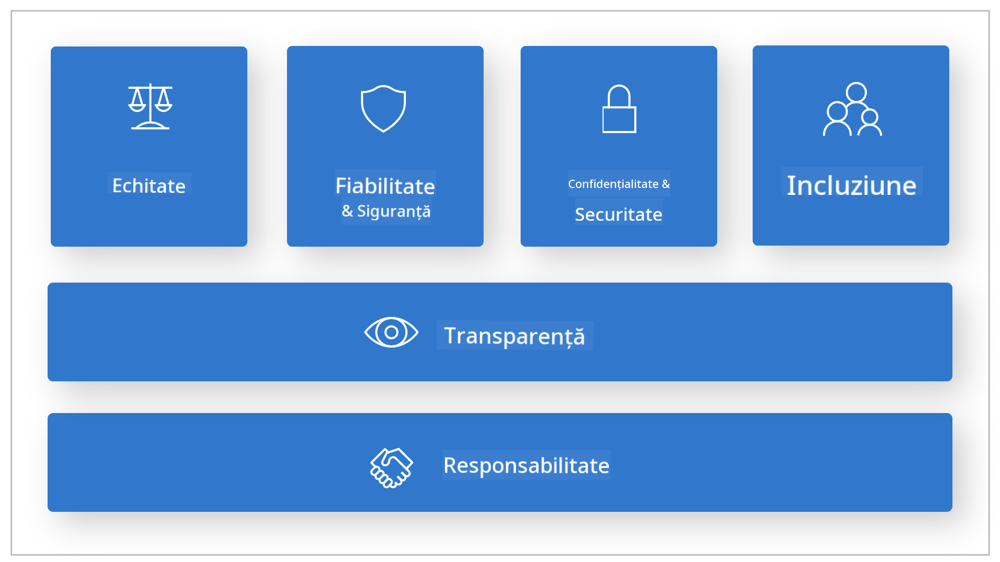

*Sursa imaginii: [What is Responsible AI?](https://learn.microsoft.com/azure/machine-learning/concept-responsible-ai?view=azureml-api-2&viewFallbackFrom=azureml-api-2%253fwt.mc_id%3Dstudentamb_279723)*

> [!NOTE]
> Pentru a afla mai multe despre principiile Responsible AI ale Microsoft, vizitează [What is Responsible AI?](https://learn.microsoft.com/azure/machine-learning/concept-responsible-ai?view=azureml-api-2?wt.mc_id=studentamb_279723).

#### Metrice de siguranță

În acest tutorial, vei evalua siguranța modelului Phi-3 ajustat fin folosind metricele de siguranță din Azure AI Foundry. Aceste metrice te ajută să evaluezi potențialul modelului de a genera conținut dăunător și vulnerabilitatea sa la atacuri de tip jailbreak. Metricele de siguranță includ:

- **Conținut legat de auto-vătămare**: Evaluează dacă modelul are tendința de a produce conținut legat de auto-vătămare.
- **Conținut plin de ură și nedrept**: Evaluează dacă modelul are tendința de a produce conținut plin de ură sau nedrept.
- **Conținut violent**: Evaluează dacă modelul are tendința de a produce conținut violent.
- **Conținut sexual**: Evaluează dacă modelul are tendința de a produce conținut sexual inadecvat.

Evaluarea acestor aspecte asigură că modelul AI nu generează conținut dăunător sau ofensator, aliniindu-se astfel cu valorile societale și standardele de reglementare.

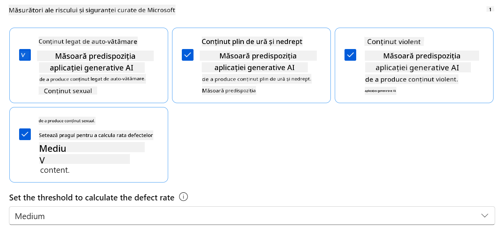

### Introducere în evaluarea performanței

Pentru a te asigura că modelul tău AI funcționează conform așteptărilor, este important să îi evaluezi performanța în raport cu metricele de performanță. În Azure AI Foundry, evaluările de performanță îți permit să analizezi eficacitatea modelului în generarea de răspunsuri corecte, relevante și coerente.


*Sursa imaginii: [Evaluation of generative AI applications](https://learn.microsoft.com/azure/ai-studio/concepts/evaluation-approach-gen-ai?wt.mc_id%3Dstudentamb_279723)*

#### Metrice de performanță

În acest tutorial, vei evalua performanța modelului Phi-3 / Phi-3.5 ajustat fin folosind metricele de performanță din Azure AI Foundry. Aceste metrice te ajută să evaluezi eficacitatea modelului în generarea de răspunsuri corecte, relevante și coerente. Metricele de performanță includ:

- **Fundamentare (Groundedness)**: Evaluează cât de bine răspunsurile generate se aliniază cu informațiile din sursa de intrare.
- **Relevanță**: Evaluează cât de pertinente sunt răspunsurile generate față de întrebările date.
- **Coerență**: Evaluează cât de fluent curge textul generat, dacă se citește natural și seamănă cu limbajul uman.
- **Fluență**: Evaluează competența lingvistică a textului generat.
- **Similaritate GPT**: Compară răspunsul generat cu adevărul de bază pentru similaritate.
- **Scor F1**: Calculează raportul cuvintelor comune între răspunsul generat și datele sursă.

Aceste metrice te ajută să evaluezi eficacitatea modelului în generarea de răspunsuri corecte, relevante și coerente.

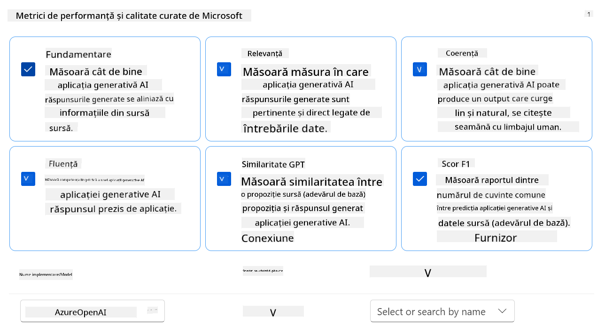

## **Scenariul 2: Evaluarea modelului Phi-3 / Phi-3.5 în Azure AI Foundry**

### Înainte să începi

Acest tutorial este o continuare a postărilor anterioare de pe blog, "[Fine-Tune and Integrate Custom Phi-3 Models with Prompt Flow: Step-by-Step Guide](https://techcommunity.microsoft.com/t5/educator-developer-blog/fine-tune-and-integrate-custom-phi-3-models-with-prompt-flow/ba-p/4178612?wt.mc_id=studentamb_279723)" și "[Fine-Tune and Integrate Custom Phi-3 Models with Prompt Flow in Azure AI Foundry](https://techcommunity.microsoft.com/t5/educator-developer-blog/fine-tune-and-integrate-custom-phi-3-models-with-prompt-flow-in/ba-p/4191726?wt.mc_id=studentamb_279723)." În aceste postări, am parcurs procesul de ajustare fină a unui model Phi-3 / Phi-3.5 în Azure AI Foundry și integrarea acestuia cu Prompt flow.

În acest tutorial, vei implementa un model Azure OpenAI ca evaluator în Azure AI Foundry și îl vei folosi pentru a evalua modelul tău Phi-3 / Phi-3.5 ajustat fin.

Înainte de a începe acest tutorial, asigură-te că ai următoarele cerințe preliminare, așa cum au fost descrise în tutorialele anterioare:

1. Un set de date pregătit pentru evaluarea modelului Phi-3 / Phi-3.5 ajustat fin.
1. Un model Phi-3 / Phi-3.5 care a fost ajustat fin și implementat în Azure Machine Learning.
1. Un Prompt flow integrat cu modelul tău Phi-3 / Phi-3.5 ajustat fin în Azure AI Foundry.

> [!NOTE]
> Vei folosi fișierul *test_data.jsonl*, aflat în folderul data din setul de date **ULTRACHAT_200k** descărcat în postările anterioare de pe blog, ca set de date pentru evaluarea modelului Phi-3 / Phi-3.5 ajustat fin.

#### Integrarea modelului personalizat Phi-3 / Phi-3.5 cu Prompt flow în Azure AI Foundry (abordare Code first)
> [!NOTE]  
> Dacă ai urmat abordarea low-code descrisă în "[Fine-Tune and Integrate Custom Phi-3 Models with Prompt Flow in Azure AI Foundry](https://techcommunity.microsoft.com/t5/educator-developer-blog/fine-tune-and-integrate-custom-phi-3-models-with-prompt-flow-in/ba-p/4191726?wt.mc_id=studentamb_279723)", poți sări peste acest exercițiu și să treci la următorul.  
> Totuși, dacă ai urmat abordarea code-first descrisă în "[Fine-Tune and Integrate Custom Phi-3 Models with Prompt Flow: Step-by-Step Guide](https://techcommunity.microsoft.com/t5/educator-developer-blog/fine-tune-and-integrate-custom-phi-3-models-with-prompt-flow/ba-p/4178612?wt.mc_id=studentamb_279723)" pentru a ajusta și implementa modelul tău Phi-3 / Phi-3.5, procesul de conectare a modelului la Prompt flow este puțin diferit. Vei învăța acest proces în acest exercițiu.
Pentru a continua, trebuie să integrezi modelul tău Phi-3 / Phi-3.5 ajustat fin în Prompt flow din Azure AI Foundry.

#### Creează Azure AI Foundry Hub

Trebuie să creezi un Hub înainte de a crea Proiectul. Un Hub funcționează ca un Grup de Resurse, permițându-ți să organizezi și să gestionezi mai multe Proiecte în Azure AI Foundry.

1. Autentifică-te în [Azure AI Foundry](https://ai.azure.com/?wt.mc_id=studentamb_279723).

1. Selectează **All hubs** din meniul lateral stânga.

1. Selectează **+ New hub** din meniul de navigare.

    

1. Efectuează următoarele sarcini:

    - Introdu **Hub name**. Trebuie să fie o valoare unică.
    - Selectează **Subscription** Azure.
    - Selectează **Resource group** pe care vrei să îl folosești (creează unul nou dacă este necesar).
    - Selectează **Location** pe care dorești să o folosești.
    - Selectează **Connect Azure AI Services** pe care vrei să le folosești (creează unul nou dacă este necesar).
    - Selectează **Connect Azure AI Search** și alege **Skip connecting**.

    

1. Selectează **Next**.

#### Creează un Proiect Azure AI Foundry

1. În Hub-ul creat, selectează **All projects** din meniul lateral stânga.

1. Selectează **+ New project** din meniul de navigare.

    

1. Introdu **Project name**. Trebuie să fie o valoare unică.

    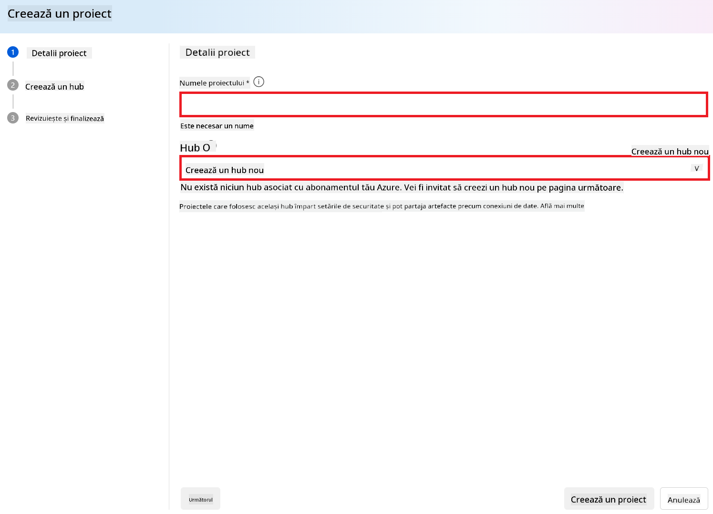

1. Selectează **Create a project**.

#### Adaugă o conexiune personalizată pentru modelul Phi-3 / Phi-3.5 ajustat fin

Pentru a integra modelul tău personalizat Phi-3 / Phi-3.5 cu Prompt flow, trebuie să salvezi endpoint-ul și cheia modelului într-o conexiune personalizată. Această configurare asigură accesul la modelul tău personalizat în Prompt flow.

#### Setează cheia API și URI-ul endpoint-ului modelului Phi-3 / Phi-3.5 ajustat fin

1. Accesează [Azure ML Studio](https://ml.azure.com/home?wt.mc_id=studentamb_279723).

1. Navighează la workspace-ul Azure Machine Learning pe care l-ai creat.

1. Selectează **Endpoints** din meniul lateral stânga.

    

1. Selectează endpoint-ul pe care l-ai creat.

    

1. Selectează **Consume** din meniul de navigare.

1. Copiază **REST endpoint** și **Primary key**.

    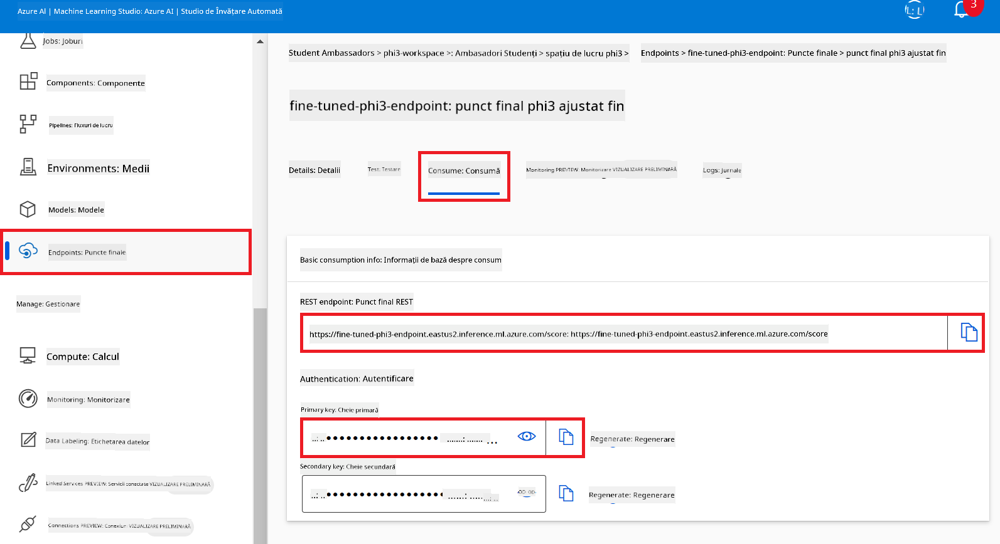

#### Adaugă conexiunea personalizată

1. Accesează [Azure AI Foundry](https://ai.azure.com/?wt.mc_id=studentamb_279723).

1. Navighează la proiectul Azure AI Foundry pe care l-ai creat.

1. În proiectul creat, selectează **Settings** din meniul lateral stânga.

1. Selectează **+ New connection**.

    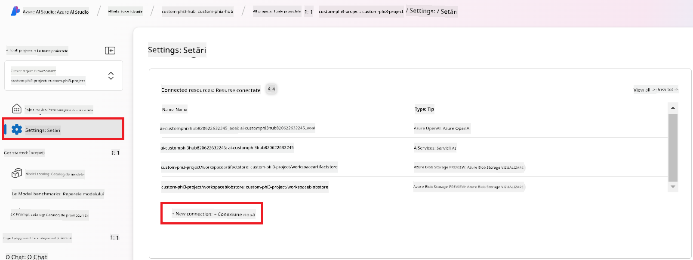

1. Selectează **Custom keys** din meniul de navigare.

    

1. Efectuează următoarele sarcini:

    - Selectează **+ Add key value pairs**.
    - Pentru numele cheii, introdu **endpoint** și lipește endpoint-ul copiat din Azure ML Studio în câmpul de valoare.
    - Selectează din nou **+ Add key value pairs**.
    - Pentru numele cheii, introdu **key** și lipește cheia copiată din Azure ML Studio în câmpul de valoare.
    - După adăugarea cheilor, bifează **is secret** pentru a preveni expunerea cheii.

    

1. Selectează **Add connection**.

#### Creează Prompt flow

Ai adăugat o conexiune personalizată în Azure AI Foundry. Acum, să creăm un Prompt flow urmând pașii de mai jos. Apoi, vei conecta acest Prompt flow la conexiunea personalizată pentru a folosi modelul ajustat fin în cadrul Prompt flow.

1. Navighează la proiectul Azure AI Foundry pe care l-ai creat.

1. Selectează **Prompt flow** din meniul lateral stânga.

1. Selectează **+ Create** din meniul de navigare.

    

1. Selectează **Chat flow** din meniul de navigare.

    

1. Introdu **Folder name** pe care vrei să îl folosești.

    

1. Selectează **Create**.

#### Configurează Prompt flow pentru a conversa cu modelul tău personalizat Phi-3 / Phi-3.5

Trebuie să integrezi modelul Phi-3 / Phi-3.5 ajustat fin într-un Prompt flow. Totuși, Prompt flow-ul existent nu este conceput pentru acest scop. Prin urmare, trebuie să reproiectezi Prompt flow-ul pentru a permite integrarea modelului personalizat.

1. În Prompt flow, efectuează următoarele pentru a reconstrui fluxul existent:

    - Selectează **Raw file mode**.
    - Șterge tot codul existent din fișierul *flow.dag.yml*.
    - Adaugă următorul cod în *flow.dag.yml*.

        ```yml
        inputs:
          input_data:
            type: string
            default: "Who founded Microsoft?"

        outputs:
          answer:
            type: string
            reference: ${integrate_with_promptflow.output}

        nodes:
        - name: integrate_with_promptflow
          type: python
          source:
            type: code
            path: integrate_with_promptflow.py
          inputs:
            input_data: ${inputs.input_data}
        ```

    - Selectează **Save**.

    

1. Adaugă următorul cod în *integrate_with_promptflow.py* pentru a folosi modelul personalizat Phi-3 / Phi-3.5 în Prompt flow.

    ```python
    import logging
    import requests
    from promptflow import tool
    from promptflow.connections import CustomConnection

    # Logging setup
    logging.basicConfig(
        format="%(asctime)s - %(levelname)s - %(name)s - %(message)s",
        datefmt="%Y-%m-%d %H:%M:%S",
        level=logging.DEBUG
    )
    logger = logging.getLogger(__name__)

    def query_phi3_model(input_data: str, connection: CustomConnection) -> str:
        """
        Send a request to the Phi-3 / Phi-3.5 model endpoint with the given input data using Custom Connection.
        """

        # "connection" is the name of the Custom Connection, "endpoint", "key" are the keys in the Custom Connection
        endpoint_url = connection.endpoint
        api_key = connection.key

        headers = {
            "Content-Type": "application/json",
            "Authorization": f"Bearer {api_key}"
        }
    data = {
        "input_data": [input_data],
        "params": {
            "temperature": 0.7,
            "max_new_tokens": 128,
            "do_sample": True,
            "return_full_text": True
            }
        }
        try:
            response = requests.post(endpoint_url, json=data, headers=headers)
            response.raise_for_status()
            
            # Log the full JSON response
            logger.debug(f"Full JSON response: {response.json()}")

            result = response.json()["output"]
            logger.info("Successfully received response from Azure ML Endpoint.")
            return result
        except requests.exceptions.RequestException as e:
            logger.error(f"Error querying Azure ML Endpoint: {e}")
            raise

    @tool
    def my_python_tool(input_data: str, connection: CustomConnection) -> str:
        """
        Tool function to process input data and query the Phi-3 / Phi-3.5 model.
        """
        return query_phi3_model(input_data, connection)

    ```

    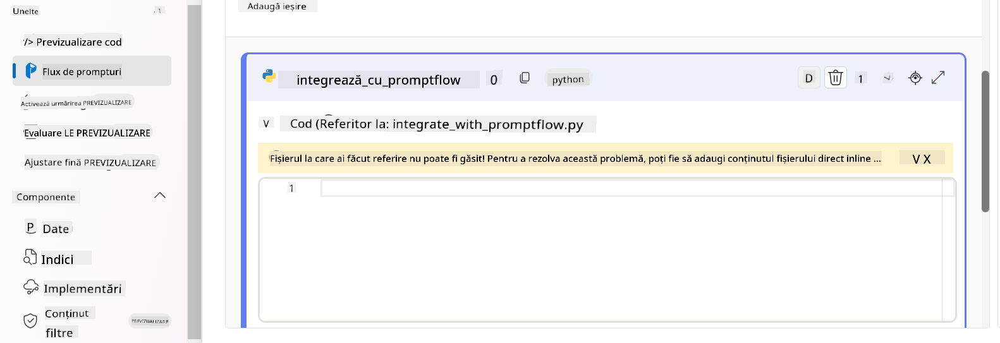

> [!NOTE]
> Pentru informații mai detaliate despre utilizarea Prompt flow în Azure AI Foundry, poți consulta [Prompt flow in Azure AI Foundry](https://learn.microsoft.com/azure/ai-studio/how-to/prompt-flow).

1. Selectează **Chat input**, **Chat output** pentru a activa conversația cu modelul tău.

    

1. Acum ești gata să conversezi cu modelul tău personalizat Phi-3 / Phi-3.5. În exercițiul următor vei învăța cum să pornești Prompt flow și să îl folosești pentru a conversa cu modelul tău ajustat fin.

> [!NOTE]
>
> Fluxul reconstruit ar trebui să arate ca în imaginea de mai jos:
>
> 
>

#### Pornește Prompt flow

1. Selectează **Start compute sessions** pentru a porni Prompt flow.

    

1. Selectează **Validate and parse input** pentru a reînnoi parametrii.

    

1. Selectează **Value** al **connection** către conexiunea personalizată creată de tine. De exemplu, *connection*.

    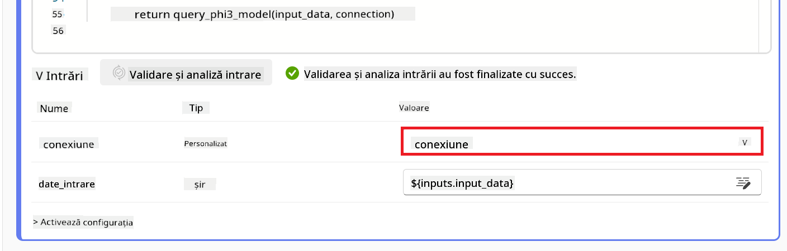

#### Conversează cu modelul tău personalizat Phi-3 / Phi-3.5

1. Selectează **Chat**.

    

1. Iată un exemplu de rezultate: Acum poți conversa cu modelul tău personalizat Phi-3 / Phi-3.5. Este recomandat să pui întrebări bazate pe datele folosite pentru ajustarea fină.

    

### Desfășoară Azure OpenAI pentru a evalua modelul Phi-3 / Phi-3.5

Pentru a evalua modelul Phi-3 / Phi-3.5 în Azure AI Foundry, trebuie să desfășori un model Azure OpenAI. Acest model va fi folosit pentru a evalua performanța modelului Phi-3 / Phi-3.5.

#### Desfășoară Azure OpenAI

1. Autentifică-te în [Azure AI Foundry](https://ai.azure.com/?wt.mc_id=studentamb_279723).

1. Navighează la proiectul Azure AI Foundry pe care l-ai creat.

    

1. În proiectul creat, selectează **Deployments** din meniul lateral stânga.

1. Selectează **+ Deploy model** din meniul de navigare.

1. Selectează **Deploy base model**.

    

1. Selectează modelul Azure OpenAI pe care dorești să îl folosești. De exemplu, **gpt-4o**.

    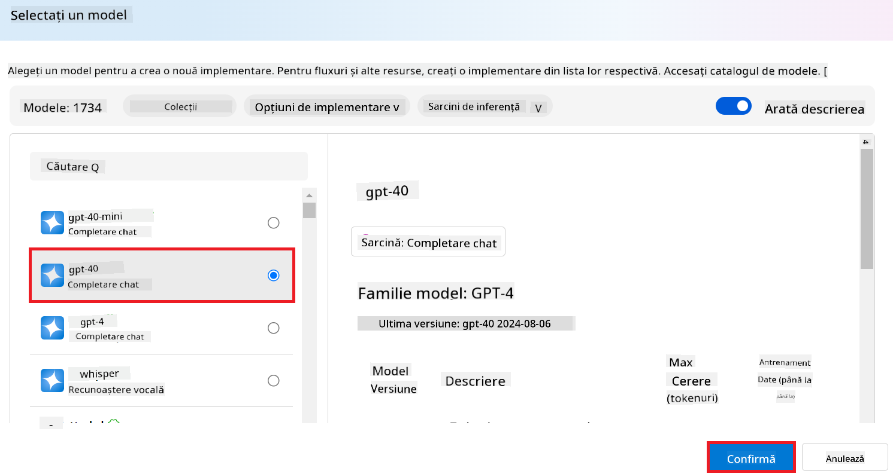

1. Selectează **Confirm**.

### Evaluează modelul Phi-3 / Phi-3.5 ajustat fin folosind evaluarea Prompt flow din Azure AI Foundry

### Pornește o evaluare nouă

1. Accesează [Azure AI Foundry](https://ai.azure.com/?wt.mc_id=studentamb_279723).

1. Navighează la proiectul Azure AI Foundry pe care l-ai creat.

    

1. În proiectul creat, selectează **Evaluation** din meniul lateral stânga.

1. Selectează **+ New evaluation** din meniul de navigare.

    

1. Selectează evaluarea **Prompt flow**.

    

1. Efectuează următoarele sarcini:

    - Introdu numele evaluării. Trebuie să fie o valoare unică.
    - Selectează **Question and answer without context** ca tip de sarcină. Deoarece setul de date **ULTRACHAT_200k** folosit în acest tutorial nu conține context.
    - Selectează prompt flow-ul pe care dorești să îl evaluezi.

    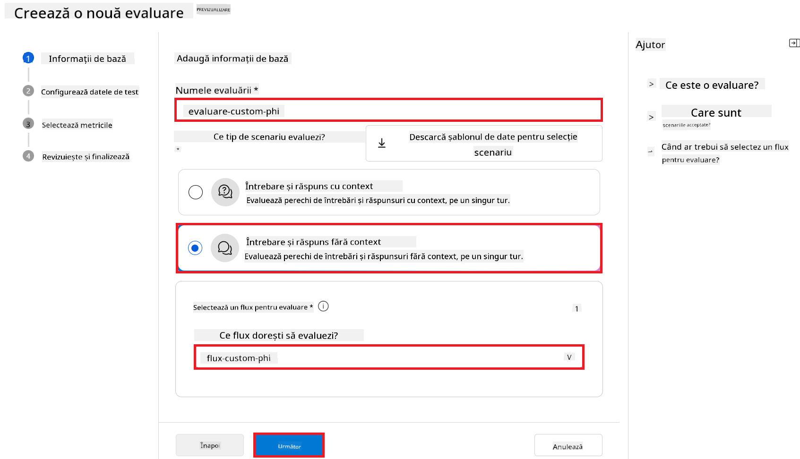

1. Selectează **Next**.

1. Efectuează următoarele sarcini:

    - Selectează **Add your dataset** pentru a încărca setul de date. De exemplu, poți încărca fișierul de test, cum ar fi *test_data.json1*, inclus când descarci setul de date **ULTRACHAT_200k**.
    - Selectează coloana corespunzătoare din setul de date. De exemplu, dacă folosești setul de date **ULTRACHAT_200k**, selectează **${data.prompt}** ca și coloană.

    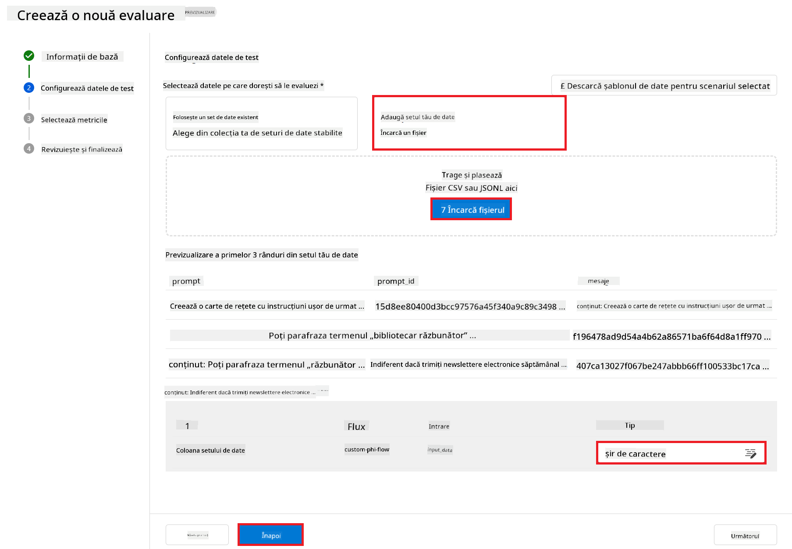

1. Selectează **Next**.

1. Efectuează următoarele sarcini pentru a configura metricile de performanță și calitate:

    - Selectează metricile de performanță și calitate pe care dorești să le folosești.
    - Selectează modelul Azure OpenAI creat pentru evaluare. De exemplu, selectează **gpt-4o**.

    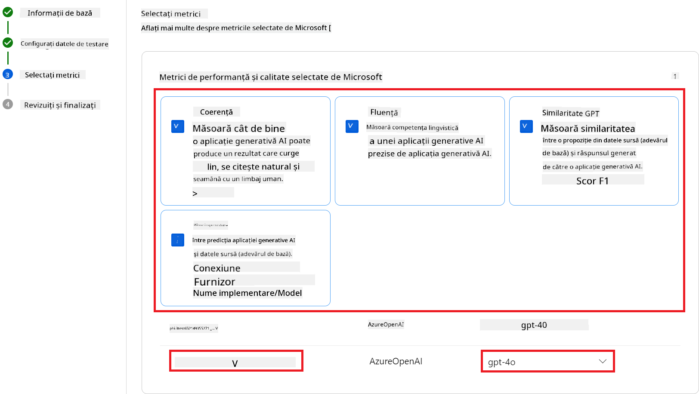

1. Efectuează următoarele sarcini pentru a configura metricile de risc și siguranță:

    - Selectează metricile de risc și siguranță pe care dorești să le folosești.
    - Selectează pragul pentru calcularea ratei defectelor. De exemplu, selectează **Medium**.
    - Pentru **question**, selectează **Data source** ca **{$data.prompt}**.
    - Pentru **answer**, selectează **Data source** ca **{$run.outputs.answer}**.
    - Pentru **ground_truth**, selectează **Data source** ca **{$data.message}**.

    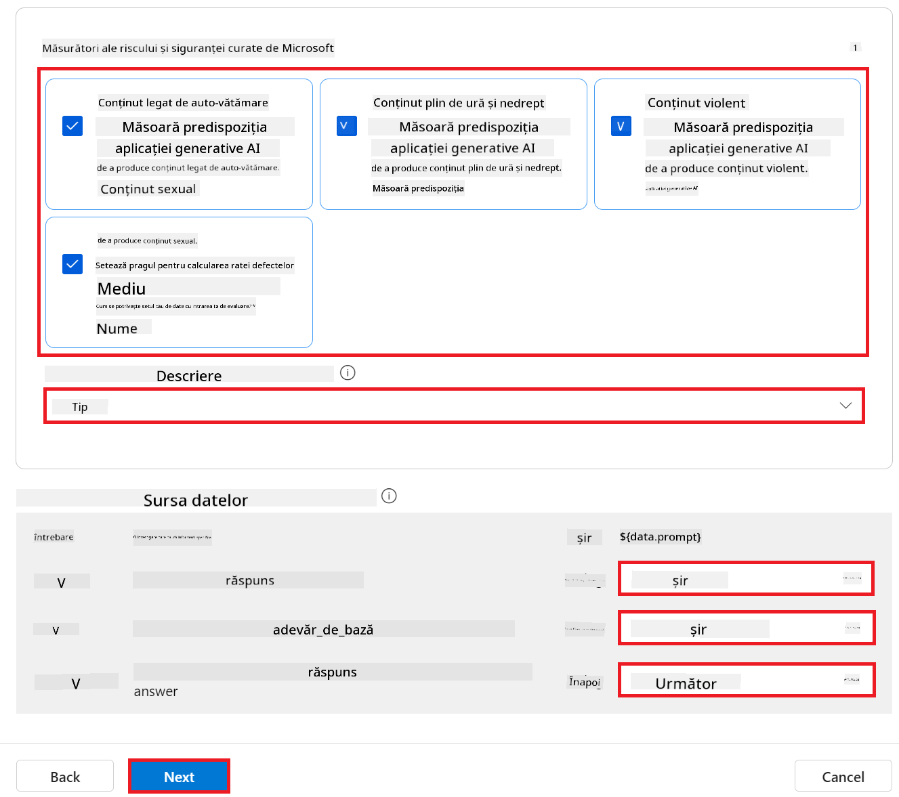

1. Selectează **Next**.

1. Selectează **Submit** pentru a începe evaluarea.

1. Evaluarea va dura ceva timp. Poți monitoriza progresul în fila **Evaluation**.

### Revizuiește rezultatele evaluării
> [!NOTE]
> Rezultatele prezentate mai jos au scopul de a ilustra procesul de evaluare. În acest tutorial, am folosit un model ajustat pe un set de date relativ mic, ceea ce poate conduce la rezultate suboptime. Rezultatele reale pot varia semnificativ în funcție de dimensiunea, calitatea și diversitatea setului de date utilizat, precum și de configurația specifică a modelului.
Odată ce evaluarea este finalizată, poți analiza rezultatele atât pentru metricile de performanță, cât și pentru cele de siguranță.

1. Metrici de performanță și calitate:

    - evaluează eficiența modelului în generarea unor răspunsuri coerente, fluente și relevante.

    

1. Metrici de risc și siguranță:

    - Asigură-te că rezultatele modelului sunt sigure și respectă Principiile Responsible AI, evitând orice conținut dăunător sau ofensator.

    

1. Poți derula în jos pentru a vedea **Rezultatele detaliate ale metricilor**.

    

1. Prin evaluarea modelului tău personalizat Phi-3 / Phi-3.5 atât în funcție de metricile de performanță, cât și de cele de siguranță, poți confirma că modelul nu este doar eficient, ci respectă și practicile responsabile AI, fiind pregătit pentru implementarea în lumea reală.

## Felicitări!

### Ai finalizat acest tutorial

Ai evaluat cu succes modelul Phi-3 ajustat fin, integrat cu Prompt flow în Azure AI Foundry. Acesta este un pas important pentru a te asigura că modelele tale AI nu doar performează bine, ci respectă și principiile Responsible AI ale Microsoft, ajutându-te să construiești aplicații AI de încredere și fiabile.


## Curățarea resurselor Azure

Curăță resursele Azure pentru a evita costuri suplimentare pe contul tău. Accesează portalul Azure și șterge următoarele resurse:

- Resursa Azure Machine learning.
- Endpoint-ul modelului Azure Machine learning.
- Resursa proiectului Azure AI Foundry.
- Resursa Prompt flow din Azure AI Foundry.

### Pașii următori

#### Documentație

- [Evaluarea sistemelor AI folosind Responsible AI dashboard](https://learn.microsoft.com/azure/machine-learning/concept-responsible-ai-dashboard?view=azureml-api-2&source=recommendations?wt.mc_id=studentamb_279723)
- [Metrici de evaluare și monitorizare pentru AI generativ](https://learn.microsoft.com/azure/ai-studio/concepts/evaluation-metrics-built-in?tabs=definition?wt.mc_id=studentamb_279723)
- [Documentația Azure AI Foundry](https://learn.microsoft.com/azure/ai-studio/?wt.mc_id=studentamb_279723)
- [Documentația Prompt flow](https://microsoft.github.io/promptflow/?wt.mc_id=studentamb_279723)

#### Conținut de instruire

- [Introducere în abordarea Responsible AI a Microsoft](https://learn.microsoft.com/training/modules/introduction-to-microsofts-responsible-ai-approach/?source=recommendations?wt.mc_id=studentamb_279723)
- [Introducere în Azure AI Foundry](https://learn.microsoft.com/training/modules/introduction-to-azure-ai-studio/?wt.mc_id=studentamb_279723)

### Referințe

- [Ce este Responsible AI?](https://learn.microsoft.com/azure/machine-learning/concept-responsible-ai?view=azureml-api-2?wt.mc_id=studentamb_279723)
- [Anunțarea noilor instrumente în Azure AI pentru a te ajuta să construiești aplicații AI generative mai sigure și de încredere](https://azure.microsoft.com/blog/announcing-new-tools-in-azure-ai-to-help-you-build-more-secure-and-trustworthy-generative-ai-applications/?wt.mc_id=studentamb_279723)
- [Evaluarea aplicațiilor AI generative](https://learn.microsoft.com/azure/ai-studio/concepts/evaluation-approach-gen-ai?wt.mc_id%3Dstudentamb_279723)

**Declinare de responsabilitate**:  
Acest document a fost tradus folosind serviciul de traducere AI [Co-op Translator](https://github.com/Azure/co-op-translator). Deși ne străduim pentru acuratețe, vă rugăm să rețineți că traducerile automate pot conține erori sau inexactități. Documentul original în limba sa nativă trebuie considerat sursa autorizată. Pentru informații critice, se recomandă traducerea profesională realizată de un specialist uman. Nu ne asumăm răspunderea pentru eventualele neînțelegeri sau interpretări greșite rezultate din utilizarea acestei traduceri.