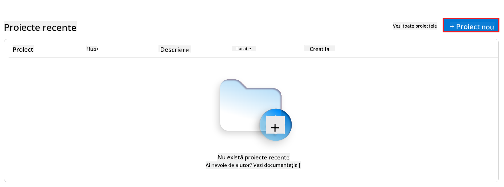
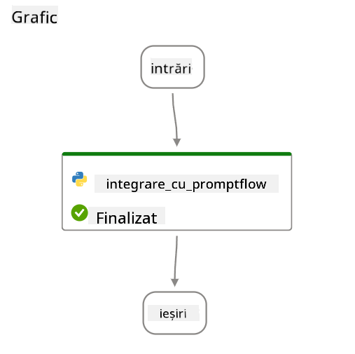

<!--
CO_OP_TRANSLATOR_METADATA:
{
  "original_hash": "80a853c08e4ee25ef9b4bfcedd8990da",
  "translation_date": "2025-05-09T17:14:51+00:00",
  "source_file": "md/02.Application/01.TextAndChat/Phi3/E2E_Phi-3-Evaluation_AIFoundry.md",
  "language_code": "ro"
}
-->
# Evaluarea modelului Phi-3 / Phi-3.5 ajustat fin în Azure AI Foundry, cu accent pe principiile Responsible AI ale Microsoft

Acest exemplu complet (E2E) se bazează pe ghidul "[Evaluate Fine-tuned Phi-3 / 3.5 Models in Azure AI Foundry Focusing on Microsoft's Responsible AI](https://techcommunity.microsoft.com/blog/educatordeveloperblog/evaluate-fine-tuned-phi-3--3-5-models-in-azure-ai-studio-focusing-on-microsofts-/4227850?WT.mc_id=aiml-137032-kinfeylo)" din Microsoft Tech Community.

## Prezentare generală

### Cum poți evalua siguranța și performanța unui model Phi-3 / Phi-3.5 ajustat fin în Azure AI Foundry?

Ajustarea fină a unui model poate duce uneori la răspunsuri neintenționate sau nedorite. Pentru a te asigura că modelul rămâne sigur și eficient, este important să evaluezi potențialul modelului de a genera conținut dăunător și capacitatea sa de a oferi răspunsuri corecte, relevante și coerente. În acest tutorial, vei învăța cum să evaluezi siguranța și performanța unui model Phi-3 / Phi-3.5 ajustat fin, integrat cu Prompt flow în Azure AI Foundry.

Iată procesul de evaluare în Azure AI Foundry.


*Sursa imaginii: [Evaluation of generative AI applications](https://learn.microsoft.com/azure/ai-studio/concepts/evaluation-approach-gen-ai?wt.mc_id%3Dstudentamb_279723)*

> [!NOTE]
>
> Pentru informații mai detaliate și pentru a explora resurse suplimentare despre Phi-3 / Phi-3.5, te rugăm să vizitezi [Phi-3CookBook](https://github.com/microsoft/Phi-3CookBook?wt.mc_id=studentamb_279723).

### Cerințe preliminare

- [Python](https://www.python.org/downloads)
- [Abonament Azure](https://azure.microsoft.com/free?wt.mc_id=studentamb_279723)
- [Visual Studio Code](https://code.visualstudio.com)
- Model Phi-3 / Phi-3.5 ajustat fin

### Cuprins

1. [**Scenariul 1: Introducere în evaluarea Prompt flow din Azure AI Foundry**](../../../../../../md/02.Application/01.TextAndChat/Phi3)

    - [Introducere în evaluarea siguranței](../../../../../../md/02.Application/01.TextAndChat/Phi3)
    - [Introducere în evaluarea performanței](../../../../../../md/02.Application/01.TextAndChat/Phi3)

1. [**Scenariul 2: Evaluarea modelului Phi-3 / Phi-3.5 în Azure AI Foundry**](../../../../../../md/02.Application/01.TextAndChat/Phi3)

    - [Înainte de a începe](../../../../../../md/02.Application/01.TextAndChat/Phi3)
    - [Implementarea Azure OpenAI pentru evaluarea modelului Phi-3 / Phi-3.5](../../../../../../md/02.Application/01.TextAndChat/Phi3)
    - [Evaluarea modelului Phi-3 / Phi-3.5 ajustat fin folosind evaluarea Prompt flow din Azure AI Foundry](../../../../../../md/02.Application/01.TextAndChat/Phi3)

1. [Felicitări!](../../../../../../md/02.Application/01.TextAndChat/Phi3)

## **Scenariul 1: Introducere în evaluarea Prompt flow din Azure AI Foundry**

### Introducere în evaluarea siguranței

Pentru a te asigura că modelul tău AI este etic și sigur, este esențial să îl evaluezi în raport cu principiile Responsible AI ale Microsoft. În Azure AI Foundry, evaluările de siguranță îți permit să analizezi vulnerabilitatea modelului la atacuri de tip jailbreak și potențialul acestuia de a genera conținut dăunător, ceea ce este direct în concordanță cu aceste principii.


*Sursa imaginii: [Evaluation of generative AI applications](https://learn.microsoft.com/azure/ai-studio/concepts/evaluation-approach-gen-ai?wt.mc_id%3Dstudentamb_279723)*

#### Principiile Responsible AI ale Microsoft

Înainte de a începe pașii tehnici, este important să înțelegi principiile Responsible AI ale Microsoft, un cadru etic conceput să ghideze dezvoltarea, implementarea și operarea responsabilă a sistemelor AI. Aceste principii orientează proiectarea, dezvoltarea și implementarea responsabilă a sistemelor AI, asigurând că tehnologiile AI sunt construite într-un mod corect, transparent și incluziv. Aceste principii stau la baza evaluării siguranței modelelor AI.

Principiile Responsible AI ale Microsoft includ:

- **Echitate și incluziune**: Sistemele AI ar trebui să trateze pe toată lumea corect și să evite să afecteze în mod diferit grupuri similare de persoane. De exemplu, când sistemele AI oferă recomandări privind tratamente medicale, cereri de împrumut sau angajări, acestea ar trebui să facă aceleași recomandări tuturor celor cu simptome, circumstanțe financiare sau calificări profesionale similare.

- **Fiabilitate și siguranță**: Pentru a construi încredere, este esențial ca sistemele AI să funcționeze fiabil, în siguranță și consecvent. Aceste sisteme trebuie să poată opera conform proiectului inițial, să răspundă în siguranță la condiții neprevăzute și să reziste manipulărilor dăunătoare. Modul în care se comportă și varietatea condițiilor pe care le pot gestiona reflectă gama de situații și circumstanțe anticipate de dezvoltatori în timpul proiectării și testării.

- **Transparență**: Atunci când sistemele AI ajută la luarea deciziilor cu impact major asupra vieților oamenilor, este esențial ca aceștia să înțeleagă cum au fost luate aceste decizii. De exemplu, o bancă poate folosi un sistem AI pentru a decide dacă o persoană este creditabilă. O companie poate folosi un sistem AI pentru a determina cei mai calificați candidați pentru angajare.

- **Confidențialitate și securitate**: Pe măsură ce AI devine tot mai prezentă, protejarea confidențialității și securizarea informațiilor personale și de afaceri devin din ce în ce mai importante și complexe. În cazul AI, confidențialitatea și securitatea datelor necesită o atenție sporită, deoarece accesul la date este esențial pentru ca sistemele AI să facă predicții și decizii precise și bine informate despre persoane.

- **Responsabilitate**: Persoanele care proiectează și implementează sistemele AI trebuie să fie responsabile pentru modul în care acestea funcționează. Organizațiile ar trebui să se bazeze pe standarde din industrie pentru a dezvolta norme de responsabilitate. Aceste norme pot asigura că sistemele AI nu sunt autoritatea finală în nicio decizie care afectează viața oamenilor. De asemenea, pot asigura că oamenii păstrează un control semnificativ asupra sistemelor AI altfel foarte autonome.


*Sursa imaginii: [What is Responsible AI?](https://learn.microsoft.com/azure/machine-learning/concept-responsible-ai?view=azureml-api-2&viewFallbackFrom=azureml-api-2%253fwt.mc_id%3Dstudentamb_279723)*

> [!NOTE]
> Pentru a afla mai multe despre principiile Responsible AI ale Microsoft, vizitează [What is Responsible AI?](https://learn.microsoft.com/azure/machine-learning/concept-responsible-ai?view=azureml-api-2?wt.mc_id=studentamb_279723).

#### Metrici de siguranță

În acest tutorial, vei evalua siguranța modelului Phi-3 ajustat fin folosind metricile de siguranță din Azure AI Foundry. Aceste metrici te ajută să evaluezi potențialul modelului de a genera conținut dăunător și vulnerabilitatea sa la atacuri de tip jailbreak. Metricile de siguranță includ:

- **Conținut legat de auto-vătămare**: Evaluează dacă modelul are tendința de a produce conținut legat de auto-vătămare.
- **Conținut plin de ură și inechitabil**: Evaluează dacă modelul are tendința de a genera conținut plin de ură sau inechitabil.
- **Conținut violent**: Evaluează dacă modelul are tendința de a produce conținut violent.
- **Conținut sexual**: Evaluează dacă modelul are tendința de a genera conținut sexual inadecvat.

Evaluarea acestor aspecte asigură că modelul AI nu produce conținut dăunător sau ofensator, aliniindu-se cu valorile societale și standardele de reglementare.


### Introducere în evaluarea performanței

Pentru a te asigura că modelul tău AI funcționează conform așteptărilor, este important să îi evaluezi performanța pe baza unor metrici specifice. În Azure AI Foundry, evaluările de performanță îți permit să analizezi eficiența modelului în generarea de răspunsuri corecte, relevante și coerente.


*Sursa imaginii: [Evaluation of generative AI applications](https://learn.microsoft.com/azure/ai-studio/concepts/evaluation-approach-gen-ai?wt.mc_id%3Dstudentamb_279723)*

#### Metrici de performanță

În acest tutorial, vei evalua performanța modelului Phi-3 / Phi-3.5 ajustat fin folosind metricile de performanță din Azure AI Foundry. Aceste metrici te ajută să analizezi eficiența modelului în generarea de răspunsuri corecte, relevante și coerente. Metricile de performanță includ:

- **Fundamentare**: Evaluează cât de bine se aliniază răspunsurile generate cu informațiile din sursa de intrare.
- **Relevanță**: Evaluează pertinenta răspunsurilor generate față de întrebările puse.
- **Coerență**: Evaluează cât de fluent curge textul generat, dacă se citește natural și seamănă cu limbajul uman.
- **Fluență**: Evaluează competența lingvistică a textului generat.
- **Similaritate GPT**: Compară răspunsul generat cu adevărul de bază pentru similaritate.
- **Scor F1**: Calculează raportul cuvintelor comune între răspunsul generat și datele sursă.

Aceste metrici te ajută să evaluezi eficiența modelului în generarea de răspunsuri corecte, relevante și coerente.


## **Scenariul 2: Evaluarea modelului Phi-3 / Phi-3.5 în Azure AI Foundry**

### Înainte de a începe

Acest tutorial este o continuare a postărilor anterioare de pe blog, "[Fine-Tune and Integrate Custom Phi-3 Models with Prompt Flow: Step-by-Step Guide](https://techcommunity.microsoft.com/t5/educator-developer-blog/fine-tune-and-integrate-custom-phi-3-models-with-prompt-flow/ba-p/4178612?wt.mc_id=studentamb_279723)" și "[Fine-Tune and Integrate Custom Phi-3 Models with Prompt Flow in Azure AI Foundry](https://techcommunity.microsoft.com/t5/educator-developer-blog/fine-tune-and-integrate-custom-phi-3-models-with-prompt-flow-in/ba-p/4191726?wt.mc_id=studentamb_279723)." În aceste postări, am parcurs procesul de ajustare fină a unui model Phi-3 / Phi-3.5 în Azure AI Foundry și integrarea acestuia cu Prompt flow.

În acest tutorial, vei implementa un model Azure OpenAI ca evaluator în Azure AI Foundry și îl vei folosi pentru a evalua modelul tău Phi-3 / Phi-3.5 ajustat fin.

Înainte de a începe acest tutorial, asigură-te că ai următoarele cerințe preliminare, așa cum au fost descrise în tutorialele anterioare:

1. Un set de date pregătit pentru evaluarea modelului Phi-3 / Phi-3.5 ajustat fin.
1. Un model Phi-3 / Phi-3.5 care a fost ajustat fin și implementat în Azure Machine Learning.
1. Un Prompt flow integrat cu modelul tău Phi-3 / Phi-3.5 ajustat fin în Azure AI Foundry.

> [!NOTE]
> Vei folosi fișierul *test_data.jsonl*, aflat în folderul data din setul de date **ULTRACHAT_200k** descărcat în postările anterioare, ca set de date pentru evaluarea modelului Phi-3 / Phi-3.5 ajustat fin.

#### Integrarea modelului personalizat Phi-3 / Phi-3.5 cu Prompt flow în Azure AI Foundry (abordarea code-first)

> [!NOTE]
> Dacă ai urmat abordarea low-code descrisă în "[Fine-Tune and Integrate Custom Phi-3 Models with Prompt Flow in Azure AI Foundry](https://techcommunity.microsoft.com/t5/educator-developer-blog/fine-tune-and-integrate-custom-phi-3-models-with-prompt-flow-in/ba-p/4191726?wt.mc_id=studentamb_279723)", poți sări peste acest exercițiu și să continui cu următorul.
> Totuși, dacă ai urmat abordarea code-first descrisă în "[Fine-Tune and Integrate Custom Phi-3 Models with Prompt Flow: Step-by-Step Guide](https://techcommunity.microsoft.com/t5/educator-developer-blog/fine-tune-and-integrate-custom-phi-3-models-with-prompt-flow/ba-p/4178612?wt.mc_id=studentamb_279723)" pentru ajustarea fină și implementarea modelului Phi-3 / Phi-3.5, procesul de conectare a modelului tău la Prompt flow este ușor diferit. Vei învăța acest proces în acest exercițiu.

Pentru a continua, trebuie să integrezi modelul tău Phi-3 / Phi-3.5 ajustat fin în Prompt flow în Azure AI Foundry.

#### Creează un Hub Azure AI Foundry

Trebuie să creezi un Hub înainte de a crea un Proiect. Un Hub funcționează ca un Resource Group, permițându-ți să organizezi și să gestionezi mai multe Proiecte în Azure AI Foundry.

1. Conectează-te la [Azure AI Foundry](https://ai.azure.com/?wt.mc_id=studentamb_279723).

1. Selectează **All hubs** din meniul lateral stâng.

1. Selectează **+ New hub** din meniul de navigare.

    

1. Realizează următoarele acțiuni:

    - Introdu un **Hub name**. Trebuie să fie o valoare unică.
    - Selectează abonamentul tău Azure (**Subscription**).
    - Selectează **Resource group** pe care vrei să îl folosești (creează unul nou dacă este necesar).
    - Selectează **Location** pe care vrei să o folosești.
    - Selectează **Connect Azure AI Services** pe care vrei să îl folosești (creează unul nou dacă este necesar).
    - Selectează **Connect Azure AI Search** și alege **Skip connecting**.


1. Selectați **Next**.

#### Creați un proiect Azure AI Foundry

1. În Hub-ul pe care l-ați creat, selectați **All projects** din fila din partea stângă.

1. Selectați **+ New project** din meniul de navigare.

    

1. Introduceți **Project name**. Trebuie să fie o valoare unică.

    

1. Selectați **Create a project**.

#### Adăugați o conexiune personalizată pentru modelul Phi-3 / Phi-3.5 ajustat fin

Pentru a integra modelul dvs. personalizat Phi-3 / Phi-3.5 cu Prompt flow, trebuie să salvați endpoint-ul și cheia modelului într-o conexiune personalizată. Această configurare asigură accesul la modelul dvs. Phi-3 / Phi-3.5 personalizat în Prompt flow.

#### Configurați cheia api și URI-ul endpoint-ului modelului Phi-3 / Phi-3.5 ajustat fin

1. Vizitați [Azure ML Studio](https://ml.azure.com/home?wt.mc_id=studentamb_279723).

1. Navigați la workspace-ul Azure Machine learning pe care l-ați creat.

1. Selectați **Endpoints** din fila din partea stângă.

    

1. Selectați endpoint-ul pe care l-ați creat.

    

1. Selectați **Consume** din meniul de navigare.

1. Copiați **REST endpoint** și **Primary key**.

    

#### Adăugați conexiunea personalizată

1. Vizitați [Azure AI Foundry](https://ai.azure.com/?wt.mc_id=studentamb_279723).

1. Navigați la proiectul Azure AI Foundry pe care l-ați creat.

1. În proiectul creat, selectați **Settings** din fila din partea stângă.

1. Selectați **+ New connection**.

    

1. Selectați **Custom keys** din meniul de navigare.

    

1. Efectuați următoarele acțiuni:

    - Selectați **+ Add key value pairs**.
    - Pentru numele cheii, introduceți **endpoint** și lipiți endpoint-ul copiat din Azure ML Studio în câmpul de valoare.
    - Selectați din nou **+ Add key value pairs**.
    - Pentru numele cheii, introduceți **key** și lipiți cheia copiată din Azure ML Studio în câmpul de valoare.
    - După adăugarea cheilor, selectați **is secret** pentru a împiedica expunerea cheii.

    

1. Selectați **Add connection**.

#### Creați Prompt flow

Ați adăugat o conexiune personalizată în Azure AI Foundry. Acum, să creăm un Prompt flow folosind pașii următori. Apoi, veți conecta acest Prompt flow la conexiunea personalizată pentru a folosi modelul ajustat fin în cadrul Prompt flow.

1. Navigați la proiectul Azure AI Foundry pe care l-ați creat.

1. Selectați **Prompt flow** din fila din partea stângă.

1. Selectați **+ Create** din meniul de navigare.

    

1. Selectați **Chat flow** din meniul de navigare.

    

1. Introduceți **Folder name** pe care doriți să-l folosiți.

    

1. Selectați **Create**.

#### Configurați Prompt flow pentru a conversa cu modelul dvs. personalizat Phi-3 / Phi-3.5

Trebuie să integrați modelul Phi-3 / Phi-3.5 ajustat fin într-un Prompt flow. Totuși, Prompt flow-ul existent nu este proiectat pentru acest scop. Prin urmare, trebuie să reproiectați Prompt flow-ul pentru a permite integrarea modelului personalizat.

1. În Prompt flow, efectuați următoarele pentru a reconstrui fluxul existent:

    - Selectați **Raw file mode**.
    - Ștergeți tot codul existent din fișierul *flow.dag.yml*.
    - Adăugați următorul cod în *flow.dag.yml*.

        ```yml
        inputs:
          input_data:
            type: string
            default: "Who founded Microsoft?"

        outputs:
          answer:
            type: string
            reference: ${integrate_with_promptflow.output}

        nodes:
        - name: integrate_with_promptflow
          type: python
          source:
            type: code
            path: integrate_with_promptflow.py
          inputs:
            input_data: ${inputs.input_data}
        ```

    - Selectați **Save**.

    

1. Adăugați următorul cod în *integrate_with_promptflow.py* pentru a folosi modelul personalizat Phi-3 / Phi-3.5 în Prompt flow.

    ```python
    import logging
    import requests
    from promptflow import tool
    from promptflow.connections import CustomConnection

    # Logging setup
    logging.basicConfig(
        format="%(asctime)s - %(levelname)s - %(name)s - %(message)s",
        datefmt="%Y-%m-%d %H:%M:%S",
        level=logging.DEBUG
    )
    logger = logging.getLogger(__name__)

    def query_phi3_model(input_data: str, connection: CustomConnection) -> str:
        """
        Send a request to the Phi-3 / Phi-3.5 model endpoint with the given input data using Custom Connection.
        """

        # "connection" is the name of the Custom Connection, "endpoint", "key" are the keys in the Custom Connection
        endpoint_url = connection.endpoint
        api_key = connection.key

        headers = {
            "Content-Type": "application/json",
            "Authorization": f"Bearer {api_key}"
        }
    data = {
        "input_data": [input_data],
        "params": {
            "temperature": 0.7,
            "max_new_tokens": 128,
            "do_sample": True,
            "return_full_text": True
            }
        }
        try:
            response = requests.post(endpoint_url, json=data, headers=headers)
            response.raise_for_status()
            
            # Log the full JSON response
            logger.debug(f"Full JSON response: {response.json()}")

            result = response.json()["output"]
            logger.info("Successfully received response from Azure ML Endpoint.")
            return result
        except requests.exceptions.RequestException as e:
            logger.error(f"Error querying Azure ML Endpoint: {e}")
            raise

    @tool
    def my_python_tool(input_data: str, connection: CustomConnection) -> str:
        """
        Tool function to process input data and query the Phi-3 / Phi-3.5 model.
        """
        return query_phi3_model(input_data, connection)

    ```

    

> [!NOTE]
> Pentru informații mai detaliate despre utilizarea Prompt flow în Azure AI Foundry, puteți consulta [Prompt flow in Azure AI Foundry](https://learn.microsoft.com/azure/ai-studio/how-to/prompt-flow).

1. Selectați **Chat input**, **Chat output** pentru a activa conversația cu modelul dvs.

    

1. Acum sunteți gata să conversați cu modelul dvs. personalizat Phi-3 / Phi-3.5. În exercițiul următor, veți învăța cum să porniți Prompt flow și să-l folosiți pentru a discuta cu modelul dvs. ajustat fin Phi-3 / Phi-3.5.

> [!NOTE]
>
> Fluxul reconstruit ar trebui să arate ca în imaginea de mai jos:
>
> 
>

#### Porniți Prompt flow

1. Selectați **Start compute sessions** pentru a porni Prompt flow.

    

1. Selectați **Validate and parse input** pentru a reînnoi parametrii.

    

1. Selectați **Value** al **connection** către conexiunea personalizată pe care ați creat-o. De exemplu, *connection*.

    

#### Conversați cu modelul dvs. personalizat Phi-3 / Phi-3.5

1. Selectați **Chat**.

    

1. Iată un exemplu de rezultate: acum puteți conversa cu modelul dvs. personalizat Phi-3 / Phi-3.5. Se recomandă să puneți întrebări bazate pe datele folosite pentru ajustarea fină.

    

### Implementați Azure OpenAI pentru a evalua modelul Phi-3 / Phi-3.5

Pentru a evalua modelul Phi-3 / Phi-3.5 în Azure AI Foundry, trebuie să implementați un model Azure OpenAI. Acest model va fi folosit pentru a evalua performanța modelului Phi-3 / Phi-3.5.

#### Implementați Azure OpenAI

1. Autentificați-vă în [Azure AI Foundry](https://ai.azure.com/?wt.mc_id=studentamb_279723).

1. Navigați la proiectul Azure AI Foundry pe care l-ați creat.

    

1. În proiectul pe care l-ați creat, selectați **Deployments** din fila din partea stângă.

1. Selectați **+ Deploy model** din meniul de navigare.

1. Selectați **Deploy base model**.

    

1. Selectați modelul Azure OpenAI pe care doriți să îl folosiți. De exemplu, **gpt-4o**.

    

1. Selectați **Confirm**.

### Evaluați modelul Phi-3 / Phi-3.5 ajustat fin folosind evaluarea Prompt flow din Azure AI Foundry

### Porniți o evaluare nouă

1. Vizitați [Azure AI Foundry](https://ai.azure.com/?wt.mc_id=studentamb_279723).

1. Navigați la proiectul Azure AI Foundry pe care l-ați creat.

    

1. În proiectul pe care l-ați creat, selectați **Evaluation** din fila din partea stângă.

1. Selectați **+ New evaluation** din meniul de navigare.


1. Selectați evaluarea **Prompt flow**.

    

1. efectuați următoarele sarcini:

    - Introduceți numele evaluării. Trebuie să fie o valoare unică.
    - Selectați **Question and answer without context** ca tip de sarcină. Deoarece setul de date **UlTRACHAT_200k** folosit în acest tutorial nu conține context.
    - Selectați prompt flow-ul pe care doriți să-l evaluați.

    

1. Selectați **Next**.

1. efectuați următoarele sarcini:

    - Selectați **Add your dataset** pentru a încărca setul de date. De exemplu, puteți încărca fișierul de test, cum ar fi *test_data.json1*, inclus atunci când descărcați setul de date **ULTRACHAT_200k**.
    - Selectați coloana corespunzătoare din **Dataset column** care se potrivește cu setul dumneavoastră de date. De exemplu, dacă folosiți setul **ULTRACHAT_200k**, selectați **${data.prompt}** ca și coloană.

    

1. Selectați **Next**.

1. efectuați următoarele sarcini pentru a configura metricile de performanță și calitate:

    - Selectați metricile de performanță și calitate pe care doriți să le utilizați.
    - Selectați modelul Azure OpenAI creat pentru evaluare. De exemplu, selectați **gpt-4o**.

    

1. efectuați următoarele sarcini pentru a configura metricile de risc și siguranță:

    - Selectați metricile de risc și siguranță pe care doriți să le utilizați.
    - Selectați pragul pentru calcularea ratei de defecte pe care doriți să îl folosiți. De exemplu, selectați **Medium**.
    - Pentru **question**, selectați **Data source** la **{$data.prompt}**.
    - Pentru **answer**, selectați **Data source** la **{$run.outputs.answer}**.
    - Pentru **ground_truth**, selectați **Data source** la **{$data.message}**.

    

1. Selectați **Next**.

1. Selectați **Submit** pentru a începe evaluarea.

1. Evaluarea va dura ceva timp până se finalizează. Puteți monitoriza progresul în fila **Evaluation**.

### Revizuiți rezultatele evaluării

> [!NOTE]
> Rezultatele prezentate mai jos sunt destinate să ilustreze procesul de evaluare. În acest tutorial, am folosit un model ajustat pe un set de date relativ mic, ceea ce poate conduce la rezultate suboptimale. Rezultatele reale pot varia semnificativ în funcție de dimensiunea, calitatea și diversitatea setului de date utilizat, precum și de configurația specifică a modelului.

După finalizarea evaluării, puteți analiza rezultatele pentru metricile de performanță și siguranță.

1. Metrici de performanță și calitate:

    - evaluați eficiența modelului în generarea unor răspunsuri coerente, fluente și relevante.

    

1. Metrici de risc și siguranță:

    - Asigurați-vă că rezultatele modelului sunt sigure și respectă Principiile Responsible AI, evitând orice conținut dăunător sau ofensator.

    

1. Puteți derula în jos pentru a vedea **Detailed metrics result**.

    

1. Prin evaluarea modelului personalizat Phi-3 / Phi-3.5 atât pe metrici de performanță, cât și de siguranță, puteți confirma că modelul nu este doar eficient, ci respectă și practicile responsabile AI, fiind gata pentru implementare în lumea reală.

## Felicitări!

### Ați finalizat acest tutorial

Ați evaluat cu succes modelul Phi-3 ajustat și integrat cu Prompt flow în Azure AI Foundry. Acesta este un pas important pentru a vă asigura că modelele AI nu doar performează bine, ci respectă și principiile Responsible AI Microsoft, ajutându-vă să construiți aplicații AI de încredere și fiabile.


## Curățare resurse Azure

Curățați resursele Azure pentru a evita costuri suplimentare pe contul dumneavoastră. Accesați portalul Azure și ștergeți următoarele resurse:

- Resursa Azure Machine learning.
- Endpoint-ul modelului Azure Machine learning.
- Resursa Azure AI Foundry Project.
- Resursa Azure AI Foundry Prompt flow.

### Pași următori

#### Documentație

- [Assess AI systems by using the Responsible AI dashboard](https://learn.microsoft.com/azure/machine-learning/concept-responsible-ai-dashboard?view=azureml-api-2&source=recommendations?wt.mc_id=studentamb_279723)
- [Evaluation and monitoring metrics for generative AI](https://learn.microsoft.com/azure/ai-studio/concepts/evaluation-metrics-built-in?tabs=definition?wt.mc_id=studentamb_279723)
- [Azure AI Foundry documentation](https://learn.microsoft.com/azure/ai-studio/?wt.mc_id=studentamb_279723)
- [Prompt flow documentation](https://microsoft.github.io/promptflow/?wt.mc_id=studentamb_279723)

#### Conținut de instruire

- [Introduction to Microsoft's Responsible AI Approach](https://learn.microsoft.com/training/modules/introduction-to-microsofts-responsible-ai-approach/?source=recommendations?wt.mc_id=studentamb_279723)
- [Introduction to Azure AI Foundry](https://learn.microsoft.com/training/modules/introduction-to-azure-ai-studio/?wt.mc_id=studentamb_279723)

### Referințe

- [What is Responsible AI?](https://learn.microsoft.com/azure/machine-learning/concept-responsible-ai?view=azureml-api-2?wt.mc_id=studentamb_279723)
- [Announcing new tools in Azure AI to help you build more secure and trustworthy generative AI applications](https://azure.microsoft.com/blog/announcing-new-tools-in-azure-ai-to-help-you-build-more-secure-and-trustworthy-generative-ai-applications/?wt.mc_id=studentamb_279723)
- [Evaluation of generative AI applications](https://learn.microsoft.com/azure/ai-studio/concepts/evaluation-approach-gen-ai?wt.mc_id%3Dstudentamb_279723)

**Declinare a responsabilității**:  
Acest document a fost tradus folosind serviciul de traducere AI [Co-op Translator](https://github.com/Azure/co-op-translator). Deși ne străduim pentru acuratețe, vă rugăm să rețineți că traducerile automate pot conține erori sau inexactități. Documentul original în limba sa nativă trebuie considerat sursa autoritară. Pentru informații critice, se recomandă traducerea profesională realizată de un specialist uman. Nu ne asumăm răspunderea pentru eventualele neînțelegeri sau interpretări greșite rezultate din utilizarea acestei traduceri.