<!--
CO_OP_TRANSLATOR_METADATA:
{
  "original_hash": "455be2b7b9c3390d367d528f8fab2aa0",
  "translation_date": "2025-07-17T00:44:49+00:00",
  "source_file": "md/02.Application/01.TextAndChat/Phi3/E2E_Phi-3-FineTuning_PromptFlow_Integration.md",
  "language_code": "ro"
}
-->
# Ajustați și integrați modelele personalizate Phi-3 cu Prompt flow

Acest exemplu end-to-end (E2E) se bazează pe ghidul „[Fine-Tune and Integrate Custom Phi-3 Models with Prompt Flow: Step-by-Step Guide](https://techcommunity.microsoft.com/t5/educator-developer-blog/fine-tune-and-integrate-custom-phi-3-models-with-prompt-flow/ba-p/4178612?WT.mc_id=aiml-137032-kinfeylo)” din Microsoft Tech Community. Acesta prezintă procesele de ajustare fină, implementare și integrare a modelelor personalizate Phi-3 cu Prompt flow.

## Prezentare generală

În acest exemplu E2E, veți învăța cum să ajustați fin modelul Phi-3 și să îl integrați cu Prompt flow. Folosind Azure Machine Learning și Prompt flow, veți stabili un flux de lucru pentru implementarea și utilizarea modelelor AI personalizate. Acest exemplu E2E este împărțit în trei scenarii:

**Scenariul 1: Configurarea resurselor Azure și pregătirea pentru ajustarea fină**

**Scenariul 2: Ajustarea fină a modelului Phi-3 și implementarea în Azure Machine Learning Studio**

**Scenariul 3: Integrarea cu Prompt flow și conversația cu modelul personalizat**

Iată o prezentare generală a acestui exemplu E2E.

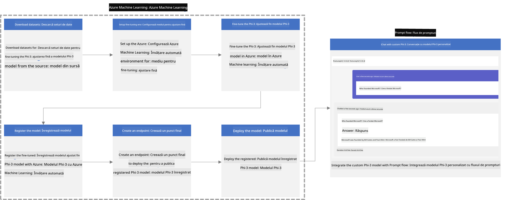

### Cuprins

1. **[Scenariul 1: Configurarea resurselor Azure și pregătirea pentru ajustarea fină](../../../../../../md/02.Application/01.TextAndChat/Phi3)**
    - [Crearea unui Workspace Azure Machine Learning](../../../../../../md/02.Application/01.TextAndChat/Phi3)
    - [Solicitarea cotelor GPU în abonamentul Azure](../../../../../../md/02.Application/01.TextAndChat/Phi3)
    - [Adăugarea unei atribuiri de rol](../../../../../../md/02.Application/01.TextAndChat/Phi3)
    - [Configurarea proiectului](../../../../../../md/02.Application/01.TextAndChat/Phi3)
    - [Pregătirea setului de date pentru ajustarea fină](../../../../../../md/02.Application/01.TextAndChat/Phi3)

1. **[Scenariul 2: Ajustarea fină a modelului Phi-3 și implementarea în Azure Machine Learning Studio](../../../../../../md/02.Application/01.TextAndChat/Phi3)**
    - [Configurarea Azure CLI](../../../../../../md/02.Application/01.TextAndChat/Phi3)
    - [Ajustarea fină a modelului Phi-3](../../../../../../md/02.Application/01.TextAndChat/Phi3)
    - [Implementarea modelului ajustat](../../../../../../md/02.Application/01.TextAndChat/Phi3)

1. **[Scenariul 3: Integrarea cu Prompt flow și conversația cu modelul personalizat](../../../../../../md/02.Application/01.TextAndChat/Phi3)**
    - [Integrarea modelului personalizat Phi-3 cu Prompt flow](../../../../../../md/02.Application/01.TextAndChat/Phi3)
    - [Conversația cu modelul personalizat](../../../../../../md/02.Application/01.TextAndChat/Phi3)

## Scenariul 1: Configurarea resurselor Azure și pregătirea pentru ajustarea fină

### Crearea unui Workspace Azure Machine Learning

1. Tastați *azure machine learning* în **bara de căutare** din partea de sus a paginii portalului și selectați **Azure Machine Learning** din opțiunile afișate.

    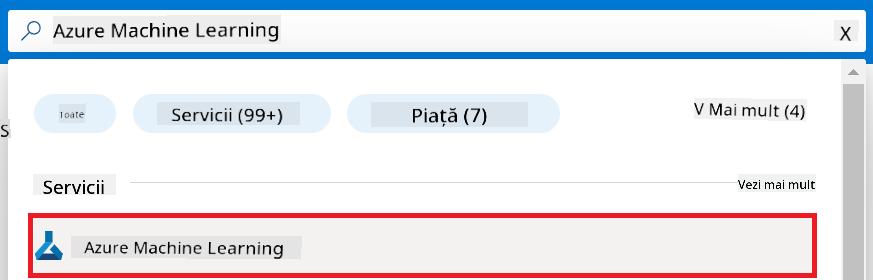

1. Selectați **+ Create** din meniul de navigare.

1. Selectați **New workspace** din meniul de navigare.

    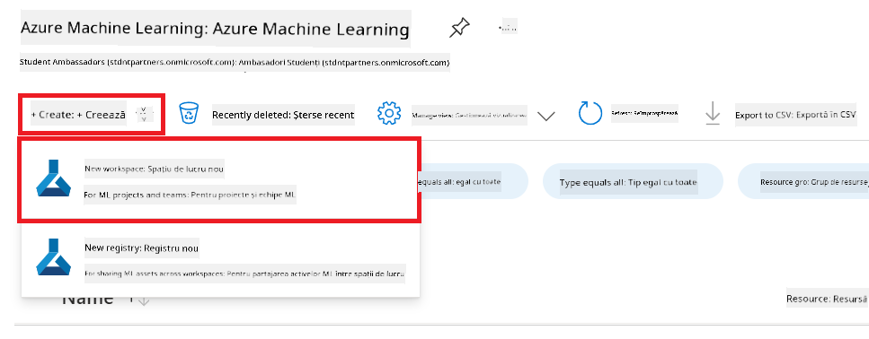

1. Efectuați următoarele acțiuni:

    - Selectați **Subscription** Azure.
    - Selectați **Resource group** pe care doriți să îl folosiți (creați unul nou dacă este necesar).
    - Introduceți **Workspace Name**. Trebuie să fie o valoare unică.
    - Selectați **Region** pe care doriți să o utilizați.
    - Selectați **Storage account** pe care doriți să îl folosiți (creați unul nou dacă este necesar).
    - Selectați **Key vault** pe care doriți să îl folosiți (creați unul nou dacă este necesar).
    - Selectați **Application insights** pe care doriți să îl folosiți (creați unul nou dacă este necesar).
    - Selectați **Container registry** pe care doriți să îl folosiți (creați unul nou dacă este necesar).

    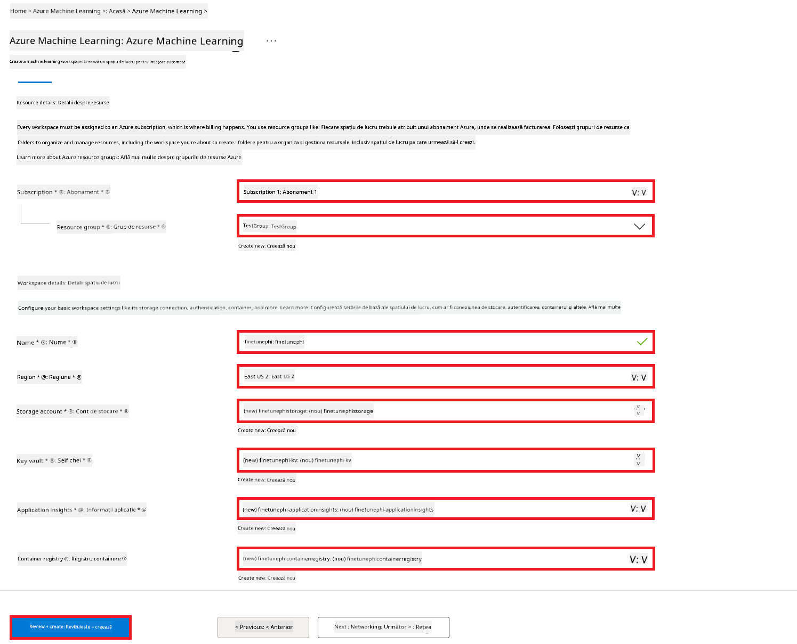

1. Selectați **Review + Create**.

1. Selectați **Create**.

### Solicitarea cotelor GPU în abonamentul Azure

În acest exemplu E2E, veți folosi *Standard_NC24ads_A100_v4 GPU* pentru ajustarea fină, care necesită o solicitare de cotă, și *Standard_E4s_v3* CPU pentru implementare, care nu necesită solicitare de cotă.

> [!NOTE]
>
> Doar abonamentele Pay-As-You-Go (tipul standard de abonament) sunt eligibile pentru alocarea GPU; abonamentele de tip beneficii nu sunt acceptate în prezent.
>
> Pentru cei care folosesc abonamente de tip beneficii (cum ar fi Visual Studio Enterprise Subscription) sau doresc să testeze rapid procesul de ajustare fină și implementare, acest tutorial oferă și indicații pentru ajustarea fină cu un set minim de date folosind CPU. Totuși, este important de menționat că rezultatele ajustării fine sunt semnificativ mai bune când se folosește GPU cu seturi de date mai mari.

1. Accesați [Azure ML Studio](https://ml.azure.com/home?wt.mc_id=studentamb_279723).

1. Efectuați următoarele acțiuni pentru a solicita cota *Standard NCADSA100v4 Family*:

    - Selectați **Quota** din fila din stânga.
    - Selectați **Virtual machine family** pe care doriți să o folosiți. De exemplu, selectați **Standard NCADSA100v4 Family Cluster Dedicated vCPUs**, care include GPU-ul *Standard_NC24ads_A100_v4*.
    - Selectați **Request quota** din meniul de navigare.

        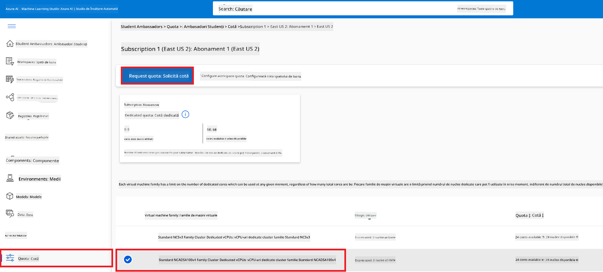

    - În pagina Request quota, introduceți **New cores limit** pe care doriți să îl utilizați. De exemplu, 24.
    - În pagina Request quota, selectați **Submit** pentru a trimite cererea de cotă GPU.

> [!NOTE]
> Puteți selecta GPU-ul sau CPU-ul potrivit nevoilor dvs. consultând documentul [Sizes for Virtual Machines in Azure](https://learn.microsoft.com/azure/virtual-machines/sizes/overview?tabs=breakdownseries%2Cgeneralsizelist%2Ccomputesizelist%2Cmemorysizelist%2Cstoragesizelist%2Cgpusizelist%2Cfpgasizelist%2Chpcsizelist).

### Adăugarea unei atribuiri de rol

Pentru a ajusta fin și implementa modelele, trebuie mai întâi să creați o Identitate Gestionată Atribuită Utilizatorului (User Assigned Managed Identity - UAI) și să îi atribuiți permisiunile corespunzătoare. Această UAI va fi folosită pentru autentificare în timpul implementării.

#### Crearea unei User Assigned Managed Identity (UAI)

1. Tastați *managed identities* în **bara de căutare** din partea de sus a paginii portalului și selectați **Managed Identities** din opțiunile afișate.

    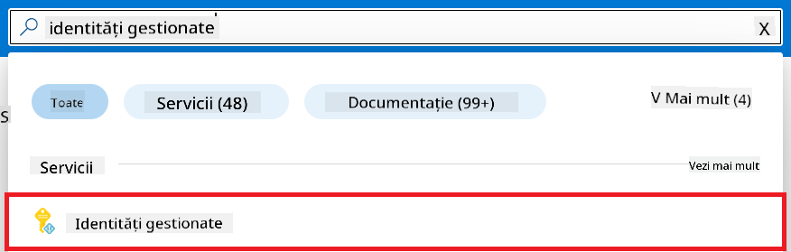

1. Selectați **+ Create**.

    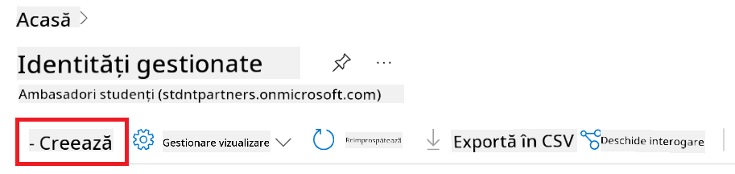

1. Efectuați următoarele acțiuni:

    - Selectați **Subscription** Azure.
    - Selectați **Resource group** pe care doriți să îl folosiți (creați unul nou dacă este necesar).
    - Selectați **Region** pe care doriți să o utilizați.
    - Introduceți **Name**. Trebuie să fie o valoare unică.

1. Selectați **Review + create**.

1. Selectați **+ Create**.

#### Adăugarea rolului Contributor la Managed Identity

1. Navigați la resursa Managed Identity pe care ați creat-o.

1. Selectați **Azure role assignments** din fila din stânga.

1. Selectați **+Add role assignment** din meniul de navigare.

1. În pagina Add role assignment, efectuați următoarele acțiuni:
    - Selectați **Scope** la **Resource group**.
    - Selectați **Subscription** Azure.
    - Selectați **Resource group** pe care doriți să îl folosiți.
    - Selectați **Role** la **Contributor**.

    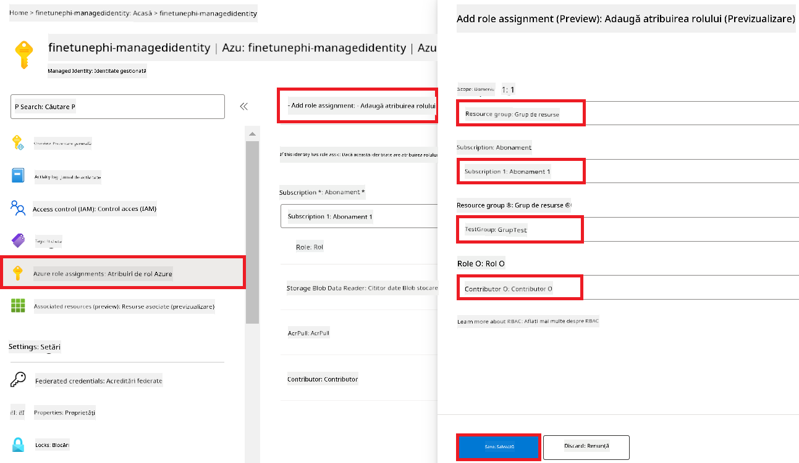

1. Selectați **Save**.

#### Adăugarea rolului Storage Blob Data Reader la Managed Identity

1. Tastați *storage accounts* în **bara de căutare** din partea de sus a paginii portalului și selectați **Storage accounts** din opțiunile afișate.

    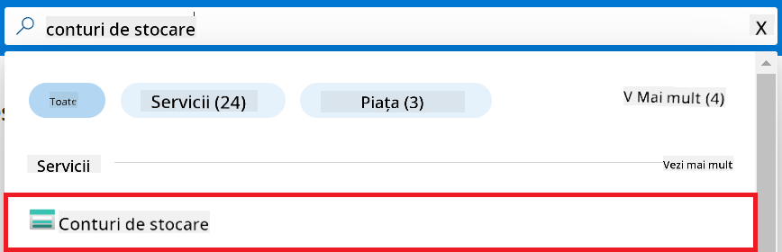

1. Selectați contul de stocare asociat cu workspace-ul Azure Machine Learning pe care l-ați creat. De exemplu, *finetunephistorage*.

1. Efectuați următoarele acțiuni pentru a naviga la pagina Add role assignment:

    - Navigați la contul Azure Storage pe care l-ați creat.
    - Selectați **Access Control (IAM)** din fila din stânga.
    - Selectați **+ Add** din meniul de navigare.
    - Selectați **Add role assignment** din meniul de navigare.

    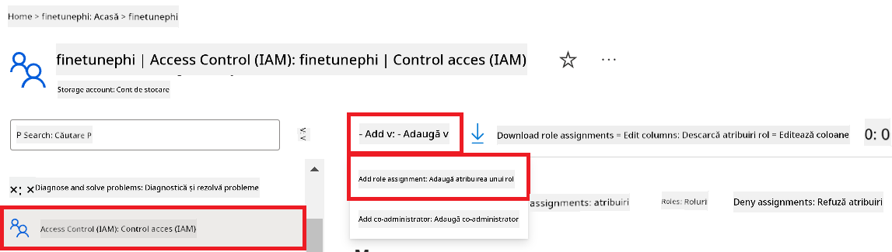

1. În pagina Add role assignment, efectuați următoarele acțiuni:

    - În pagina Role, tastați *Storage Blob Data Reader* în **bara de căutare** și selectați **Storage Blob Data Reader** din opțiunile afișate.
    - În pagina Role, selectați **Next**.
    - În pagina Members, selectați **Assign access to** **Managed identity**.
    - În pagina Members, selectați **+ Select members**.
    - În pagina Select managed identities, selectați **Subscription** Azure.
    - În pagina Select managed identities, selectați **Managed identity** la **Manage Identity**.
    - În pagina Select managed identities, selectați Managed Identity pe care ați creat-o. De exemplu, *finetunephi-managedidentity*.
    - În pagina Select managed identities, selectați **Select**.

    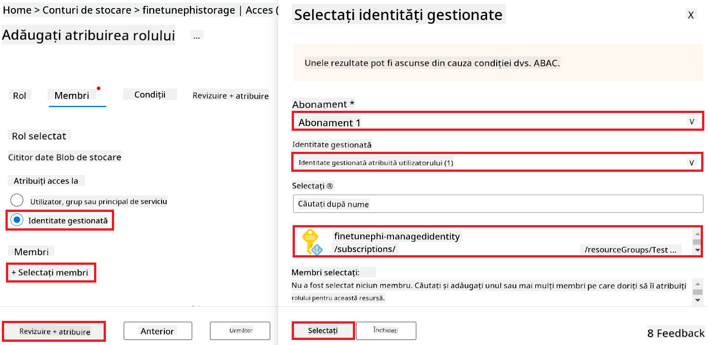

1. Selectați **Review + assign**.

#### Adăugarea rolului AcrPull la Managed Identity

1. Tastați *container registries* în **bara de căutare** din partea de sus a paginii portalului și selectați **Container registries** din opțiunile afișate.

    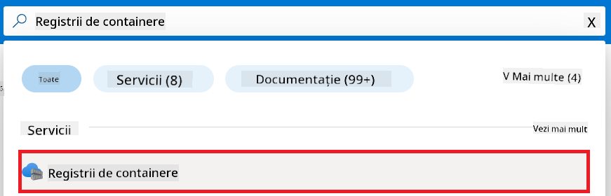

1. Selectați container registry asociat cu workspace-ul Azure Machine Learning. De exemplu, *finetunephicontainerregistries*

1. Efectuați următoarele acțiuni pentru a naviga la pagina Add role assignment:

    - Selectați **Access Control (IAM)** din fila din stânga.
    - Selectați **+ Add** din meniul de navigare.
    - Selectați **Add role assignment** din meniul de navigare.

1. În pagina Add role assignment, efectuați următoarele acțiuni:

    - În pagina Role, tastați *AcrPull* în **bara de căutare** și selectați **AcrPull** din opțiunile afișate.
    - În pagina Role, selectați **Next**.
    - În pagina Members, selectați **Assign access to** **Managed identity**.
    - În pagina Members, selectați **+ Select members**.
    - În pagina Select managed identities, selectați **Subscription** Azure.
    - În pagina Select managed identities, selectați **Managed identity** la **Manage Identity**.
    - În pagina Select managed identities, selectați Managed Identity pe care ați creat-o. De exemplu, *finetunephi-managedidentity*.
    - În pagina Select managed identities, selectați **Select**.
    - Selectați **Review + assign**.

### Configurarea proiectului

Acum, veți crea un folder în care să lucrați și veți configura un mediu virtual pentru a dezvolta un program care interacționează cu utilizatorii și folosește istoricul conversațiilor stocat în Azure Cosmos DB pentru a-și informa răspunsurile.

#### Crearea unui folder în care să lucrați

1. Deschideți o fereastră de terminal și tastați următoarea comandă pentru a crea un folder numit *finetune-phi* în calea implicită.

    ```console
    mkdir finetune-phi
    ```

1. Tastați următoarea comandă în terminal pentru a naviga în folderul *finetune-phi* pe care l-ați creat.

    ```console
    cd finetune-phi
    ```

#### Crearea unui mediu virtual

1. Tastați următoarea comandă în terminal pentru a crea un mediu virtual numit *.venv*.

    ```console
    python -m venv .venv
    ```

1. Tastați următoarea comandă în terminal pentru a activa mediul virtual.

    ```console
    .venv\Scripts\activate.bat
    ```
> [!NOTE]
>
> Dacă a funcționat, ar trebui să vezi *(.venv)* înaintea promptului de comandă.
#### Instalează pachetele necesare

1. Tastează următoarele comenzi în terminal pentru a instala pachetele necesare.

    ```console
    pip install datasets==2.19.1
    pip install transformers==4.41.1
    pip install azure-ai-ml==1.16.0
    pip install torch==2.3.1
    pip install trl==0.9.4
    pip install promptflow==1.12.0
    ```

#### Creează fișierele proiectului

În acest exercițiu, vei crea fișierele esențiale pentru proiectul nostru. Aceste fișiere includ scripturi pentru descărcarea setului de date, configurarea mediului Azure Machine Learning, ajustarea fină a modelului Phi-3 și implementarea modelului ajustat. De asemenea, vei crea un fișier *conda.yml* pentru a configura mediul de fine-tuning.

În acest exercițiu vei:

- Crea un fișier *download_dataset.py* pentru descărcarea setului de date.
- Crea un fișier *setup_ml.py* pentru configurarea mediului Azure Machine Learning.
- Crea un fișier *fine_tune.py* în folderul *finetuning_dir* pentru ajustarea fină a modelului Phi-3 folosind setul de date.
- Crea un fișier *conda.yml* pentru configurarea mediului de fine-tuning.
- Crea un fișier *deploy_model.py* pentru implementarea modelului ajustat.
- Crea un fișier *integrate_with_promptflow.py* pentru integrarea modelului ajustat și rularea acestuia folosind Prompt flow.
- Crea un fișier *flow.dag.yml* pentru configurarea structurii fluxului de lucru în Prompt flow.
- Crea un fișier *config.py* pentru a introduce informațiile Azure.

> [!NOTE]
>
> Structura completă a folderelor:
>
> ```text
> └── YourUserName
> .    └── finetune-phi
> .        ├── finetuning_dir
> .        │      └── fine_tune.py
> .        ├── conda.yml
> .        ├── config.py
> .        ├── deploy_model.py
> .        ├── download_dataset.py
> .        ├── flow.dag.yml
> .        ├── integrate_with_promptflow.py
> .        └── setup_ml.py
> ```

1. Deschide **Visual Studio Code**.

1. Selectează **File** din bara de meniu.

1. Selectează **Open Folder**.

1. Selectează folderul *finetune-phi* pe care l-ai creat, situat la *C:\Users\yourUserName\finetune-phi*.

    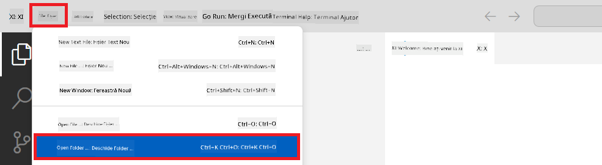

1. În panoul din stânga al Visual Studio Code, fă clic dreapta și selectează **New File** pentru a crea un fișier nou numit *download_dataset.py*.

1. În panoul din stânga al Visual Studio Code, fă clic dreapta și selectează **New File** pentru a crea un fișier nou numit *setup_ml.py*.

1. În panoul din stânga al Visual Studio Code, fă clic dreapta și selectează **New File** pentru a crea un fișier nou numit *deploy_model.py*.

    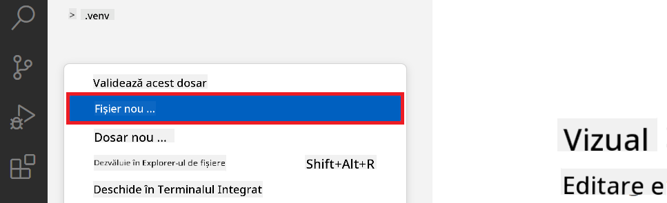

1. În panoul din stânga al Visual Studio Code, fă clic dreapta și selectează **New Folder** pentru a crea un folder nou numit *finetuning_dir*.

1. În folderul *finetuning_dir*, creează un fișier nou numit *fine_tune.py*.

#### Creează și configurează fișierul *conda.yml*

1. În panoul din stânga al Visual Studio Code, fă clic dreapta și selectează **New File** pentru a crea un fișier nou numit *conda.yml*.

1. Adaugă următorul cod în fișierul *conda.yml* pentru a configura mediul de fine-tuning pentru modelul Phi-3.

    ```yml
    name: phi-3-training-env
    channels:
      - defaults
      - conda-forge
    dependencies:
      - python=3.10
      - pip
      - numpy<2.0
      - pip:
          - torch==2.4.0
          - torchvision==0.19.0
          - trl==0.8.6
          - transformers==4.41
          - datasets==2.21.0
          - azureml-core==1.57.0
          - azure-storage-blob==12.19.0
          - azure-ai-ml==1.16
          - azure-identity==1.17.1
          - accelerate==0.33.0
          - mlflow==2.15.1
          - azureml-mlflow==1.57.0
    ```

#### Creează și configurează fișierul *config.py*

1. În panoul din stânga al Visual Studio Code, fă clic dreapta și selectează **New File** pentru a crea un fișier nou numit *config.py*.

1. Adaugă următorul cod în fișierul *config.py* pentru a introduce informațiile tale Azure.

    ```python
    # Azure settings
    AZURE_SUBSCRIPTION_ID = "your_subscription_id"
    AZURE_RESOURCE_GROUP_NAME = "your_resource_group_name" # "TestGroup"

    # Azure Machine Learning settings
    AZURE_ML_WORKSPACE_NAME = "your_workspace_name" # "finetunephi-workspace"

    # Azure Managed Identity settings
    AZURE_MANAGED_IDENTITY_CLIENT_ID = "your_azure_managed_identity_client_id"
    AZURE_MANAGED_IDENTITY_NAME = "your_azure_managed_identity_name" # "finetunephi-mangedidentity"
    AZURE_MANAGED_IDENTITY_RESOURCE_ID = f"/subscriptions/{AZURE_SUBSCRIPTION_ID}/resourceGroups/{AZURE_RESOURCE_GROUP_NAME}/providers/Microsoft.ManagedIdentity/userAssignedIdentities/{AZURE_MANAGED_IDENTITY_NAME}"

    # Dataset file paths
    TRAIN_DATA_PATH = "data/train_data.jsonl"
    TEST_DATA_PATH = "data/test_data.jsonl"

    # Fine-tuned model settings
    AZURE_MODEL_NAME = "your_fine_tuned_model_name" # "finetune-phi-model"
    AZURE_ENDPOINT_NAME = "your_fine_tuned_model_endpoint_name" # "finetune-phi-endpoint"
    AZURE_DEPLOYMENT_NAME = "your_fine_tuned_model_deployment_name" # "finetune-phi-deployment"

    AZURE_ML_API_KEY = "your_fine_tuned_model_api_key"
    AZURE_ML_ENDPOINT = "your_fine_tuned_model_endpoint_uri" # "https://{your-endpoint-name}.{your-region}.inference.ml.azure.com/score"
    ```

#### Adaugă variabilele de mediu Azure

1. Urmează pașii de mai jos pentru a adăuga Azure Subscription ID:

    - Tastează *subscriptions* în **bara de căutare** din partea de sus a paginii portalului și selectează **Subscriptions** din opțiunile afișate.
    - Selectează abonamentul Azure pe care îl folosești.
    - Copiază și lipește Subscription ID în fișierul *config.py*.

    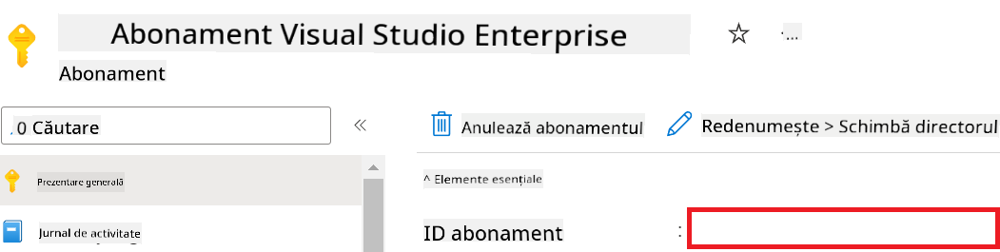

1. Urmează pașii de mai jos pentru a adăuga Azure Workspace Name:

    - Navighează la resursa Azure Machine Learning pe care ai creat-o.
    - Copiază și lipește numele contului în fișierul *config.py*.

    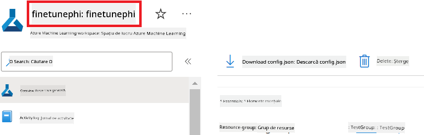

1. Urmează pașii de mai jos pentru a adăuga Azure Resource Group Name:

    - Navighează la resursa Azure Machine Learning pe care ai creat-o.
    - Copiază și lipește numele grupului de resurse Azure în fișierul *config.py*.

    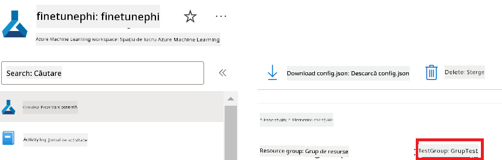

2. Urmează pașii de mai jos pentru a adăuga numele Azure Managed Identity:

    - Navighează la resursa Managed Identities pe care ai creat-o.
    - Copiază și lipește numele Azure Managed Identity în fișierul *config.py*.

    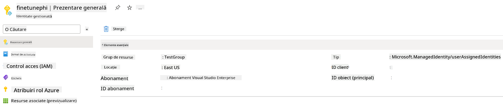

### Pregătește setul de date pentru fine-tuning

În acest exercițiu, vei rula fișierul *download_dataset.py* pentru a descărca seturile de date *ULTRACHAT_200k* în mediul tău local. Apoi vei folosi aceste seturi de date pentru a ajusta fin modelul Phi-3 în Azure Machine Learning.

#### Descarcă setul de date folosind *download_dataset.py*

1. Deschide fișierul *download_dataset.py* în Visual Studio Code.

1. Adaugă următorul cod în *download_dataset.py*.

    ```python
    import json
    import os
    from datasets import load_dataset
    from config import (
        TRAIN_DATA_PATH,
        TEST_DATA_PATH)

    def load_and_split_dataset(dataset_name, config_name, split_ratio):
        """
        Load and split a dataset.
        """
        # Load the dataset with the specified name, configuration, and split ratio
        dataset = load_dataset(dataset_name, config_name, split=split_ratio)
        print(f"Original dataset size: {len(dataset)}")
        
        # Split the dataset into train and test sets (80% train, 20% test)
        split_dataset = dataset.train_test_split(test_size=0.2)
        print(f"Train dataset size: {len(split_dataset['train'])}")
        print(f"Test dataset size: {len(split_dataset['test'])}")
        
        return split_dataset

    def save_dataset_to_jsonl(dataset, filepath):
        """
        Save a dataset to a JSONL file.
        """
        # Create the directory if it does not exist
        os.makedirs(os.path.dirname(filepath), exist_ok=True)
        
        # Open the file in write mode
        with open(filepath, 'w', encoding='utf-8') as f:
            # Iterate over each record in the dataset
            for record in dataset:
                # Dump the record as a JSON object and write it to the file
                json.dump(record, f)
                # Write a newline character to separate records
                f.write('\n')
        
        print(f"Dataset saved to {filepath}")

    def main():
        """
        Main function to load, split, and save the dataset.
        """
        # Load and split the ULTRACHAT_200k dataset with a specific configuration and split ratio
        dataset = load_and_split_dataset("HuggingFaceH4/ultrachat_200k", 'default', 'train_sft[:1%]')
        
        # Extract the train and test datasets from the split
        train_dataset = dataset['train']
        test_dataset = dataset['test']

        # Save the train dataset to a JSONL file
        save_dataset_to_jsonl(train_dataset, TRAIN_DATA_PATH)
        
        # Save the test dataset to a separate JSONL file
        save_dataset_to_jsonl(test_dataset, TEST_DATA_PATH)

    if __name__ == "__main__":
        main()

    ```

> [!TIP]
>
> **Recomandări pentru fine-tuning cu un set de date minim folosind CPU**
>
> Dacă dorești să folosești un CPU pentru fine-tuning, această metodă este ideală pentru cei cu abonamente benefice (cum ar fi Visual Studio Enterprise Subscription) sau pentru a testa rapid procesul de fine-tuning și implementare.
>
> Înlocuiește `dataset = load_and_split_dataset("HuggingFaceH4/ultrachat_200k", 'default', 'train_sft[:1%]')` cu `dataset = load_and_split_dataset("HuggingFaceH4/ultrachat_200k", 'default', 'train_sft[:10]')`
>

1. Tastează următoarea comandă în terminal pentru a rula scriptul și a descărca setul de date în mediul local.

    ```console
    python download_data.py
    ```

1. Verifică dacă seturile de date au fost salvate cu succes în directorul local *finetune-phi/data*.

> [!NOTE]
>
> **Dimensiunea setului de date și timpul de fine-tuning**
>
> În acest exemplu E2E, folosești doar 1% din setul de date (`train_sft[:1%]`). Aceasta reduce semnificativ cantitatea de date, accelerând atât încărcarea, cât și procesul de fine-tuning. Poți ajusta procentajul pentru a găsi echilibrul potrivit între timpul de antrenare și performanța modelului. Folosirea unui subset mai mic din setul de date reduce timpul necesar pentru fine-tuning, făcând procesul mai ușor de gestionat pentru un exemplu E2E.

## Scenariul 2: Ajustarea fină a modelului Phi-3 și implementarea în Azure Machine Learning Studio

### Configurează Azure CLI

Trebuie să configurezi Azure CLI pentru a autentifica mediul tău. Azure CLI îți permite să gestionezi resursele Azure direct din linia de comandă și oferă acreditările necesare pentru ca Azure Machine Learning să acceseze aceste resurse. Pentru a începe, instalează [Azure CLI](https://learn.microsoft.com/cli/azure/install-azure-cli)

1. Deschide o fereastră de terminal și tastează următoarea comandă pentru a te autentifica în contul tău Azure.

    ```console
    az login
    ```

1. Selectează contul Azure pe care dorești să îl folosești.

1. Selectează abonamentul Azure pe care dorești să îl folosești.

    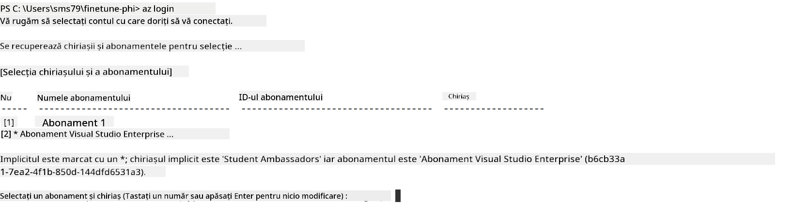

> [!TIP]
>
> Dacă întâmpini probleme la autentificarea în Azure, încearcă să folosești un cod de dispozitiv. Deschide o fereastră de terminal și tastează următoarea comandă pentru a te autentifica în contul tău Azure:
>
> ```console
> az login --use-device-code
> ```
>

### Ajustează fin modelul Phi-3

În acest exercițiu, vei ajusta fin modelul Phi-3 folosind setul de date furnizat. Mai întâi, vei defini procesul de fine-tuning în fișierul *fine_tune.py*. Apoi, vei configura mediul Azure Machine Learning și vei iniția procesul de fine-tuning rulând fișierul *setup_ml.py*. Acest script asigură că fine-tuning-ul are loc în mediul Azure Machine Learning.

Prin rularea *setup_ml.py*, vei porni procesul de fine-tuning în mediul Azure Machine Learning.

#### Adaugă cod în fișierul *fine_tune.py*

1. Navighează în folderul *finetuning_dir* și deschide fișierul *fine_tune.py* în Visual Studio Code.

1. Adaugă următorul cod în *fine_tune.py*.

    ```python
    import argparse
    import sys
    import logging
    import os
    from datasets import load_dataset
    import torch
    import mlflow
    from transformers import AutoModelForCausalLM, AutoTokenizer, TrainingArguments
    from trl import SFTTrainer

    # To avoid the INVALID_PARAMETER_VALUE error in MLflow, disable MLflow integration
    os.environ["DISABLE_MLFLOW_INTEGRATION"] = "True"

    # Logging setup
    logging.basicConfig(
        format="%(asctime)s - %(levelname)s - %(name)s - %(message)s",
        datefmt="%Y-%m-%d %H:%M:%S",
        handlers=[logging.StreamHandler(sys.stdout)],
        level=logging.WARNING
    )
    logger = logging.getLogger(__name__)

    def initialize_model_and_tokenizer(model_name, model_kwargs):
        """
        Initialize the model and tokenizer with the given pretrained model name and arguments.
        """
        model = AutoModelForCausalLM.from_pretrained(model_name, **model_kwargs)
        tokenizer = AutoTokenizer.from_pretrained(model_name)
        tokenizer.model_max_length = 2048
        tokenizer.pad_token = tokenizer.unk_token
        tokenizer.pad_token_id = tokenizer.convert_tokens_to_ids(tokenizer.pad_token)
        tokenizer.padding_side = 'right'
        return model, tokenizer

    def apply_chat_template(example, tokenizer):
        """
        Apply a chat template to tokenize messages in the example.
        """
        messages = example["messages"]
        if messages[0]["role"] != "system":
            messages.insert(0, {"role": "system", "content": ""})
        example["text"] = tokenizer.apply_chat_template(
            messages, tokenize=False, add_generation_prompt=False
        )
        return example

    def load_and_preprocess_data(train_filepath, test_filepath, tokenizer):
        """
        Load and preprocess the dataset.
        """
        train_dataset = load_dataset('json', data_files=train_filepath, split='train')
        test_dataset = load_dataset('json', data_files=test_filepath, split='train')
        column_names = list(train_dataset.features)

        train_dataset = train_dataset.map(
            apply_chat_template,
            fn_kwargs={"tokenizer": tokenizer},
            num_proc=10,
            remove_columns=column_names,
            desc="Applying chat template to train dataset",
        )

        test_dataset = test_dataset.map(
            apply_chat_template,
            fn_kwargs={"tokenizer": tokenizer},
            num_proc=10,
            remove_columns=column_names,
            desc="Applying chat template to test dataset",
        )

        return train_dataset, test_dataset

    def train_and_evaluate_model(train_dataset, test_dataset, model, tokenizer, output_dir):
        """
        Train and evaluate the model.
        """
        training_args = TrainingArguments(
            bf16=True,
            do_eval=True,
            output_dir=output_dir,
            eval_strategy="epoch",
            learning_rate=5.0e-06,
            logging_steps=20,
            lr_scheduler_type="cosine",
            num_train_epochs=3,
            overwrite_output_dir=True,
            per_device_eval_batch_size=4,
            per_device_train_batch_size=4,
            remove_unused_columns=True,
            save_steps=500,
            seed=0,
            gradient_checkpointing=True,
            gradient_accumulation_steps=1,
            warmup_ratio=0.2,
        )

        trainer = SFTTrainer(
            model=model,
            args=training_args,
            train_dataset=train_dataset,
            eval_dataset=test_dataset,
            max_seq_length=2048,
            dataset_text_field="text",
            tokenizer=tokenizer,
            packing=True
        )

        train_result = trainer.train()
        trainer.log_metrics("train", train_result.metrics)

        mlflow.transformers.log_model(
            transformers_model={"model": trainer.model, "tokenizer": tokenizer},
            artifact_path=output_dir,
        )

        tokenizer.padding_side = 'left'
        eval_metrics = trainer.evaluate()
        eval_metrics["eval_samples"] = len(test_dataset)
        trainer.log_metrics("eval", eval_metrics)

    def main(train_file, eval_file, model_output_dir):
        """
        Main function to fine-tune the model.
        """
        model_kwargs = {
            "use_cache": False,
            "trust_remote_code": True,
            "torch_dtype": torch.bfloat16,
            "device_map": None,
            "attn_implementation": "eager"
        }

        # pretrained_model_name = "microsoft/Phi-3-mini-4k-instruct"
        pretrained_model_name = "microsoft/Phi-3.5-mini-instruct"

        with mlflow.start_run():
            model, tokenizer = initialize_model_and_tokenizer(pretrained_model_name, model_kwargs)
            train_dataset, test_dataset = load_and_preprocess_data(train_file, eval_file, tokenizer)
            train_and_evaluate_model(train_dataset, test_dataset, model, tokenizer, model_output_dir)

    if __name__ == "__main__":
        parser = argparse.ArgumentParser()
        parser.add_argument("--train-file", type=str, required=True, help="Path to the training data")
        parser.add_argument("--eval-file", type=str, required=True, help="Path to the evaluation data")
        parser.add_argument("--model_output_dir", type=str, required=True, help="Directory to save the fine-tuned model")
        args = parser.parse_args()
        main(args.train_file, args.eval_file, args.model_output_dir)

    ```

1. Salvează și închide fișierul *fine_tune.py*.

> [!TIP]
> **Poți ajusta fin modelul Phi-3.5**
>
> În fișierul *fine_tune.py*, poți schimba `pretrained_model_name` din `"microsoft/Phi-3-mini-4k-instruct"` în orice model dorești să ajustezi fin. De exemplu, dacă îl schimbi în `"microsoft/Phi-3.5-mini-instruct"`, vei folosi modelul Phi-3.5-mini-instruct pentru fine-tuning. Pentru a găsi și folosi numele modelului preferat, vizitează [Hugging Face](https://huggingface.co/), caută modelul care te interesează și apoi copiază și lipește numele său în câmpul `pretrained_model_name` din scriptul tău.
>
> :::image type="content" source="../../imgs/03/FineTuning-PromptFlow/finetunephi3.5.png" alt-text="Fine tune Phi-3.5.":::
>

#### Adaugă cod în fișierul *setup_ml.py*

1. Deschide fișierul *setup_ml.py* în Visual Studio Code.

1. Adaugă următorul cod în *setup_ml.py*.

    ```python
    import logging
    from azure.ai.ml import MLClient, command, Input
    from azure.ai.ml.entities import Environment, AmlCompute
    from azure.identity import AzureCliCredential
    from config import (
        AZURE_SUBSCRIPTION_ID,
        AZURE_RESOURCE_GROUP_NAME,
        AZURE_ML_WORKSPACE_NAME,
        TRAIN_DATA_PATH,
        TEST_DATA_PATH
    )

    # Constants

    # Uncomment the following lines to use a CPU instance for training
    # COMPUTE_INSTANCE_TYPE = "Standard_E16s_v3" # cpu
    # COMPUTE_NAME = "cpu-e16s-v3"
    # DOCKER_IMAGE_NAME = "mcr.microsoft.com/azureml/openmpi4.1.0-ubuntu20.04:latest"

    # Uncomment the following lines to use a GPU instance for training
    COMPUTE_INSTANCE_TYPE = "Standard_NC24ads_A100_v4"
    COMPUTE_NAME = "gpu-nc24s-a100-v4"
    DOCKER_IMAGE_NAME = "mcr.microsoft.com/azureml/curated/acft-hf-nlp-gpu:59"

    CONDA_FILE = "conda.yml"
    LOCATION = "eastus2" # Replace with the location of your compute cluster
    FINETUNING_DIR = "./finetuning_dir" # Path to the fine-tuning script
    TRAINING_ENV_NAME = "phi-3-training-environment" # Name of the training environment
    MODEL_OUTPUT_DIR = "./model_output" # Path to the model output directory in azure ml

    # Logging setup to track the process
    logger = logging.getLogger(__name__)
    logging.basicConfig(
        format="%(asctime)s - %(levelname)s - %(name)s - %(message)s",
        datefmt="%Y-%m-%d %H:%M:%S",
        level=logging.WARNING
    )

    def get_ml_client():
        """
        Initialize the ML Client using Azure CLI credentials.
        """
        credential = AzureCliCredential()
        return MLClient(credential, AZURE_SUBSCRIPTION_ID, AZURE_RESOURCE_GROUP_NAME, AZURE_ML_WORKSPACE_NAME)

    def create_or_get_environment(ml_client):
        """
        Create or update the training environment in Azure ML.
        """
        env = Environment(
            image=DOCKER_IMAGE_NAME,  # Docker image for the environment
            conda_file=CONDA_FILE,  # Conda environment file
            name=TRAINING_ENV_NAME,  # Name of the environment
        )
        return ml_client.environments.create_or_update(env)

    def create_or_get_compute_cluster(ml_client, compute_name, COMPUTE_INSTANCE_TYPE, location):
        """
        Create or update the compute cluster in Azure ML.
        """
        try:
            compute_cluster = ml_client.compute.get(compute_name)
            logger.info(f"Compute cluster '{compute_name}' already exists. Reusing it for the current run.")
        except Exception:
            logger.info(f"Compute cluster '{compute_name}' does not exist. Creating a new one with size {COMPUTE_INSTANCE_TYPE}.")
            compute_cluster = AmlCompute(
                name=compute_name,
                size=COMPUTE_INSTANCE_TYPE,
                location=location,
                tier="Dedicated",  # Tier of the compute cluster
                min_instances=0,  # Minimum number of instances
                max_instances=1  # Maximum number of instances
            )
            ml_client.compute.begin_create_or_update(compute_cluster).wait()  # Wait for the cluster to be created
        return compute_cluster

    def create_fine_tuning_job(env, compute_name):
        """
        Set up the fine-tuning job in Azure ML.
        """
        return command(
            code=FINETUNING_DIR,  # Path to fine_tune.py
            command=(
                "python fine_tune.py "
                "--train-file ${{inputs.train_file}} "
                "--eval-file ${{inputs.eval_file}} "
                "--model_output_dir ${{inputs.model_output}}"
            ),
            environment=env,  # Training environment
            compute=compute_name,  # Compute cluster to use
            inputs={
                "train_file": Input(type="uri_file", path=TRAIN_DATA_PATH),  # Path to the training data file
                "eval_file": Input(type="uri_file", path=TEST_DATA_PATH),  # Path to the evaluation data file
                "model_output": MODEL_OUTPUT_DIR
            }
        )

    def main():
        """
        Main function to set up and run the fine-tuning job in Azure ML.
        """
        # Initialize ML Client
        ml_client = get_ml_client()

        # Create Environment
        env = create_or_get_environment(ml_client)
        
        # Create or get existing compute cluster
        create_or_get_compute_cluster(ml_client, COMPUTE_NAME, COMPUTE_INSTANCE_TYPE, LOCATION)

        # Create and Submit Fine-Tuning Job
        job = create_fine_tuning_job(env, COMPUTE_NAME)
        returned_job = ml_client.jobs.create_or_update(job)  # Submit the job
        ml_client.jobs.stream(returned_job.name)  # Stream the job logs
        
        # Capture the job name
        job_name = returned_job.name
        print(f"Job name: {job_name}")

    if __name__ == "__main__":
        main()

    ```

1. Înlocuiește `COMPUTE_INSTANCE_TYPE`, `COMPUTE_NAME` și `LOCATION` cu detaliile tale specifice.

    ```python
   # Uncomment the following lines to use a GPU instance for training
    COMPUTE_INSTANCE_TYPE = "Standard_NC24ads_A100_v4"
    COMPUTE_NAME = "gpu-nc24s-a100-v4"
    ...
    LOCATION = "eastus2" # Replace with the location of your compute cluster
    ```

> [!TIP]
>
> **Recomandări pentru fine-tuning cu un set de date minim folosind CPU**
>
> Dacă dorești să folosești un CPU pentru fine-tuning, această metodă este ideală pentru cei cu abonamente benefice (cum ar fi Visual Studio Enterprise Subscription) sau pentru a testa rapid procesul de fine-tuning și implementare.
>
> 1. Deschide fișierul *setup_ml*.
> 1. Înlocuiește `COMPUTE_INSTANCE_TYPE`, `COMPUTE_NAME` și `DOCKER_IMAGE_NAME` cu următoarele. Dacă nu ai acces la *Standard_E16s_v3*, poți folosi o instanță CPU echivalentă sau poți solicita o cotă nouă.
> 1. Înlocuiește `LOCATION` cu detaliile tale specifice.
>
>    ```python
>    # Uncomment the following lines to use a CPU instance for training
>    COMPUTE_INSTANCE_TYPE = "Standard_E16s_v3" # cpu
>    COMPUTE_NAME = "cpu-e16s-v3"
>    DOCKER_IMAGE_NAME = "mcr.microsoft.com/azureml/openmpi4.1.0-ubuntu20.04:latest"
>    LOCATION = "eastus2" # Replace with the location of your compute cluster
>    ```
>

1. Tastează următoarea comandă pentru a rula scriptul *setup_ml.py* și a începe procesul de fine-tuning în Azure Machine Learning.

    ```python
    python setup_ml.py
    ```

1. În acest exercițiu, ai ajustat cu succes modelul Phi-3 folosind Azure Machine Learning. Prin rularea scriptului *setup_ml.py*, ai configurat mediul Azure Machine Learning și ai inițiat procesul de fine-tuning definit în fișierul *fine_tune.py*. Reține că procesul de fine-tuning poate dura destul de mult timp. După ce rulezi comanda `python setup_ml.py`, trebuie să aștepți finalizarea procesului. Poți monitoriza starea jobului de fine-tuning urmând linkul oferit în terminal către portalul Azure Machine Learning.

    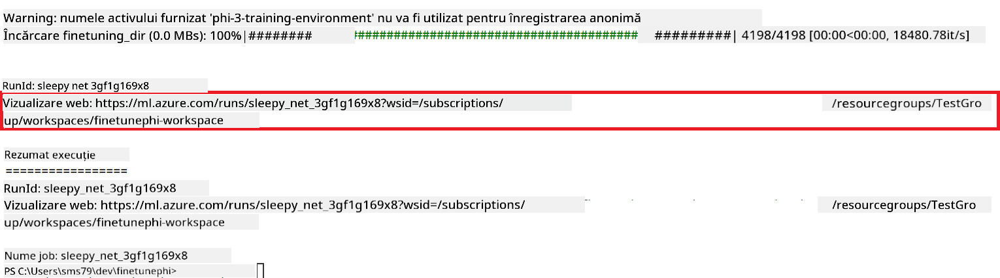

### Implementează modelul ajustat

Pentru a integra modelul Phi-3 ajustat cu Prompt Flow, trebuie să implementezi modelul pentru a-l face accesibil pentru inferență în timp real. Acest proces implică înregistrarea modelului, crearea unui endpoint online și implementarea modelului.

#### Setează numele modelului, numele endpoint-ului și numele implementării pentru implementare

1. Deschide fișierul *config.py*.

1. Înlocuiește `AZURE_MODEL_NAME = "your_fine_tuned_model_name"` cu numele dorit pentru modelul tău.

1. Înlocuiește `AZURE_ENDPOINT_NAME = "your_fine_tuned_model_endpoint_name"` cu numele dorit pentru endpoint-ul tău.

1. Înlocuiește `AZURE_DEPLOYMENT_NAME = "your_fine_tuned_model_deployment_name"` cu numele dorit pentru implementarea ta.

#### Adaugă cod în fișierul *deploy_model.py*

Rularea fișierului *deploy_model.py* automatizează întregul proces de implementare. Acesta înregistrează modelul, creează un endpoint și execută implementarea pe baza setărilor specificate în fișierul *config.py*, care include numele modelului, numele endpoint-ului și numele implementării.

1. Deschide fișierul *deploy_model.py* în Visual Studio Code.

1. Adaugă următorul cod în *deploy_model.py*.

    ```python
    import logging
    from azure.identity import AzureCliCredential
    from azure.ai.ml import MLClient
    from azure.ai.ml.entities import Model, ProbeSettings, ManagedOnlineEndpoint, ManagedOnlineDeployment, IdentityConfiguration, ManagedIdentityConfiguration, OnlineRequestSettings
    from azure.ai.ml.constants import AssetTypes

    # Configuration imports
    from config import (
        AZURE_SUBSCRIPTION_ID,
        AZURE_RESOURCE_GROUP_NAME,
        AZURE_ML_WORKSPACE_NAME,
        AZURE_MANAGED_IDENTITY_RESOURCE_ID,
        AZURE_MANAGED_IDENTITY_CLIENT_ID,
        AZURE_MODEL_NAME,
        AZURE_ENDPOINT_NAME,
        AZURE_DEPLOYMENT_NAME
    )

    # Constants
    JOB_NAME = "your-job-name"
    COMPUTE_INSTANCE_TYPE = "Standard_E4s_v3"

    deployment_env_vars = {
        "SUBSCRIPTION_ID": AZURE_SUBSCRIPTION_ID,
        "RESOURCE_GROUP_NAME": AZURE_RESOURCE_GROUP_NAME,
        "UAI_CLIENT_ID": AZURE_MANAGED_IDENTITY_CLIENT_ID,
    }

    # Logging setup
    logging.basicConfig(
        format="%(asctime)s - %(levelname)s - %(name)s - %(message)s",
        datefmt="%Y-%m-%d %H:%M:%S",
        level=logging.DEBUG
    )
    logger = logging.getLogger(__name__)

    def get_ml_client():
        """Initialize and return the ML Client."""
        credential = AzureCliCredential()
        return MLClient(credential, AZURE_SUBSCRIPTION_ID, AZURE_RESOURCE_GROUP_NAME, AZURE_ML_WORKSPACE_NAME)

    def register_model(ml_client, model_name, job_name):
        """Register a new model."""
        model_path = f"azureml://jobs/{job_name}/outputs/artifacts/paths/model_output"
        logger.info(f"Registering model {model_name} from job {job_name} at path {model_path}.")
        run_model = Model(
            path=model_path,
            name=model_name,
            description="Model created from run.",
            type=AssetTypes.MLFLOW_MODEL,
        )
        model = ml_client.models.create_or_update(run_model)
        logger.info(f"Registered model ID: {model.id}")
        return model

    def delete_existing_endpoint(ml_client, endpoint_name):
        """Delete existing endpoint if it exists."""
        try:
            endpoint_result = ml_client.online_endpoints.get(name=endpoint_name)
            logger.info(f"Deleting existing endpoint {endpoint_name}.")
            ml_client.online_endpoints.begin_delete(name=endpoint_name).result()
            logger.info(f"Deleted existing endpoint {endpoint_name}.")
        except Exception as e:
            logger.info(f"No existing endpoint {endpoint_name} found to delete: {e}")

    def create_or_update_endpoint(ml_client, endpoint_name, description=""):
        """Create or update an endpoint."""
        delete_existing_endpoint(ml_client, endpoint_name)
        logger.info(f"Creating new endpoint {endpoint_name}.")
        endpoint = ManagedOnlineEndpoint(
            name=endpoint_name,
            description=description,
            identity=IdentityConfiguration(
                type="user_assigned",
                user_assigned_identities=[ManagedIdentityConfiguration(resource_id=AZURE_MANAGED_IDENTITY_RESOURCE_ID)]
            )
        )
        endpoint_result = ml_client.online_endpoints.begin_create_or_update(endpoint).result()
        logger.info(f"Created new endpoint {endpoint_name}.")
        return endpoint_result

    def create_or_update_deployment(ml_client, endpoint_name, deployment_name, model):
        """Create or update a deployment."""

        logger.info(f"Creating deployment {deployment_name} for endpoint {endpoint_name}.")
        deployment = ManagedOnlineDeployment(
            name=deployment_name,
            endpoint_name=endpoint_name,
            model=model.id,
            instance_type=COMPUTE_INSTANCE_TYPE,
            instance_count=1,
            environment_variables=deployment_env_vars,
            request_settings=OnlineRequestSettings(
                max_concurrent_requests_per_instance=3,
                request_timeout_ms=180000,
                max_queue_wait_ms=120000
            ),
            liveness_probe=ProbeSettings(
                failure_threshold=30,
                success_threshold=1,
                period=100,
                initial_delay=500,
            ),
            readiness_probe=ProbeSettings(
                failure_threshold=30,
                success_threshold=1,
                period=100,
                initial_delay=500,
            ),
        )
        deployment_result = ml_client.online_deployments.begin_create_or_update(deployment).result()
        logger.info(f"Created deployment {deployment.name} for endpoint {endpoint_name}.")
        return deployment_result

    def set_traffic_to_deployment(ml_client, endpoint_name, deployment_name):
        """Set traffic to the specified deployment."""
        try:
            # Fetch the current endpoint details
            endpoint = ml_client.online_endpoints.get(name=endpoint_name)
            
            # Log the current traffic allocation for debugging
            logger.info(f"Current traffic allocation: {endpoint.traffic}")
            
            # Set the traffic allocation for the deployment
            endpoint.traffic = {deployment_name: 100}
            
            # Update the endpoint with the new traffic allocation
            endpoint_poller = ml_client.online_endpoints.begin_create_or_update(endpoint)
            updated_endpoint = endpoint_poller.result()
            
            # Log the updated traffic allocation for debugging
            logger.info(f"Updated traffic allocation: {updated_endpoint.traffic}")
            logger.info(f"Set traffic to deployment {deployment_name} at endpoint {endpoint_name}.")
            return updated_endpoint
        except Exception as e:
            # Log any errors that occur during the process
            logger.error(f"Failed to set traffic to deployment: {e}")
            raise


    def main():
        ml_client = get_ml_client()

        registered_model = register_model(ml_client, AZURE_MODEL_NAME, JOB_NAME)
        logger.info(f"Registered model ID: {registered_model.id}")

        endpoint = create_or_update_endpoint(ml_client, AZURE_ENDPOINT_NAME, "Endpoint for finetuned Phi-3 model")
        logger.info(f"Endpoint {AZURE_ENDPOINT_NAME} is ready.")

        try:
            deployment = create_or_update_deployment(ml_client, AZURE_ENDPOINT_NAME, AZURE_DEPLOYMENT_NAME, registered_model)
            logger.info(f"Deployment {AZURE_DEPLOYMENT_NAME} is created for endpoint {AZURE_ENDPOINT_NAME}.")

            set_traffic_to_deployment(ml_client, AZURE_ENDPOINT_NAME, AZURE_DEPLOYMENT_NAME)
            logger.info(f"Traffic is set to deployment {AZURE_DEPLOYMENT_NAME} at endpoint {AZURE_ENDPOINT_NAME}.")
        except Exception as e:
            logger.error(f"Failed to create or update deployment: {e}")

    if __name__ == "__main__":
        main()

    ```

1. Urmează pașii de mai jos pentru a obține `JOB_NAME`:

    - Navighează la resursa Azure Machine Learning pe care ai creat-o.
    - Selectează **Studio web URL** pentru a deschide workspace-ul Azure Machine Learning.
    - Selectează **Jobs** din tab-ul din partea stângă.
    - Selectează experimentul pentru fine-tuning. De exemplu, *finetunephi*.
    - Selectează jobul pe care l-ai creat.
- Copiază și lipește numele jobului tău în `JOB_NAME = "your-job-name"` din fișierul *deploy_model.py*.

1. Înlocuiește `COMPUTE_INSTANCE_TYPE` cu detaliile tale specifice.

1. Tastează următoarea comandă pentru a rula scriptul *deploy_model.py* și a începe procesul de implementare în Azure Machine Learning.

    ```python
    python deploy_model.py
    ```


> [!WARNING]
> Pentru a evita costuri suplimentare pe contul tău, asigură-te că ștergi endpoint-ul creat în workspace-ul Azure Machine Learning.
>

#### Verifică starea implementării în Azure Machine Learning Workspace

1. Accesează [Azure ML Studio](https://ml.azure.com/home?wt.mc_id=studentamb_279723).

1. Navighează la workspace-ul Azure Machine Learning pe care l-ai creat.

1. Selectează **Studio web URL** pentru a deschide workspace-ul Azure Machine Learning.

1. Selectează **Endpoints** din meniul din partea stângă.

    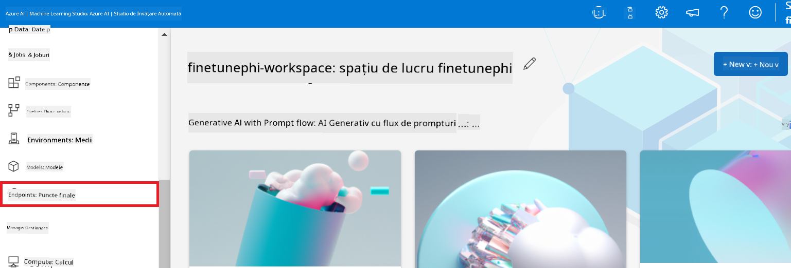

2. Selectează endpoint-ul pe care l-ai creat.

    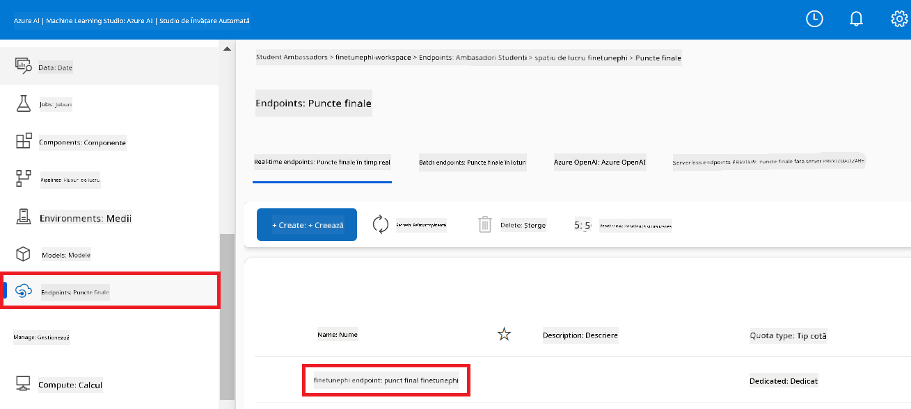

3. Pe această pagină poți gestiona endpoint-urile create în timpul procesului de implementare.

## Scenariul 3: Integrează cu Prompt flow și discută cu modelul tău personalizat

### Integrează modelul personalizat Phi-3 cu Prompt flow

După ce ai implementat cu succes modelul tău ajustat, îl poți integra acum cu Prompt flow pentru a-l folosi în aplicații în timp real, permițând o varietate de sarcini interactive cu modelul tău personalizat Phi-3.

#### Setează cheia API și URI-ul endpoint-ului modelului Phi-3 ajustat

1. Navighează la workspace-ul Azure Machine Learning pe care l-ai creat.
1. Selectează **Endpoints** din meniul din partea stângă.
1. Selectează endpoint-ul pe care l-ai creat.
1. Selectează **Consume** din meniul de navigare.
1. Copiază și lipește **REST endpoint** în fișierul *config.py*, înlocuind `AZURE_ML_ENDPOINT = "your_fine_tuned_model_endpoint_uri"` cu **REST endpoint**-ul tău.
1. Copiază și lipește **Primary key** în fișierul *config.py*, înlocuind `AZURE_ML_API_KEY = "your_fine_tuned_model_api_key"` cu **Primary key**-ul tău.

    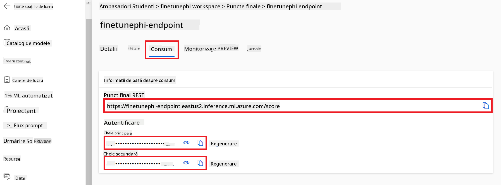

#### Adaugă cod în fișierul *flow.dag.yml*

1. Deschide fișierul *flow.dag.yml* în Visual Studio Code.

1. Adaugă următorul cod în *flow.dag.yml*.

    ```yml
    inputs:
      input_data:
        type: string
        default: "Who founded Microsoft?"

    outputs:
      answer:
        type: string
        reference: ${integrate_with_promptflow.output}

    nodes:
    - name: integrate_with_promptflow
      type: python
      source:
        type: code
        path: integrate_with_promptflow.py
      inputs:
        input_data: ${inputs.input_data}
    ```

#### Adaugă cod în fișierul *integrate_with_promptflow.py*

1. Deschide fișierul *integrate_with_promptflow.py* în Visual Studio Code.

1. Adaugă următorul cod în *integrate_with_promptflow.py*.

    ```python
    import logging
    import requests
    from promptflow.core import tool
    import asyncio
    import platform
    from config import (
        AZURE_ML_ENDPOINT,
        AZURE_ML_API_KEY
    )

    # Logging setup
    logging.basicConfig(
        format="%(asctime)s - %(levelname)s - %(name)s - %(message)s",
        datefmt="%Y-%m-%d %H:%M:%S",
        level=logging.DEBUG
    )
    logger = logging.getLogger(__name__)

    def query_azml_endpoint(input_data: list, endpoint_url: str, api_key: str) -> str:
        """
        Send a request to the Azure ML endpoint with the given input data.
        """
        headers = {
            "Content-Type": "application/json",
            "Authorization": f"Bearer {api_key}"
        }
        data = {
            "input_data": [input_data],
            "params": {
                "temperature": 0.7,
                "max_new_tokens": 128,
                "do_sample": True,
                "return_full_text": True
            }
        }
        try:
            response = requests.post(endpoint_url, json=data, headers=headers)
            response.raise_for_status()
            result = response.json()[0]
            logger.info("Successfully received response from Azure ML Endpoint.")
            return result
        except requests.exceptions.RequestException as e:
            logger.error(f"Error querying Azure ML Endpoint: {e}")
            raise

    def setup_asyncio_policy():
        """
        Setup asyncio event loop policy for Windows.
        """
        if platform.system() == 'Windows':
            asyncio.set_event_loop_policy(asyncio.WindowsSelectorEventLoopPolicy())
            logger.info("Set Windows asyncio event loop policy.")

    @tool
    def my_python_tool(input_data: str) -> str:
        """
        Tool function to process input data and query the Azure ML endpoint.
        """
        setup_asyncio_policy()
        return query_azml_endpoint(input_data, AZURE_ML_ENDPOINT, AZURE_ML_API_KEY)

    ```

### Discută cu modelul tău personalizat

1. Tastează următoarea comandă pentru a rula scriptul *deploy_model.py* și a începe procesul de implementare în Azure Machine Learning.

    ```python
    pf flow serve --source ./ --port 8080 --host localhost
    ```

1. Iată un exemplu de rezultate: Acum poți discuta cu modelul tău personalizat Phi-3. Se recomandă să pui întrebări bazate pe datele folosite pentru ajustare.

    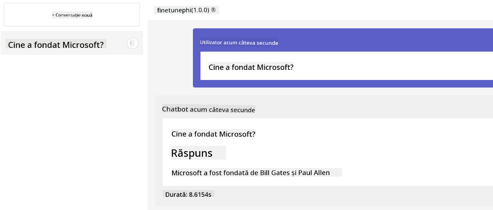

**Declinare de responsabilitate**:  
Acest document a fost tradus folosind serviciul de traducere AI [Co-op Translator](https://github.com/Azure/co-op-translator). Deși ne străduim pentru acuratețe, vă rugăm să rețineți că traducerile automate pot conține erori sau inexactități. Documentul original în limba sa nativă trebuie considerat sursa autorizată. Pentru informații critice, se recomandă traducerea profesională realizată de un specialist uman. Nu ne asumăm răspunderea pentru eventualele neînțelegeri sau interpretări greșite rezultate din utilizarea acestei traduceri.