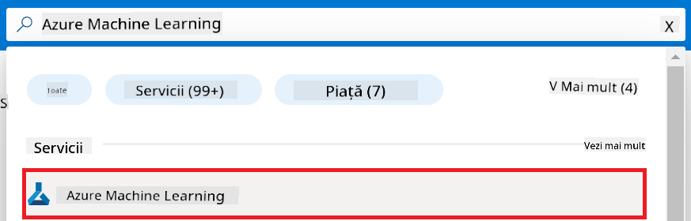
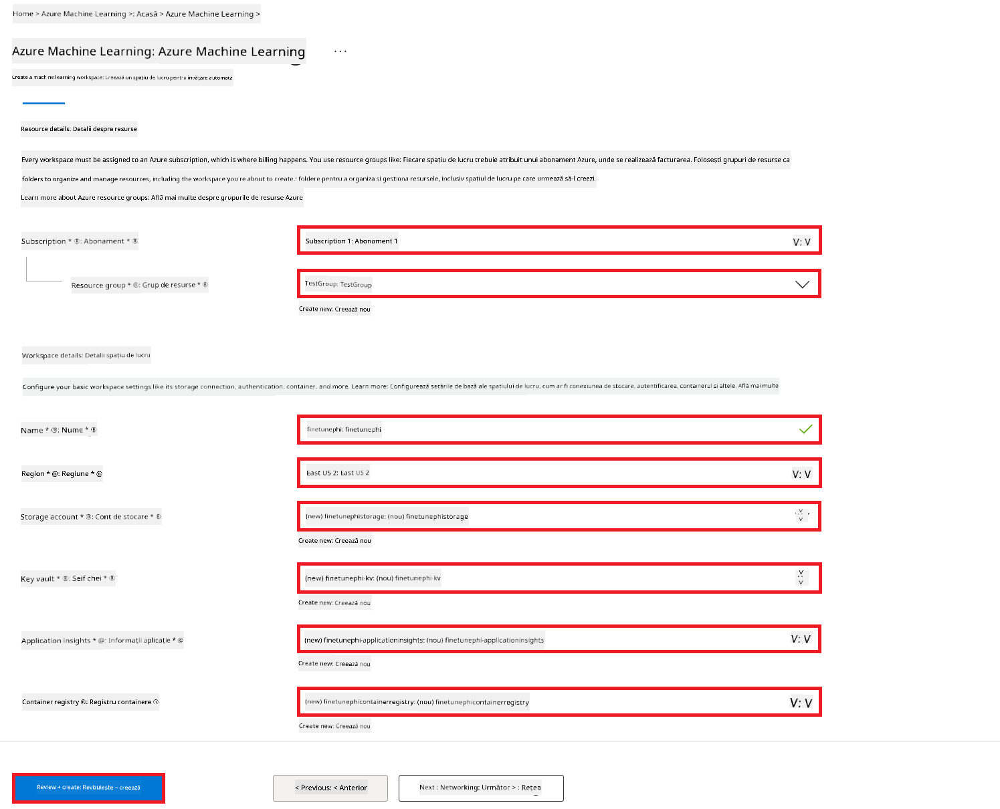
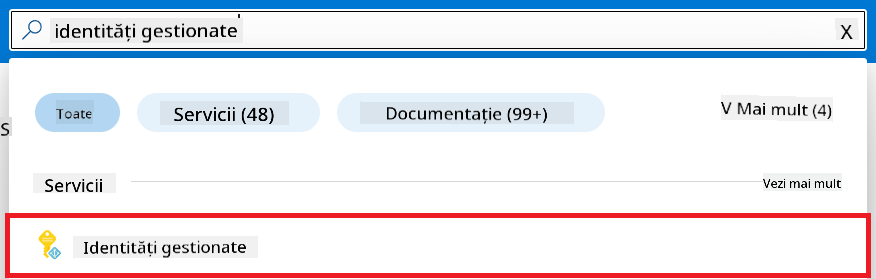
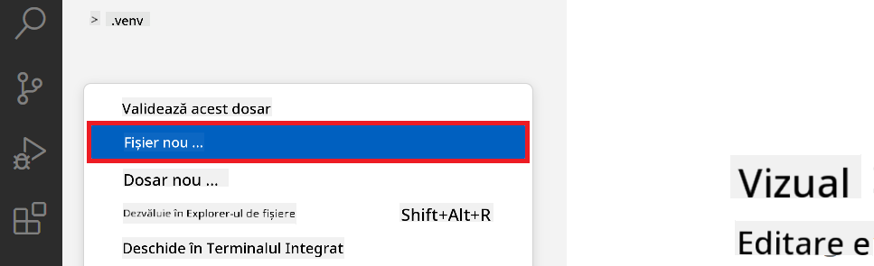
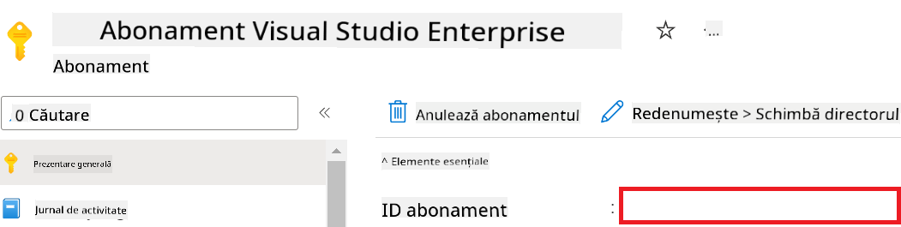
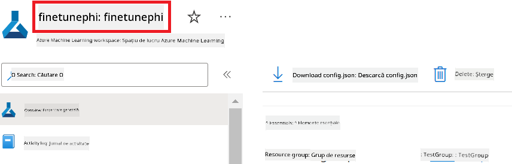
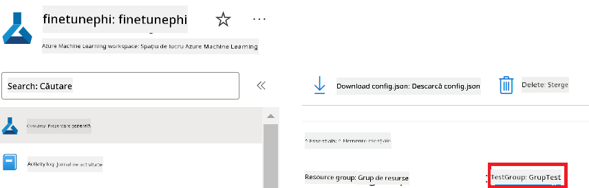
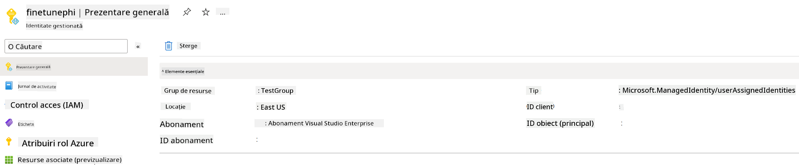
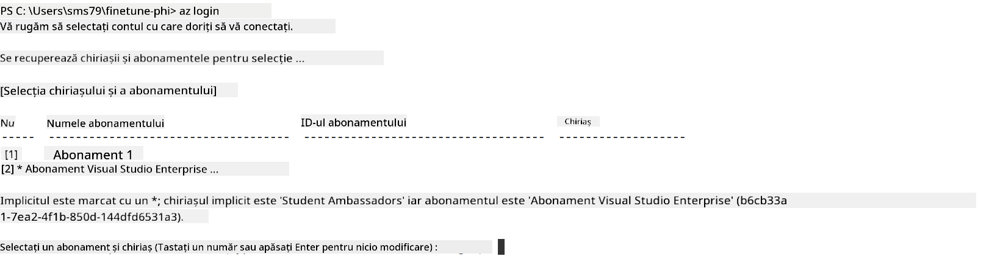

<!--
CO_OP_TRANSLATOR_METADATA:
{
  "original_hash": "7ca2c30fdb802664070e9cfbf92e24fe",
  "translation_date": "2026-01-05T09:52:58+00:00",
  "source_file": "md/02.Application/01.TextAndChat/Phi3/E2E_Phi-3-FineTuning_PromptFlow_Integration.md",
  "language_code": "ro"
}
-->
# Reglarea fină și integrarea modelelor personalizate Phi-3 cu Prompt flow

Acest exemplu end-to-end (E2E) este bazat pe ghidul "[Fine-Tune and Integrate Custom Phi-3 Models with Prompt Flow: Step-by-Step Guide](https://techcommunity.microsoft.com/t5/educator-developer-blog/fine-tune-and-integrate-custom-phi-3-models-with-prompt-flow/ba-p/4178612?WT.mc_id=aiml-137032-kinfeylo)" din Microsoft Tech Community. Acesta introduce procesele de reglare fină, implementare și integrare a modelelor personalizate Phi-3 cu Prompt flow.

## Prezentare generală

În acest exemplu E2E, veți învăța cum să reglați fin modelul Phi-3 și să-l integrați cu Prompt flow. Folosind Azure Machine Learning și Prompt flow, veți stabili un flux de lucru pentru implementarea și utilizarea modelelor AI personalizate. Acest exemplu E2E este împărțit în trei scenarii:

**Scenariul 1: Configurarea resurselor Azure și pregătirea pentru reglarea fină**

**Scenariul 2: Reglarea fină a modelului Phi-3 și implementarea în Azure Machine Learning Studio**

**Scenariul 3: Integrarea cu Prompt flow și chat cu modelul personalizat**

Iată o prezentare generală a acestui exemplu E2E.


### Cuprins

1. **[Scenariul 1: Configurarea resurselor Azure și pregătirea pentru reglarea fină](../../../../../../md/02.Application/01.TextAndChat/Phi3)**
    - [Crearea unui Workspace Azure Machine Learning](../../../../../../md/02.Application/01.TextAndChat/Phi3)
    - [Solicitarea cotelor GPU în abonamentul Azure](../../../../../../md/02.Application/01.TextAndChat/Phi3)
    - [Adăugarea unei atribuiri de rol](../../../../../../md/02.Application/01.TextAndChat/Phi3)
    - [Configurarea proiectului](../../../../../../md/02.Application/01.TextAndChat/Phi3)
    - [Pregătirea setului de date pentru reglarea fină](../../../../../../md/02.Application/01.TextAndChat/Phi3)

1. **[Scenariul 2: Reglarea fină a modelului Phi-3 și implementarea în Azure Machine Learning Studio](../../../../../../md/02.Application/01.TextAndChat/Phi3)**
    - [Configurarea Azure CLI](../../../../../../md/02.Application/01.TextAndChat/Phi3)
    - [Reglarea fină a modelului Phi-3](../../../../../../md/02.Application/01.TextAndChat/Phi3)
    - [Implementarea modelului reglat fin](../../../../../../md/02.Application/01.TextAndChat/Phi3)

1. **[Scenariul 3: Integrarea cu Prompt flow și chat cu modelul personalizat](../../../../../../md/02.Application/01.TextAndChat/Phi3)**
    - [Integrarea modelului personalizat Phi-3 cu Prompt flow](../../../../../../md/02.Application/01.TextAndChat/Phi3)
    - [Chat cu modelul tău personalizat](../../../../../../md/02.Application/01.TextAndChat/Phi3)

## Scenariul 1: Configurarea resurselor Azure și pregătirea pentru reglarea fină

### Crearea unui Workspace Azure Machine Learning

1. Tastați *azure machine learning* în **bara de căutare** din partea de sus a paginii portalului și selectați **Azure Machine Learning** din opțiunile afișate.

    

1. Selectați **+ Create** din meniul de navigare.

1. Selectați **New workspace** din meniul de navigare.

    

1. Efectuați următoarele sarcini:

    - Selectați **Subscription**-ul Azure.
    - Selectați **Resource group**-ul pe care doriți să îl utilizați (creați unul nou dacă este necesar).
    - Introduceți **Workspace Name**. Trebuie să fie o valoare unică.
    - Selectați **Region** pe care doriți să o utilizați.
    - Selectați contul de **Storage** pe care doriți să îl utilizați (creați unul nou dacă este necesar).
    - Selectați **Key vault** pe care doriți să îl utilizați (creați unul nou dacă este necesar).
    - Selectați **Application insights** pe care doriți să îl utilizați (creați unul nou dacă este necesar).
    - Selectați **Container registry** pe care doriți să îl utilizați (creați unul nou dacă este necesar).

    

1. Selectați **Review + Create**.

1. Selectați **Create**.

### Solicitarea cotelor GPU în abonamentul Azure

În acest exemplu E2E, veți folosi *Standard_NC24ads_A100_v4 GPU* pentru reglarea fină, care necesită o solicitare de cotă, și *Standard_E4s_v3* CPU pentru implementare, care nu necesită solicitare de cotă.

> [!NOTE]
>
> Doar abonamentele Pay-As-You-Go (tipul standard de abonament) sunt eligibile pentru alocarea GPU; abonamentele de tip beneficiu nu sunt în prezent suportate.
>
> Pentru cei care utilizează abonamente de tip beneficiu (cum ar fi Visual Studio Enterprise Subscription) sau care doresc să testeze rapid procesul de reglare fină și implementare, acest tutorial oferă și un ghid pentru reglarea fină cu un set minim de date folosind un CPU. Totuși, este important de menționat că rezultatele reglarii fine sunt semnificativ mai bune când se folosește un GPU cu seturi de date mai mari.

1. Vizitați [Azure ML Studio](https://ml.azure.com/home?wt.mc_id=studentamb_279723).

1. Efectuați următoarele sarcini pentru a solicita cota de *Standard NCADSA100v4 Family*:

    - Selectați **Quota** din fila din partea stângă.
    - Selectați **Virtual machine family** pe care doriți să o utilizați. De exemplu, selectați **Standard NCADSA100v4 Family Cluster Dedicated vCPUs**, care include *Standard_NC24ads_A100_v4* GPU.
    - Selectați **Request quota** din meniul de navigare.

        

    - În pagina Request quota, introduceți **New cores limit** pe care doriți să o utilizați. De exemplu, 24.
    - În pagina Request quota, selectați **Submit** pentru a solicita cota GPU.

> [!NOTE]
> Puteți selecta GPU-ul sau CPU-ul potrivit pentru nevoile dvs. consultând documentul [Sizes for Virtual Machines in Azure](https://learn.microsoft.com/azure/virtual-machines/sizes/overview?tabs=breakdownseries%2Cgeneralsizelist%2Ccomputesizelist%2Cmemorysizelist%2Cstoragesizelist%2Cgpusizelist%2Cfpgasizelist%2Chpcsizelist).

### Adăugarea unei atribuiri de rol

Pentru a regla fin și implementa modelele, trebuie mai întâi să creați o Identitate Gestionată Atribuită Utilizatorului (User Assigned Managed Identity - UAI) și să îi atribuiți permisiunile corespunzătoare. Această UAI va fi folosită pentru autentificare în timpul implementării.

#### Crearea unei User Assigned Managed Identity (UAI)

1. Tastați *managed identities* în **bara de căutare** din partea de sus a paginii portalului și selectați **Managed Identities** din opțiunile afișate.

    

1. Selectați **+ Create**.

    

1. Efectuați următoarele sarcini:

    - Selectați **Subscription**-ul Azure.
    - Selectați **Resource group**-ul pe care doriți să îl utilizați (creați unul nou dacă este necesar).
    - Selectați **Region** pe care doriți să o utilizați.
    - Introduceți un **Nume**. Trebuie să fie o valoare unică.

1. Selectați **Review + create**.

1. Selectați **+ Create**.

#### Adăugarea rolului Contributor la Managed Identity

1. Navigați la resursa Managed Identity pe care ați creat-o.

1. Selectați **Azure role assignments** din fila din partea stângă.

1. Selectați **+Add role assignment** din meniul de navigare.

1. În pagina Add role assignment, efectuați următoarele:
    - Selectați **Scope** la **Resource group**.
    - Selectați **Subscription**-ul Azure.
    - Selectați **Resource group**-ul pe care doriți să îl folosiți.
    - Selectați **Role** la **Contributor**.

    

1. Selectați **Save**.

#### Adăugarea rolului Storage Blob Data Reader la Managed Identity

1. Tastați *storage accounts* în **bara de căutare** din partea de sus a paginii portalului și selectați **Storage accounts** din opțiunile afișate.

    

1. Selectați contul de stocare asociat cu workspace-ul Azure Machine Learning pe care l-ați creat. De exemplu, *finetunephistorage*.

1. Efectuați următoarele pentru a naviga la pagina Add role assignment:

    - Navigați la contul de Azure Storage pe care l-ați creat.
    - Selectați **Access Control (IAM)** din fila din stânga.
    - Selectați **+ Add** din meniul de navigare.
    - Selectați **Add role assignment** din meniul de navigare.

    

1. În pagina Add role assignment, efectuați următoarele:

    - În pagina Role, tastați *Storage Blob Data Reader* în **bara de căutare** și selectați **Storage Blob Data Reader** din opțiunile afișate.
    - În pagina Role, selectați **Next**.
    - În pagina Members, selectați **Assign access to** **Managed identity**.
    - În pagina Members, selectați **+ Select members**.
    - În pagina Select managed identities, selectați **Subscription**-ul Azure.
    - În pagina Select managed identities, selectați **Managed identity** la **Manage Identity**.
    - În pagina Select managed identities, selectați identitatea gestionată pe care ați creat-o. De exemplu, *finetunephi-managedidentity*.
    - În pagina Select managed identities, selectați **Select**.

    

1. Selectați **Review + assign**.

#### Adăugarea rolului AcrPull la Managed Identity

1. Tastați *container registries* în **bara de căutare** din partea de sus a paginii portalului și selectați **Container registries** din opțiunile afișate.

    

1. Selectați registrul de containere asociat cu workspace-ul Azure Machine Learning. De exemplu, *finetunephicontainerregistries*

1. Efectuați următoarele pentru a naviga la pagina Add role assignment:

    - Selectați **Access Control (IAM)** din fila din stânga.
    - Selectați **+ Add** din meniul de navigare.
    - Selectați **Add role assignment** din meniul de navigare.

1. În pagina Add role assignment, efectuați următoarele:

    - În pagina Role, tastați *AcrPull* în **bara de căutare** și selectați **AcrPull** din opțiunile afișate.
    - În pagina Role, selectați **Next**.
    - În pagina Members, selectați **Assign access to** **Managed identity**.
    - În pagina Members, selectați **+ Select members**.
    - În pagina Select managed identities, selectați **Subscription**-ul Azure.
    - În pagina Select managed identities, selectați **Managed identity** la **Manage Identity**.
    - În pagina Select managed identities, selectați identitatea gestionată pe care ați creat-o. De exemplu, *finetunephi-managedidentity*.
    - În pagina Select managed identities, selectați **Select**.
    - Selectați **Review + assign**.

### Configurarea proiectului

Acum, veți crea un folder în care să lucrați și veți configura un mediu virtual pentru a dezvolta un program care interacționează cu utilizatorii și folosește istoricul de chat stocat în Azure Cosmos DB pentru a informa răspunsurile.

#### Crearea unui folder în care să lucrați

1. Deschideți o fereastră de terminal și tastați următoarea comandă pentru a crea un folder numit *finetune-phi* în calea implicită.

    ```console
    mkdir finetune-phi
    ```

1. Tastați următoarea comandă în terminal pentru a naviga în folderul *finetune-phi* pe care l-ați creat.

    ```console
    cd finetune-phi
    ```

#### Crearea unui mediu virtual

1. Tastați următoarea comandă în terminal pentru a crea un mediu virtual numit *.venv*.

    ```console
    python -m venv .venv
    ```

1. Tastați următoarea comandă în terminal pentru a activa mediul virtual.

    ```console
    .venv\Scripts\activate.bat
    ```

> [!NOTE]
>
> Dacă a funcționat, ar trebui să vedeți *(.venv)* înaintea promptului de comandă.

#### Instalarea pachetelor necesare

1. Tastați următoarele comenzi în terminal pentru a instala pachetele necesare.

    ```console
    pip install datasets==2.19.1
    pip install transformers==4.41.1
    pip install azure-ai-ml==1.16.0
    pip install torch==2.3.1
    pip install trl==0.9.4
    pip install promptflow==1.12.0
    ```

#### Crearea fișierelor proiectului
În acest exercițiu, veți crea fișierele esențiale pentru proiectul nostru. Aceste fișiere includ scripturi pentru descărcarea setului de date, configurarea mediului Azure Machine Learning, reglarea fină a modelului Phi-3 și implementarea modelului reglat fin. De asemenea, veți crea un fișier *conda.yml* pentru a configura mediul de reglare fină.

În acest exercițiu, veți:

- Crea un fișier *download_dataset.py* pentru a descărca setul de date.
- Crea un fișier *setup_ml.py* pentru a configura mediul Azure Machine Learning.
- Crea un fișier *fine_tune.py* în folderul *finetuning_dir* pentru a regla fin modelul Phi-3 folosind setul de date.
- Crea un fișier *conda.yml* pentru configurarea mediului de reglare fină.
- Crea un fișier *deploy_model.py* pentru a implementa modelul reglat fin.
- Crea un fișier *integrate_with_promptflow.py*, pentru a integra modelul reglat fin și a executa modelul folosind Prompt flow.
- Crea un fișier flow.dag.yml, pentru a configura structura fluxului de lucru pentru Prompt flow.
- Crea un fișier *config.py* pentru a introduce informațiile Azure.

> [!NOTE]
>
> Structura completă a folderelor:
>
> ```text
> └── YourUserName
> .    └── finetune-phi
> .        ├── finetuning_dir
> .        │      └── fine_tune.py
> .        ├── conda.yml
> .        ├── config.py
> .        ├── deploy_model.py
> .        ├── download_dataset.py
> .        ├── flow.dag.yml
> .        ├── integrate_with_promptflow.py
> .        └── setup_ml.py
> ```

1. Deschideți **Visual Studio Code**.

1. Selectați **File** din bara de meniu.

1. Selectați **Open Folder**.

1. Selectați folderul *finetune-phi* pe care l-ați creat, care se află la *C:\Users\yourUserName\finetune-phi*.

    

1. În panoul din stânga al Visual Studio Code, faceți clic dreapta și selectați **New File** pentru a crea un fișier nou numit *download_dataset.py*.

1. În panoul din stânga al Visual Studio Code, faceți clic dreapta și selectați **New File** pentru a crea un fișier nou numit *setup_ml.py*.

1. În panoul din stânga al Visual Studio Code, faceți clic dreapta și selectați **New File** pentru a crea un fișier nou numit *deploy_model.py*.

    

1. În panoul din stânga al Visual Studio Code, faceți clic dreapta și selectați **New Folder** pentru a crea un folder nou numit *finetuning_dir*.

1. În folderul *finetuning_dir*, creați un fișier nou numit *fine_tune.py*.

#### Creați și configurați fișierul *conda.yml*

1. În panoul din stânga al Visual Studio Code, faceți clic dreapta și selectați **New File** pentru a crea un fișier nou numit *conda.yml*.

1. Adăugați următorul cod în fișierul *conda.yml* pentru a configura mediul de reglare fină pentru modelul Phi-3.

    ```yml
    name: phi-3-training-env
    channels:
      - defaults
      - conda-forge
    dependencies:
      - python=3.10
      - pip
      - numpy<2.0
      - pip:
          - torch==2.4.0
          - torchvision==0.19.0
          - trl==0.8.6
          - transformers==4.41
          - datasets==2.21.0
          - azureml-core==1.57.0
          - azure-storage-blob==12.19.0
          - azure-ai-ml==1.16
          - azure-identity==1.17.1
          - accelerate==0.33.0
          - mlflow==2.15.1
          - azureml-mlflow==1.57.0
    ```

#### Creați și configurați fișierul *config.py*

1. În panoul din stânga al Visual Studio Code, faceți clic dreapta și selectați **New File** pentru a crea un fișier nou numit *config.py*.

1. Adăugați următorul cod în fișierul *config.py* pentru a include informațiile dvs. Azure.

    ```python
    # Setări Azure
    AZURE_SUBSCRIPTION_ID = "your_subscription_id"
    AZURE_RESOURCE_GROUP_NAME = "your_resource_group_name" # "TestGroup"

    # Setări Azure Machine Learning
    AZURE_ML_WORKSPACE_NAME = "your_workspace_name" # "finetunephi-workspace"

    # Setări Azure Managed Identity
    AZURE_MANAGED_IDENTITY_CLIENT_ID = "your_azure_managed_identity_client_id"
    AZURE_MANAGED_IDENTITY_NAME = "your_azure_managed_identity_name" # "finetunephi-mangedidentity"
    AZURE_MANAGED_IDENTITY_RESOURCE_ID = f"/subscriptions/{AZURE_SUBSCRIPTION_ID}/resourceGroups/{AZURE_RESOURCE_GROUP_NAME}/providers/Microsoft.ManagedIdentity/userAssignedIdentities/{AZURE_MANAGED_IDENTITY_NAME}"

    # Căi fișiere set de date
    TRAIN_DATA_PATH = "data/train_data.jsonl"
    TEST_DATA_PATH = "data/test_data.jsonl"

    # Setări model ajustat fin
    AZURE_MODEL_NAME = "your_fine_tuned_model_name" # "finetune-phi-model"
    AZURE_ENDPOINT_NAME = "your_fine_tuned_model_endpoint_name" # "finetune-phi-endpoint"
    AZURE_DEPLOYMENT_NAME = "your_fine_tuned_model_deployment_name" # "finetune-phi-deployment"

    AZURE_ML_API_KEY = "your_fine_tuned_model_api_key"
    AZURE_ML_ENDPOINT = "your_fine_tuned_model_endpoint_uri" # "https://{your-endpoint-name}.{your-region}.inference.ml.azure.com/score"
    ```

#### Adăugați variabile de mediu Azure

1. Efectuați următoarele sarcini pentru a adăuga ID-ul de abonament Azure:

    - Tastați *subscriptions* în **bara de căutare** din partea de sus a paginii portalului și selectați **Subscriptions** din opțiunile care apar.
    - Selectați Abonamentul Azure pe care îl utilizați în prezent.
    - Copiați și inserați ID-ul Abonamentului în fișierul *config.py*.

    

1. Efectuați următoarele sarcini pentru a adăuga numele spațiului de lucru Azure:

    - Navigați la resursa Azure Machine Learning pe care ați creat-o.
    - Copiați și inserați numele contului dvs. în fișierul *config.py*.

    

1. Efectuați următoarele sarcini pentru a adăuga numele grupului de resurse Azure:

    - Navigați la resursa Azure Machine Learning pe care ați creat-o.
    - Copiați și inserați numele grupului dvs. de resurse Azure în fișierul *config.py*.

    

2. Efectuați următoarele sarcini pentru a adăuga numele identității administrate Azure

    - Navigați la resursa Managed Identities pe care ați creat-o.
    - Copiați și inserați numele identității administrate Azure în fișierul *config.py*.

    

### Pregătiți setul de date pentru reglarea fină

În acest exercițiu, veți rula fișierul *download_dataset.py* pentru a descărca seturile de date *ULTRACHAT_200k* în mediul dvs. local. Veți folosi apoi aceste seturi de date pentru a regla fin modelul Phi-3 în Azure Machine Learning.

#### Descărcați setul de date folosind *download_dataset.py*

1. Deschideți fișierul *download_dataset.py* în Visual Studio Code.

1. Adăugați următorul cod în *download_dataset.py*.

    ```python
    import json
    import os
    from datasets import load_dataset
    from config import (
        TRAIN_DATA_PATH,
        TEST_DATA_PATH)

    def load_and_split_dataset(dataset_name, config_name, split_ratio):
        """
        Load and split a dataset.
        """
        # Încarcă setul de date cu numele specificat, configurația și raportul de împărțire
        dataset = load_dataset(dataset_name, config_name, split=split_ratio)
        print(f"Original dataset size: {len(dataset)}")
        
        # Împarte setul de date în seturi de antrenament și test (80% antrenament, 20% test)
        split_dataset = dataset.train_test_split(test_size=0.2)
        print(f"Train dataset size: {len(split_dataset['train'])}")
        print(f"Test dataset size: {len(split_dataset['test'])}")
        
        return split_dataset

    def save_dataset_to_jsonl(dataset, filepath):
        """
        Save a dataset to a JSONL file.
        """
        # Creează directorul dacă nu există
        os.makedirs(os.path.dirname(filepath), exist_ok=True)
        
        # Deschide fișierul în modul de scriere
        with open(filepath, 'w', encoding='utf-8') as f:
            # Parcurge fiecare înregistrare din setul de date
            for record in dataset:
                # Salvează înregistrarea ca obiect JSON și scrie-o în fișier
                json.dump(record, f)
                # Scrie un caracter de newline pentru a separa înregistrările
                f.write('\n')
        
        print(f"Dataset saved to {filepath}")

    def main():
        """
        Main function to load, split, and save the dataset.
        """
        # Încarcă și împarte setul de date ULTRACHAT_200k cu o configurație specifică și raport de împărțire
        dataset = load_and_split_dataset("HuggingFaceH4/ultrachat_200k", 'default', 'train_sft[:1%]')
        
        # Extrage seturile de date de antrenament și test din împărțire
        train_dataset = dataset['train']
        test_dataset = dataset['test']

        # Salvează setul de date de antrenament într-un fișier JSONL
        save_dataset_to_jsonl(train_dataset, TRAIN_DATA_PATH)
        
        # Salvează setul de date de test într-un fișier JSONL separat
        save_dataset_to_jsonl(test_dataset, TEST_DATA_PATH)

    if __name__ == "__main__":
        main()

    ```

> [!TIP]
>
> **Ghid pentru reglarea fină cu un set minim de date folosind un CPU**
>
> Dacă doriți să utilizați un CPU pentru reglarea fină, această abordare este ideală pentru cei cu abonamente benefice (cum ar fi Visual Studio Enterprise Subscription) sau pentru a testa rapid procesul de reglare fină și implementare.
>
> Înlocuiți `dataset = load_and_split_dataset("HuggingFaceH4/ultrachat_200k", 'default', 'train_sft[:1%]')` cu `dataset = load_and_split_dataset("HuggingFaceH4/ultrachat_200k", 'default', 'train_sft[:10]')`
>

1. Tastați următoarea comandă în terminalul dvs. pentru a rula scriptul și a descărca setul de date în mediul local.

    ```console
    python download_data.py
    ```

1. Verificați că seturile de date au fost salvate cu succes în directorul local *finetune-phi/data*.

> [!NOTE]
>
> **Dimensiunea setului de date și timpul de reglare fină**
>
> În acest exemplu E2E, folosiți doar 1% din setul de date (`train_sft[:1%]`). Aceasta reduce semnificativ cantitatea de date, accelerând atât încărcarea, cât și procesul de reglare fină. Puteți ajusta procentajul pentru a găsi echilibrul potrivit între timpul de antrenament și performanța modelului. Folosirea unui subset mai mic al setului de date reduce timpul necesar pentru reglarea fină, făcând procesul mai ușor de gestionat pentru un exemplu E2E.

## Scenariul 2: Reglarea fină a modelului Phi-3 și implementarea în Azure Machine Learning Studio

### Configurarea Azure CLI

Trebuie să configurați Azure CLI pentru a vă autentifica mediul. Azure CLI vă permite să gestionați resursele Azure direct din linia de comandă și oferă acreditările necesare pentru Azure Machine Learning pentru a accesa aceste resurse. Pentru a începe, instalați [Azure CLI](https://learn.microsoft.com/cli/azure/install-azure-cli)

1. Deschideți o fereastră de terminal și tastați următoarea comandă pentru a vă autentifica în contul dvs. Azure.

    ```console
    az login
    ```

1. Selectați contul dvs. Azure pe care doriți să îl utilizați.

1. Selectați abonamentul dvs. Azure pe care doriți să îl utilizați.

    

> [!TIP]
>
> Dacă întâmpinați dificultăți la autentificarea în Azure, încercați să utilizați un cod de dispozitiv. Deschideți o fereastră de terminal și tastați următoarea comandă pentru a vă autentifica în contul dvs. Azure:
>
> ```console
> az login --use-device-code
> ```
>

### Reglarea fină a modelului Phi-3

În acest exercițiu, veți regla fin modelul Phi-3 folosind setul de date furnizat. Mai întâi, veți defini procesul de reglare fină în fișierul *fine_tune.py*. Apoi, veți configura mediul Azure Machine Learning și veți iniția procesul de reglare fină rulând fișierul *setup_ml.py*. Acest script asigură că reglarea fină are loc în cadrul mediului Azure Machine Learning.

Rulând *setup_ml.py*, veți executa procesul de reglare fină în mediul Azure Machine Learning.

#### Adăugați cod în fișierul *fine_tune.py*

1. Navigați la folderul *finetuning_dir* și deschideți fișierul *fine_tune.py* în Visual Studio Code.

1. Adăugați următorul cod în *fine_tune.py*.

    ```python
    import argparse
    import sys
    import logging
    import os
    from datasets import load_dataset
    import torch
    import mlflow
    from transformers import AutoModelForCausalLM, AutoTokenizer, TrainingArguments
    from trl import SFTTrainer

    # Pentru a evita eroarea INVALID_PARAMETER_VALUE în MLflow, dezactivează integrarea MLflow
    os.environ["DISABLE_MLFLOW_INTEGRATION"] = "True"

    # Configurarea jurnalizării
    logging.basicConfig(
        format="%(asctime)s - %(levelname)s - %(name)s - %(message)s",
        datefmt="%Y-%m-%d %H:%M:%S",
        handlers=[logging.StreamHandler(sys.stdout)],
        level=logging.WARNING
    )
    logger = logging.getLogger(__name__)

    def initialize_model_and_tokenizer(model_name, model_kwargs):
        """
        Initialize the model and tokenizer with the given pretrained model name and arguments.
        """
        model = AutoModelForCausalLM.from_pretrained(model_name, **model_kwargs)
        tokenizer = AutoTokenizer.from_pretrained(model_name)
        tokenizer.model_max_length = 2048
        tokenizer.pad_token = tokenizer.unk_token
        tokenizer.pad_token_id = tokenizer.convert_tokens_to_ids(tokenizer.pad_token)
        tokenizer.padding_side = 'right'
        return model, tokenizer

    def apply_chat_template(example, tokenizer):
        """
        Apply a chat template to tokenize messages in the example.
        """
        messages = example["messages"]
        if messages[0]["role"] != "system":
            messages.insert(0, {"role": "system", "content": ""})
        example["text"] = tokenizer.apply_chat_template(
            messages, tokenize=False, add_generation_prompt=False
        )
        return example

    def load_and_preprocess_data(train_filepath, test_filepath, tokenizer):
        """
        Load and preprocess the dataset.
        """
        train_dataset = load_dataset('json', data_files=train_filepath, split='train')
        test_dataset = load_dataset('json', data_files=test_filepath, split='train')
        column_names = list(train_dataset.features)

        train_dataset = train_dataset.map(
            apply_chat_template,
            fn_kwargs={"tokenizer": tokenizer},
            num_proc=10,
            remove_columns=column_names,
            desc="Applying chat template to train dataset",
        )

        test_dataset = test_dataset.map(
            apply_chat_template,
            fn_kwargs={"tokenizer": tokenizer},
            num_proc=10,
            remove_columns=column_names,
            desc="Applying chat template to test dataset",
        )

        return train_dataset, test_dataset

    def train_and_evaluate_model(train_dataset, test_dataset, model, tokenizer, output_dir):
        """
        Train and evaluate the model.
        """
        training_args = TrainingArguments(
            bf16=True,
            do_eval=True,
            output_dir=output_dir,
            eval_strategy="epoch",
            learning_rate=5.0e-06,
            logging_steps=20,
            lr_scheduler_type="cosine",
            num_train_epochs=3,
            overwrite_output_dir=True,
            per_device_eval_batch_size=4,
            per_device_train_batch_size=4,
            remove_unused_columns=True,
            save_steps=500,
            seed=0,
            gradient_checkpointing=True,
            gradient_accumulation_steps=1,
            warmup_ratio=0.2,
        )

        trainer = SFTTrainer(
            model=model,
            args=training_args,
            train_dataset=train_dataset,
            eval_dataset=test_dataset,
            max_seq_length=2048,
            dataset_text_field="text",
            tokenizer=tokenizer,
            packing=True
        )

        train_result = trainer.train()
        trainer.log_metrics("train", train_result.metrics)

        mlflow.transformers.log_model(
            transformers_model={"model": trainer.model, "tokenizer": tokenizer},
            artifact_path=output_dir,
        )

        tokenizer.padding_side = 'left'
        eval_metrics = trainer.evaluate()
        eval_metrics["eval_samples"] = len(test_dataset)
        trainer.log_metrics("eval", eval_metrics)

    def main(train_file, eval_file, model_output_dir):
        """
        Main function to fine-tune the model.
        """
        model_kwargs = {
            "use_cache": False,
            "trust_remote_code": True,
            "torch_dtype": torch.bfloat16,
            "device_map": None,
            "attn_implementation": "eager"
        }

        # pretrained_model_name = "microsoft/Phi-3-mini-4k-instruct"
        pretrained_model_name = "microsoft/Phi-3.5-mini-instruct"

        with mlflow.start_run():
            model, tokenizer = initialize_model_and_tokenizer(pretrained_model_name, model_kwargs)
            train_dataset, test_dataset = load_and_preprocess_data(train_file, eval_file, tokenizer)
            train_and_evaluate_model(train_dataset, test_dataset, model, tokenizer, model_output_dir)

    if __name__ == "__main__":
        parser = argparse.ArgumentParser()
        parser.add_argument("--train-file", type=str, required=True, help="Path to the training data")
        parser.add_argument("--eval-file", type=str, required=True, help="Path to the evaluation data")
        parser.add_argument("--model_output_dir", type=str, required=True, help="Directory to save the fine-tuned model")
        args = parser.parse_args()
        main(args.train_file, args.eval_file, args.model_output_dir)

    ```

1. Salvați și închideți fișierul *fine_tune.py*.

> [!TIP]
> **Puteți regla fin modelul Phi-3.5**
>
> În fișierul *fine_tune.py*, puteți modifica `pretrained_model_name` de la `"microsoft/Phi-3-mini-4k-instruct"` la orice model doriți să reglați fin. De exemplu, dacă îl schimbați în `"microsoft/Phi-3.5-mini-instruct"`, veți folosi modelul Phi-3.5-mini-instruct pentru reglarea fină. Pentru a găsi și a folosi numele modelului preferat, vizitați [Hugging Face](https://huggingface.co/), căutați modelul care vă interesează, apoi copiați și inserați numele său în câmpul `pretrained_model_name` din scriptul dvs.
>
> <image type="content" src="../../../../imgs/02/FineTuning-PromptFlow/finetunephi3.5.png" alt-text="Fine tune Phi-3.5.">
>

#### Adăugați cod în fișierul *setup_ml.py*

1. Deschideți fișierul *setup_ml.py* în Visual Studio Code.

1. Adăugați următorul cod în *setup_ml.py*.

    ```python
    import logging
    from azure.ai.ml import MLClient, command, Input
    from azure.ai.ml.entities import Environment, AmlCompute
    from azure.identity import AzureCliCredential
    from config import (
        AZURE_SUBSCRIPTION_ID,
        AZURE_RESOURCE_GROUP_NAME,
        AZURE_ML_WORKSPACE_NAME,
        TRAIN_DATA_PATH,
        TEST_DATA_PATH
    )

    # Constante

    # Deblocați următoarele linii pentru a utiliza o instanță CPU pentru antrenament
    # COMPUTE_INSTANCE_TYPE = "Standard_E16s_v3" # cpu
    # COMPUTE_NAME = "cpu-e16s-v3"
    # DOCKER_IMAGE_NAME = "mcr.microsoft.com/azureml/openmpi4.1.0-ubuntu20.04:latest"

    # Deblocați următoarele linii pentru a utiliza o instanță GPU pentru antrenament
    COMPUTE_INSTANCE_TYPE = "Standard_NC24ads_A100_v4"
    COMPUTE_NAME = "gpu-nc24s-a100-v4"
    DOCKER_IMAGE_NAME = "mcr.microsoft.com/azureml/curated/acft-hf-nlp-gpu:59"

    CONDA_FILE = "conda.yml"
    LOCATION = "eastus2" # Înlocuiți cu locația clusterului dumneavoastră de calcul
    FINETUNING_DIR = "./finetuning_dir" # Calea către scriptul de ajustare fină
    TRAINING_ENV_NAME = "phi-3-training-environment" # Numele mediului de antrenament
    MODEL_OUTPUT_DIR = "./model_output" # Calea către directorul de ieșire al modelului în Azure ML

    # Configurare jurnalizare pentru urmărirea procesului
    logger = logging.getLogger(__name__)
    logging.basicConfig(
        format="%(asctime)s - %(levelname)s - %(name)s - %(message)s",
        datefmt="%Y-%m-%d %H:%M:%S",
        level=logging.WARNING
    )

    def get_ml_client():
        """
        Initialize the ML Client using Azure CLI credentials.
        """
        credential = AzureCliCredential()
        return MLClient(credential, AZURE_SUBSCRIPTION_ID, AZURE_RESOURCE_GROUP_NAME, AZURE_ML_WORKSPACE_NAME)

    def create_or_get_environment(ml_client):
        """
        Create or update the training environment in Azure ML.
        """
        env = Environment(
            image=DOCKER_IMAGE_NAME,  # Imagine Docker pentru mediu
            conda_file=CONDA_FILE,  # Fișierul mediului Conda
            name=TRAINING_ENV_NAME,  # Numele mediului
        )
        return ml_client.environments.create_or_update(env)

    def create_or_get_compute_cluster(ml_client, compute_name, COMPUTE_INSTANCE_TYPE, location):
        """
        Create or update the compute cluster in Azure ML.
        """
        try:
            compute_cluster = ml_client.compute.get(compute_name)
            logger.info(f"Compute cluster '{compute_name}' already exists. Reusing it for the current run.")
        except Exception:
            logger.info(f"Compute cluster '{compute_name}' does not exist. Creating a new one with size {COMPUTE_INSTANCE_TYPE}.")
            compute_cluster = AmlCompute(
                name=compute_name,
                size=COMPUTE_INSTANCE_TYPE,
                location=location,
                tier="Dedicated",  # Nivelul clusterului de calcul
                min_instances=0,  # Numărul minim de instanțe
                max_instances=1  # Numărul maxim de instanțe
            )
            ml_client.compute.begin_create_or_update(compute_cluster).wait()  # Așteptați crearea clusterului
        return compute_cluster

    def create_fine_tuning_job(env, compute_name):
        """
        Set up the fine-tuning job in Azure ML.
        """
        return command(
            code=FINETUNING_DIR,  # Calea către fine_tune.py
            command=(
                "python fine_tune.py "
                "--train-file ${{inputs.train_file}} "
                "--eval-file ${{inputs.eval_file}} "
                "--model_output_dir ${{inputs.model_output}}"
            ),
            environment=env,  # Mediu de antrenament
            compute=compute_name,  # Clusterul de calcul de utilizat
            inputs={
                "train_file": Input(type="uri_file", path=TRAIN_DATA_PATH),  # Calea către fișierul de date pentru antrenament
                "eval_file": Input(type="uri_file", path=TEST_DATA_PATH),  # Calea către fișierul de date pentru evaluare
                "model_output": MODEL_OUTPUT_DIR
            }
        )

    def main():
        """
        Main function to set up and run the fine-tuning job in Azure ML.
        """
        # Inițializați clientul ML
        ml_client = get_ml_client()

        # Creează mediu
        env = create_or_get_environment(ml_client)
        
        # Creează sau obține clusterul de calcul existent
        create_or_get_compute_cluster(ml_client, COMPUTE_NAME, COMPUTE_INSTANCE_TYPE, LOCATION)

        # Creează și trimite sarcina de ajustare fină
        job = create_fine_tuning_job(env, COMPUTE_NAME)
        returned_job = ml_client.jobs.create_or_update(job)  # Trimite sarcina
        ml_client.jobs.stream(returned_job.name)  # Redă în flux jurnalele sarcinii
        
        # Capturați numele sarcinii
        job_name = returned_job.name
        print(f"Job name: {job_name}")

    if __name__ == "__main__":
        main()

    ```

1. Înlocuiți `COMPUTE_INSTANCE_TYPE`, `COMPUTE_NAME` și `LOCATION` cu detaliile dvs. specifice.

    ```python
   # Deblocați liniile următoare pentru a utiliza o instanță GPU pentru antrenament
    COMPUTE_INSTANCE_TYPE = "Standard_NC24ads_A100_v4"
    COMPUTE_NAME = "gpu-nc24s-a100-v4"
    ...
    LOCATION = "eastus2" # Înlocuiți cu locația clusterului dvs. de calcul
    ```

> [!TIP]
>
> **Ghid pentru reglarea fină cu un set minim de date folosind un CPU**
>
> Dacă doriți să utilizați un CPU pentru reglarea fină, această abordare este ideală pentru cei cu abonamente benefice (cum ar fi Visual Studio Enterprise Subscription) sau pentru a testa rapid procesul de reglare fină și implementare.
>
> 1. Deschideți fișierul *setup_ml*.
> 1. Înlocuiți `COMPUTE_INSTANCE_TYPE`, `COMPUTE_NAME` și `DOCKER_IMAGE_NAME` cu următoarele. Dacă nu aveți acces la *Standard_E16s_v3*, puteți folosi o instanță CPU echivalentă sau puteți solicita o nouă cotă.
> 1. Înlocuiți `LOCATION` cu detaliile dvs. specifice.
>
>    ```python
>    # Uncomment the following lines to use a CPU instance for training
>    COMPUTE_INSTANCE_TYPE = "Standard_E16s_v3" # cpu
>    COMPUTE_NAME = "cpu-e16s-v3"
>    DOCKER_IMAGE_NAME = "mcr.microsoft.com/azureml/openmpi4.1.0-ubuntu20.04:latest"
>    LOCATION = "eastus2" # Replace with the location of your compute cluster
>    ```
>

1. Tastați următoarea comandă pentru a rula scriptul *setup_ml.py* și a începe procesul de reglare fină în Azure Machine Learning.

    ```python
    python setup_ml.py
    ```

1. În acest exercițiu, ați reglat cu succes fin modelul Phi-3 folosind Azure Machine Learning. Rulând scriptul *setup_ml.py*, ați configurat mediul Azure Machine Learning și ați inițiat procesul de reglare fină definit în fișierul *fine_tune.py*. Rețineți că procesul de reglare fină poate dura o perioadă considerabilă de timp. După ce rulați comanda `python setup_ml.py`, trebuie să așteptați finalizarea procesului. Puteți monitoriza starea sarcinii de reglare fină urmând linkul furnizat în terminal către portalul Azure Machine Learning.

    

### Implementați modelul reglat fin

Pentru a integra modelul Phi-3 reglat fin cu Prompt Flow, trebuie să implementați modelul pentru a-l face accesibil pentru inferență în timp real. Acest proces implică înregistrarea modelului, crearea unui endpoint online și implementarea modelului.

#### Setarea numelui modelului, numelui endpoint-ului și numelui implementării pentru implementare

1. Deschideți fișierul *config.py*.

1. Înlocuiți `AZURE_MODEL_NAME = "your_fine_tuned_model_name"` cu numele dorit pentru modelul dvs.

1. Înlocuiți `AZURE_ENDPOINT_NAME = "your_fine_tuned_model_endpoint_name"` cu numele dorit pentru endpoint-ul dvs.

1. Înlocuiți `AZURE_DEPLOYMENT_NAME = "your_fine_tuned_model_deployment_name"` cu numele dorit pentru implementarea dvs.

#### Adăugați cod în fișierul *deploy_model.py*

Rularea fișierului *deploy_model.py* automatizează întregul proces de implementare. Acesta înregistrează modelul, creează un endpoint și execută implementarea pe baza setărilor specificate în fișierul config.py, care include numele modelului, numele endpoint-ului și numele implementării.

1. Deschideți fișierul *deploy_model.py* în Visual Studio Code.

1. Adăugați următorul cod în *deploy_model.py*.

    ```python
    import logging
    from azure.identity import AzureCliCredential
    from azure.ai.ml import MLClient
    from azure.ai.ml.entities import Model, ProbeSettings, ManagedOnlineEndpoint, ManagedOnlineDeployment, IdentityConfiguration, ManagedIdentityConfiguration, OnlineRequestSettings
    from azure.ai.ml.constants import AssetTypes

    # Importări de configurare
    from config import (
        AZURE_SUBSCRIPTION_ID,
        AZURE_RESOURCE_GROUP_NAME,
        AZURE_ML_WORKSPACE_NAME,
        AZURE_MANAGED_IDENTITY_RESOURCE_ID,
        AZURE_MANAGED_IDENTITY_CLIENT_ID,
        AZURE_MODEL_NAME,
        AZURE_ENDPOINT_NAME,
        AZURE_DEPLOYMENT_NAME
    )

    # Constante
    JOB_NAME = "your-job-name"
    COMPUTE_INSTANCE_TYPE = "Standard_E4s_v3"

    deployment_env_vars = {
        "SUBSCRIPTION_ID": AZURE_SUBSCRIPTION_ID,
        "RESOURCE_GROUP_NAME": AZURE_RESOURCE_GROUP_NAME,
        "UAI_CLIENT_ID": AZURE_MANAGED_IDENTITY_CLIENT_ID,
    }

    # Configurare logare
    logging.basicConfig(
        format="%(asctime)s - %(levelname)s - %(name)s - %(message)s",
        datefmt="%Y-%m-%d %H:%M:%S",
        level=logging.DEBUG
    )
    logger = logging.getLogger(__name__)

    def get_ml_client():
        """Initialize and return the ML Client."""
        credential = AzureCliCredential()
        return MLClient(credential, AZURE_SUBSCRIPTION_ID, AZURE_RESOURCE_GROUP_NAME, AZURE_ML_WORKSPACE_NAME)

    def register_model(ml_client, model_name, job_name):
        """Register a new model."""
        model_path = f"azureml://jobs/{job_name}/outputs/artifacts/paths/model_output"
        logger.info(f"Registering model {model_name} from job {job_name} at path {model_path}.")
        run_model = Model(
            path=model_path,
            name=model_name,
            description="Model created from run.",
            type=AssetTypes.MLFLOW_MODEL,
        )
        model = ml_client.models.create_or_update(run_model)
        logger.info(f"Registered model ID: {model.id}")
        return model

    def delete_existing_endpoint(ml_client, endpoint_name):
        """Delete existing endpoint if it exists."""
        try:
            endpoint_result = ml_client.online_endpoints.get(name=endpoint_name)
            logger.info(f"Deleting existing endpoint {endpoint_name}.")
            ml_client.online_endpoints.begin_delete(name=endpoint_name).result()
            logger.info(f"Deleted existing endpoint {endpoint_name}.")
        except Exception as e:
            logger.info(f"No existing endpoint {endpoint_name} found to delete: {e}")

    def create_or_update_endpoint(ml_client, endpoint_name, description=""):
        """Create or update an endpoint."""
        delete_existing_endpoint(ml_client, endpoint_name)
        logger.info(f"Creating new endpoint {endpoint_name}.")
        endpoint = ManagedOnlineEndpoint(
            name=endpoint_name,
            description=description,
            identity=IdentityConfiguration(
                type="user_assigned",
                user_assigned_identities=[ManagedIdentityConfiguration(resource_id=AZURE_MANAGED_IDENTITY_RESOURCE_ID)]
            )
        )
        endpoint_result = ml_client.online_endpoints.begin_create_or_update(endpoint).result()
        logger.info(f"Created new endpoint {endpoint_name}.")
        return endpoint_result

    def create_or_update_deployment(ml_client, endpoint_name, deployment_name, model):
        """Create or update a deployment."""

        logger.info(f"Creating deployment {deployment_name} for endpoint {endpoint_name}.")
        deployment = ManagedOnlineDeployment(
            name=deployment_name,
            endpoint_name=endpoint_name,
            model=model.id,
            instance_type=COMPUTE_INSTANCE_TYPE,
            instance_count=1,
            environment_variables=deployment_env_vars,
            request_settings=OnlineRequestSettings(
                max_concurrent_requests_per_instance=3,
                request_timeout_ms=180000,
                max_queue_wait_ms=120000
            ),
            liveness_probe=ProbeSettings(
                failure_threshold=30,
                success_threshold=1,
                period=100,
                initial_delay=500,
            ),
            readiness_probe=ProbeSettings(
                failure_threshold=30,
                success_threshold=1,
                period=100,
                initial_delay=500,
            ),
        )
        deployment_result = ml_client.online_deployments.begin_create_or_update(deployment).result()
        logger.info(f"Created deployment {deployment.name} for endpoint {endpoint_name}.")
        return deployment_result

    def set_traffic_to_deployment(ml_client, endpoint_name, deployment_name):
        """Set traffic to the specified deployment."""
        try:
            # Preia detaliile endpoint-ului curent
            endpoint = ml_client.online_endpoints.get(name=endpoint_name)
            
            # Înregistrează alocarea actuală a traficului pentru depanare
            logger.info(f"Current traffic allocation: {endpoint.traffic}")
            
            # Setează alocarea traficului pentru implementare
            endpoint.traffic = {deployment_name: 100}
            
            # Actualizează endpoint-ul cu noua alocare a traficului
            endpoint_poller = ml_client.online_endpoints.begin_create_or_update(endpoint)
            updated_endpoint = endpoint_poller.result()
            
            # Înregistrează alocarea actualizată a traficului pentru depanare
            logger.info(f"Updated traffic allocation: {updated_endpoint.traffic}")
            logger.info(f"Set traffic to deployment {deployment_name} at endpoint {endpoint_name}.")
            return updated_endpoint
        except Exception as e:
            # Înregistrează orice erori care apar în timpul procesului
            logger.error(f"Failed to set traffic to deployment: {e}")
            raise


    def main():
        ml_client = get_ml_client()

        registered_model = register_model(ml_client, AZURE_MODEL_NAME, JOB_NAME)
        logger.info(f"Registered model ID: {registered_model.id}")

        endpoint = create_or_update_endpoint(ml_client, AZURE_ENDPOINT_NAME, "Endpoint for finetuned Phi-3 model")
        logger.info(f"Endpoint {AZURE_ENDPOINT_NAME} is ready.")

        try:
            deployment = create_or_update_deployment(ml_client, AZURE_ENDPOINT_NAME, AZURE_DEPLOYMENT_NAME, registered_model)
            logger.info(f"Deployment {AZURE_DEPLOYMENT_NAME} is created for endpoint {AZURE_ENDPOINT_NAME}.")

            set_traffic_to_deployment(ml_client, AZURE_ENDPOINT_NAME, AZURE_DEPLOYMENT_NAME)
            logger.info(f"Traffic is set to deployment {AZURE_DEPLOYMENT_NAME} at endpoint {AZURE_ENDPOINT_NAME}.")
        except Exception as e:
            logger.error(f"Failed to create or update deployment: {e}")

    if __name__ == "__main__":
        main()

    ```

1. Efectuați următoarele sarcini pentru a obține `JOB_NAME`:

    - Navigați la resursa Azure Machine Learning pe care ați creat-o.
    - Selectați **Studio web URL** pentru a deschide spațiul de lucru Azure Machine Learning.
    - Selectați **Jobs** din tab-ul din partea stângă.
    - Selectați experimentul pentru reglare fină. De exemplu, *finetunephi*.
    - Selectați jobul pe care l-ați creat.
- Copiază și lipește numele jobului tău în `JOB_NAME = "your-job-name"` în fișierul *deploy_model.py*.

1. Înlocuiește `COMPUTE_INSTANCE_TYPE` cu detaliile specifice ție.

1. Tastează următoarea comandă pentru a rula scriptul *deploy_model.py* și a începe procesul de implementare în Azure Machine Learning.

    ```python
    python deploy_model.py
    ```

> [!WARNING]
> Pentru a evita costuri suplimentare pe contul tău, asigură-te că ștergi endpoint-ul creat în workspace-ul Azure Machine Learning.
>

#### Verifică starea implementării în Azure Machine Learning Workspace

1. Vizitează [Azure ML Studio](https://ml.azure.com/home?wt.mc_id=studentamb_279723).

1. Navighează către workspace-ul Azure Machine Learning pe care l-ai creat.

1. Selectează **Studio web URL** pentru a deschide workspace-ul Azure Machine Learning.

1. Selectează **Endpoints** din bara laterală din stânga.

    

2. Selectează endpoint-ul pe care l-ai creat.

    

3. Pe această pagină, poți gestiona endpoint-urile create în timpul procesului de implementare.

## Scenariul 3: Integrarea cu Prompt flow și dialogul cu modelul personalizat

### Integrează modelul personalizat Phi-3 cu Prompt flow

După ce ai implementat cu succes modelul tău fin-tuned, poți acum să-l integrezi cu Prompt flow pentru a folosi modelul în aplicații în timp real, permițând o varietate de sarcini interactive cu modelul tău personalizat Phi-3.

#### Setează cheia api și uri-ul endpoint-ului modelului fin-tuned Phi-3

1. Navighează la workspace-ul Azure Machine Learning pe care l-ai creat.
1. Selectează **Endpoints** din bara laterală din stânga.
1. Selectează endpoint-ul pe care l-ai creat.
1. Selectează **Consume** din meniul de navigare.
1. Copiază și lipește **REST endpoint** în fișierul *config.py*, înlocuind `AZURE_ML_ENDPOINT = "your_fine_tuned_model_endpoint_uri"` cu **REST endpoint**.
1. Copiază și lipește **Primary key** în fișierul *config.py*, înlocuind `AZURE_ML_API_KEY = "your_fine_tuned_model_api_key"` cu **Primary key**.

    

#### Adaugă codul în fișierul *flow.dag.yml*

1. Deschide fișierul *flow.dag.yml* în Visual Studio Code.

1. Adaugă următorul cod în *flow.dag.yml*.

    ```yml
    inputs:
      input_data:
        type: string
        default: "Who founded Microsoft?"

    outputs:
      answer:
        type: string
        reference: ${integrate_with_promptflow.output}

    nodes:
    - name: integrate_with_promptflow
      type: python
      source:
        type: code
        path: integrate_with_promptflow.py
      inputs:
        input_data: ${inputs.input_data}
    ```

#### Adaugă codul în fișierul *integrate_with_promptflow.py*

1. Deschide fișierul *integrate_with_promptflow.py* în Visual Studio Code.

1. Adaugă următorul cod în *integrate_with_promptflow.py*.

    ```python
    import logging
    import requests
    from promptflow.core import tool
    import asyncio
    import platform
    from config import (
        AZURE_ML_ENDPOINT,
        AZURE_ML_API_KEY
    )

    # Configurarea jurnalizării
    logging.basicConfig(
        format="%(asctime)s - %(levelname)s - %(name)s - %(message)s",
        datefmt="%Y-%m-%d %H:%M:%S",
        level=logging.DEBUG
    )
    logger = logging.getLogger(__name__)

    def query_azml_endpoint(input_data: list, endpoint_url: str, api_key: str) -> str:
        """
        Send a request to the Azure ML endpoint with the given input data.
        """
        headers = {
            "Content-Type": "application/json",
            "Authorization": f"Bearer {api_key}"
        }
        data = {
            "input_data": [input_data],
            "params": {
                "temperature": 0.7,
                "max_new_tokens": 128,
                "do_sample": True,
                "return_full_text": True
            }
        }
        try:
            response = requests.post(endpoint_url, json=data, headers=headers)
            response.raise_for_status()
            result = response.json()[0]
            logger.info("Successfully received response from Azure ML Endpoint.")
            return result
        except requests.exceptions.RequestException as e:
            logger.error(f"Error querying Azure ML Endpoint: {e}")
            raise

    def setup_asyncio_policy():
        """
        Setup asyncio event loop policy for Windows.
        """
        if platform.system() == 'Windows':
            asyncio.set_event_loop_policy(asyncio.WindowsSelectorEventLoopPolicy())
            logger.info("Set Windows asyncio event loop policy.")

    @tool
    def my_python_tool(input_data: str) -> str:
        """
        Tool function to process input data and query the Azure ML endpoint.
        """
        setup_asyncio_policy()
        return query_azml_endpoint(input_data, AZURE_ML_ENDPOINT, AZURE_ML_API_KEY)

    ```

### Dialoghează cu modelul tău personalizat

1. Tastează următoarea comandă pentru a rula scriptul *deploy_model.py* și a începe procesul de implementare în Azure Machine Learning.

    ```python
    pf flow serve --source ./ --port 8080 --host localhost
    ```

1. Iată un exemplu de rezultate: Acum poți dialoga cu modelul tău personalizat Phi-3. Este recomandat să pui întrebări bazate pe datele folosite pentru fine-tuning.

    

---

<!-- CO-OP TRANSLATOR DISCLAIMER START -->
**Declinare de responsabilitate**:  
Acest document a fost tradus utilizând serviciul de traducere AI [Co-op Translator](https://github.com/Azure/co-op-translator). Deși ne străduim pentru acuratețe, vă rugăm să rețineți că traducerile automate pot conține erori sau inexactități. Documentul original în limba sa nativă trebuie considerat sursa autorizată. Pentru informații critice, se recomandă folosirea unei traduceri profesionale realizate de un traducător uman. Nu ne asumăm răspunderea pentru eventualele neînțelegeri sau interpretări greșite cauzate de utilizarea acestei traduceri.
<!-- CO-OP TRANSLATOR DISCLAIMER END -->