<!--
CO_OP_TRANSLATOR_METADATA:
{
  "original_hash": "ecbd9179a21edbaafaf114d47f09f3e3",
  "translation_date": "2025-05-09T18:24:25+00:00",
  "source_file": "md/02.Application/01.TextAndChat/Phi3/E2E_Phi-3-FineTuning_PromptFlow_Integration_AIFoundry.md",
  "language_code": "ro"
}
-->
# Ajusta fin și integrează modele personalizate Phi-3 cu Prompt flow în Azure AI Foundry

Acest exemplu end-to-end (E2E) se bazează pe ghidul „[Fine-Tune and Integrate Custom Phi-3 Models with Prompt Flow in Azure AI Foundry](https://techcommunity.microsoft.com/t5/educator-developer-blog/fine-tune-and-integrate-custom-phi-3-models-with-prompt-flow-in/ba-p/4191726?WT.mc_id=aiml-137032-kinfeylo)” din Microsoft Tech Community. El prezintă procesele de ajustare fină, implementare și integrare a modelelor personalizate Phi-3 cu Prompt flow în Azure AI Foundry.
Spre deosebire de exemplul E2E „[Fine-Tune and Integrate Custom Phi-3 Models with Prompt Flow](./E2E_Phi-3-FineTuning_PromptFlow_Integration.md)”, care presupunea rularea codului local, acest tutorial se concentrează exclusiv pe ajustarea fină și integrarea modelului tău în Azure AI / ML Studio.

## Prezentare generală

În acest exemplu E2E vei învăța cum să ajustezi fin modelul Phi-3 și să-l integrezi cu Prompt flow în Azure AI Foundry. Folosind Azure AI / ML Studio, vei crea un flux de lucru pentru implementarea și utilizarea modelelor AI personalizate. Acest exemplu E2E este împărțit în trei scenarii:

**Scenariul 1: Configurarea resurselor Azure și pregătirea pentru ajustarea fină**

**Scenariul 2: Ajustarea fină a modelului Phi-3 și implementarea în Azure Machine Learning Studio**

**Scenariul 3: Integrarea cu Prompt flow și conversația cu modelul tău personalizat în Azure AI Foundry**

Iată o prezentare generală a acestui exemplu E2E.

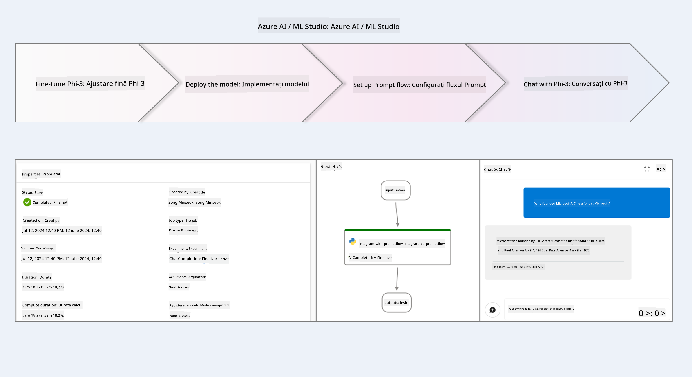

### Cuprins

1. **[Scenariul 1: Configurarea resurselor Azure și pregătirea pentru ajustarea fină](../../../../../../md/02.Application/01.TextAndChat/Phi3)**
    - [Crearea unui Azure Machine Learning Workspace](../../../../../../md/02.Application/01.TextAndChat/Phi3)
    - [Cererea de cote GPU în abonamentul Azure](../../../../../../md/02.Application/01.TextAndChat/Phi3)
    - [Adăugarea unei atribuiri de rol](../../../../../../md/02.Application/01.TextAndChat/Phi3)
    - [Configurarea proiectului](../../../../../../md/02.Application/01.TextAndChat/Phi3)
    - [Pregătirea setului de date pentru ajustarea fină](../../../../../../md/02.Application/01.TextAndChat/Phi3)

1. **[Scenariul 2: Ajustarea fină a modelului Phi-3 și implementarea în Azure Machine Learning Studio](../../../../../../md/02.Application/01.TextAndChat/Phi3)**
    - [Ajustarea fină a modelului Phi-3](../../../../../../md/02.Application/01.TextAndChat/Phi3)
    - [Implementarea modelului Phi-3 ajustat fin](../../../../../../md/02.Application/01.TextAndChat/Phi3)

1. **[Scenariul 3: Integrarea cu Prompt flow și conversația cu modelul tău personalizat în Azure AI Foundry](../../../../../../md/02.Application/01.TextAndChat/Phi3)**
    - [Integrarea modelului personalizat Phi-3 cu Prompt flow](../../../../../../md/02.Application/01.TextAndChat/Phi3)
    - [Conversația cu modelul tău personalizat Phi-3](../../../../../../md/02.Application/01.TextAndChat/Phi3)

## Scenariul 1: Configurarea resurselor Azure și pregătirea pentru ajustarea fină

### Crearea unui Azure Machine Learning Workspace

1. Tastează *azure machine learning* în **bara de căutare** din partea de sus a paginii portalului și selectează **Azure Machine Learning** din opțiunile afișate.

    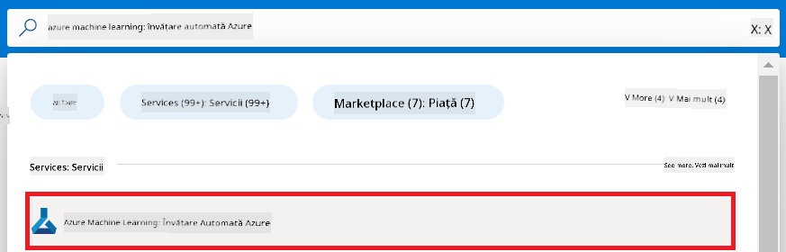

2. Selectează **+ Create** din meniul de navigare.

3. Selectează **New workspace** din meniul de navigare.

    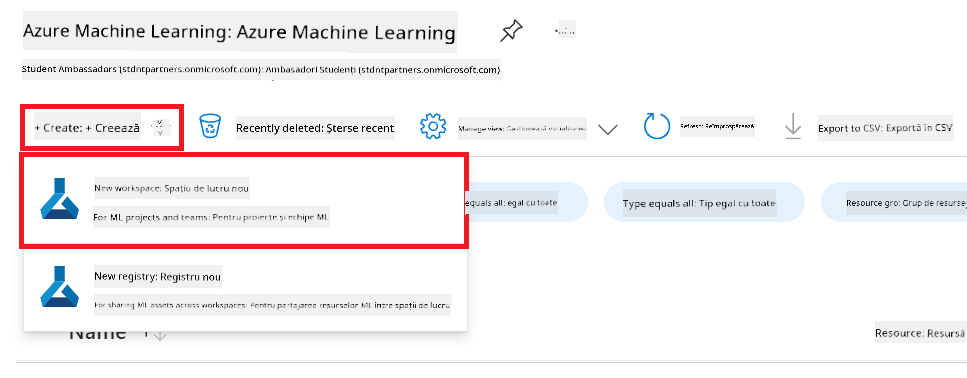

4. Efectuează următoarele acțiuni:

    - Selectează abonamentul tău Azure **Subscription**.
    - Selectează **Resource group** pe care vrei să-l folosești (creează unul nou dacă este necesar).
    - Introdu **Workspace Name**. Trebuie să fie un nume unic.
    - Selectează **Region** pe care vrei să o folosești.
    - Selectează **Storage account** pe care vrei să-l folosești (creează unul nou dacă este necesar).
    - Selectează **Key vault** pe care vrei să-l folosești (creează unul nou dacă este necesar).
    - Selectează **Application insights** pe care vrei să-l folosești (creează unul nou dacă este necesar).
    - Selectează **Container registry** pe care vrei să-l folosești (creează unul nou dacă este necesar).

    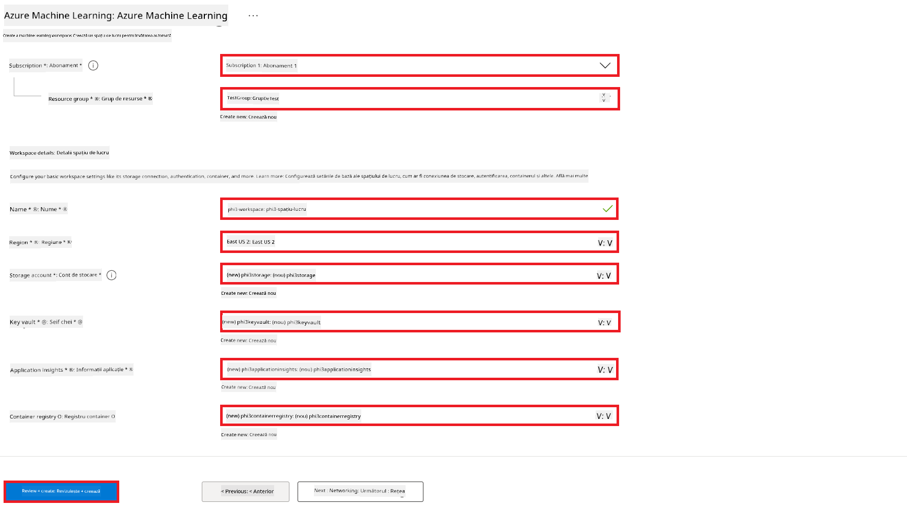

5. Selectează **Review + Create**.

6. Selectează **Create**.

### Cererea de cote GPU în abonamentul Azure

În acest tutorial vei învăța cum să ajustezi fin și să implementezi un model Phi-3, folosind GPU-uri. Pentru ajustarea fină vei folosi GPU-ul *Standard_NC24ads_A100_v4*, care necesită o cerere de cotă. Pentru implementare vei folosi GPU-ul *Standard_NC6s_v3*, care de asemenea necesită o cerere de cotă.

> [!NOTE]
>
> Doar abonamentele Pay-As-You-Go (tipul standard de abonament) sunt eligibile pentru alocarea GPU; abonamentele de tip beneficii nu sunt suportate în prezent.
>

1. Vizitează [Azure ML Studio](https://ml.azure.com/home?wt.mc_id=studentamb_279723).

1. Efectuează următoarele pentru a solicita cota *Standard NCADSA100v4 Family*:

    - Selectează **Quota** din tab-ul din stânga.
    - Selectează **Virtual machine family** pe care vrei să o folosești. De exemplu, selectează **Standard NCADSA100v4 Family Cluster Dedicated vCPUs**, care include GPU-ul *Standard_NC24ads_A100_v4*.
    - Selectează **Request quota** din meniul de navigare.

        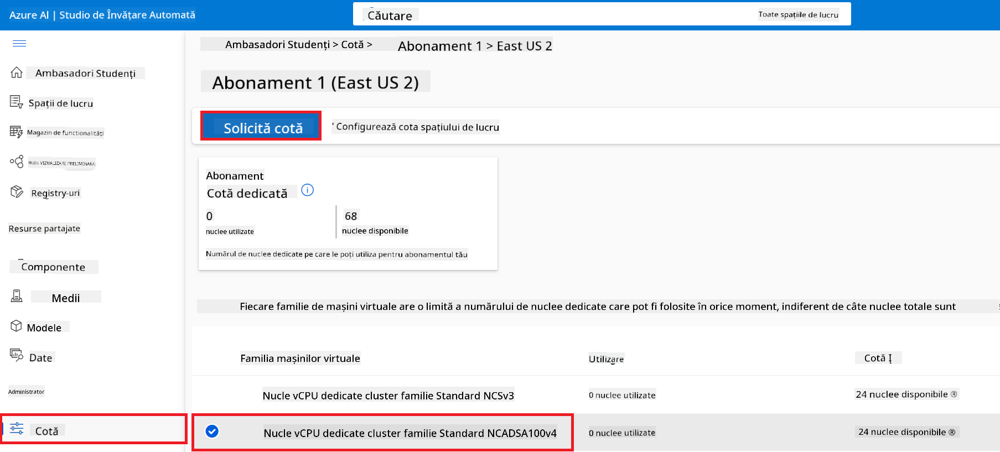

    - În pagina Request quota, introdu **New cores limit** pe care dorești să-l folosești. De exemplu, 24.
    - În pagina Request quota, selectează **Submit** pentru a trimite cererea de cotă pentru GPU.

1. Efectuează următoarele pentru a solicita cota *Standard NCSv3 Family*:

    - Selectează **Quota** din tab-ul din stânga.
    - Selectează **Virtual machine family** pe care vrei să o folosești. De exemplu, selectează **Standard NCSv3 Family Cluster Dedicated vCPUs**, care include GPU-ul *Standard_NC6s_v3*.
    - Selectează **Request quota** din meniul de navigare.
    - În pagina Request quota, introdu **New cores limit** pe care dorești să-l folosești. De exemplu, 24.
    - În pagina Request quota, selectează **Submit** pentru a trimite cererea de cotă pentru GPU.

### Adăugarea unei atribuiri de rol

Pentru a ajusta fin și implementa modelele, trebuie mai întâi să creezi o Identitate Gestionată Alocată de Utilizator (User Assigned Managed Identity - UAI) și să îi atribui permisiunile corespunzătoare. Această UAI va fi folosită pentru autentificare în timpul implementării.

#### Crearea unei User Assigned Managed Identity (UAI)

1. Tastează *managed identities* în **bara de căutare** din partea de sus a paginii portalului și selectează **Managed Identities** din opțiunile afișate.

    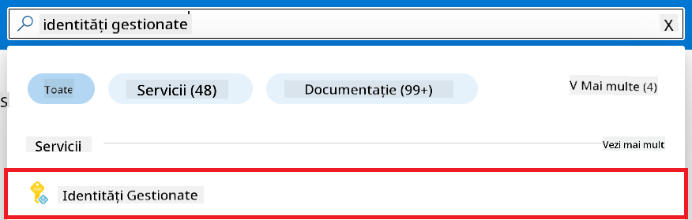

1. Selectează **+ Create**.

    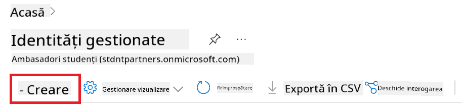

1. Efectuează următoarele acțiuni:

    - Selectează abonamentul tău Azure **Subscription**.
    - Selectează **Resource group** pe care vrei să-l folosești (creează unul nou dacă este necesar).
    - Selectează **Region** pe care vrei să o folosești.
    - Introdu **Name**. Trebuie să fie un nume unic.

    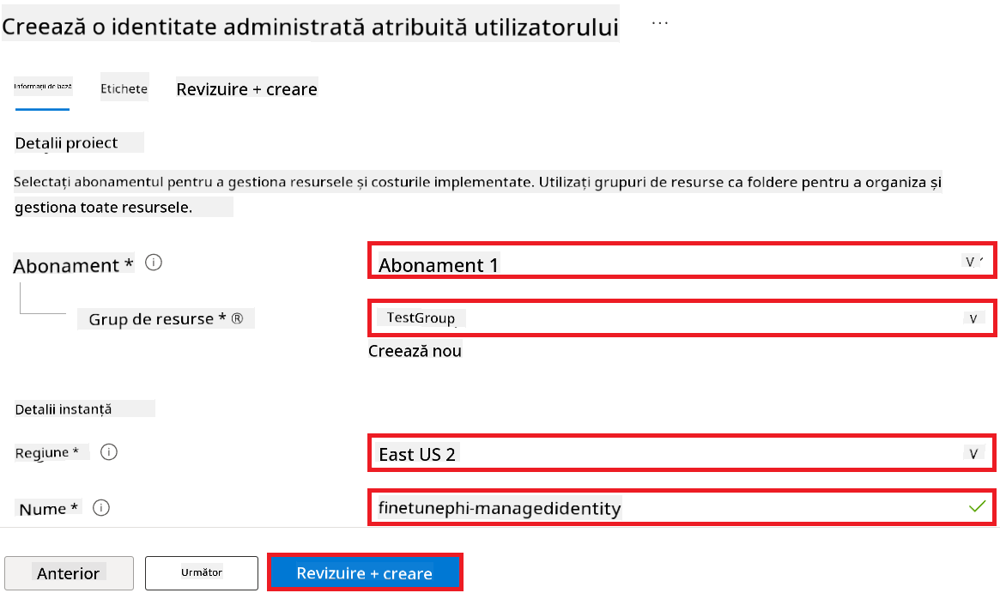

1. Selectează **Review + create**.

1. Selectează **+ Create**.

#### Atribuirea rolului Contributor identității gestionate

1. Navighează la resursa Managed Identity pe care ai creat-o.

1. Selectează **Azure role assignments** din tab-ul din stânga.

1. Selectează **+Add role assignment** din meniul de navigare.

1. În pagina Add role assignment, efectuează următoarele:

    - Selectează **Scope** pe **Resource group**.
    - Selectează abonamentul tău Azure **Subscription**.
    - Selectează **Resource group** pe care îl folosești.
    - Selectează **Role** pe **Contributor**.

    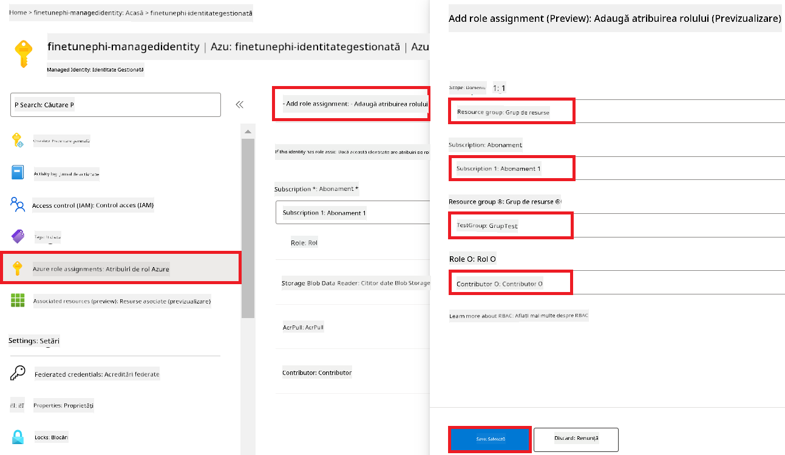

2. Selectează **Save**.

#### Atribuirea rolului Storage Blob Data Reader identității gestionate

1. Tastează *storage accounts* în **bara de căutare** din partea de sus a paginii portalului și selectează **Storage accounts** din opțiunile afișate.

    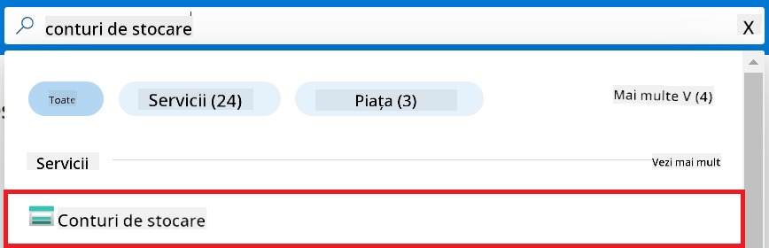

1. Selectează contul de stocare asociat cu Azure Machine Learning workspace pe care l-ai creat. De exemplu, *finetunephistorage*.

1. Efectuează următoarele pentru a naviga la pagina Add role assignment:

    - Navighează la contul de stocare Azure pe care l-ai creat.
    - Selectează **Access Control (IAM)** din tab-ul din stânga.
    - Selectează **+ Add** din meniul de navigare.
    - Selectează **Add role assignment** din meniul de navigare.

    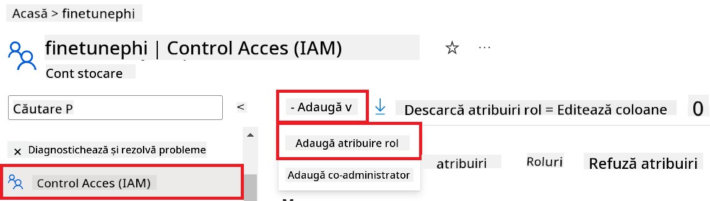

1. În pagina Add role assignment, efectuează următoarele:

    - În pagina Role, tastează *Storage Blob Data Reader* în **bara de căutare** și selectează **Storage Blob Data Reader** din opțiunile afișate.
    - În pagina Role, selectează **Next**.
    - În pagina Members, selectează **Assign access to** pe **Managed identity**.
    - În pagina Members, selectează **+ Select members**.
    - În pagina Select managed identities, selectează abonamentul tău Azure **Subscription**.
    - În pagina Select managed identities, selectează **Managed identity** pe **Manage Identity**.
    - În pagina Select managed identities, selectează Manage Identity pe care ai creat-o. De exemplu, *finetunephi-managedidentity*.
    - În pagina Select managed identities, selectează **Select**.

    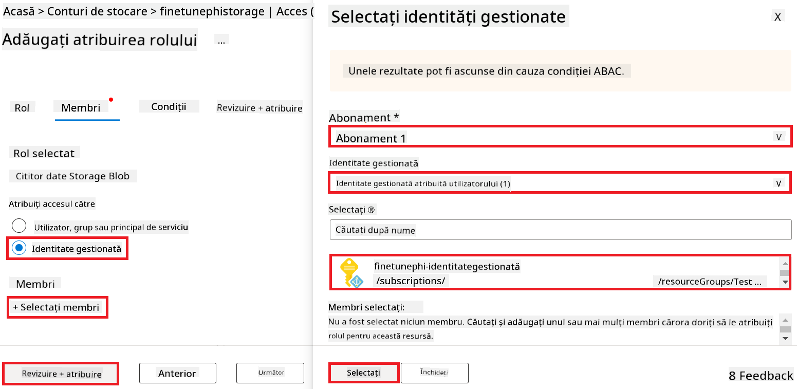

1. Selectează **Review + assign**.

#### Atribuirea rolului AcrPull identității gestionate

1. Tastează *container registries* în **bara de căutare** din partea de sus a paginii portalului și selectează **Container registries** din opțiunile afișate.

    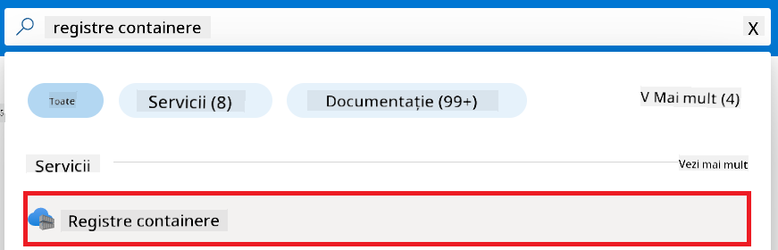

1. Selectează container registry asociat cu Azure Machine Learning workspace. De exemplu, *finetunephicontainerregistry*

1. Efectuează următoarele pentru a naviga la pagina Add role assignment:

    - Selectează **Access Control (IAM)** din tab-ul din stânga.
    - Selectează **+ Add** din meniul de navigare.
    - Selectează **Add role assignment** din meniul de navigare.

1. În pagina Add role assignment, efectuează următoarele:

    - În pagina Role, tastează *AcrPull* în **bara de căutare** și selectează **AcrPull** din opțiunile afișate.
    - În pagina Role, selectează **Next**.
    - În pagina Members, selectează **Assign access to** pe **Managed identity**.
    - În pagina Members, selectează **+ Select members**.
    - În pagina Select managed identities, selectează abonamentul tău Azure **Subscription**.
    - În pagina Select managed identities, selectează **Managed identity** pe **Manage Identity**.
    - În pagina Select managed identities, selectează Manage Identity pe care ai creat-o. De exemplu, *finetunephi-managedidentity*.
    - În pagina Select managed identities, selectează **Select**.
    - Selectează **Review + assign**.

### Configurarea proiectului

Pentru a descărca seturile de date necesare pentru ajustarea fină, vei configura un mediu local.

În acest exercițiu vei:

- Crea un folder în care să lucrezi.
- Crea un mediu virtual.
- Instala pachetele necesare.
- Crea un fișier *download_dataset.py* pentru descărcarea setului de date.

#### Crearea unui folder în care să lucrezi

1. Deschide o fereastră de terminal și tastează următoarea comandă pentru a crea un folder numit *finetune-phi* în calea implicită.

    ```console
    mkdir finetune-phi
    ```

2. Tastează următoarea comandă în terminal pentru a naviga în folderul *finetune-phi* creat.

    ```console
    cd finetune-phi
    ```

#### Crearea unui mediu virtual

1. Tastează următoarea comandă în terminal pentru a crea un mediu virtual numit *.venv*.

    ```console
    python -m venv .venv
    ```

2. Tastează următoarea comandă în terminal pentru a activa mediul virtual.

    ```console
    .venv\Scripts\activate.bat
    ```

> [!NOTE]
> Dacă a funcționat, ar trebui să vezi *(.venv)* înaintea promptului de comandă.

#### Instalarea pachetelor necesare

1. Tastează următoarele comenzi în terminal pentru a instala pachetele necesare.

    ```console
    pip install datasets==2.19.1
    ```

#### Crearea fișierului `download_dataset.py`

> [!NOTE]
> Structura completă a folderului:
>
> ```text
> └── YourUserName
> .    └── finetune-phi
> .        └── download_dataset.py
> ```

1. Deschide **Visual Studio Code**.

1. Selectează **File** din bara de meniu.

1. Selectează **Open Folder**.

1. Selectează folderul *finetune-phi* pe care l-ai creat, care se află în *C:\Users\yourUserName\finetune-phi*.

    

1. În panoul din stânga al Visual Studio Code, dă clic dreapta și selectează **New File** pentru a crea un fișier nou numit *download_dataset.py*.

    

### Pregătirea setului de date pentru ajustarea fină

În acest exercițiu vei rula fișierul *download_dataset.py* pentru a descărca seturile de date *ultrachat_200k* în mediul tău local. Ulterior vei folosi aceste seturi pentru ajustarea fină a modelului Phi-3 în Azure Machine Learning.

În acest exercițiu vei:

- Adăuga cod în fișierul *download_dataset.py* pentru a descărca seturile de date.
- Rula fișierul *download_dataset.py* pentru a descărca seturile în mediul local.

#### Descarcă setul tău de date folosind *download_dataset.py*

1. Deschide fișierul *download_dataset.py* în Visual Studio Code.

1. Adaugă următorul cod în fișierul *download_dataset.py*.

    ```python
    import json
    import os
    from datasets import load_dataset

    def load_and_split_dataset(dataset_name, config_name, split_ratio):
        """
        Load and split a dataset.
        """
        # Load the dataset with the specified name, configuration, and split ratio
        dataset = load_dataset(dataset_name, config_name, split=split_ratio)
        print(f"Original dataset size: {len(dataset)}")
        
        # Split the dataset into train and test sets (80% train, 20% test)
        split_dataset = dataset.train_test_split(test_size=0.2)
        print(f"Train dataset size: {len(split_dataset['train'])}")
        print(f"Test dataset size: {len(split_dataset['test'])}")
        
        return split_dataset

    def save_dataset_to_jsonl(dataset, filepath):
        """
        Save a dataset to a JSONL file.
        """
        # Create the directory if it does not exist
        os.makedirs(os.path.dirname(filepath), exist_ok=True)
        
        # Open the file in write mode
        with open(filepath, 'w', encoding='utf-8') as f:
            # Iterate over each record in the dataset
            for record in dataset:
                # Dump the record as a JSON object and write it to the file
                json.dump(record, f)
                # Write a newline character to separate records
                f.write('\n')
        
        print(f"Dataset saved to {filepath}")

    def main():
        """
        Main function to load, split, and save the dataset.
        """
        # Load and split the ULTRACHAT_200k dataset with a specific configuration and split ratio
        dataset = load_and_split_dataset("HuggingFaceH4/ultrachat_200k", 'default', 'train_sft[:1%]')
        
        # Extract the train and test datasets from the split
        train_dataset = dataset['train']
        test_dataset = dataset['test']

        # Save the train dataset to a JSONL file
        save_dataset_to_jsonl(train_dataset, "data/train_data.jsonl")
        
        # Save the test dataset to a separate JSONL file
        save_dataset_to_jsonl(test_dataset, "data/test_data.jsonl")

    if __name__ == "__main__":
        main()

    ```

1. Tastează următoarea comandă în terminal pentru a rula scriptul și a descărca setul de date în mediul local.

    ```console
    python download_dataset.py
    ```

1. Verifică dacă seturile de date au fost salvate cu succes în directorul local *finetune-phi/data*.

> [!NOTE]
>
>
1. Accesează [Azure ML Studio](https://ml.azure.com/home?wt.mc_id=studentamb_279723).

1. Selectează **Compute** din bara laterală din stânga.

1. Selectează **Compute clusters** din meniul de navigare.

1. Selectează **+ New**.

    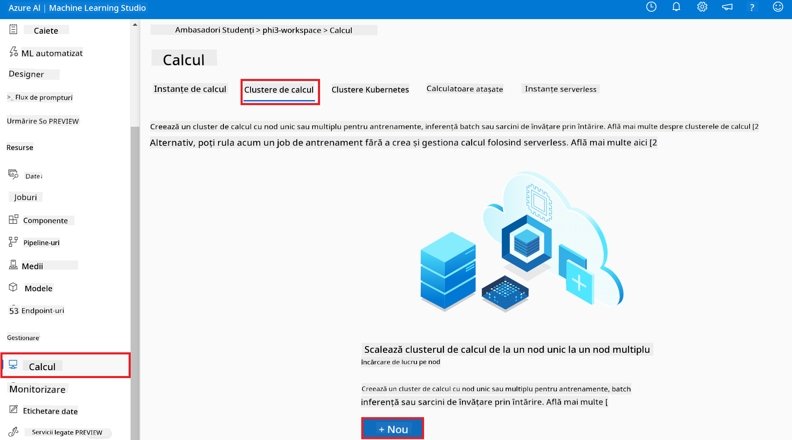

1. Efectuează următoarele operațiuni:

    - Selectează **Region** pe care dorești să o folosești.
    - Selectează **Virtual machine tier** pe **Dedicated**.
    - Selectează **Virtual machine type** pe **GPU**.
    - Filtrează **Virtual machine size** pe **Select from all options**.
    - Selectează **Virtual machine size** pe **Standard_NC24ads_A100_v4**.

    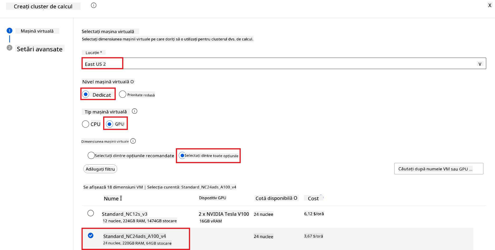

1. Selectează **Next**.

1. Efectuează următoarele operațiuni:

    - Introdu un **Compute name**. Trebuie să fie o valoare unică.
    - Selectează **Minimum number of nodes** pe **0**.
    - Selectează **Maximum number of nodes** pe **1**.
    - Selectează **Idle seconds before scale down** pe **120**.

    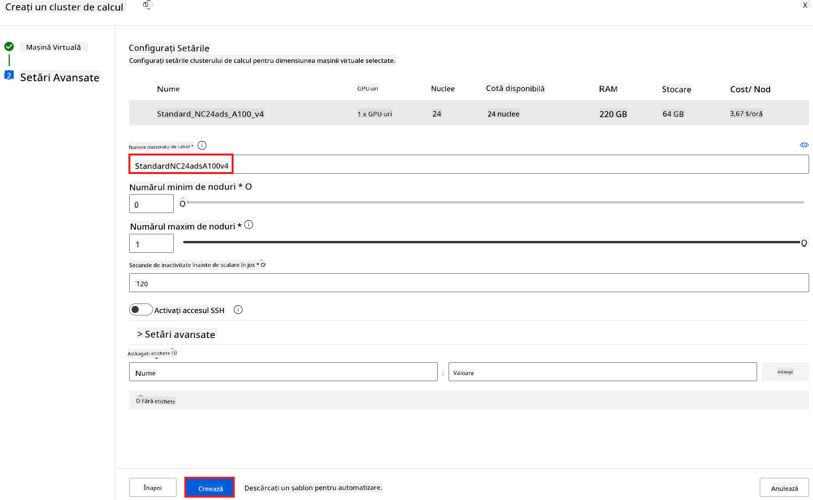

1. Selectează **Create**.

#### Ajustează fin modelul Phi-3

1. Accesează [Azure ML Studio](https://ml.azure.com/home?wt.mc_id=studentamb_279723).

1. Selectează workspace-ul Azure Machine Learning pe care l-ai creat.

    

1. Efectuează următoarele operațiuni:

    - Selectează **Model catalog** din bara laterală din stânga.
    - Tastează *phi-3-mini-4k* în **bara de căutare** și selectează **Phi-3-mini-4k-instruct** din opțiunile afișate.

    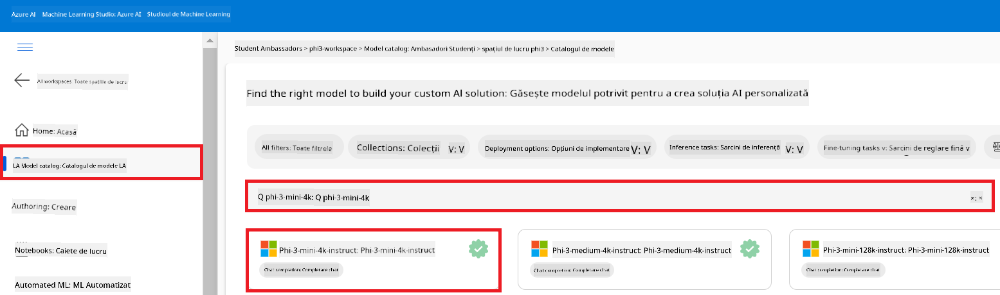

1. Selectează **Fine-tune** din meniul de navigare.

    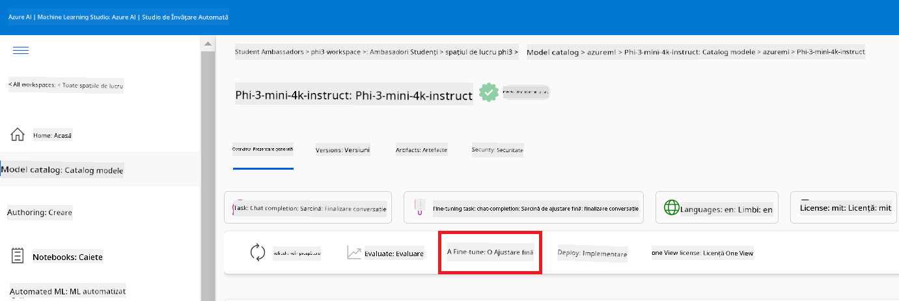

1. Efectuează următoarele operațiuni:

    - Selectează **Select task type** pe **Chat completion**.
    - Selectează **+ Select data** pentru a încărca **Traning data**.
    - Selectează tipul de încărcare pentru Validation data pe **Provide different validation data**.
    - Selectează **+ Select data** pentru a încărca **Validation data**.

    

    > [!TIP]
    >
    > Poți selecta **Advanced settings** pentru a personaliza configurări precum **learning_rate** și **lr_scheduler_type**, optimizând astfel procesul de fine-tuning în funcție de nevoile tale specifice.

1. Selectează **Finish**.

1. În acest exercițiu, ai ajustat cu succes modelul Phi-3 folosind Azure Machine Learning. Reține că procesul de fine-tuning poate dura destul de mult timp. După ce pornești jobul de fine-tuning, trebuie să aștepți finalizarea acestuia. Poți monitoriza stadiul jobului accesând fila Jobs din partea stângă a Workspace-ului tău Azure Machine Learning. În următorul set de pași, vei implementa modelul ajustat și îl vei integra cu Prompt flow.

    

### Implementează modelul Phi-3 ajustat

Pentru a integra modelul Phi-3 ajustat cu Prompt flow, trebuie să implementezi modelul pentru a-l face accesibil pentru inferență în timp real. Acest proces implică înregistrarea modelului, crearea unui endpoint online și implementarea modelului.

În acest exercițiu vei:

- Înregistra modelul ajustat în workspace-ul Azure Machine Learning.
- Crea un endpoint online.
- Implementa modelul Phi-3 ajustat înregistrat.

#### Înregistrează modelul ajustat

1. Accesează [Azure ML Studio](https://ml.azure.com/home?wt.mc_id=studentamb_279723).

1. Selectează workspace-ul Azure Machine Learning pe care l-ai creat.

    

1. Selectează **Models** din bara laterală din stânga.
1. Selectează **+ Register**.
1. Selectează **From a job output**.

    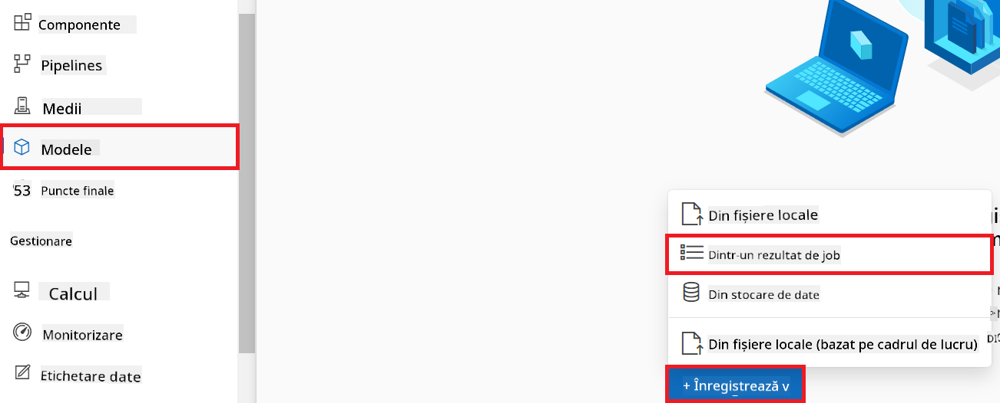

1. Selectează jobul pe care l-ai creat.

    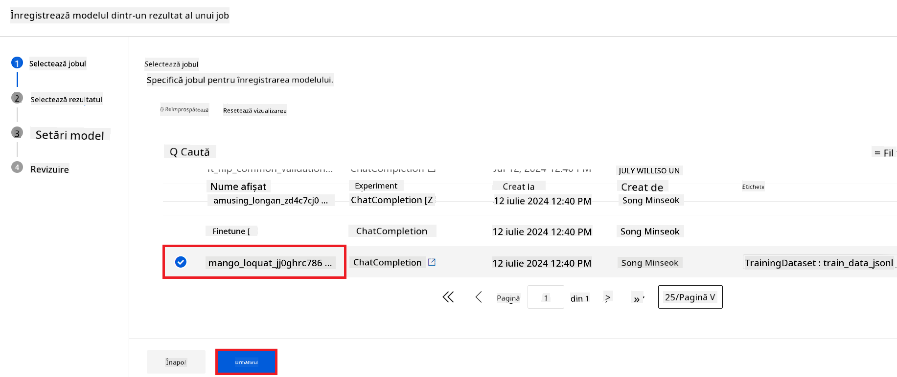

1. Selectează **Next**.

1. Selectează **Model type** pe **MLflow**.

1. Asigură-te că **Job output** este selectat; ar trebui să fie selectat automat.

    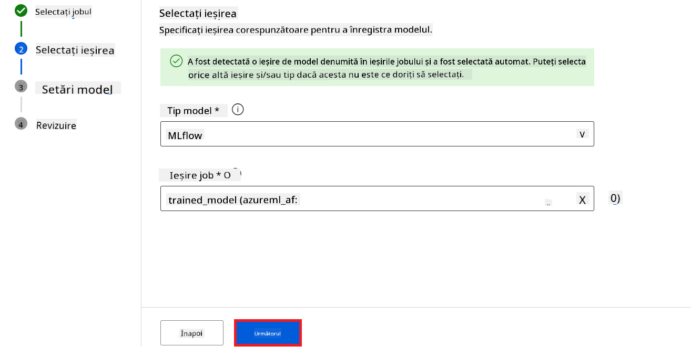

2. Selectează **Next**.

3. Selectează **Register**.

    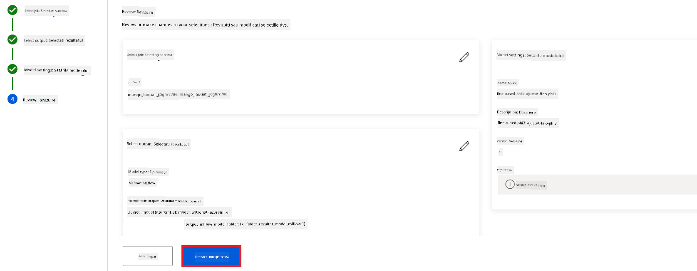

4. Poți vedea modelul înregistrat navigând la meniul **Models** din bara laterală din stânga.

    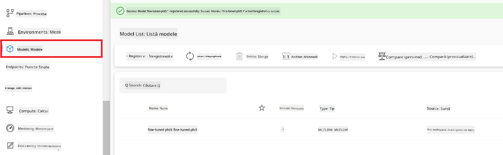

#### Implementează modelul ajustat

1. Navighează la workspace-ul Azure Machine Learning pe care l-ai creat.

1. Selectează **Endpoints** din bara laterală din stânga.

1. Selectează **Real-time endpoints** din meniul de navigare.

    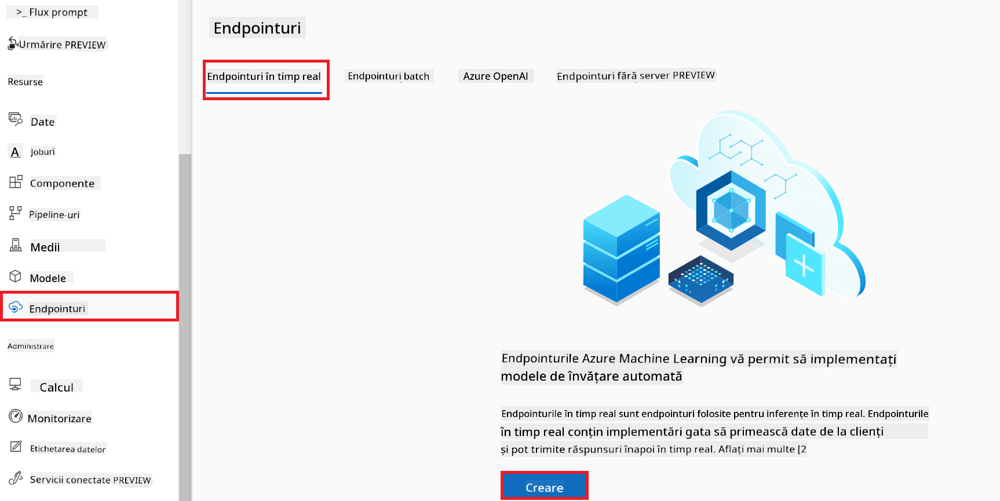

1. Selectează **Create**.

1. Selectează modelul înregistrat pe care l-ai creat.

    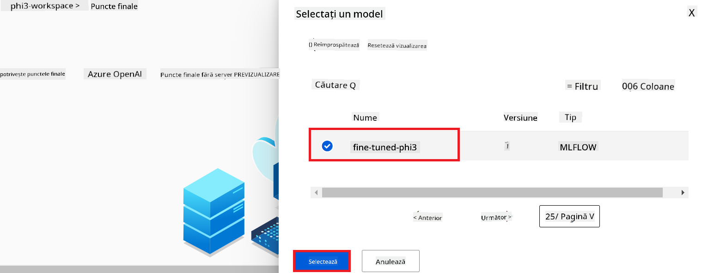

1. Selectează **Select**.

1. Efectuează următoarele operațiuni:

    - Selectează **Virtual machine** pe *Standard_NC6s_v3*.
    - Selectează numărul de instanțe dorit, de exemplu *1*.
    - Selectează **Endpoint** pe **New** pentru a crea un endpoint.
    - Introdu un **Endpoint name**. Trebuie să fie o valoare unică.
    - Introdu un **Deployment name**. Trebuie să fie o valoare unică.

    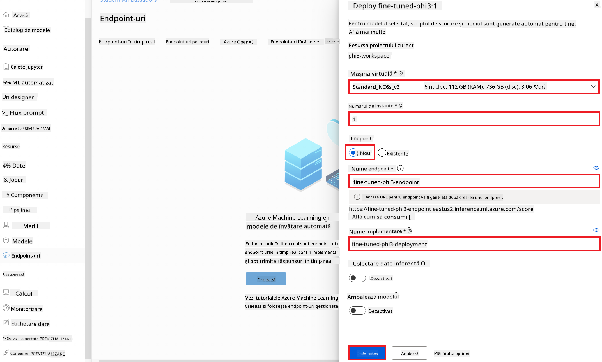

1. Selectează **Deploy**.

> [!WARNING]
> Pentru a evita costuri suplimentare, asigură-te că ștergi endpoint-ul creat în workspace-ul Azure Machine Learning după utilizare.
>

#### Verifică stadiul implementării în Azure Machine Learning Workspace

1. Navighează la workspace-ul Azure Machine Learning pe care l-ai creat.

1. Selectează **Endpoints** din bara laterală din stânga.

1. Selectează endpoint-ul pe care l-ai creat.

    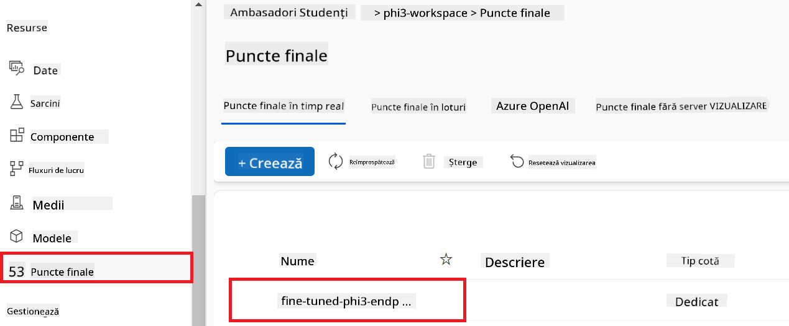

1. Pe această pagină poți gestiona endpoint-urile pe parcursul procesului de implementare.

> [!NOTE]
> După ce implementarea este finalizată, asigură-te că **Live traffic** este setat la **100%**. Dacă nu este, selectează **Update traffic** pentru a ajusta setările de trafic. Reține că nu poți testa modelul dacă traficul este setat la 0%.
>
> 
>

## Scenariul 3: Integrează cu Prompt flow și discută cu modelul tău personalizat în Azure AI Foundry

### Integrează modelul personalizat Phi-3 cu Prompt flow

După ce ai implementat cu succes modelul ajustat, îl poți integra acum cu Prompt Flow pentru a-l folosi în aplicații în timp real, permițând o varietate de sarcini interactive cu modelul tău personalizat Phi-3.

În acest exercițiu vei:

- Crea Azure AI Foundry Hub.
- Crea Azure AI Foundry Project.
- Crea Prompt flow.
- Adăuga o conexiune personalizată pentru modelul Phi-3 ajustat.
- Configura Prompt flow pentru a discuta cu modelul tău personalizat Phi-3.

> [!NOTE]
> Poți integra Promptflow și folosind Azure ML Studio. Același proces de integrare se aplică și pentru Azure ML Studio.

#### Creează Azure AI Foundry Hub

Trebuie să creezi un Hub înainte de a crea un Project. Un Hub funcționează ca un Resource Group, permițând organizarea și gestionarea mai multor proiecte în Azure AI Foundry.

1. Accesează [Azure AI Foundry](https://ai.azure.com/?WT.mc_id=aiml-137032-kinfeylo).

1. Selectează **All hubs** din bara laterală din stânga.

1. Selectează **+ New hub** din meniul de navigare.

    

1. Efectuează următoarele operațiuni:

    - Introdu un **Hub name**. Trebuie să fie o valoare unică.
    - Selectează abonamentul Azure **Subscription**.
    - Selectează **Resource group** pe care dorești să-l folosești (creează unul nou dacă este necesar).
    - Selectează **Location** pe care dorești să o folosești.
    - Selectează **Connect Azure AI Services** (creează unul nou dacă este necesar).
    - Selectează **Connect Azure AI Search** pe **Skip connecting**.

    

1. Selectează **Next**.

#### Creează Azure AI Foundry Project

1. În Hub-ul pe care l-ai creat, selectează **All projects** din bara laterală din stânga.

1. Selectează **+ New project** din meniul de navigare.

    

1. Introdu un **Project name**. Trebuie să fie o valoare unică.

    

1. Selectează **Create a project**.

#### Adaugă o conexiune personalizată pentru modelul Phi-3 ajustat

Pentru a integra modelul tău personalizat Phi-3 cu Prompt flow, trebuie să salvezi endpoint-ul și cheia modelului într-o conexiune personalizată. Această configurare asigură accesul la modelul tău Phi-3 personalizat în Prompt flow.

#### Setează cheia api și URI-ul endpoint-ului pentru modelul Phi-3 ajustat

1. Accesează [Azure ML Studio](https://ml.azure.com/home?WT.mc_id=aiml-137032-kinfeylo).

1. Navighează la workspace-ul Azure Machine Learning pe care l-ai creat.

1. Selectează **Endpoints** din bara laterală din stânga.

    

1. Selectează endpoint-ul pe care l-ai creat.

    

1. Selectează **Consume** din meniul de navigare.

1. Copiază **REST endpoint** și **Primary key**.


#### Adaugă conexiunea personalizată

1. Accesează [Azure AI Foundry](https://ai.azure.com/?WT.mc_id=aiml-137032-kinfeylo).

1. Navighează la proiectul Azure AI Foundry pe care l-ai creat.

1. În proiectul creat, selectează **Settings** din fila din partea stângă.

1. Selectează **+ New connection**.

    

1. Selectează **Custom keys** din meniul de navigare.

    

1. Efectuează următoarele operațiuni:

    - Selectează **+ Add key value pairs**.
    - Pentru numele cheii, introdu **endpoint** și lipește endpoint-ul copiat din Azure ML Studio în câmpul de valoare.
    - Selectează din nou **+ Add key value pairs**.
    - Pentru numele cheii, introdu **key** și lipește cheia copiată din Azure ML Studio în câmpul de valoare.
    - După ce ai adăugat cheile, bifează **is secret** pentru a împiedica expunerea cheii.

    

1. Selectează **Add connection**.

#### Creează Prompt flow

Ai adăugat o conexiune personalizată în Azure AI Foundry. Acum, hai să creăm un Prompt flow urmând pașii de mai jos. Apoi, vei conecta acest Prompt flow la conexiunea personalizată pentru a putea folosi modelul finetunat în cadrul Prompt flow.

1. Navighează la proiectul Azure AI Foundry pe care l-ai creat.

1. Selectează **Prompt flow** din fila din partea stângă.

1. Selectează **+ Create** din meniul de navigare.

    

1. Selectează **Chat flow** din meniul de navigare.

    

1. Introdu **Folder name** pe care dorești să-l folosești.

    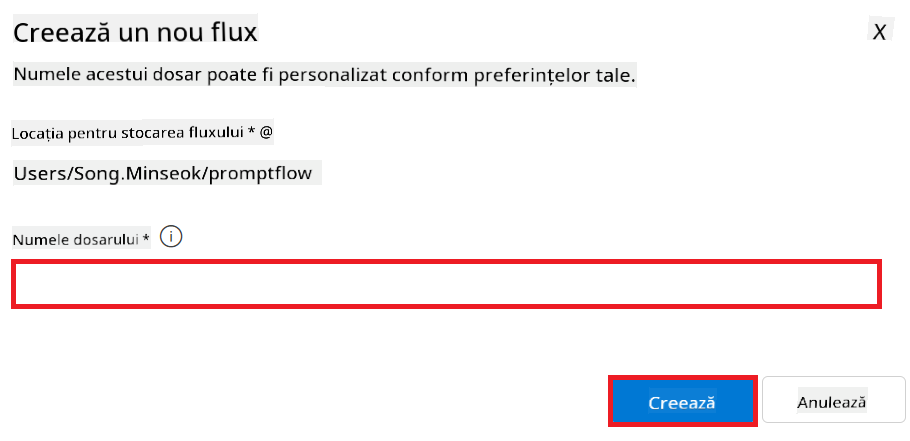

2. Selectează **Create**.

#### Configurează Prompt flow pentru a conversa cu modelul tău personalizat Phi-3

Trebuie să integrezi modelul Phi-3 finetunat într-un Prompt flow. Totuși, Prompt flow-ul existent nu este conceput pentru acest scop. Prin urmare, trebuie să reproiectezi Prompt flow-ul pentru a permite integrarea modelului personalizat.

1. În Prompt flow, realizează următoarele pentru a reconstrui fluxul existent:

    - Selectează **Raw file mode**.
    - Șterge tot codul existent din fișierul *flow.dag.yml*.
    - Adaugă următorul cod în fișierul *flow.dag.yml*.

        ```yml
        inputs:
          input_data:
            type: string
            default: "Who founded Microsoft?"

        outputs:
          answer:
            type: string
            reference: ${integrate_with_promptflow.output}

        nodes:
        - name: integrate_with_promptflow
          type: python
          source:
            type: code
            path: integrate_with_promptflow.py
          inputs:
            input_data: ${inputs.input_data}
        ```

    - Selectează **Save**.

    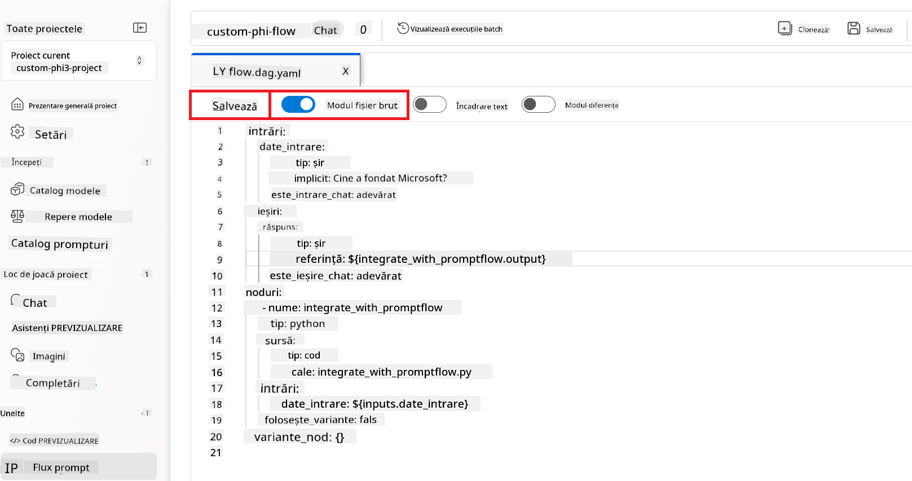

1. Adaugă următorul cod în fișierul *integrate_with_promptflow.py* pentru a folosi modelul personalizat Phi-3 în Prompt flow.

    ```python
    import logging
    import requests
    from promptflow import tool
    from promptflow.connections import CustomConnection

    # Logging setup
    logging.basicConfig(
        format="%(asctime)s - %(levelname)s - %(name)s - %(message)s",
        datefmt="%Y-%m-%d %H:%M:%S",
        level=logging.DEBUG
    )
    logger = logging.getLogger(__name__)

    def query_phi3_model(input_data: str, connection: CustomConnection) -> str:
        """
        Send a request to the Phi-3 model endpoint with the given input data using Custom Connection.
        """

        # "connection" is the name of the Custom Connection, "endpoint", "key" are the keys in the Custom Connection
        endpoint_url = connection.endpoint
        api_key = connection.key

        headers = {
            "Content-Type": "application/json",
            "Authorization": f"Bearer {api_key}"
        }
        data = {
            "input_data": {
                "input_string": [
                    {"role": "user", "content": input_data}
                ],
                "parameters": {
                    "temperature": 0.7,
                    "max_new_tokens": 128
                }
            }
        }
        try:
            response = requests.post(endpoint_url, json=data, headers=headers)
            response.raise_for_status()
            
            # Log the full JSON response
            logger.debug(f"Full JSON response: {response.json()}")

            result = response.json()["output"]
            logger.info("Successfully received response from Azure ML Endpoint.")
            return result
        except requests.exceptions.RequestException as e:
            logger.error(f"Error querying Azure ML Endpoint: {e}")
            raise

    @tool
    def my_python_tool(input_data: str, connection: CustomConnection) -> str:
        """
        Tool function to process input data and query the Phi-3 model.
        """
        return query_phi3_model(input_data, connection)

    ```

    

> [!NOTE]
> Pentru informații mai detaliate despre utilizarea Prompt flow în Azure AI Foundry, poți consulta [Prompt flow in Azure AI Foundry](https://learn.microsoft.com/azure/ai-studio/how-to/prompt-flow).

1. Selectează **Chat input**, **Chat output** pentru a activa conversația cu modelul tău.

    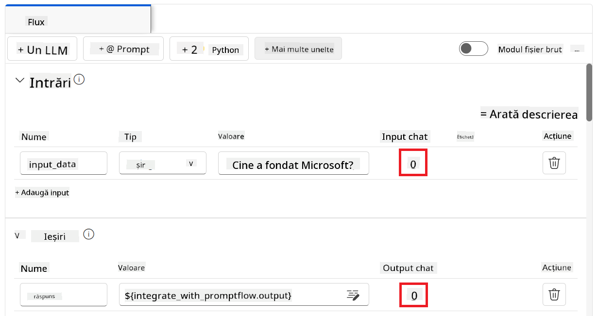

1. Acum ești gata să conversezi cu modelul tău personalizat Phi-3. În exercițiul următor vei învăța cum să pornești Prompt flow și să îl folosești pentru a conversa cu modelul Phi-3 finetunat.

> [!NOTE]
>
> Fluxul reconstruit ar trebui să arate ca în imaginea de mai jos:
>
> 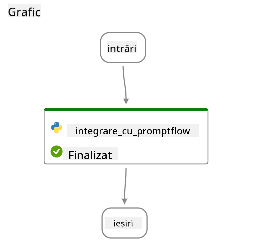
>

### Conversează cu modelul tău personalizat Phi-3

Acum că ai finetunat și integrat modelul tău personalizat Phi-3 cu Prompt flow, ești pregătit să începi să interacționezi cu el. Acest exercițiu te va ghida prin procesul de configurare și inițiere a unei conversații cu modelul folosind Prompt flow. Urmând acești pași, vei putea folosi pe deplin capacitățile modelului tău Phi-3 finetunat pentru diverse sarcini și conversații.

- Conversează cu modelul tău personalizat Phi-3 folosind Prompt flow.

#### Pornește Prompt flow

1. Selectează **Start compute sessions** pentru a porni Prompt flow.

    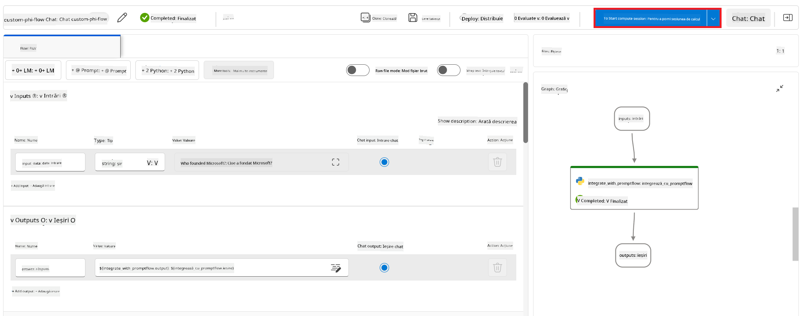

1. Selectează **Validate and parse input** pentru a reînnoi parametrii.

    

1. Selectează **Value** al **connection** către conexiunea personalizată pe care ai creat-o. De exemplu, *connection*.

    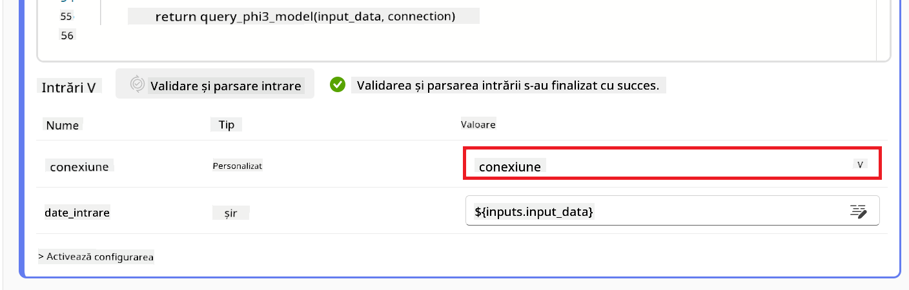

#### Conversează cu modelul tău personalizat

1. Selectează **Chat**.

    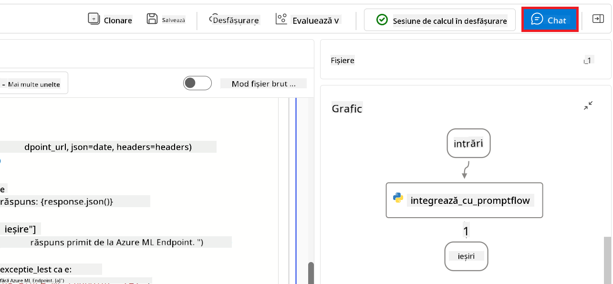

1. Iată un exemplu al rezultatelor: Acum poți conversa cu modelul tău personalizat Phi-3. Se recomandă să pui întrebări bazate pe datele folosite pentru finetuning.

    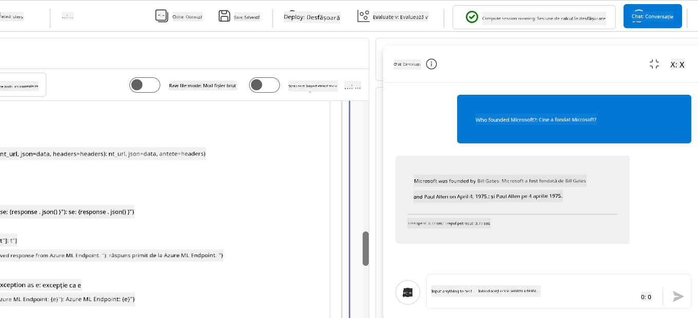

**Declinare a responsabilității**:  
Acest document a fost tradus folosind serviciul de traducere automată AI [Co-op Translator](https://github.com/Azure/co-op-translator). Deși ne străduim pentru acuratețe, vă rugăm să rețineți că traducerile automate pot conține erori sau inexactități. Documentul original în limba sa nativă trebuie considerat sursa autoritară. Pentru informații critice, se recomandă traducerea profesională realizată de un traducător uman. Nu ne asumăm răspunderea pentru eventualele neînțelegeri sau interpretări greșite care pot apărea în urma utilizării acestei traduceri.