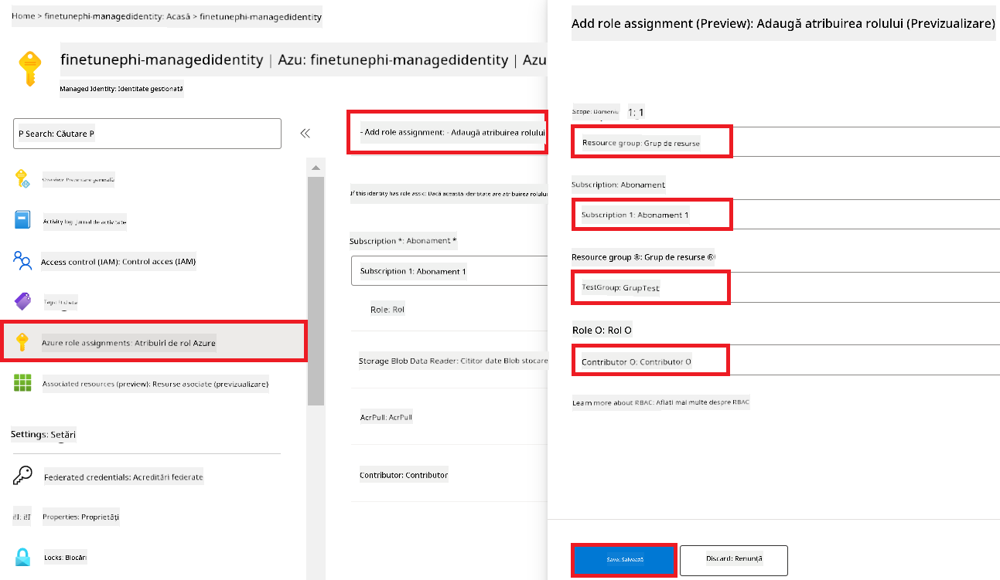
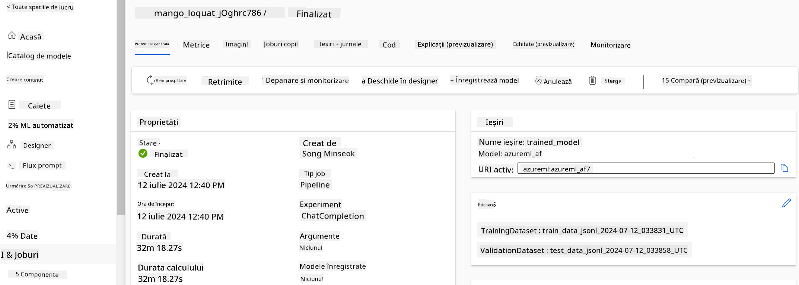
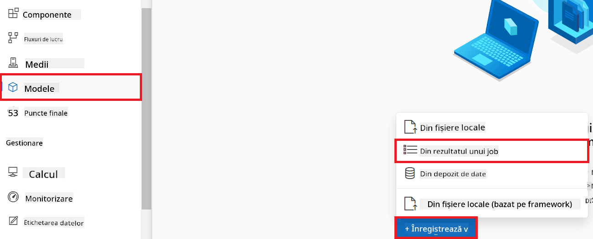
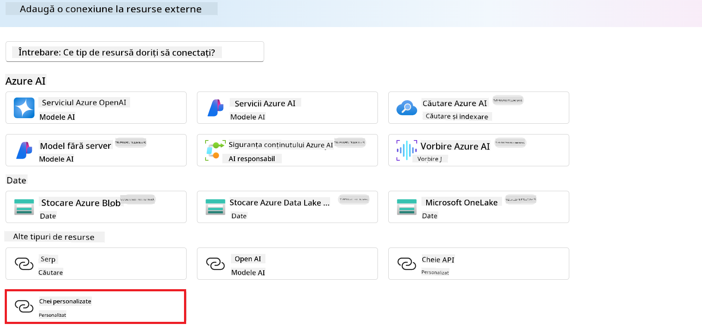

<!--
CO_OP_TRANSLATOR_METADATA:
{
  "original_hash": "0df910a227098303cc392b6ad204c271",
  "translation_date": "2026-01-06T05:08:44+00:00",
  "source_file": "md/02.Application/01.TextAndChat/Phi3/E2E_Phi-3-FineTuning_PromptFlow_Integration_AIFoundry.md",
  "language_code": "ro"
}
-->
# Ajustați și integrați modelele personalizate Phi-3 cu Prompt flow în Azure AI Foundry

Acest exemplu complet (E2E) este bazat pe ghidul "[Fine-Tune and Integrate Custom Phi-3 Models with Prompt Flow in Azure AI Foundry](https://techcommunity.microsoft.com/t5/educator-developer-blog/fine-tune-and-integrate-custom-phi-3-models-with-prompt-flow-in/ba-p/4191726?WT.mc_id=aiml-137032-kinfeylo)" din Microsoft Tech Community. Prezintă procesele de ajustare fină, implementare și integrare a modelelor personalizate Phi-3 cu Prompt flow în Azure AI Foundry. Spre deosebire de exemplul E2E, "[Fine-Tune and Integrate Custom Phi-3 Models with Prompt Flow](./E2E_Phi-3-FineTuning_PromptFlow_Integration.md)", care implica rularea codului local, acest tutorial se concentrează integral pe ajustarea fină și integrarea modelului dvs. în Azure AI / ML Studio.

## Prezentare generală

În acest exemplu E2E, veți învăța cum să ajustați fin modelul Phi-3 și să îl integrați cu Prompt flow în Azure AI Foundry. Folosind Azure AI / ML Studio, veți stabili un flux de lucru pentru implementarea și utilizarea modelelor AI personalizate. Acest exemplu E2E este împărțit în trei scenarii:

**Scenariul 1: Configurați resursele Azure și pregătiți pentru ajustarea fină**

**Scenariul 2: Ajustați fin modelul Phi-3 și implementați în Azure Machine Learning Studio**

**Scenariul 3: Integrați cu Prompt flow și conversați cu modelul personalizat în Azure AI Foundry**

Iată o prezentare generală a acestui exemplu E2E.


### Cuprins

1. **[Scenariul 1: Configurați resursele Azure și pregătiți pentru ajustarea fină](../../../../../../md/02.Application/01.TextAndChat/Phi3)**
    - [Creați un workspace Azure Machine Learning](../../../../../../md/02.Application/01.TextAndChat/Phi3)
    - [Solicitați cote GPU în abonamentul Azure](../../../../../../md/02.Application/01.TextAndChat/Phi3)
    - [Adăugați atribuirea unui rol](../../../../../../md/02.Application/01.TextAndChat/Phi3)
    - [Configurați proiectul](../../../../../../md/02.Application/01.TextAndChat/Phi3)
    - [Pregătiți setul de date pentru ajustarea fină](../../../../../../md/02.Application/01.TextAndChat/Phi3)

1. **[Scenariul 2: Ajustați fin modelul Phi-3 și implementați în Azure Machine Learning Studio](../../../../../../md/02.Application/01.TextAndChat/Phi3)**
    - [Ajustați fin modelul Phi-3](../../../../../../md/02.Application/01.TextAndChat/Phi3)
    - [Implementați modelul Phi-3 ajustat fin](../../../../../../md/02.Application/01.TextAndChat/Phi3)

1. **[Scenariul 3: Integrați cu Prompt flow și conversați cu modelul personalizat în Azure AI Foundry](../../../../../../md/02.Application/01.TextAndChat/Phi3)**
    - [Integrați modelul personalizat Phi-3 cu Prompt flow](../../../../../../md/02.Application/01.TextAndChat/Phi3)
    - [Conversați cu modelul personalizat Phi-3](../../../../../../md/02.Application/01.TextAndChat/Phi3)

## Scenariul 1: Configurați resursele Azure și pregătiți pentru ajustarea fină

### Creați un workspace Azure Machine Learning

1. Tastați *azure machine learning* în **bara de căutare** din partea de sus a paginii portalului și selectați **Azure Machine Learning** din opțiunile care apar.

    

2. Selectați **+ Create** din meniul de navigare.

3. Selectați **New workspace** din meniul de navigare.

    

4. Efectuați următoarele acțiuni:

    - Selectați **Abonamentul** dvs. Azure.
    - Selectați **Grupul de resurse** pe care doriți să-l utilizați (creați unul nou dacă este necesar).
    - Introduceți **Numele Workspace-ului**. Trebuie să fie o valoare unică.
    - Selectați **Regiunea** pe care doriți să o utilizați.
    - Selectați contul de **Stocare** pe care doriți să-l utilizați (creați unul nou dacă este necesar).
    - Selectați **Key vault-ul** pe care doriți să-l utilizați (creați unul nou dacă este necesar).
    - Selectați **Application insights** pe care doriți să-l utilizați (creați unul nou dacă este necesar).
    - Selectați **Container registry-ul** pe care doriți să-l utilizați (creați unul nou dacă este necesar).

    

5. Selectați **Review + Create**.

6. Selectați **Create**.

### Solicitați cote GPU în abonamentul Azure

În acest tutorial, veți învăța cum să ajustați fin și să implementați un model Phi-3, folosind GPU-uri. Pentru ajustarea fină, veți folosi GPU-ul *Standard_NC24ads_A100_v4*, care necesită o solicitare de cotă. Pentru implementare, veți folosi GPU-ul *Standard_NC6s_v3*, care necesită de asemenea o solicitare de cotă.

> [!NOTE]
>
> Doar abonamentele Pay-As-You-Go (tipul standard de abonament) sunt eligibile pentru alocarea GPU-urilor; abonamentele de tip benefit nu sunt în prezent suportate.
>

1. Accesați [Azure ML Studio](https://ml.azure.com/home?wt.mc_id=studentamb_279723).

1. Efectuați următoarele acțiuni pentru a solicita cota *Standard NCADSA100v4 Family*:

    - Selectați **Quota** din fila din stânga.
    - Selectați **Familia mașinii virtuale** pe care doriți să o utilizați. De exemplu, selectați **Standard NCADSA100v4 Family Cluster Dedicated vCPUs**, care include GPU-ul *Standard_NC24ads_A100_v4*.
    - Selectați **Request quota** din meniul de navigare.

        

    - În pagina Request quota introduceți **Limita nouă de nuclee** pe care doriți să o utilizați. De exemplu, 24.
    - În pagina Request quota selectați **Submit** pentru a trimite solicitarea de cotă GPU.

1. Efectuați următoarele acțiuni pentru a solicita cota *Standard NCSv3 Family*:

    - Selectați **Quota** din fila din stânga.
    - Selectați **Familia mașinii virtuale** pe care doriți să o utilizați. De exemplu, selectați **Standard NCSv3 Family Cluster Dedicated vCPUs**, care include GPU-ul *Standard_NC6s_v3*.
    - Selectați **Request quota** din meniul de navigare.
    - În pagina Request quota introduceți **Limita nouă de nuclee** pe care doriți să o utilizați. De exemplu, 24.
    - În pagina Request quota selectați **Submit** pentru a trimite solicitarea de cotă GPU.

### Adăugați atribuirea unui rol

Pentru a ajusta fin și implementa modelele, trebuie mai întâi să creați o Identitate Gestionată Asignată Utilizatorului (User Assigned Managed Identity - UAI) și să-i atribuiți permisiunile corespunzătoare. Această UAI va fi utilizată pentru autentificare în timpul implementării.

#### Creați o identitate gestionată asignată utilizatorului (UAI)

1. Tastați *managed identities* în **bara de căutare** din partea de sus a paginii portalului și selectați **Managed Identities** din opțiunile care apar.

    

1. Selectați **+ Create**.

    

1. Efectuați următoarele acțiuni:

    - Selectați **Abonamentul** dvs. Azure.
    - Selectați **Grupul de resurse** pe care doriți să-l utilizați (creați unul nou dacă este necesar).
    - Selectați regiunea pe care doriți să o utilizați.
    - Introduceți **Numele**. Trebuie să fie o valoare unică.

    

1. Selectați **Review + create**.

1. Selectați **+ Create**.

#### Adăugați atribuirea rolului Contributor identității gestionate

1. Navigați la resursa Identitate Gestionată pe care ați creat-o.

1. Selectați **Azure role assignments** din fila din stânga.

1. Selectați **+Add role assignment** din meniul de navigare.

1. În pagina Add role assignment, efectuați următoarele:

    - Selectați **Scope** la **Resource group**.
    - Selectați **Abonamentul** dvs. Azure.
    - Selectați **Grupul de resurse** pe care doriți să-l utilizați.
    - Selectați rolul **Contributor**.

    

2. Selectați **Save**.

#### Adăugați atribuirea rolului Storage Blob Data Reader identității gestionate

1. Tastați *storage accounts* în **bara de căutare** din partea de sus a paginii portalului și selectați **Storage accounts** din opțiunile care apar.

    

1. Selectați contul de stocare asociat workspace-ului Azure Machine Learning pe care l-ați creat. De exemplu, *finetunephistorage*.

1. Efectuați următoarele acțiuni pentru a naviga la pagina Add role assignment:

    - Navigați la contul de stocare Azure pe care l-ați creat.
    - Selectați **Access Control (IAM)** din fila din stânga.
    - Selectați **+ Add** din meniul de navigare.
    - Selectați **Add role assignment** din meniul de navigare.

    

1. În pagina Add role assignment, efectuați următoarele:

    - În pagina Role, tastați *Storage Blob Data Reader* în **bara de căutare** și selectați **Storage Blob Data Reader** din opțiunile care apar.
    - În pagina Role, selectați **Next**.
    - În pagina Members, selectați **Assign access to** **Managed identity**.
    - În pagina Members, selectați **+ Select members**.
    - În pagina Select managed identities, selectați **Abonamentul** dvs. Azure.
    - În pagina Select managed identities, selectați **Managed identity** ca tip.
    - În pagina Select managed identities, selectați Identitatea Gestionată pe care ați creat-o. De exemplu, *finetunephi-managedidentity*.
    - În pagina Select managed identities, selectați **Select**.

    

1. Selectați **Review + assign**.

#### Adăugați atribuirea rolului AcrPull identității gestionate

1. Tastați *container registries* în **bara de căutare** din partea de sus a paginii portalului și selectați **Container registries** din opțiunile care apar.

    

1. Selectați registrul de containere asociat workspace-ului Azure Machine Learning. De exemplu, *finetunephicontainerregistry*

1. Efectuați următoarele acțiuni pentru a naviga la pagina Add role assignment:

    - Selectați **Access Control (IAM)** din fila din stânga.
    - Selectați **+ Add** din meniul de navigare.
    - Selectați **Add role assignment** din meniul de navigare.

1. În pagina Add role assignment, efectuați următoarele:

    - În pagina Role, tastați *AcrPull* în **bara de căutare** și selectați **AcrPull** din opțiunile care apar.
    - În pagina Role, selectați **Next**.
    - În pagina Members, selectați **Assign access to** **Managed identity**.
    - În pagina Members, selectați **+ Select members**.
    - În pagina Select managed identities, selectați **Abonamentul** dvs. Azure.
    - În pagina Select managed identities, selectați **Managed identity** ca tip.
    - În pagina Select managed identities, selectați Identitatea Gestionată pe care ați creat-o. De exemplu, *finetunephi-managedidentity*.
    - În pagina Select managed identities, selectați **Select**.
    - Selectați **Review + assign**.

### Configurați proiectul

Pentru a descărca seturile de date necesare pentru ajustarea fină, veți configura un mediu local.

În acest exercițiu veți

- Crea un folder în care să lucrați.
- Crea un mediu virtual.
- Instala pachetele necesare.
- Crea un fișier *download_dataset.py* pentru a descărca setul de date.

#### Creați un folder în care să lucrați

1. Deschideți o fereastră de terminal și tastați următoarea comandă pentru a crea un folder numit *finetune-phi* în calea implicită.

    ```console
    mkdir finetune-phi
    ```

2. Scrieți următoarea comandă în terminal pentru a naviga către folderul *finetune-phi* pe care l-ați creat.

    ```console
    cd finetune-phi
    ```

#### Creați un mediu virtual

1. Scrieți următoarea comandă în terminal pentru a crea un mediu virtual numit *.venv*.

    ```console
    python -m venv .venv
    ```

2. Scrieți următoarea comandă în terminal pentru a activa mediul virtual.

    ```console
    .venv\Scripts\activate.bat
    ```

> [!NOTE]
> Dacă a funcționat, ar trebui să vedeți *(.venv)* înaintea promptului de comandă.

#### Instalați pachetele necesare

1. Scrieți următoarele comenzi în terminal pentru a instala pachetele necesare.

    ```console
    pip install datasets==2.19.1
    ```

#### Creați `donload_dataset.py`

> [!NOTE]
> Structura completă a folderului:
>
> ```text
> └── YourUserName
> .    └── finetune-phi
> .        └── download_dataset.py
> ```

1. Deschideți **Visual Studio Code**.

1. Selectați **File** din bara de meniu.

1. Selectați **Open Folder**.

1. Selectați folderul *finetune-phi* pe care l-ați creat, aflat la *C:\Users\yourUserName\finetune-phi*.

    

1. În panoul din stânga al Visual Studio Code, faceți clic dreapta și selectați **New File** pentru a crea un fișier nou numit *download_dataset.py*.

    

### Pregătiți setul de date pentru ajustare fină

În acest exercițiu, veți rula fișierul *download_dataset.py* pentru a descărca seturile de date *ultrachat_200k* în mediul dvs. local. Apoi veți folosi aceste seturi de date pentru a ajusta modelul Phi-3 în Azure Machine Learning.

În acest exercițiu, veți:

- Adăuga cod în fișierul *download_dataset.py* pentru a descărca seturile de date.
- Rula fișierul *download_dataset.py* pentru a descărca seturile de date în mediul local.

#### Descărcați setul de date folosind *download_dataset.py*

1. Deschideți fișierul *download_dataset.py* în Visual Studio Code.

1. Adăugați următorul cod în fișierul *download_dataset.py*.

    ```python
    import json
    import os
    from datasets import load_dataset

    def load_and_split_dataset(dataset_name, config_name, split_ratio):
        """
        Load and split a dataset.
        """
        # Încarcă setul de date cu numele specificat, configurația și raportul de împărțire
        dataset = load_dataset(dataset_name, config_name, split=split_ratio)
        print(f"Original dataset size: {len(dataset)}")
        
        # Împarte setul de date în seturi de antrenament și testare (80% antrenament, 20% testare)
        split_dataset = dataset.train_test_split(test_size=0.2)
        print(f"Train dataset size: {len(split_dataset['train'])}")
        print(f"Test dataset size: {len(split_dataset['test'])}")
        
        return split_dataset

    def save_dataset_to_jsonl(dataset, filepath):
        """
        Save a dataset to a JSONL file.
        """
        # Creează directorul dacă nu există
        os.makedirs(os.path.dirname(filepath), exist_ok=True)
        
        # Deschide fișierul în modul de scriere
        with open(filepath, 'w', encoding='utf-8') as f:
            # Iterează peste fiecare înregistrare din setul de date
            for record in dataset:
                # Exportă înregistrarea ca un obiect JSON și scrie-l în fișier
                json.dump(record, f)
                # Scrie un caracter de linie nouă pentru a separa înregistrările
                f.write('\n')
        
        print(f"Dataset saved to {filepath}")

    def main():
        """
        Main function to load, split, and save the dataset.
        """
        # Încarcă și împarte setul de date ULTRACHAT_200k cu o configurație specifică și raport de împărțire
        dataset = load_and_split_dataset("HuggingFaceH4/ultrachat_200k", 'default', 'train_sft[:1%]')
        
        # Extrage seturile de date de antrenament și testare din împărțire
        train_dataset = dataset['train']
        test_dataset = dataset['test']

        # Salvează setul de date de antrenament într-un fișier JSONL
        save_dataset_to_jsonl(train_dataset, "data/train_data.jsonl")
        
        # Salvează setul de date de testare într-un fișier JSONL separat
        save_dataset_to_jsonl(test_dataset, "data/test_data.jsonl")

    if __name__ == "__main__":
        main()

    ```

1. Scrieți următoarea comandă în terminal pentru a rula scriptul și a descărca setul de date în mediul local.

    ```console
    python download_dataset.py
    ```

1. Verificați dacă seturile de date au fost salvate cu succes în directorul local *finetune-phi/data*.

> [!NOTE]
>
> #### Notă despre dimensiunea setului de date și timpul de ajustare fină
>
> În acest tutorial, folosiți doar 1% din setul de date (`split='train[:1%]'`). Aceasta reduce semnificativ cantitatea de date, accelerând atât procesul de încărcare, cât și pe cel de ajustare fină. Puteți ajusta procentul pentru a găsi un echilibru potrivit între timpul de antrenare și performanța modelului. Utilizarea unui subset mai mic din setul de date scurtează timpul necesar pentru ajustarea fină, făcând procesul mai ușor de gestionat într-un tutorial.

## Scenariul 2: Ajustare fină a modelului Phi-3 și implementare în Azure Machine Learning Studio

### Ajustați fin modelul Phi-3

În acest exercițiu, veți ajusta fin modelul Phi-3 în Azure Machine Learning Studio.

În acest exercițiu, veți:

- Crea un cluster de calcul pentru ajustarea fină.
- Ajusta fin modelul Phi-3 în Azure Machine Learning Studio.

#### Creați un cluster de calcul pentru ajustarea fină

1. Vizitați [Azure ML Studio](https://ml.azure.com/home?wt.mc_id=studentamb_279723).

1. Selectați **Compute** din tab-ul din partea stângă.

1. Selectați **Compute clusters** din meniul de navigare.

1. Selectați **+ New**.

    

1. Efectuați următoarele operațiuni:

    - Selectați **Region** pe care doriți să o utilizați.
    - Selectați **Virtual machine tier** la **Dedicated**.
    - Selectați **Virtual machine type** la **GPU**.
    - Filtrați pentru **Virtual machine size** la **Select from all options**.
    - Selectați **Virtual machine size** la **Standard_NC24ads_A100_v4**.

    

1. Selectați **Next**.

1. Efectuați următoarele operațiuni:

    - Introduceți **Compute name**. Trebuie să fie o valoare unică.
    - Selectați **Minimum number of nodes** la **0**.
    - Selectați **Maximum number of nodes** la **1**.
    - Selectați **Idle seconds before scale down** la **120**.

    

1. Selectați **Create**.

#### Ajustați fin modelul Phi-3

1. Vizitați [Azure ML Studio](https://ml.azure.com/home?wt.mc_id=studentamb_279723).

1. Selectați workspace-ul Azure Machine Learning pe care l-ați creat.

    

1. Efectuați următoarele operațiuni:

    - Selectați **Model catalog** din tab-ul din partea stângă.
    - Tastați *phi-3-mini-4k* în **bara de căutare** și selectați **Phi-3-mini-4k-instruct** din opțiunile afișate.

    

1. Selectați **Fine-tune** din meniul de navigare.

    

1. Efectuați următoarele operațiuni:

    - Selectați **Select task type** la **Chat completion**.
    - Selectați **+ Select data** pentru a încărca **Training data**.
    - Selectați tipul de upload pentru datele de validare la **Provide different validation data**.
    - Selectați **+ Select data** pentru a încărca **Validation data**.

    

> [!TIP]
>
> Puteți selecta **Advanced settings** pentru a personaliza configurații precum **learning_rate** și **lr_scheduler_type** pentru a optimiza procesul de ajustare fină conform nevoilor dvs.

1. Selectați **Finish**.

1. În acest exercițiu, ați ajustat cu succes modelul Phi-3 folosind Azure Machine Learning. Rețineți că procesul de ajustare fină poate dura o perioadă considerabilă de timp. După ce porniți jobul de ajustare fină, trebuie să așteptați să se finalizeze. Puteți monitoriza starea jobului în fila Jobs din partea stângă a workspace-ului Azure Machine Learning. În următoarea serie, veți implementa modelul ajustat și îl veți integra cu Prompt flow.

    

### Implementați modelul Phi-3 ajustat

Pentru a integra modelul Phi-3 ajustat cu Prompt flow, trebuie să implementați modelul pentru a fi accesibil în inferențe în timp real. Acest proces implică înregistrarea modelului, crearea unui endpoint online și implementarea modelului.

În acest exercițiu, veți:

- Înregistra modelul ajustat în workspace-ul Azure Machine Learning.
- Crea un endpoint online.
- Implementa modelul Phi-3 ajustat înregistrat.

#### Înregistrați modelul ajustat

1. Vizitați [Azure ML Studio](https://ml.azure.com/home?wt.mc_id=studentamb_279723).

1. Selectați workspace-ul Azure Machine Learning pe care l-ați creat.

    

1. Selectați **Models** din tab-ul din partea stângă.
1. Selectați **+ Register**.
1. Selectați **From a job output**.

    

1. Selectați jobul pe care l-ați creat.

    

1. Selectați **Next**.

1. Selectați **Model type** la **MLflow**.

1. Asigurați-vă că este selectat **Job output**; ar trebui să fie selectat automat.

    

2. Selectați **Next**.

3. Selectați **Register**.

    

4. Puteți vizualiza modelul înregistrat accesând meniul **Models** din tab-ul din partea stângă.

    

#### Implementați modelul ajustat

1. Navigați la workspace-ul Azure Machine Learning pe care l-ați creat.

1. Selectați **Endpoints** din tab-ul din partea stângă.

1. Selectați **Real-time endpoints** din meniul de navigare.

    

1. Selectați **Create**.

1. Selectați modelul înregistrat pe care l-ați creat.

    

1. Selectați **Select**.

1. Efectuați următoarele operațiuni:

    - Selectați **Virtual machine** la *Standard_NC6s_v3*.
    - Selectați **Instance count** la numărul dorit. De exemplu, *1*.
    - Selectați **Endpoint** la **New** pentru a crea un endpoint nou.
    - Introduceți **Endpoint name**. Trebuie să fie o valoare unică.
    - Introduceți **Deployment name**. Trebuie să fie o valoare unică.

    

1. Selectați **Deploy**.

> [!WARNING]
> Pentru a evita costuri suplimentare în contul dvs., asigurați-vă că ștergeți endpointul creat în workspace-ul Azure Machine Learning.
>

#### Verificați statusul implementării în Azure Machine Learning Workspace

1. Navigați la workspace-ul Azure Machine Learning pe care l-ați creat.

1. Selectați **Endpoints** din tab-ul din partea stângă.

1. Selectați endpointul pe care l-ați creat.

    

1. Pe această pagină, puteți gestiona endpointurile pe durata procesului de implementare.

> [!NOTE]
> După ce implementarea este completă, asigurați-vă că **Live traffic** este setat la **100%**. Dacă nu este, selectați **Update traffic** pentru a ajusta setările traficului. Rețineți că nu puteți testa modelul dacă traficul este setat la 0%.
>
> 
>

## Scenariul 3: Integrați cu Prompt flow și conversați cu modelul personalizat în Azure AI Foundry

### Integrați modelul Phi-3 personalizat cu Prompt flow

După ce ați implementat cu succes modelul ajustat, puteți acum să îl integrați cu Prompt Flow pentru a utiliza modelul în aplicații în timp real, oferind o varietate de sarcini interactive cu modelul Phi-3 personalizat.

În acest exercițiu, veți:

- Crea un Azure AI Foundry Hub.
- Crea un proiect Azure AI Foundry.
- Crea un Prompt flow.
- Adăuga o conexiune personalizată pentru modelul Phi-3 ajustat.
- Configura Prompt flow pentru a conversa cu modelul Phi-3 personalizat.

> [!NOTE]
> De asemenea, puteți integra cu Promptflow folosind Azure ML Studio. Același proces de integrare se poate aplica și în Azure ML Studio.

#### Creați Azure AI Foundry Hub

Trebuie să creați un Hub înainte de a crea un Proiect. Un Hub funcționează ca un Grup de Resurse, permițând organizarea și gestionarea mai multor proiecte în Azure AI Foundry.

1. Vizitați [Azure AI Foundry](https://ai.azure.com/?WT.mc_id=aiml-137032-kinfeylo).

1. Selectați **All hubs** din tab-ul din partea stângă.

1. Selectați **+ New hub** din meniul de navigare.


1. Realizați următoarele sarcini:

    - Introduceți **Numele Hub-ului**. Trebuie să fie o valoare unică.
    - Selectați **Abonamentul** Azure.
    - Selectați **Grupul de resurse** pe care doriți să-l folosiți (creați unul nou dacă este necesar).
    - Selectați **Locația** pe care doriți să o utilizați.
    - Selectați **Conectare la Azure AI Services** pe care să o utilizați (creați una nouă dacă este necesar).
    - Selectați **Conectare la Azure AI Search** pentru a **Sări peste conectare**.


1. Selectați **Next**.

#### Creați un proiect Azure AI Foundry

1. În Hub-ul pe care l-ați creat, selectați **Toate proiectele** din fila din partea stângă.

1. Selectați **+ Proiect nou** din meniul de navigare.


1. Introduceți **Numele proiectului**. Trebuie să fie o valoare unică.


1. Selectați **Creează un proiect**.

#### Adăugați o conexiune personalizată pentru modelul fine-tuned Phi-3

Pentru a integra modelul dvs. personalizat Phi-3 cu Prompt flow, trebuie să salvați endpoint-ul și cheia modelului într-o conexiune personalizată. Această configurare asigură accesul la modelul dvs. Phi-3 personalizat în Prompt flow.

#### Configurați cheia api și uri-ul endpoint-ului modelului fine-tuned Phi-3

1. Vizitați [Azure ML Studio](https://ml.azure.com/home?WT.mc_id=aiml-137032-kinfeylo).

1. Navigați la spațiul de lucru Azure Machine Learning pe care l-ați creat.

1. Selectați **Endpoints** din fila din stânga.


1. Selectați endpoint-ul pe care l-ați creat.


1. Selectați **Consume** din meniul de navigare.

1. Copiați **REST endpoint** și **Cheia primară**.


#### Adăugați Conexiunea Personalizată

1. Vizitați [Azure AI Foundry](https://ai.azure.com/?WT.mc_id=aiml-137032-kinfeylo).

1. Navigați la proiectul Azure AI Foundry pe care l-ați creat.

1. În proiectul pe care l-ați creat, selectați **Settings** din fila din stânga.

1. Selectați **+ Conexiune nouă**.


1. Selectați **Chei personalizate** din meniul de navigare.



1. Efectuați următoarele sarcini:

    - Selectați **+ Adaugă perechi cheie-valoare**.
    - Pentru numele cheii introduceți **endpoint** și lipiți endpoint-ul copiat din Azure ML Studio în câmpul de valoare.
    - Selectați din nou **+ Adaugă perechi cheie-valoare**.
    - Pentru numele cheii introduceți **key** și lipiți cheia copiată din Azure ML Studio în câmpul de valoare.
    - După ce ați adăugat cheile, selectați **este secret** pentru a preveni expunerea cheii.


1. Selectați **Adaugă conexiune**.

#### Creați Prompt flow

Ați adăugat o conexiune personalizată în Azure AI Foundry. Acum, să creăm un Prompt flow folosind pașii următori. Apoi, veți conecta acest Prompt flow la conexiunea personalizată astfel încât să puteți utiliza modelul fine-tuned în Prompt flow.

1. Navigați la proiectul Azure AI Foundry pe care l-ați creat.

1. Selectați **Prompt flow** din fila din stânga.

1. Selectați **+ Creează** din meniul de navigare.


1. Selectați **Flux de chat** din meniul de navigare.


1. Introduceți **Numele dosarului** pe care să îl folosiți.


2. Selectați **Creează**.

#### Configurați Prompt flow pentru a discuta cu modelul dvs. personalizat Phi-3

Trebuie să integrați modelul fine-tuned Phi-3 într-un Prompt flow. Totuși, Prompt flow-ul existent nu este proiectat pentru acest scop. Prin urmare, trebuie să redesenați Prompt flow-ul pentru a permite integrarea modelului personalizat.

1. În Prompt flow, efectuați următoarele sarcini pentru a reconstrui fluxul existent:

    - Selectați **Mod fișier brut**.
    - Ștergeți tot codul existent în fișierul *flow.dag.yml*.
    - Adăugați următorul cod în fișierul *flow.dag.yml*.

        ```yml
        inputs:
          input_data:
            type: string
            default: "Who founded Microsoft?"

        outputs:
          answer:
            type: string
            reference: ${integrate_with_promptflow.output}

        nodes:
        - name: integrate_with_promptflow
          type: python
          source:
            type: code
            path: integrate_with_promptflow.py
          inputs:
            input_data: ${inputs.input_data}
        ```

    - Selectați **Salvează**.


1. Adăugați următorul cod în fișierul *integrate_with_promptflow.py* pentru a folosi modelul personalizat Phi-3 în Prompt flow.

    ```python
    import logging
    import requests
    from promptflow import tool
    from promptflow.connections import CustomConnection

    # Configurarea înregistrării
    logging.basicConfig(
        format="%(asctime)s - %(levelname)s - %(name)s - %(message)s",
        datefmt="%Y-%m-%d %H:%M:%S",
        level=logging.DEBUG
    )
    logger = logging.getLogger(__name__)

    def query_phi3_model(input_data: str, connection: CustomConnection) -> str:
        """
        Send a request to the Phi-3 model endpoint with the given input data using Custom Connection.
        """

        # "connection" este numele Conexiunii Personalizate, "endpoint", "key" sunt cheile din Conexiunea Personalizată
        endpoint_url = connection.endpoint
        api_key = connection.key

        headers = {
            "Content-Type": "application/json",
            "Authorization": f"Bearer {api_key}"
        }
        data = {
            "input_data": {
                "input_string": [
                    {"role": "user", "content": input_data}
                ],
                "parameters": {
                    "temperature": 0.7,
                    "max_new_tokens": 128
                }
            }
        }
        try:
            response = requests.post(endpoint_url, json=data, headers=headers)
            response.raise_for_status()
            
            # Înregistrează răspunsul JSON complet
            logger.debug(f"Full JSON response: {response.json()}")

            result = response.json()["output"]
            logger.info("Successfully received response from Azure ML Endpoint.")
            return result
        except requests.exceptions.RequestException as e:
            logger.error(f"Error querying Azure ML Endpoint: {e}")
            raise

    @tool
    def my_python_tool(input_data: str, connection: CustomConnection) -> str:
        """
        Tool function to process input data and query the Phi-3 model.
        """
        return query_phi3_model(input_data, connection)

    ```


> [!NOTE]
> Pentru informații mai detaliate despre folosirea Prompt flow în Azure AI Foundry, puteți consulta [Prompt flow în Azure AI Foundry](https://learn.microsoft.com/azure/ai-studio/how-to/prompt-flow).

1. Selectați **Intrare chat**, **Ieșire chat** pentru a activa chat-ul cu modelul dvs.


1. Acum sunteți gata să discutați cu modelul dvs. personalizat Phi-3. În exercițiul următor, veți învăța cum să porniți Prompt flow și să îl folosiți pentru a discuta cu modelul dvs. fine-tuned Phi-3.

> [!NOTE]
>
> Fluxul reconstruit ar trebui să arate ca în imaginea de mai jos:
>
> 
>

### Discutați cu modelul dvs. personalizat Phi-3

Acum că ați fine-tuned și integrat modelul dvs. personalizat Phi-3 cu Prompt flow, sunteți gata să începeți să interacționați cu el. Acest exercițiu vă va ghida prin procesul de configurare și inițiere a unui chat cu modelul folosind Prompt flow. Urmând acești pași, veți putea utiliza pe deplin capacitățile modelului dvs. fine-tuned Phi-3 pentru diverse sarcini și conversații.

- Discutați cu modelul dvs. personalizat Phi-3 folosind Prompt flow.

#### Porniți Prompt flow

1. Selectați **Start compute sessions** pentru a porni Prompt flow.


1. Selectați **Validate and parse input** pentru a actualiza parametrii.


1. Selectați **Valoarea** conexiunii către conexiunea personalizată pe care ați creat-o. De exemplu, *conexiune*.


#### Discutați cu modelul personalizat

1. Selectați **Chat**.


1. Iată un exemplu al rezultatelor: Acum puteți discuta cu modelul dvs. personalizat Phi-3. Este recomandat să puneți întrebări bazate pe datele folosite pentru fine-tuning.


---

<!-- CO-OP TRANSLATOR DISCLAIMER START -->
**Declinare a responsabilității**:
Acest document a fost tradus folosind serviciul de traducere automată AI [Co-op Translator](https://github.com/Azure/co-op-translator). Deși depunem eforturi pentru acuratețe, vă rugăm să rețineți că traducerile automate pot conține erori sau inexactități. Documentul original, în limba sa nativă, trebuie considerat sursa autoritară. Pentru informații critice, se recomandă traducerea profesională realizată de un specialist. Nu ne asumăm răspunderea pentru eventuale neînțelegeri sau interpretări greșite rezultate din utilizarea acestei traduceri.
<!-- CO-OP TRANSLATOR DISCLAIMER END -->