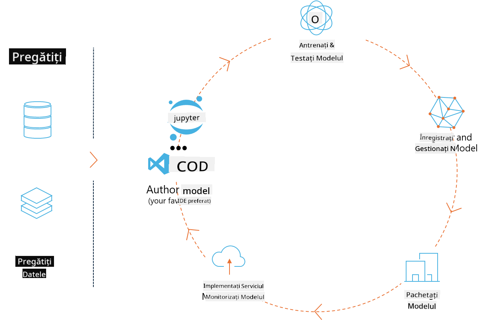
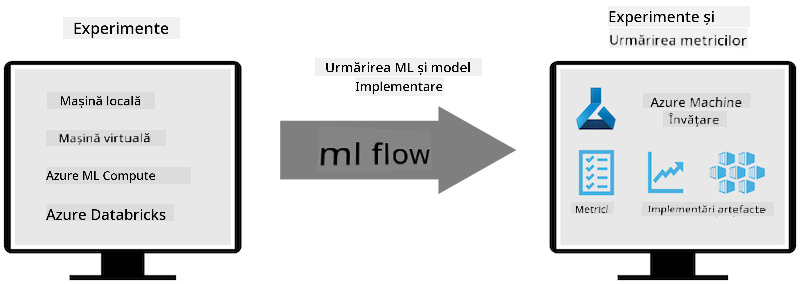
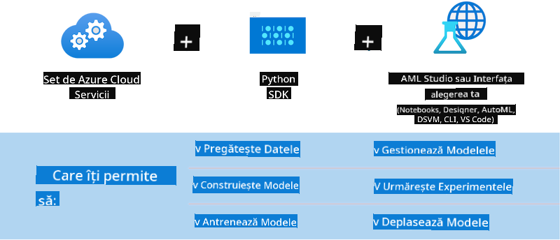

<!--
CO_OP_TRANSLATOR_METADATA:
{
  "original_hash": "f61c383bbf0c3dac97e43f833c258731",
  "translation_date": "2025-07-17T02:35:51+00:00",
  "source_file": "md/02.Application/01.TextAndChat/Phi3/E2E_Phi-3-MLflow.md",
  "language_code": "ro"
}
-->
# MLflow

[MLflow](https://mlflow.org/) este o platformă open-source creată pentru a gestiona întregul ciclu de viață al învățării automate.



MLFlow este folosit pentru a gestiona ciclul de viață al ML, incluzând experimentarea, reproducibilitatea, implementarea și un registru central de modele. În prezent, MLflow oferă patru componente.

- **MLflow Tracking:** Înregistrează și interoghează experimente, cod, configurații de date și rezultate.
- **MLflow Projects:** Împachetează codul de știință a datelor într-un format care permite reproducerea rulărilor pe orice platformă.
- **Mlflow Models:** Permite implementarea modelelor de învățare automată în diverse medii de servire.
- **Model Registry:** Stochează, adnotează și gestionează modelele într-un depozit central.

Include funcționalități pentru urmărirea experimentelor, împachetarea codului în rulări reproducibile și partajarea și implementarea modelelor. MLFlow este integrat în Databricks și suportă o varietate de biblioteci ML, fiind astfel independent de bibliotecă. Poate fi folosit cu orice bibliotecă de învățare automată și în orice limbaj de programare, oferind o API REST și o interfață CLI pentru comoditate.



Caracteristicile cheie ale MLFlow includ:

- **Urmărirea experimentelor:** Înregistrează și compară parametrii și rezultatele.
- **Gestionarea modelelor:** Permite implementarea modelelor pe diverse platforme de servire și inferență.
- **Model Registry:** Gestionează colaborativ ciclul de viață al modelelor MLflow, inclusiv versionarea și adnotările.
- **Projects:** Împachetează codul ML pentru partajare sau utilizare în producție.

MLFlow susține și bucla MLOps, care include pregătirea datelor, înregistrarea și gestionarea modelelor, împachetarea modelelor pentru execuție, implementarea serviciilor și monitorizarea modelelor. Scopul său este să simplifice procesul de trecere de la un prototip la un flux de lucru de producție, în special în medii cloud și edge.

## Scenariu E2E - Construirea unui wrapper și utilizarea Phi-3 ca model MLFlow

În acest exemplu E2E vom demonstra două abordări diferite pentru construirea unui wrapper în jurul modelului mic de limbaj Phi-3 (SLM) și apoi rularea acestuia ca model MLFlow, fie local, fie în cloud, de exemplu în Azure Machine Learning workspace.



| Proiect | Descriere | Locație |
| ------------ | ----------- | -------- |
| Transformer Pipeline | Transformer Pipeline este cea mai simplă opțiune pentru a construi un wrapper dacă dorești să folosești un model HuggingFace cu versiunea experimentală transformers a MLFlow. | [**TransformerPipeline.ipynb**](../../../../../../code/06.E2E/E2E_Phi-3-MLflow_TransformerPipeline.ipynb) |
| Custom Python Wrapper | La momentul scrierii, transformer pipeline nu suporta generarea wrapper-ului MLFlow pentru modelele HuggingFace în format ONNX, nici măcar cu pachetul experimental optimum Python. Pentru astfel de cazuri, poți construi un wrapper Python personalizat pentru modul MLFlow. | [**CustomPythonWrapper.ipynb**](../../../../../../code/06.E2E/E2E_Phi-3-MLflow_CustomPythonWrapper.ipynb) |

## Proiect: Transformer Pipeline

1. Vei avea nevoie de pachetele Python relevante din MLFlow și HuggingFace:

    ``` Python
    import mlflow
    import transformers
    ```

2. Apoi, ar trebui să inițiezi un transformer pipeline referindu-te la modelul țintă Phi-3 din registrul HuggingFace. După cum se poate vedea din cardul modelului _Phi-3-mini-4k-instruct_, sarcina sa este de tip „Generare de text”:

    ``` Python
    pipeline = transformers.pipeline(
        task = "text-generation",
        model = "microsoft/Phi-3-mini-4k-instruct"
    )
    ```

3. Acum poți salva pipeline-ul transformer al modelului Phi-3 în format MLFlow și să oferi detalii suplimentare, cum ar fi calea țintă pentru artefacte, setările specifice de configurare a modelului și tipul API-ului de inferență:

    ``` Python
    model_info = mlflow.transformers.log_model(
        transformers_model = pipeline,
        artifact_path = "phi3-mlflow-model",
        model_config = model_config,
        task = "llm/v1/chat"
    )
    ```

## Proiect: Custom Python Wrapper

1. Putem folosi aici API-ul [ONNX Runtime generate()](https://github.com/microsoft/onnxruntime-genai) de la Microsoft pentru inferența modelului ONNX și codarea/decodarea tokenilor. Trebuie să alegi pachetul _onnxruntime_genai_ pentru calculul țintă, exemplul de mai jos fiind pentru CPU:

    ``` Python
    import mlflow
    from mlflow.models import infer_signature
    import onnxruntime_genai as og
    ```

1. Clasa noastră personalizată implementează două metode: _load_context()_ pentru a inițializa **modelul ONNX** Phi-3 Mini 4K Instruct, **parametrii generatorului** și **tokenizatorul**; și _predict()_ pentru a genera tokenii de ieșire pentru promptul furnizat:

    ``` Python
    class Phi3Model(mlflow.pyfunc.PythonModel):
        def load_context(self, context):
            # Retrieving model from the artifacts
            model_path = context.artifacts["phi3-mini-onnx"]
            model_options = {
                 "max_length": 300,
                 "temperature": 0.2,         
            }
        
            # Defining the model
            self.phi3_model = og.Model(model_path)
            self.params = og.GeneratorParams(self.phi3_model)
            self.params.set_search_options(**model_options)
            
            # Defining the tokenizer
            self.tokenizer = og.Tokenizer(self.phi3_model)
    
        def predict(self, context, model_input):
            # Retrieving prompt from the input
            prompt = model_input["prompt"][0]
            self.params.input_ids = self.tokenizer.encode(prompt)
    
            # Generating the model's response
            response = self.phi3_model.generate(self.params)
    
            return self.tokenizer.decode(response[0][len(self.params.input_ids):])
    ```

1. Acum poți folosi funcția _mlflow.pyfunc.log_model()_ pentru a genera un wrapper Python personalizat (în format pickle) pentru modelul Phi-3, împreună cu modelul ONNX original și dependențele necesare:

    ``` Python
    model_info = mlflow.pyfunc.log_model(
        artifact_path = artifact_path,
        python_model = Phi3Model(),
        artifacts = {
            "phi3-mini-onnx": "cpu_and_mobile/cpu-int4-rtn-block-32-acc-level-4",
        },
        input_example = input_example,
        signature = infer_signature(input_example, ["Run"]),
        extra_pip_requirements = ["torch", "onnxruntime_genai", "numpy"],
    )
    ```

## Semnăturile modelelor MLFlow generate

1. În pasul 3 al proiectului Transformer Pipeline de mai sus, am setat sarcina modelului MLFlow la „_llm/v1/chat_”. Această instrucțiune generează un wrapper API pentru model, compatibil cu OpenAI Chat API, așa cum se arată mai jos:

    ``` Python
    {inputs: 
      ['messages': Array({content: string (required), name: string (optional), role: string (required)}) (required), 'temperature': double (optional), 'max_tokens': long (optional), 'stop': Array(string) (optional), 'n': long (optional), 'stream': boolean (optional)],
    outputs: 
      ['id': string (required), 'object': string (required), 'created': long (required), 'model': string (required), 'choices': Array({finish_reason: string (required), index: long (required), message: {content: string (required), name: string (optional), role: string (required)} (required)}) (required), 'usage': {completion_tokens: long (required), prompt_tokens: long (required), total_tokens: long (required)} (required)],
    params: 
      None}
    ```

1. Ca rezultat, poți trimite promptul tău în următorul format:

    ``` Python
    messages = [{"role": "user", "content": "What is the capital of Spain?"}]
    ```

1. Apoi, folosește post-procesarea compatibilă cu OpenAI API, de exemplu _response[0][‘choices’][0][‘message’][‘content’]_, pentru a înfrumuseța ieșirea într-un mod similar cu acesta:

    ``` JSON
    Question: What is the capital of Spain?
    
    Answer: The capital of Spain is Madrid. It is the largest city in Spain and serves as the political, economic, and cultural center of the country. Madrid is located in the center of the Iberian Peninsula and is known for its rich history, art, and architecture, including the Royal Palace, the Prado Museum, and the Plaza Mayor.
    
    Usage: {'prompt_tokens': 11, 'completion_tokens': 73, 'total_tokens': 84}
    ```

1. În pasul 3 al proiectului Custom Python Wrapper de mai sus, permitem pachetului MLFlow să genereze semnătura modelului pornind de la un exemplu de intrare. Semnătura wrapper-ului nostru MLFlow va arăta astfel:

    ``` Python
    {inputs: 
      ['prompt': string (required)],
    outputs: 
      [string (required)],
    params: 
      None}
    ```

1. Astfel, promptul nostru trebuie să conțină cheia de dicționar „prompt”, similar cu aceasta:

    ``` Python
    {"prompt": "<|system|>You are a stand-up comedian.<|end|><|user|>Tell me a joke about atom<|end|><|assistant|>",}
    ```

1. Ieșirea modelului va fi apoi furnizată în format text:

    ``` JSON
    Alright, here's a little atom-related joke for you!
    
    Why don't electrons ever play hide and seek with protons?
    
    Because good luck finding them when they're always "sharing" their electrons!
    
    Remember, this is all in good fun, and we're just having a little atomic-level humor!
    ```

**Declinare a responsabilității**:  
Acest document a fost tradus folosind serviciul de traducere AI [Co-op Translator](https://github.com/Azure/co-op-translator). Deși ne străduim pentru acuratețe, vă rugăm să rețineți că traducerile automate pot conține erori sau inexactități. Documentul original în limba sa nativă trebuie considerat sursa autorizată. Pentru informații critice, se recomandă traducerea profesională realizată de un specialist uman. Nu ne asumăm răspunderea pentru eventualele neînțelegeri sau interpretări greșite rezultate din utilizarea acestei traduceri.