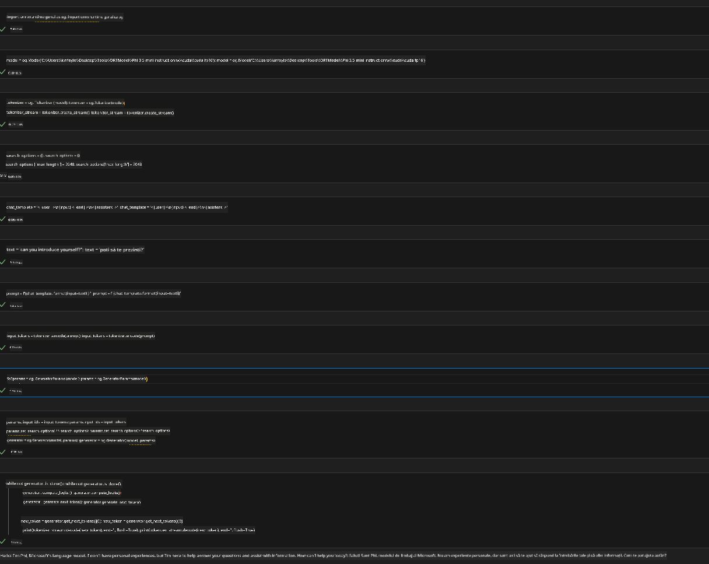
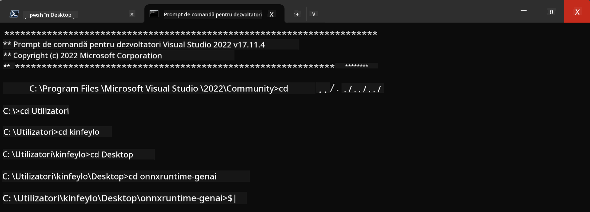

<!--
CO_OP_TRANSLATOR_METADATA:
{
  "original_hash": "b066fc29c1b2129df84e027cb75119ce",
  "translation_date": "2025-05-09T18:46:37+00:00",
  "source_file": "md/02.Application/01.TextAndChat/Phi3/ORTWindowGPUGuideline.md",
  "language_code": "ro"
}
-->
# **Ghid pentru OnnxRuntime GenAI Windows GPU**

Acest ghid oferă pașii pentru configurarea și utilizarea ONNX Runtime (ORT) cu GPU-uri pe Windows. Este conceput pentru a vă ajuta să profitați de accelerarea GPU pentru modelele dvs., îmbunătățind performanța și eficiența.

Documentul oferă îndrumări privind:

- Configurarea mediului: Instrucțiuni pentru instalarea dependențelor necesare precum CUDA, cuDNN și ONNX Runtime.
- Configurare: Cum să configurați mediul și ONNX Runtime pentru a utiliza eficient resursele GPU.
- Sfaturi de optimizare: Recomandări pentru ajustarea setărilor GPU pentru performanțe optime.

### **1. Python 3.10.x /3.11.8**

   ***Note*** Se recomandă utilizarea [miniforge](https://github.com/conda-forge/miniforge/releases/latest/download/Miniforge3-Windows-x86_64.exe) ca mediu Python

   ```bash

   conda create -n pydev python==3.11.8

   conda activate pydev

   ```

   ***Reminder*** Dacă aveți instalată vreo bibliotecă Python ONNX, vă rugăm să o dezinstalați

### **2. Instalare CMake cu winget**

   ```bash

   winget install -e --id Kitware.CMake

   ```

### **3. Instalare Visual Studio 2022 - Desktop Development cu C++**

   ***Note*** Dacă nu doriți să compilați, puteți sări peste acest pas


### **4. Instalare driver NVIDIA**

1. **Driver NVIDIA GPU**  [https://www.nvidia.com/en-us/drivers/](https://www.nvidia.com/en-us/drivers/)

2. **NVIDIA CUDA 12.4** [https://developer.nvidia.com/cuda-12-4-0-download-archive](https://developer.nvidia.com/cuda-12-4-0-download-archive)

3. **NVIDIA CUDNN 9.4**  [https://developer.nvidia.com/cudnn-downloads](https://developer.nvidia.com/cudnn-downloads)

***Reminder*** Vă rugăm să folosiți setările implicite în timpul instalării

### **5. Setare mediu NVIDIA**

Copiați fișierele lib, bin, include din NVIDIA CUDNN 9.4 în NVIDIA CUDA 12.4 lib, bin, include

- copiați fișierele din *'C:\Program Files\NVIDIA\CUDNN\v9.4\bin\12.6'* în *'C:\Program Files\NVIDIA GPU Computing Toolkit\CUDA\v12.4\bin'*

- copiați fișierele din *'C:\Program Files\NVIDIA\CUDNN\v9.4\include\12.6'* în *'C:\Program Files\NVIDIA GPU Computing Toolkit\CUDA\v12.4\include'*

- copiați fișierele din *'C:\Program Files\NVIDIA\CUDNN\v9.4\lib\12.6'* în *'C:\Program Files\NVIDIA GPU Computing Toolkit\CUDA\v12.4\lib\x64'*

### **6. Descărcare Phi-3.5-mini-instruct-onnx**

   ```bash

   winget install -e --id Git.Git

   winget install -e --id GitHub.GitLFS

   git lfs install

   git clone https://huggingface.co/microsoft/Phi-3.5-mini-instruct-onnx

   ```

### **7. Rulare InferencePhi35Instruct.ipynb**

   Deschideți [Notebook](../../../../../../code/09.UpdateSamples/Aug/ortgpu-phi35-instruct.ipynb) și executați



### **8. Compilare ORT GenAI GPU**

   ***Note*** 
   
   1. Vă rugăm să dezinstalați toate pachetele legate de onnx, onnxruntime și onnxruntime-genai înainte de toate

   ```bash

   pip list 
   
   ```

   Apoi dezinstalați toate bibliotecile onnxruntime, de exemplu

   ```bash

   pip uninstall onnxruntime

   pip uninstall onnxruntime-genai

   pip uninstall onnxruntume-genai-cuda
   
   ```

   2. Verificați suportul extensiei Visual Studio 

   Verificați în C:\Program Files\NVIDIA GPU Computing Toolkit\CUDA\v12.4\extras dacă există folderul C:\Program Files\NVIDIA GPU Computing Toolkit\CUDA\v12.4\extras\visual_studio_integration. 
   
   Dacă nu este găsit, verificați în alte foldere ale toolkit-ului CUDA și copiați folderul visual_studio_integration și conținutul său în C:\Program Files\NVIDIA GPU Computing Toolkit\CUDA\v12.4\extras\visual_studio_integration

   - Dacă nu doriți să compilați, puteți sări peste acest pas

   ```bash

   git clone https://github.com/microsoft/onnxruntime-genai

   ```

   - Descărcați [https://github.com/microsoft/onnxruntime/releases/download/v1.19.2/onnxruntime-win-x64-gpu-1.19.2.zip](https://github.com/microsoft/onnxruntime/releases/download/v1.19.2/onnxruntime-win-x64-gpu-1.19.2.zip)

   - Dezarhivați onnxruntime-win-x64-gpu-1.19.2.zip, redenumiți-l în **ort**, apoi copiați folderul ort în onnxruntime-genai

   - Folosind Windows Terminal, deschideți Developer Command Prompt pentru VS 2022 și accesați onnxruntime-genai



   - Compilați cu mediul dvs. Python

   ```bash

   cd onnxruntime-genai

   python build.py --use_cuda  --cuda_home "C:\Program Files\NVIDIA GPU Computing Toolkit\CUDA\v12.4" --config Release
 

   cd build/Windows/Release/Wheel

   pip install .whl

   ```

**Declinare a responsabilității**:  
Acest document a fost tradus folosind serviciul de traducere AI [Co-op Translator](https://github.com/Azure/co-op-translator). Deși ne străduim pentru acuratețe, vă rugăm să fiți conștienți că traducerile automate pot conține erori sau inexactități. Documentul original în limba sa nativă trebuie considerat sursa autoritară. Pentru informații critice, se recomandă traducerea profesională realizată de un specialist uman. Nu ne asumăm responsabilitatea pentru eventualele neînțelegeri sau interpretări greșite care pot apărea din utilizarea acestei traduceri.