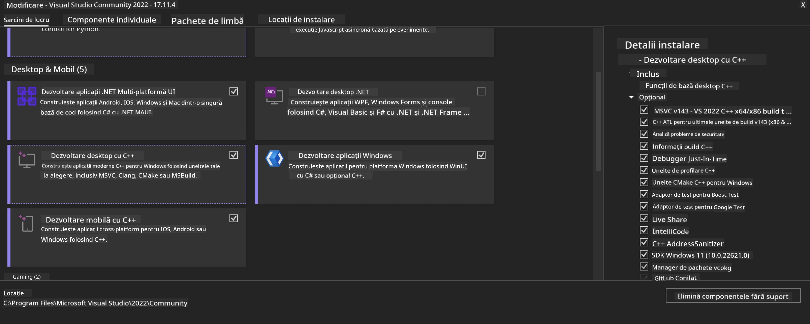
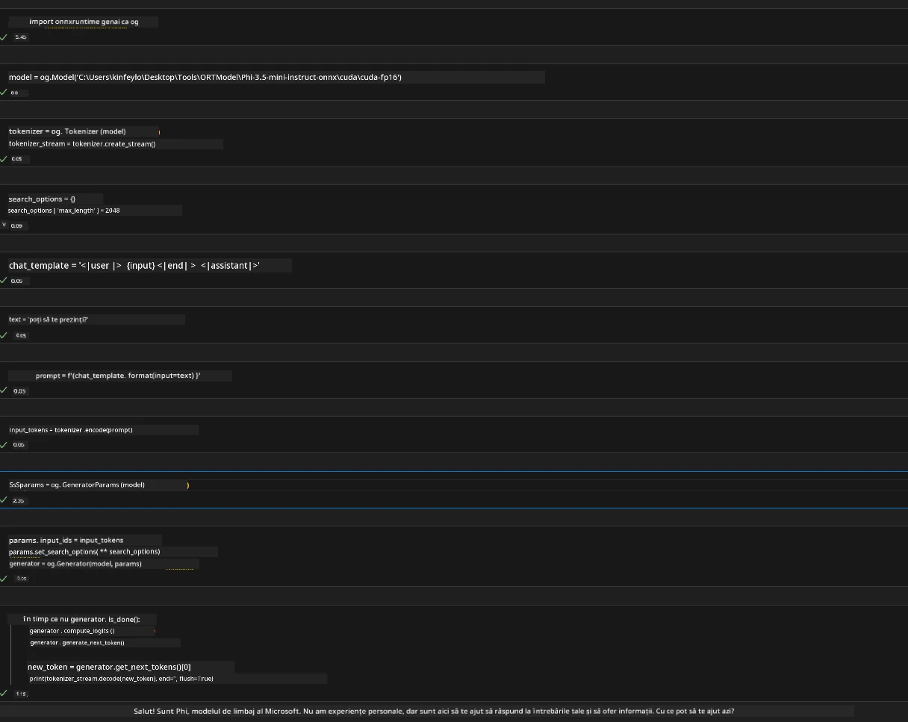
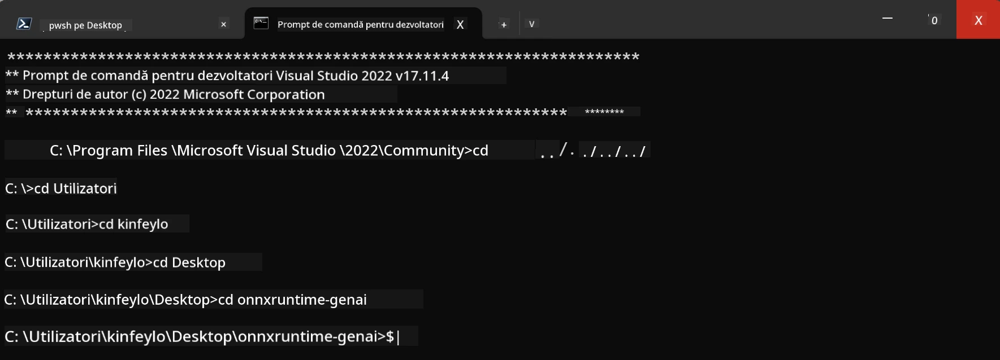

<!--
CO_OP_TRANSLATOR_METADATA:
{
  "original_hash": "b066fc29c1b2129df84e027cb75119ce",
  "translation_date": "2025-07-17T02:47:12+00:00",
  "source_file": "md/02.Application/01.TextAndChat/Phi3/ORTWindowGPUGuideline.md",
  "language_code": "ro"
}
-->
# **Ghid pentru OnnxRuntime GenAI Windows GPU**

Acest ghid oferă pașii pentru configurarea și utilizarea ONNX Runtime (ORT) cu GPU-uri pe Windows. Este conceput pentru a te ajuta să profiți de accelerarea GPU pentru modelele tale, îmbunătățind performanța și eficiența.

Documentul oferă îndrumări privind:

- Configurarea mediului: Instrucțiuni pentru instalarea dependențelor necesare precum CUDA, cuDNN și ONNX Runtime.
- Configurarea: Cum să configurezi mediul și ONNX Runtime pentru a utiliza eficient resursele GPU.
- Sfaturi de optimizare: Recomandări pentru ajustarea setărilor GPU pentru performanță optimă.

### **1. Python 3.10.x /3.11.8**

   ***Note*** Se recomandă utilizarea [miniforge](https://github.com/conda-forge/miniforge/releases/latest/download/Miniforge3-Windows-x86_64.exe) ca mediu Python

   ```bash

   conda create -n pydev python==3.11.8

   conda activate pydev

   ```

   ***Reminder*** Dacă ai instalat vreo bibliotecă ONNX pentru Python, te rugăm să o dezinstalezi

### **2. Instalare CMake cu winget**

   ```bash

   winget install -e --id Kitware.CMake

   ```

### **3. Instalare Visual Studio 2022 - Desktop Development cu C++**

   ***Note*** Dacă nu dorești să compilezi, poți sări peste acest pas



### **4. Instalare driver NVIDIA**

1. **Driver NVIDIA GPU**  [https://www.nvidia.com/en-us/drivers/](https://www.nvidia.com/en-us/drivers/)

2. **NVIDIA CUDA 12.4** [https://developer.nvidia.com/cuda-12-4-0-download-archive](https://developer.nvidia.com/cuda-12-4-0-download-archive)

3. **NVIDIA CUDNN 9.4**  [https://developer.nvidia.com/cudnn-downloads](https://developer.nvidia.com/cudnn-downloads)

***Reminder*** Te rugăm să folosești setările implicite în timpul instalării

### **5. Configurare mediu NVIDIA**

Copiază fișierele lib, bin, include din NVIDIA CUDNN 9.4 în folderele corespunzătoare din NVIDIA CUDA 12.4

- copiază fișierele din *'C:\Program Files\NVIDIA\CUDNN\v9.4\bin\12.6'* în *'C:\Program Files\NVIDIA GPU Computing Toolkit\CUDA\v12.4\bin'*

- copiază fișierele din *'C:\Program Files\NVIDIA\CUDNN\v9.4\include\12.6'* în *'C:\Program Files\NVIDIA GPU Computing Toolkit\CUDA\v12.4\include'*

- copiază fișierele din *'C:\Program Files\NVIDIA\CUDNN\v9.4\lib\12.6'* în *'C:\Program Files\NVIDIA GPU Computing Toolkit\CUDA\v12.4\lib\x64'*

### **6. Descarcă Phi-3.5-mini-instruct-onnx**

   ```bash

   winget install -e --id Git.Git

   winget install -e --id GitHub.GitLFS

   git lfs install

   git clone https://huggingface.co/microsoft/Phi-3.5-mini-instruct-onnx

   ```

### **7. Rularea InferencePhi35Instruct.ipynb**

   Deschide [Notebook-ul](../../../../../../code/09.UpdateSamples/Aug/ortgpu-phi35-instruct.ipynb) și execută-l



### **8. Compilare ORT GenAI GPU**

   ***Note*** 
   
   1. Te rugăm să dezinstalezi mai întâi toate pachetele legate de onnx, onnxruntime și onnxruntime-genai

   ```bash

   pip list 
   
   ```

   Apoi dezinstalează toate bibliotecile onnxruntime, de exemplu:

   ```bash

   pip uninstall onnxruntime

   pip uninstall onnxruntime-genai

   pip uninstall onnxruntume-genai-cuda
   
   ```

   2. Verifică suportul extensiei Visual Studio

   Verifică în C:\Program Files\NVIDIA GPU Computing Toolkit\CUDA\v12.4\extras dacă există folderul C:\Program Files\NVIDIA GPU Computing Toolkit\CUDA\v12.4\extras\visual_studio_integration. 
   
   Dacă nu îl găsești, caută în alte foldere ale toolkit-ului CUDA și copiază folderul visual_studio_integration și conținutul său în C:\Program Files\NVIDIA GPU Computing Toolkit\CUDA\v12.4\extras\visual_studio_integration

   - Dacă nu dorești să compilezi, poți sări peste acest pas

   ```bash

   git clone https://github.com/microsoft/onnxruntime-genai

   ```

   - Descarcă [https://github.com/microsoft/onnxruntime/releases/download/v1.19.2/onnxruntime-win-x64-gpu-1.19.2.zip](https://github.com/microsoft/onnxruntime/releases/download/v1.19.2/onnxruntime-win-x64-gpu-1.19.2.zip)

   - Dezarhivează onnxruntime-win-x64-gpu-1.19.2.zip, redenumește folderul în **ort** și copiază-l în onnxruntime-genai

   - Folosind Windows Terminal, deschide Developer Command Prompt pentru VS 2022 și navighează la onnxruntime-genai



   - Compilează folosind mediul tău Python

   ```bash

   cd onnxruntime-genai

   python build.py --use_cuda  --cuda_home "C:\Program Files\NVIDIA GPU Computing Toolkit\CUDA\v12.4" --config Release
 

   cd build/Windows/Release/Wheel

   pip install .whl

   ```

**Declinare de responsabilitate**:  
Acest document a fost tradus folosind serviciul de traducere AI [Co-op Translator](https://github.com/Azure/co-op-translator). Deși ne străduim pentru acuratețe, vă rugăm să rețineți că traducerile automate pot conține erori sau inexactități. Documentul original în limba sa nativă trebuie considerat sursa autorizată. Pentru informații critice, se recomandă traducerea profesională realizată de un specialist uman. Nu ne asumăm răspunderea pentru eventualele neînțelegeri sau interpretări greșite rezultate din utilizarea acestei traduceri.