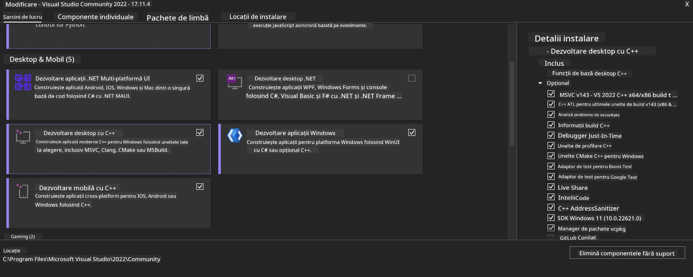
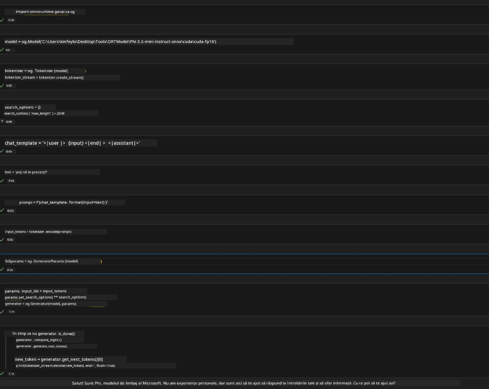
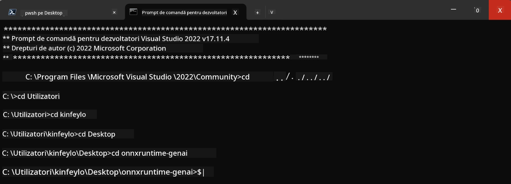

# **Ghid pentru OnnxRuntime GenAI Windows GPU**

Acest ghid oferă pași pentru configurarea și utilizarea ONNX Runtime (ORT) cu GPU-uri pe Windows. Este conceput pentru a te ajuta să valorifici accelerarea GPU pentru modelele tale, îmbunătățind performanța și eficiența.

Documentul oferă îndrumări despre:

- Configurarea mediului: Instrucțiuni pentru instalarea dependențelor necesare precum CUDA, cuDNN și ONNX Runtime.
- Configurare: Cum să configurezi mediul și ONNX Runtime pentru a utiliza eficient resursele GPU.
- Sfaturi de optimizare: Recomandări pentru ajustarea setărilor GPU pentru performanță optimă.

### **1. Python 3.10.x /3.11.8**

   ***Notă*** Se recomandă folosirea [miniforge](https://github.com/conda-forge/miniforge/releases/latest/download/Miniforge3-Windows-x86_64.exe) ca mediu Python

   ```bash

   conda create -n pydev python==3.11.8

   conda activate pydev

   ```

   ***Reamintire*** Dacă ai instalat vreo bibliotecă Python ONNX, te rog să o dezinstalezi

### **2. Instalare CMake cu winget**


   ```bash

   winget install -e --id Kitware.CMake

   ```

### **3. Instalare Visual Studio 2022 - Desktop Development cu C++**

   ***Notă*** Dacă nu dorești să compilezi, poți sări peste acest pas




### **4. Instalare Driver NVIDIA**

1. **Driver GPU NVIDIA**  [https://www.nvidia.com/en-us/drivers/](https://www.nvidia.com/en-us/drivers/)

2. **NVIDIA CUDA 12.4** [https://developer.nvidia.com/cuda-12-4-0-download-archive](https://developer.nvidia.com/cuda-12-4-0-download-archive)

3. **NVIDIA CUDNN 9.4**  [https://developer.nvidia.com/cudnn-downloads](https://developer.nvidia.com/cudnn-downloads)

***Reamintire*** Te rugăm să folosești setările implicite în fluxul de instalare

### **5. Setare mediu NVIDIA**

Copiază bibliotecile lib, bin, include de la NVIDIA CUDNN 9.4 la NVIDIA CUDA 12.4 lib, bin, include

- copiază fișierele din *'C:\Program Files\NVIDIA\CUDNN\v9.4\bin\12.6'* în *'C:\Program Files\NVIDIA GPU Computing Toolkit\CUDA\v12.4\bin'*

- copiază fișierele din *'C:\Program Files\NVIDIA\CUDNN\v9.4\include\12.6'* în *'C:\Program Files\NVIDIA GPU Computing Toolkit\CUDA\v12.4\include'*

- copiază fișierele din *'C:\Program Files\NVIDIA\CUDNN\v9.4\lib\12.6'* în *'C:\Program Files\NVIDIA GPU Computing Toolkit\CUDA\v12.4\lib\x64'*


### **6. Descarcă Phi-3.5-mini-instruct-onnx**


   ```bash

   winget install -e --id Git.Git

   winget install -e --id GitHub.GitLFS

   git lfs install

   git clone https://huggingface.co/microsoft/Phi-3.5-mini-instruct-onnx

   ```

### **7. Rularea InferencePhi35Instruct.ipynb**

   Deschide [Notebook-ul](../../../../code/09.UpdateSamples/Aug/ortgpu-phi35-instruct.ipynb) și execută





### **8. Compilare ORT GenAI GPU**


   ***Notă*** 
   
   1. Te rugăm să dezinstalezi toate pachetele onnx, onnxruntime și onnxruntime-genai mai întâi

   
   ```bash

   pip list 
   
   ```

   Apoi dezinstalează toate bibliotecile onnxruntime, de ex.


   ```bash

   pip uninstall onnxruntime

   pip uninstall onnxruntime-genai

   pip uninstall onnxruntume-genai-cuda
   
   ```

   2. Verifică suportul pentru extensii Visual Studio 

   Verifică folderul C:\Program Files\NVIDIA GPU Computing Toolkit\CUDA\v12.4\extras pentru a te asigura că există C:\Program Files\NVIDIA GPU Computing Toolkit\CUDA\v12.4\extras\visual_studio_integration.
   
   Dacă nu există, caută în alte foldere driver CUDA toolkit și copiază folderul visual_studio_integration și conținutul acestuia în C:\Program Files\NVIDIA GPU Computing Toolkit\CUDA\v12.4\extras\visual_studio_integration


   - Dacă nu dorești să compilezi, poți sări peste acest pas


   ```bash

   git clone https://github.com/microsoft/onnxruntime-genai

   ```

   - Descarcă [https://github.com/microsoft/onnxruntime/releases/download/v1.19.2/onnxruntime-win-x64-gpu-1.19.2.zip](https://github.com/microsoft/onnxruntime/releases/download/v1.19.2/onnxruntime-win-x64-gpu-1.19.2.zip)

   - Dezarhivează onnxruntime-win-x64-gpu-1.19.2.zip, redenumește-l în **ort**, copiază folderul ort în onnxruntime-genai

   - Folosind Windows Terminal, deschide Desenvoluțăm prompt pentru VS 2022 și navighează la onnxruntime-genai 



   - Compilează-l cu mediul tău python

   
   ```bash

   cd onnxruntime-genai

   python build.py --use_cuda  --cuda_home "C:\Program Files\NVIDIA GPU Computing Toolkit\CUDA\v12.4" --config Release
 

   cd build/Windows/Release/Wheel

   pip install .whl

   ```

---

<!-- CO-OP TRANSLATOR DISCLAIMER START -->
**Declinare a responsabilității**:
Acest document a fost tradus folosind serviciul de traducere AI [Co-op Translator](https://github.com/Azure/co-op-translator). În timp ce ne străduim pentru acuratețe, vă rugăm să rețineți că traducerile automate pot conține erori sau inexactități. Documentul original în limba sa nativă trebuie considerat sursa autorizată. Pentru informații critice, se recomandă traducerea profesională realizată de un om. Nu ne asumăm responsabilitatea pentru eventualele neînțelegeri sau interpretări greșite care decurg din utilizarea acestei traduceri.
<!-- CO-OP TRANSLATOR DISCLAIMER END -->