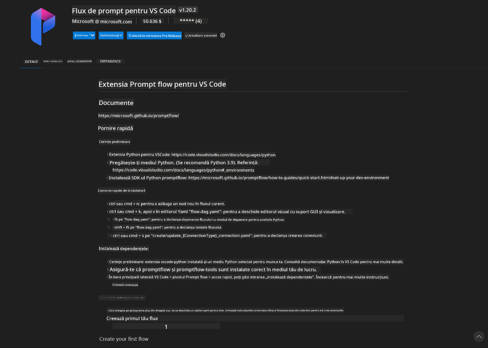
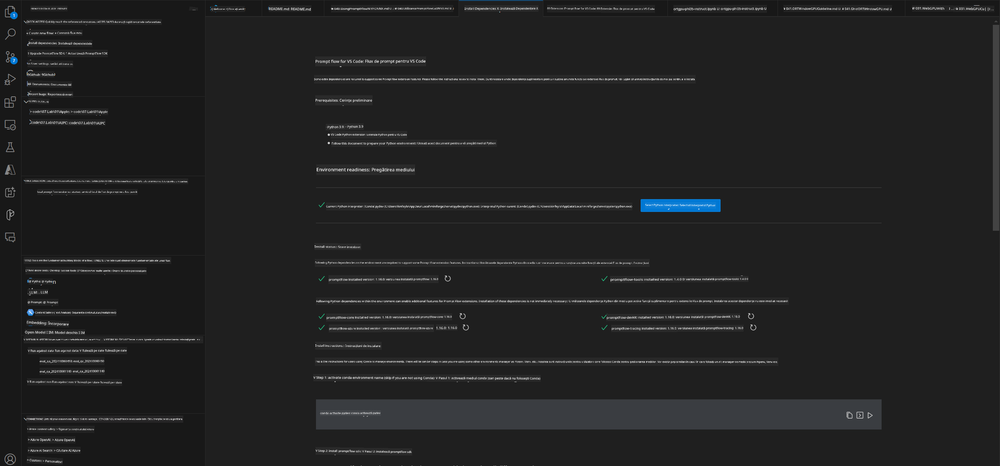
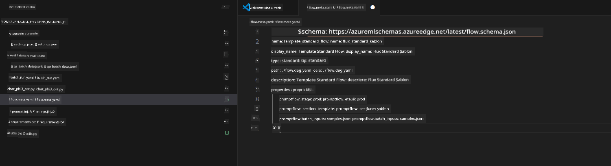
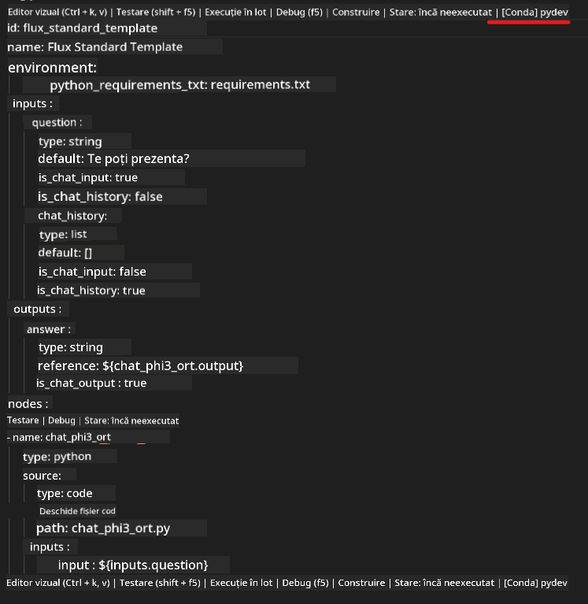
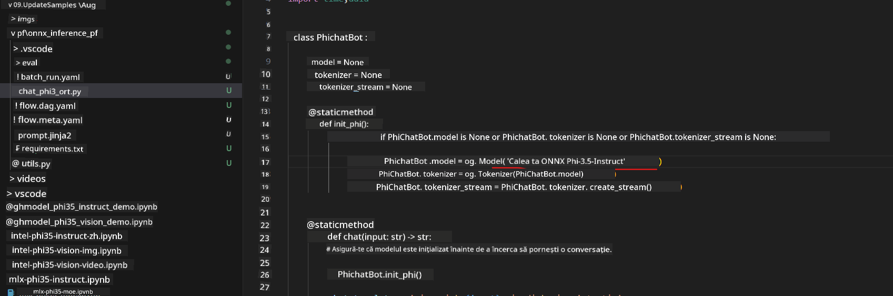
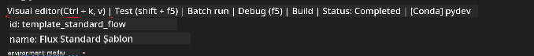
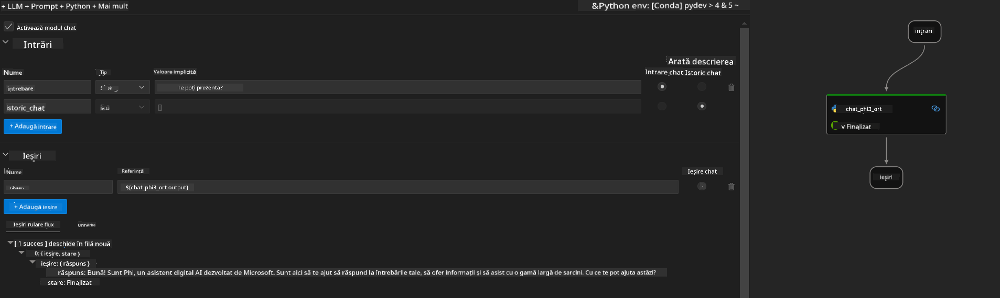
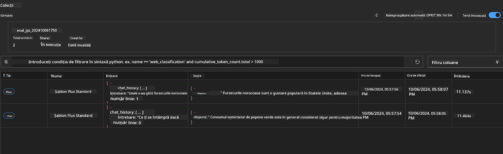

<!--
CO_OP_TRANSLATOR_METADATA:
{
  "original_hash": "92e7dac1e5af0dd7c94170fdaf6860fe",
  "translation_date": "2025-07-17T03:03:38+00:00",
  "source_file": "md/02.Application/01.TextAndChat/Phi3/UsingPromptFlowWithONNX.md",
  "language_code": "ro"
}
-->
# Utilizarea GPU-ului Windows pentru a crea o soluție Prompt flow cu Phi-3.5-Instruct ONNX

Următorul document este un exemplu despre cum să folosești PromptFlow cu ONNX (Open Neural Network Exchange) pentru dezvoltarea aplicațiilor AI bazate pe modelele Phi-3.

PromptFlow este un set de unelte de dezvoltare conceput pentru a simplifica ciclul complet de dezvoltare al aplicațiilor AI bazate pe LLM (Large Language Model), de la generarea ideilor și prototipare până la testare și evaluare.

Prin integrarea PromptFlow cu ONNX, dezvoltatorii pot:

- Optimiza performanța modelului: Folosi ONNX pentru inferență și implementare eficientă a modelului.
- Simplifica dezvoltarea: Utiliza PromptFlow pentru a gestiona fluxul de lucru și a automatiza sarcinile repetitive.
- Îmbunătăți colaborarea: Facilita o colaborare mai bună între membrii echipei prin oferirea unui mediu unificat de dezvoltare.

**Prompt flow** este un set de unelte de dezvoltare conceput pentru a simplifica ciclul complet de dezvoltare al aplicațiilor AI bazate pe LLM, de la generarea ideilor, prototipare, testare, evaluare până la implementarea în producție și monitorizare. Face ingineria prompturilor mult mai ușoară și îți permite să construiești aplicații LLM cu calitate de producție.

Prompt flow se poate conecta la OpenAI, Azure OpenAI Service și modele personalizabile (Huggingface, LLM/SLM local). Sperăm să implementăm modelul ONNX cuantificat Phi-3.5 în aplicații locale. Prompt flow ne poate ajuta să planificăm mai bine afacerea și să finalizăm soluții locale bazate pe Phi-3.5. În acest exemplu, vom combina ONNX Runtime GenAI Library pentru a completa soluția Prompt flow bazată pe GPU Windows.

## **Instalare**

### **ONNX Runtime GenAI pentru Windows GPU**

Citește acest ghid pentru a configura ONNX Runtime GenAI pentru Windows GPU [click aici](./ORTWindowGPUGuideline.md)

### **Configurarea Prompt flow în VSCode**

1. Instalează extensia Prompt flow pentru VS Code



2. După instalarea extensiei Prompt flow pentru VS Code, dă click pe extensie și alege **Installation dependencies** urmează acest ghid pentru a instala Prompt flow SDK în mediul tău



3. Descarcă [Codul Exemplu](../../../../../../code/09.UpdateSamples/Aug/pf/onnx_inference_pf) și folosește VS Code pentru a deschide acest exemplu



4. Deschide **flow.dag.yaml** pentru a alege mediul tău Python



   Deschide **chat_phi3_ort.py** pentru a schimba locația modelului tău Phi-3.5-instruct ONNX



5. Rulează prompt flow pentru testare

Deschide **flow.dag.yaml** și dă click pe editorul vizual



după ce dai click, rulează-l pentru testare



1. Poți rula batch în terminal pentru a verifica mai multe rezultate


```bash

pf run create --file batch_run.yaml --stream --name 'Your eval qa name'    

```

Poți verifica rezultatele în browserul tău implicit




**Declinare a responsabilității**:  
Acest document a fost tradus folosind serviciul de traducere AI [Co-op Translator](https://github.com/Azure/co-op-translator). Deși ne străduim pentru acuratețe, vă rugăm să rețineți că traducerile automate pot conține erori sau inexactități. Documentul original în limba sa nativă trebuie considerat sursa autorizată. Pentru informații critice, se recomandă traducerea profesională realizată de un specialist uman. Nu ne asumăm răspunderea pentru eventualele neînțelegeri sau interpretări greșite rezultate din utilizarea acestei traduceri.