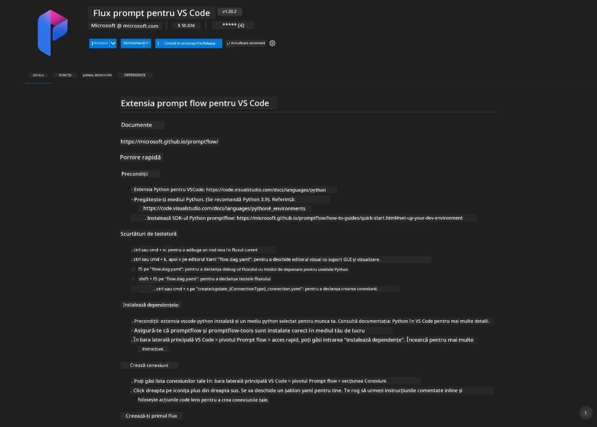
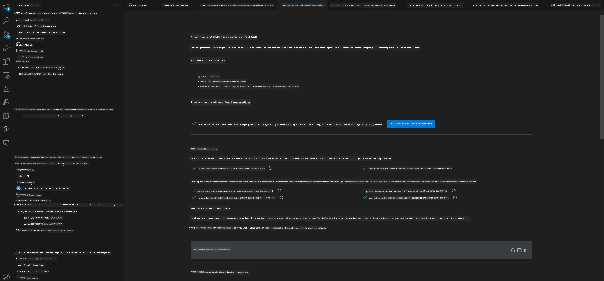
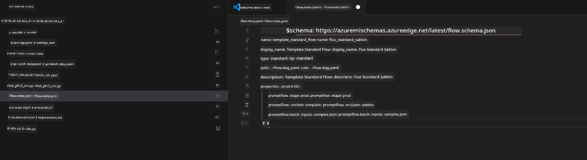
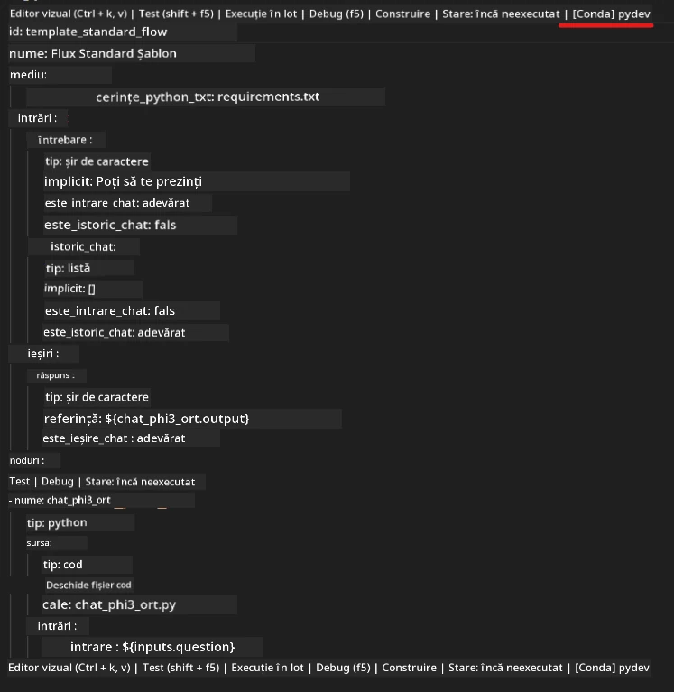
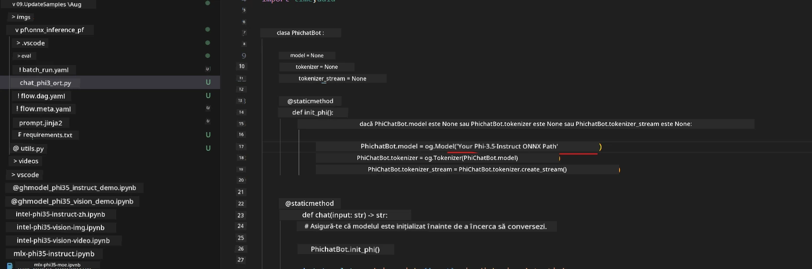
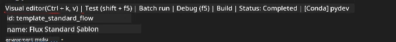
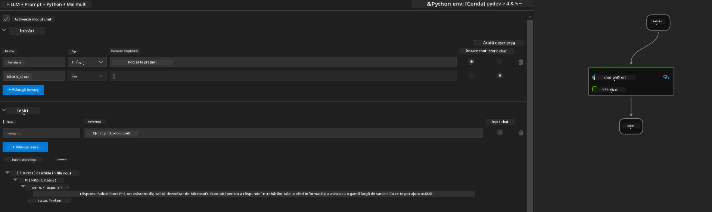
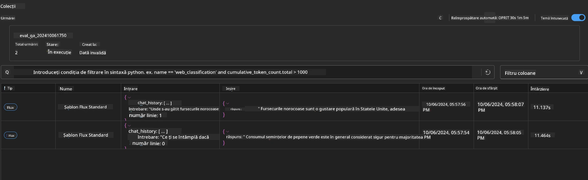

# Folosirea GPU Windows pentru a crea o soluție Prompt flow cu Phi-3.5-Instruct ONNX 

Documentul următor este un exemplu despre cum să utilizați PromptFlow cu ONNX (Open Neural Network Exchange) pentru dezvoltarea aplicațiilor AI bazate pe modelele Phi-3.

PromptFlow este un set de unelte de dezvoltare conceput pentru a simplifica ciclul complet de dezvoltare al aplicațiilor AI bazate pe LLM (Large Language Model), de la generarea de idei și prototipare până la testare și evaluare.

Prin integrarea PromptFlow cu ONNX, dezvoltatorii pot:

- Optimiza Performanța Modelului: Folosiți ONNX pentru inferență și implementare eficientă a modelului.
- Simplifica Dezvoltarea: Utilizați PromptFlow pentru a gestiona fluxul de lucru și a automatiza sarcinile repetitive.
- Îmbunătăți Colaborarea: Facilitați o colaborare mai bună între membrii echipei oferind un mediu unificat de dezvoltare.

**Prompt flow** este un set de unelte de dezvoltare conceput pentru a simplifica ciclul complet de dezvoltare al aplicațiilor AI bazate pe LLM, de la generare de idei, prototipare, testare, evaluare până la implementare în producție și monitorizare. Face ingineria prompturilor mult mai ușoară și îți permite să construiești aplicații LLM de calitate pentru producție.

Prompt flow se poate conecta la OpenAI, Azure OpenAI Service și modele personalizabile (Huggingface, LLM/SLM local). Sperăm să implementăm modelul Phi-3.5 ONNX cuantificat în aplicații locale. Prompt flow ne poate ajuta să planificăm mai bine afacerea și să finalizăm soluții locale bazate pe Phi-3.5. În acest exemplu, vom combina ONNX Runtime GenAI Library pentru a completa soluția Prompt flow bazată pe Windows GPU.

## **Instalare**

### **ONNX Runtime GenAI pentru Windows GPU**

Citiți acest ghid pentru configurarea ONNX Runtime GenAI pentru Windows GPU  [click aici](./ORTWindowGPUGuideline.md)

### **Configurarea Prompt flow în VSCode**

1. Instalați extensia Prompt flow pentru VS Code



2. După ce ați instalat extensia Prompt flow pentru VS Code, faceți clic pe extensie și alegeți **Installare dependențe** urmând acest ghid pentru a instala SDK Prompt flow în mediul vostru



3. Descărcați [Cod Exemplu](../../../../../../code/09.UpdateSamples/Aug/pf/onnx_inference_pf) și folosiți VS Code pentru a deschide acest exemplu



4. Deschideți **flow.dag.yaml** pentru a alege mediul vostru Python



   Deschideți **chat_phi3_ort.py** pentru a schimba locația modelului vostru Phi-3.5-instruct ONNX



5. Rulați prompt flow pentru testare

Deschideți **flow.dag.yaml** și faceți clic pe editorul vizual



după ce ați făcut clic, rulați pentru a testa



1. Puteți rula în lot în terminal pentru a verifica mai multe rezultate


```bash

pf run create --file batch_run.yaml --stream --name 'Your eval qa name'    

```

Puteți verifica rezultatele în browserul vostru implicit




---

<!-- CO-OP TRANSLATOR DISCLAIMER START -->
**Declinare a responsabilității**:
Acest document a fost tradus folosind serviciul de traducere AI [Co-op Translator](https://github.com/Azure/co-op-translator). În timp ce ne străduim pentru acuratețe, vă rugăm să rețineți că traducerile automate pot conține erori sau inexactități. Documentul original în limba sa nativă trebuie considerat sursa autorizată. Pentru informații critice, se recomandă traducerea profesională realizată de un om. Nu ne asumăm responsabilitatea pentru eventualele neînțelegeri sau interpretări greșite care decurg din utilizarea acestei traduceri.
<!-- CO-OP TRANSLATOR DISCLAIMER END -->