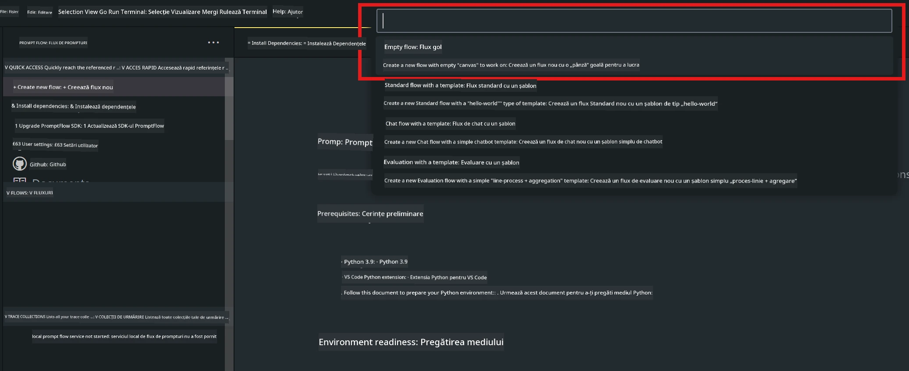
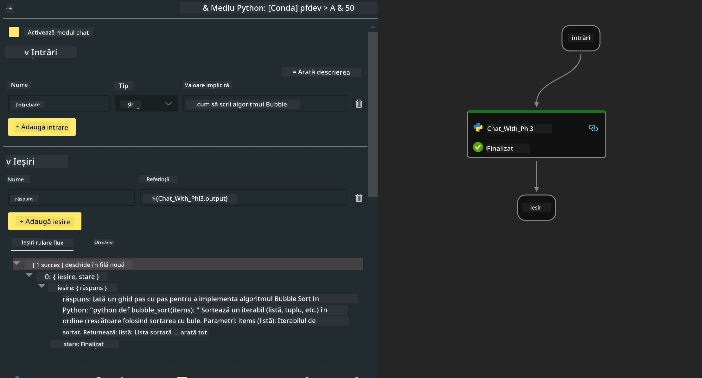
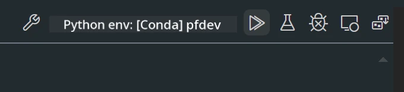

# **Laborator 2 - Rularea Prompt flow cu Phi-3-mini în AIPC**

## **Ce este Prompt flow**

Prompt flow este un set de unelte de dezvoltare concepute pentru a simplifica ciclul complet de dezvoltare a aplicațiilor AI bazate pe LLM, de la generarea ideilor, prototipare, testare, evaluare până la implementarea în producție și monitorizare. Face ingineria prompturilor mult mai ușoară și îți permite să construiești aplicații LLM de calitate pentru producție.

Cu prompt flow, vei putea:

- Să creezi fluxuri care leagă LLM-uri, prompturi, cod Python și alte unelte într-un workflow executabil.

- Să depanezi și să iterezi fluxurile, în special interacțiunea cu LLM-urile, cu ușurință.

- Să evaluezi fluxurile, să calculezi metrici de calitate și performanță pe seturi de date mai mari.

- Să integrezi testarea și evaluarea în sistemul tău CI/CD pentru a asigura calitatea fluxului.

- Să implementezi fluxurile pe platforma de servire aleasă sau să le integrezi ușor în codul aplicației tale.

- (Opțional, dar recomandat) Să colaborezi cu echipa ta folosind versiunea cloud a Prompt flow în Azure AI.

## **Ce este AIPC**

Un AI PC are un CPU, un GPU și un NPU, fiecare cu capacități specifice de accelerare AI. Un NPU, sau unitate de procesare neurală, este un accelerator specializat care gestionează sarcini de inteligență artificială (AI) și învățare automată (ML) direct pe PC-ul tău, fără a trimite datele spre procesare în cloud. GPU-ul și CPU-ul pot procesa aceste sarcini, dar NPU-ul este deosebit de eficient pentru calcule AI cu consum redus de energie. AI PC reprezintă o schimbare fundamentală în modul în care funcționează calculatoarele noastre. Nu este o soluție pentru o problemă care nu exista înainte, ci promite o îmbunătățire majoră pentru utilizările zilnice ale PC-ului.

Cum funcționează? Comparativ cu AI generativ și modelele mari de limbaj (LLM) antrenate pe cantități enorme de date publice, AI-ul care rulează pe PC-ul tău este mai accesibil la aproape toate nivelurile. Conceptul este mai ușor de înțeles, iar pentru că este antrenat pe datele tale, fără a necesita acces la cloud, beneficiile sunt mai imediat atractive pentru un public larg.

Pe termen scurt, lumea AI PC implică asistenți personali și modele AI mai mici care rulează direct pe PC-ul tău, folosind datele tale pentru a oferi îmbunătățiri AI personale, private și mai sigure pentru activitățile pe care le faci deja zilnic – luarea notițelor la întâlniri, organizarea unei ligi de fantasy football, automatizarea îmbunătățirilor pentru editare foto și video sau planificarea itinerariului perfect pentru o reuniune de familie, în funcție de orele de sosire și plecare ale tuturor.

## **Construirea fluxurilor de generare de cod pe AIPC**

***Note*** ：Dacă nu ai finalizat instalarea mediului, te rugăm să vizitezi [Lab 0 - Installations](./01.Installations.md)

1. Deschide extensia Prompt flow în Visual Studio Code și creează un proiect de flux gol



2. Adaugă parametrii Inputs și Outputs și adaugă cod Python ca flux nou



Poți folosi această structură (flow.dag.yaml) pentru a-ți construi fluxul

```yaml

inputs:
  question:
    type: string
    default: how to write Bubble Algorithm
outputs:
  answer:
    type: string
    reference: ${Chat_With_Phi3.output}
nodes:
- name: Chat_With_Phi3
  type: python
  source:
    type: code
    path: Chat_With_Phi3.py
  inputs:
    question: ${inputs.question}


```

3. Adaugă cod în ***Chat_With_Phi3.py***

```python


from promptflow.core import tool

# import torch
from transformers import AutoTokenizer, pipeline,TextStreamer
import intel_npu_acceleration_library as npu_lib

import warnings

import asyncio
import platform

class Phi3CodeAgent:
    
    model = None
    tokenizer = None
    text_streamer = None
    
    model_id = "microsoft/Phi-3-mini-4k-instruct"

    @staticmethod
    def init_phi3():
        
        if Phi3CodeAgent.model is None or Phi3CodeAgent.tokenizer is None or Phi3CodeAgent.text_streamer is None:
            Phi3CodeAgent.model = npu_lib.NPUModelForCausalLM.from_pretrained(
                                    Phi3CodeAgent.model_id,
                                    torch_dtype="auto",
                                    dtype=npu_lib.int4,
                                    trust_remote_code=True
                                )
            Phi3CodeAgent.tokenizer = AutoTokenizer.from_pretrained(Phi3CodeAgent.model_id)
            Phi3CodeAgent.text_streamer = TextStreamer(Phi3CodeAgent.tokenizer, skip_prompt=True)

    

    @staticmethod
    def chat_with_phi3(prompt):
        
        Phi3CodeAgent.init_phi3()

        messages = "<|system|>You are a AI Python coding assistant. Please help me to generate code in Python.The answer only genertated Python code, but any comments and instructions do not need to be generated<|end|><|user|>" + prompt +"<|end|><|assistant|>"


        generation_args = {
            "max_new_tokens": 1024,
            "return_full_text": False,
            "temperature": 0.3,
            "do_sample": False,
            "streamer": Phi3CodeAgent.text_streamer,
        }

        pipe = pipeline(
            "text-generation",
            model=Phi3CodeAgent.model,
            tokenizer=Phi3CodeAgent.tokenizer,
            # **generation_args
        )

        result = ''

        with warnings.catch_warnings():
            warnings.simplefilter("ignore")
            response = pipe(messages, **generation_args)
            result =response[0]['generated_text']
            return result


@tool
def my_python_tool(question: str) -> str:
    if platform.system() == 'Windows':
        asyncio.set_event_loop_policy(asyncio.WindowsSelectorEventLoopPolicy())
    return Phi3CodeAgent.chat_with_phi3(question)


```

4. Poți testa fluxul din Debug sau Run pentru a verifica dacă generarea codului funcționează corect



5. Rulează fluxul ca API de dezvoltare în terminal

```

pf flow serve --source ./ --port 8080 --host localhost   

```

Poți testa în Postman / Thunder Client

### **Note**

1. Prima rulare durează mult. Se recomandă să descarci modelul phi-3 folosind Hugging face CLI.

2. Având în vedere puterea limitată de calcul a Intel NPU, se recomandă utilizarea Phi-3-mini-4k-instruct.

3. Folosim Intel NPU Acceleration pentru conversia de cuantizare INT4, dar dacă rulezi din nou serviciul, trebuie să ștergi folderele cache și nc_workshop.

## **Resurse**

1. Învață Promptflow [https://microsoft.github.io/promptflow/](https://microsoft.github.io/promptflow/)

2. Învață Intel NPU Acceleration [https://github.com/intel/intel-npu-acceleration-library](https://github.com/intel/intel-npu-acceleration-library)

3. Cod exemplu, descarcă [Local NPU Agent Sample Code](../../../../../../../../../code/07.Lab/01/AIPC)

**Declinare de responsabilitate**:  
Acest document a fost tradus folosind serviciul de traducere AI [Co-op Translator](https://github.com/Azure/co-op-translator). Deși ne străduim pentru acuratețe, vă rugăm să rețineți că traducerile automate pot conține erori sau inexactități. Documentul original în limba sa nativă trebuie considerat sursa autorizată. Pentru informații critice, se recomandă traducerea profesională realizată de un specialist uman. Nu ne asumăm răspunderea pentru eventualele neînțelegeri sau interpretări greșite rezultate din utilizarea acestei traduceri.