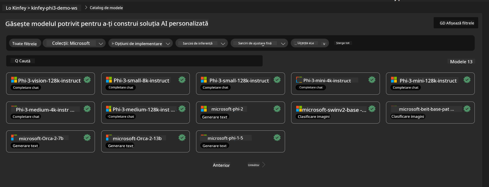
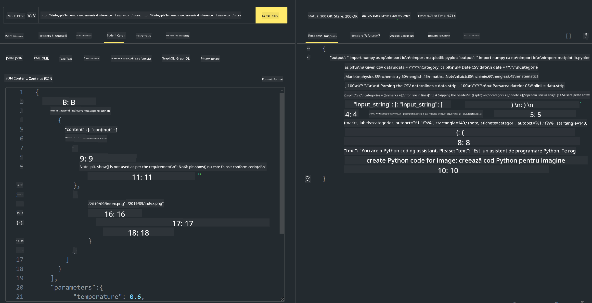

<!--
CO_OP_TRANSLATOR_METADATA:
{
  "original_hash": "20cb4e6ac1686248e8be913ccf6c2bc2",
  "translation_date": "2025-07-17T04:08:31+00:00",
  "source_file": "md/02.Application/02.Code/Phi3/VSCodeExt/HOL/AIPC/03.DeployPhi3VisionOnAzure.md",
  "language_code": "ro"
}
-->
# **Laborator 3 - Implementarea Phi-3-vision pe Azure Machine Learning Service**

Folosim NPU pentru a finaliza implementarea în producție a codului local, iar apoi dorim să introducem capacitatea de a integra PHI-3-VISION prin aceasta pentru a genera cod din imagini.

În această introducere, putem construi rapid un Model As Service Phi-3 Vision în Azure Machine Learning Service.

***Note***: Phi-3 Vision necesită putere de calcul pentru a genera conținut mai rapid. Avem nevoie de puterea de calcul în cloud pentru a ne ajuta să realizăm acest lucru.


### **1. Crearea Azure Machine Learning Service**

Trebuie să creăm un Azure Machine Learning Service în portalul Azure. Dacă vrei să înveți cum, te rugăm să vizitezi acest link [https://learn.microsoft.com/azure/machine-learning/quickstart-create-resources?view=azureml-api-2](https://learn.microsoft.com/azure/machine-learning/quickstart-create-resources?view=azureml-api-2)


### **2. Alegerea Phi-3 Vision în Azure Machine Learning Service**




### **3. Implementarea Phi-3-Vision în Azure**


### **4. Testarea Endpoint-ului în Postman**





***Note***

1. Parametrii transmiși trebuie să includă Authorization, azureml-model-deployment și Content-Type. Trebuie să verifici informațiile de implementare pentru a le obține.

2. Pentru a transmite parametrii, Phi-3-Vision trebuie să trimită un link către o imagine. Te rugăm să consulți metoda GPT-4-Vision pentru transmiterea parametrilor, de exemplu

```json

{
  "input_data":{
    "input_string":[
      {
        "role":"user",
        "content":[ 
          {
            "type": "text",
            "text": "You are a Python coding assistant.Please create Python code for image "
          },
          {
              "type": "image_url",
              "image_url": {
                "url": "https://ajaytech.co/wp-content/uploads/2019/09/index.png"
              }
          }
        ]
      }
    ],
    "parameters":{
          "temperature": 0.6,
          "top_p": 0.9,
          "do_sample": false,
          "max_new_tokens": 2048
    }
  }
}

```

3. Apelează **/score** folosind metoda Post

**Felicitări**! Ai finalizat implementarea rapidă a PHI-3-VISION și ai încercat cum să generezi cod din imagini. Următorul pas este să construim aplicații combinând NPU-uri și cloud-uri.

**Declinare de responsabilitate**:  
Acest document a fost tradus folosind serviciul de traducere AI [Co-op Translator](https://github.com/Azure/co-op-translator). Deși ne străduim pentru acuratețe, vă rugăm să rețineți că traducerile automate pot conține erori sau inexactități. Documentul original în limba sa nativă trebuie considerat sursa autorizată. Pentru informații critice, se recomandă traducerea profesională realizată de un specialist uman. Nu ne asumăm răspunderea pentru eventualele neînțelegeri sau interpretări greșite rezultate din utilizarea acestei traduceri.