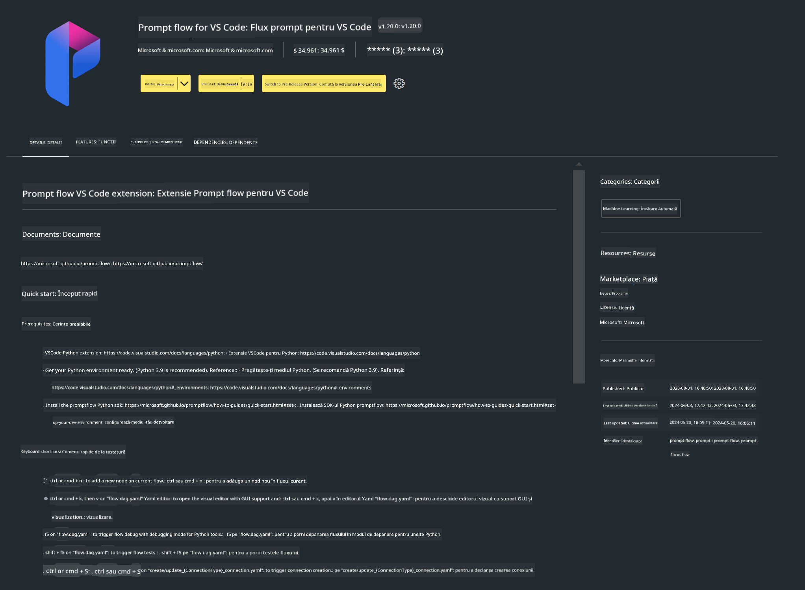

<!--
CO_OP_TRANSLATOR_METADATA:
{
  "original_hash": "4b16264917d9b93169745d92b8ce8c65",
  "translation_date": "2025-05-09T19:37:13+00:00",
  "source_file": "md/02.Application/02.Code/Phi3/VSCodeExt/HOL/Apple/01.Installations.md",
  "language_code": "ro"
}
-->
# **Lab 0 - Instalare**

Când intrăm în laborator, trebuie să configurăm mediul relevant:

### **1. Python 3.11+**

Se recomandă folosirea miniforge pentru a configura mediul Python.

Pentru configurarea miniforge, consultați [https://github.com/conda-forge/miniforge](https://github.com/conda-forge/miniforge)

După configurarea miniforge, rulați următoarea comandă în Power Shell

```bash

conda create -n pyenv python==3.11.8 -y

conda activate pyenv

```

### **2. Instalarea Prompt flow SDK**

În Lab 1, folosim Prompt flow, deci trebuie să configurați Prompt flow SDK.

```bash

pip install promptflow --upgrade

```

Puteți verifica promptflow sdk cu această comandă

```bash

pf --version

```

### **3. Instalarea extensiei Prompt flow pentru Visual Studio Code**



### **4. Framework-ul MLX de la Apple**

MLX este un framework array pentru cercetare în machine learning pe Apple silicon, oferit de cercetarea Apple în machine learning. Puteți folosi **Apple MLX framework** pentru a accelera LLM / SLM cu Apple Silicon. Dacă doriți să aflați mai multe, puteți citi [https://github.com/microsoft/PhiCookBook/blob/main/md/01.Introduction/03/MLX_Inference.md](https://github.com/microsoft/PhiCookBook/blob/main/md/01.Introduction/03/MLX_Inference.md).

Instalați librăria MLX framework în bash

```bash

pip install mlx-lm

```

### **5. Alte librării Python**

creați requirements.txt și adăugați acest conținut

```txt

notebook
numpy 
scipy 
scikit-learn 
matplotlib 
pandas 
pillow 
graphviz

```

### **6. Instalarea NVM**

instalați nvm în Powershell

```bash

brew install nvm

```

instalați nodejs 18.20

```bash

nvm install 18.20.0

nvm use 18.20.0

```

### **7. Instalarea suportului pentru dezvoltare în Visual Studio Code**

```bash

npm install --global yo generator-code

```

Felicitări! Ați configurat cu succes SDK-ul. În continuare, treceți la pașii practici.

**Declinare a responsabilității**:  
Acest document a fost tradus folosind serviciul de traducere AI [Co-op Translator](https://github.com/Azure/co-op-translator). Deși ne străduim pentru acuratețe, vă rugăm să rețineți că traducerile automate pot conține erori sau inexactități. Documentul original în limba sa nativă trebuie considerat sursa autoritară. Pentru informații critice, se recomandă traducerea profesională realizată de un specialist uman. Nu ne asumăm răspunderea pentru eventualele neînțelegeri sau interpretări greșite care pot apărea în urma utilizării acestei traduceri.