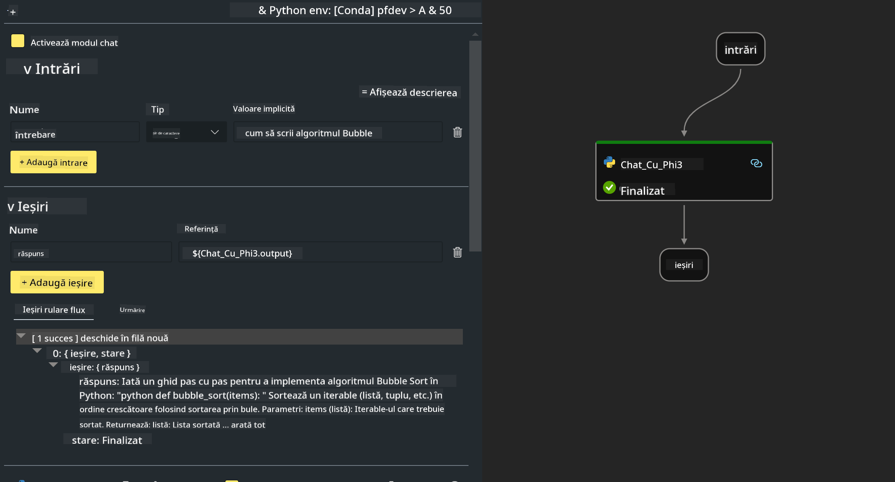

<!--
CO_OP_TRANSLATOR_METADATA:
{
  "original_hash": "3dbbf568625b1ee04b354c2dc81d3248",
  "translation_date": "2025-07-17T04:28:56+00:00",
  "source_file": "md/02.Application/02.Code/Phi3/VSCodeExt/HOL/Apple/02.PromptflowWithMLX.md",
  "language_code": "ro"
}
-->
# **Laborator 2 - Rularea Prompt flow cu Phi-3-mini în AIPC**

## **Ce este Prompt flow**

Prompt flow este un set de unelte de dezvoltare concepute pentru a simplifica ciclul complet de dezvoltare a aplicațiilor AI bazate pe LLM, de la generarea ideilor, prototipare, testare, evaluare până la implementarea în producție și monitorizare. Face ingineria prompturilor mult mai ușoară și îți permite să construiești aplicații LLM cu calitate de producție.

Cu prompt flow, vei putea:

- Să creezi fluxuri care leagă LLM-uri, prompturi, cod Python și alte unelte într-un workflow executabil.

- Să depanezi și să iterezi fluxurile, în special interacțiunea cu LLM-urile, cu ușurință.

- Să evaluezi fluxurile, să calculezi metrici de calitate și performanță pe seturi de date mai mari.

- Să integrezi testarea și evaluarea în sistemul tău CI/CD pentru a asigura calitatea fluxului.

- Să implementezi fluxurile pe platforma de servire aleasă sau să le integrezi ușor în codul aplicației tale.

- (Opțional, dar recomandat) Să colaborezi cu echipa ta folosind versiunea cloud a Prompt flow în Azure AI.

## **Construirea fluxurilor de generare de cod pe Apple Silicon**

***Note*** ：Dacă nu ai finalizat instalarea mediului, te rugăm să vizitezi [Lab 0 - Instalări](./01.Installations.md)

1. Deschide extensia Prompt flow în Visual Studio Code și creează un proiect de flux gol


2. Adaugă parametrii Inputs și Outputs și adaugă cod Python ca flux nou



Poți consulta această structură (flow.dag.yaml) pentru a-ți construi fluxul

```yaml

inputs:
  prompt:
    type: string
    default: Write python code for Fibonacci serie. Please use markdown as output
outputs:
  result:
    type: string
    reference: ${gen_code_by_phi3.output}
nodes:
- name: gen_code_by_phi3
  type: python
  source:
    type: code
    path: gen_code_by_phi3.py
  inputs:
    prompt: ${inputs.prompt}


```

3. Quantifică phi-3-mini

Dorim să rulăm mai bine SLM pe dispozitive locale. În general, cuantificăm modelul (INT4, FP16, FP32)

```bash

python -m mlx_lm.convert --hf-path microsoft/Phi-3-mini-4k-instruct

```

**Note:** folderul implicit este mlx_model

4. Adaugă cod în ***Chat_With_Phi3.py***

```python


from promptflow import tool

from mlx_lm import load, generate


# The inputs section will change based on the arguments of the tool function, after you save the code
# Adding type to arguments and return value will help the system show the types properly
# Please update the function name/signature per need
@tool
def my_python_tool(prompt: str) -> str:

    model_id = './mlx_model_phi3_mini'

    model, tokenizer = load(model_id)

    # <|user|>\nWrite python code for Fibonacci serie. Please use markdown as output<|end|>\n<|assistant|>

    response = generate(model, tokenizer, prompt="<|user|>\n" + prompt  + "<|end|>\n<|assistant|>", max_tokens=2048, verbose=True)

    return response


```

4. Poți testa fluxul din Debug sau Run pentru a verifica dacă generarea codului funcționează corect


5. Rulează fluxul ca API de dezvoltare în terminal

```

pf flow serve --source ./ --port 8080 --host localhost   

```

Poți testa în Postman / Thunder Client

### **Note**

1. Prima rulare durează mult timp. Se recomandă descărcarea modelului phi-3 folosind Hugging face CLI.

2. Având în vedere puterea limitată de calcul a Intel NPU, se recomandă folosirea Phi-3-mini-4k-instruct.

3. Folosim Intel NPU Acceleration pentru cuantificarea conversiei INT4, dar dacă rulezi din nou serviciul, trebuie să ștergi folderele cache și nc_workshop.

## **Resurse**

1. Învață Promptflow [https://microsoft.github.io/promptflow/](https://microsoft.github.io/promptflow/)

2. Învață Intel NPU Acceleration [https://github.com/intel/intel-npu-acceleration-library](https://github.com/intel/intel-npu-acceleration-library)

3. Cod exemplu, descarcă [Local NPU Agent Sample Code](../../../../../../../../../code/07.Lab/01/AIPC/local-npu-agent)

**Declinare a responsabilității**:  
Acest document a fost tradus folosind serviciul de traducere AI [Co-op Translator](https://github.com/Azure/co-op-translator). Deși ne străduim pentru acuratețe, vă rugăm să rețineți că traducerile automate pot conține erori sau inexactități. Documentul original în limba sa nativă trebuie considerat sursa autorizată. Pentru informații critice, se recomandă traducerea profesională realizată de un specialist uman. Nu ne asumăm răspunderea pentru eventualele neînțelegeri sau interpretări greșite rezultate din utilizarea acestei traduceri.