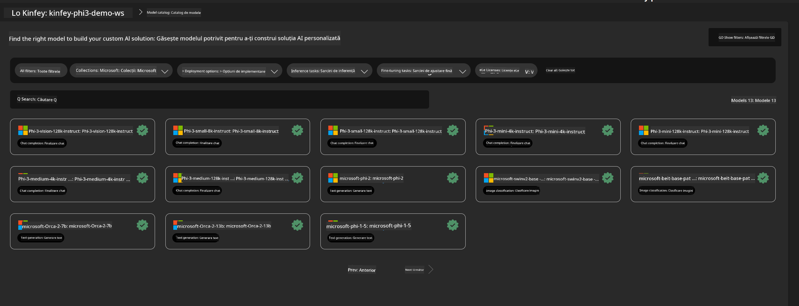
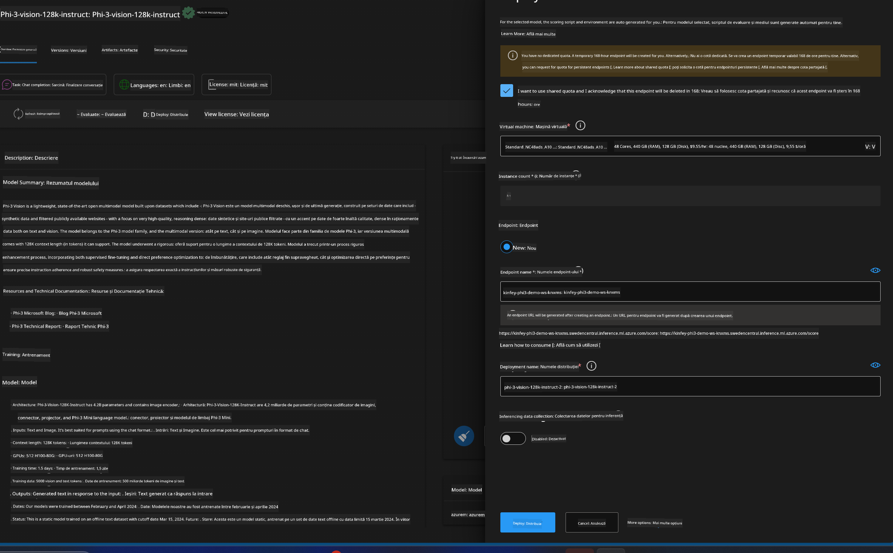
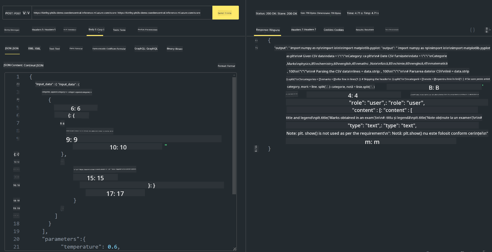

<!--
CO_OP_TRANSLATOR_METADATA:
{
  "original_hash": "20cb4e6ac1686248e8be913ccf6c2bc2",
  "translation_date": "2025-05-09T19:45:15+00:00",
  "source_file": "md/02.Application/02.Code/Phi3/VSCodeExt/HOL/Apple/03.DeployPhi3VisionOnAzure.md",
  "language_code": "ro"
}
-->
# **Laborator 3 - Implementarea Phi-3-vision pe Azure Machine Learning Service**

Folosim NPU pentru a finaliza implementarea în producție a codului local, iar apoi dorim să introducem capacitatea de a folosi PHI-3-VISION prin aceasta pentru a genera cod din imagini.

În această introducere, putem construi rapid un Model As Service Phi-3 Vision în Azure Machine Learning Service.

***Note***: Phi-3 Vision necesită putere de calcul pentru a genera conținut mai rapid. Avem nevoie de putere de calcul în cloud pentru a ne ajuta să realizăm acest lucru.

### **1. Crearea Azure Machine Learning Service**

Trebuie să creăm un Azure Machine Learning Service în Azure Portal. Dacă doriți să învățați cum, vă rugăm să vizitați acest link [https://learn.microsoft.com/azure/machine-learning/quickstart-create-resources?view=azureml-api-2](https://learn.microsoft.com/azure/machine-learning/quickstart-create-resources?view=azureml-api-2)

### **2. Alegerea Phi-3 Vision în Azure Machine Learning Service**



### **3. Implementarea Phi-3-Vision în Azure**



### **4. Testarea Endpoint-ului în Postman**



***Note***

1. Parametrii transmiși trebuie să includă Authorization, azureml-model-deployment și Content-Type. Trebuie să verificați informațiile despre implementare pentru a le obține.

2. Pentru a transmite parametrii, Phi-3-Vision trebuie să primească un link către o imagine. Vă rugăm să consultați metoda GPT-4-Vision pentru transmiterea parametrilor, de exemplu

```json

{
  "input_data":{
    "input_string":[
      {
        "role":"user",
        "content":[ 
          {
            "type": "text",
            "text": "You are a Python coding assistant.Please create Python code for image "
          },
          {
              "type": "image_url",
              "image_url": {
                "url": "https://ajaytech.co/wp-content/uploads/2019/09/index.png"
              }
          }
        ]
      }
    ],
    "parameters":{
          "temperature": 0.6,
          "top_p": 0.9,
          "do_sample": false,
          "max_new_tokens": 2048
    }
  }
}

```

3. Apelați **/score** folosind metoda Post

**Felicitări**! Ați finalizat implementarea rapidă a PHI-3-VISION și ați încercat cum să generați cod din imagini. Următorul pas este să construim aplicații combinând NPU-uri și cloud-ul.

**Declinare a responsabilității**:  
Acest document a fost tradus folosind serviciul de traducere automată AI [Co-op Translator](https://github.com/Azure/co-op-translator). Deși ne străduim pentru acuratețe, vă rugăm să țineți cont că traducerile automate pot conține erori sau inexactități. Documentul original, în limba sa nativă, trebuie considerat sursa autorizată. Pentru informații critice, se recomandă traducerea profesională realizată de un specialist uman. Nu ne asumăm răspunderea pentru eventualele neînțelegeri sau interpretări greșite rezultate din utilizarea acestei traduceri.