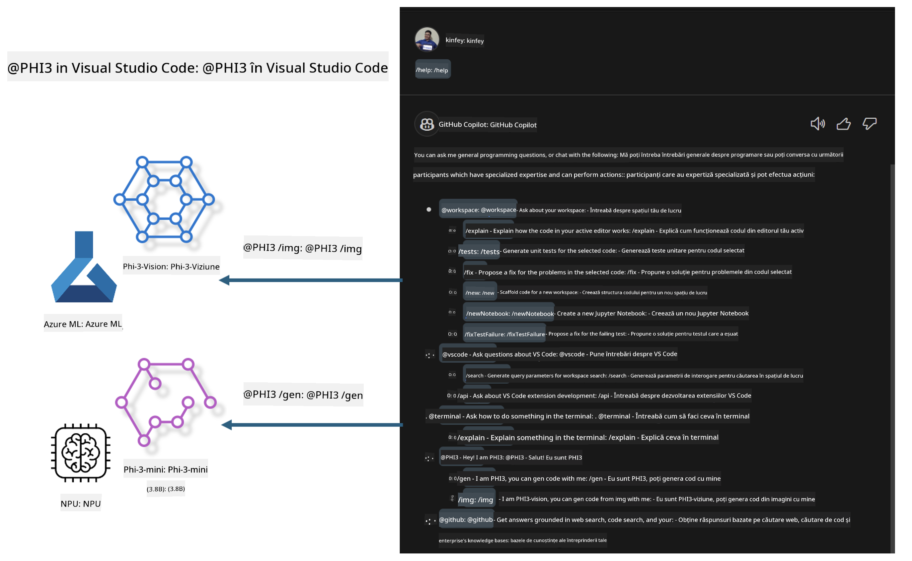

<!--
CO_OP_TRANSLATOR_METADATA:
{
  "original_hash": "00b7a699de8ac405fa821f4c0f7fc0ab",
  "translation_date": "2025-05-09T19:17:14+00:00",
  "source_file": "md/02.Application/02.Code/Phi3/VSCodeExt/README.md",
  "language_code": "ro"
}
-->
# **Construiește-ți propriul Visual Studio Code GitHub Copilot Chat cu familia Microsoft Phi-3**

Ai folosit agentul workspace în GitHub Copilot Chat? Vrei să-ți construiești propriul agent de cod pentru echipa ta? Acest laborator practic își propune să combine modelul open source pentru a construi un agent de cod de nivel enterprise.

## **Fundament**

### **De ce să alegi Microsoft Phi-3**

Phi-3 este o serie de modele, incluzând phi-3-mini, phi-3-small și phi-3-medium, bazate pe parametri diferiți de antrenament pentru generarea de text, completarea dialogului și generarea de cod. Există și phi-3-vision, bazat pe Vision. Este potrivit pentru companii sau echipe diferite care doresc să creeze soluții AI generative offline.

Recomandat să citești acest link [https://github.com/microsoft/PhiCookBook/blob/main/md/01.Introduction/01/01.PhiFamily.md](https://github.com/microsoft/PhiCookBook/blob/main/md/01.Introduction/01/01.PhiFamily.md)

### **Microsoft GitHub Copilot Chat**

Extensia GitHub Copilot Chat îți oferă o interfață de chat care îți permite să interacționezi cu GitHub Copilot și să primești răspunsuri la întrebări legate de programare direct în VS Code, fără să fie nevoie să navighezi prin documentație sau să cauți pe forumuri online.

Copilot Chat poate folosi evidențierea sintaxei, indentarea și alte elemente de formatare pentru a aduce claritate răspunsului generat. În funcție de tipul întrebării utilizatorului, rezultatul poate conține linkuri către contextul folosit de Copilot pentru generarea răspunsului, cum ar fi fișiere sursă sau documentație, sau butoane pentru accesarea funcționalităților VS Code.

- Copilot Chat se integrează în fluxul tău de dezvoltare și îți oferă asistență acolo unde ai nevoie:

- Pornește o conversație chat inline direct din editor sau terminal pentru ajutor în timp ce programezi

- Folosește vizualizarea Chat pentru a avea un asistent AI alături, disponibil oricând

- Lansează Quick Chat pentru a pune o întrebare rapidă și a reveni imediat la ce faci

Poți folosi GitHub Copilot Chat în diverse scenarii, precum:

- Răspuns la întrebări de programare despre cea mai bună soluție pentru o problemă

- Explicarea codului altcuiva și sugerarea de îmbunătățiri

- Propunerea de corecții de cod

- Generarea de teste unitare

- Generarea de documentație pentru cod

Recomandat să citești acest link [https://code.visualstudio.com/docs/copilot/copilot-chat](https://code.visualstudio.com/docs/copilot/copilot-chat?WT.mc_id=aiml-137032-kinfeylo)

###  **Microsoft GitHub Copilot Chat @workspace**

Referirea la **@workspace** în Copilot Chat îți permite să pui întrebări despre întregul tău cod. În funcție de întrebare, Copilot recuperează inteligent fișiere și simboluri relevante, pe care le folosește apoi în răspuns sub formă de linkuri și exemple de cod.

Pentru a răspunde la întrebarea ta, **@workspace** caută prin aceleași surse pe care le-ar folosi un dezvoltator când navighează un cod în VS Code:

- Toate fișierele din workspace, cu excepția celor ignorate printr-un fișier .gitignore

- Structura directoarelor cu foldere și fișiere imbricate

- Indexul de căutare cod GitHub, dacă workspace-ul este un depozit GitHub și este indexat

- Simboluri și definiții din workspace

- Textul selectat în prezent sau textul vizibil în editorul activ

Notă: .gitignore este ignorat dacă ai un fișier deschis sau text selectat într-un fișier ignorat.

Recomandat să citești acest link [[https://code.visualstudio.com/docs/copilot/copilot-chat](https://code.visualstudio.com/docs/copilot/workspace-context?WT.mc_id=aiml-137032-kinfeylo)]

## **Află mai multe despre acest laborator**

GitHub Copilot a îmbunătățit semnificativ eficiența programării în companii, iar fiecare companie dorește să personalizeze funcțiile relevante ale GitHub Copilot. Multe companii au creat extensii personalizate similare cu GitHub Copilot, bazate pe scenariile lor de business și pe modele open source. Pentru companii, extensiile personalizate sunt mai ușor de controlat, însă acest lucru poate afecta experiența utilizatorului. La urma urmei, GitHub Copilot are funcții mai puternice pentru scenarii generale și profesionalism. Dacă experiența poate fi păstrată consecventă, este mai bine să se personalizeze o extensie proprie a companiei. GitHub Copilot Chat oferă API-uri relevante pentru ca firmele să extindă experiența Chat. Menținerea unei experiențe consecvente și adăugarea funcțiilor personalizate oferă o experiență de utilizare mai bună.

Acest laborator folosește în principal modelul Phi-3 combinat cu NPU local și Azure hibrid pentru a construi un Agent personalizat în GitHub Copilot Chat ***@PHI3*** care să asiste dezvoltatorii enterprise în generarea de cod***(@PHI3 /gen)*** și generarea de cod pe baza imaginilor ***(@PHI3 /img)***.

### ***Notă:*** 

Acest laborator este implementat în prezent pe AIPC cu Intel CPU și Apple Silicon. Vom continua să actualizăm versiunea Qualcomm a NPU.

## **Laborator**

| Nume | Descriere | AIPC | Apple |
| ------------ | ----------- | -------- |-------- |
| Lab0 - Instalări(✅) | Configurarea și instalarea mediilor și uneltelor necesare | [Go](./HOL/AIPC/01.Installations.md) |[Go](./HOL/Apple/01.Installations.md) |
| Lab1 - Rularea fluxului Prompt cu Phi-3-mini (✅) | Combinat cu AIPC / Apple Silicon, folosind NPU local pentru a crea generare de cod prin Phi-3-mini | [Go](./HOL/AIPC/02.PromptflowWithNPU.md) |  [Go](./HOL/Apple/02.PromptflowWithMLX.md) |
| Lab2 - Implementarea Phi-3-vision pe Azure Machine Learning Service(✅) | Generare de cod prin implementarea Model Catalog din Azure Machine Learning Service - imagine Phi-3-vision | [Go](./HOL/AIPC/03.DeployPhi3VisionOnAzure.md) |[Go](./HOL/Apple/03.DeployPhi3VisionOnAzure.md) |
| Lab3 - Crearea unui agent @phi-3 în GitHub Copilot Chat(✅)  | Crearea unui agent Phi-3 personalizat în GitHub Copilot Chat pentru generare de cod, generare de cod grafic, RAG etc. | [Go](./HOL/AIPC/04.CreatePhi3AgentInVSCode.md) | [Go](./HOL/Apple/04.CreatePhi3AgentInVSCode.md) |
| Cod exemplu (✅)  | Descarcă cod exemplu | [Go](../../../../../../../code/07.Lab/01/AIPC) | [Go](../../../../../../../code/07.Lab/01/Apple) |

## **Resurse**

1. Phi-3 Cookbook [https://github.com/microsoft/Phi-3CookBook](https://github.com/microsoft/Phi-3CookBook)

2. Află mai multe despre GitHub Copilot [https://learn.microsoft.com/training/paths/copilot/](https://learn.microsoft.com/training/paths/copilot/?WT.mc_id=aiml-137032-kinfeylo)

3. Află mai multe despre GitHub Copilot Chat [https://learn.microsoft.com/training/paths/accelerate-app-development-using-github-copilot/](https://learn.microsoft.com/training/paths/accelerate-app-development-using-github-copilot/?WT.mc_id=aiml-137032-kinfeylo)

4. Află mai multe despre API-ul GitHub Copilot Chat [https://code.visualstudio.com/api/extension-guides/chat](https://code.visualstudio.com/api/extension-guides/chat?WT.mc_id=aiml-137032-kinfeylo)

5. Află mai multe despre Azure AI Foundry [https://learn.microsoft.com/training/paths/create-custom-copilots-ai-studio/](https://learn.microsoft.com/training/paths/create-custom-copilots-ai-studio/?WT.mc_id=aiml-137032-kinfeylo)

6. Află mai multe despre Model Catalog-ul Azure AI Foundry [https://learn.microsoft.com/azure/ai-studio/how-to/model-catalog-overview](https://learn.microsoft.com/azure/ai-studio/how-to/model-catalog-overview)

**Declinare a responsabilității**:  
Acest document a fost tradus folosind serviciul de traducere AI [Co-op Translator](https://github.com/Azure/co-op-translator). Deși ne străduim pentru acuratețe, vă rugăm să rețineți că traducerile automate pot conține erori sau inexactități. Documentul original în limba sa nativă trebuie considerat sursa autorizată. Pentru informații critice, se recomandă traducerea profesională realizată de un specialist uman. Nu ne asumăm răspunderea pentru eventualele neînțelegeri sau interpretări greșite care pot apărea în urma utilizării acestei traduceri.