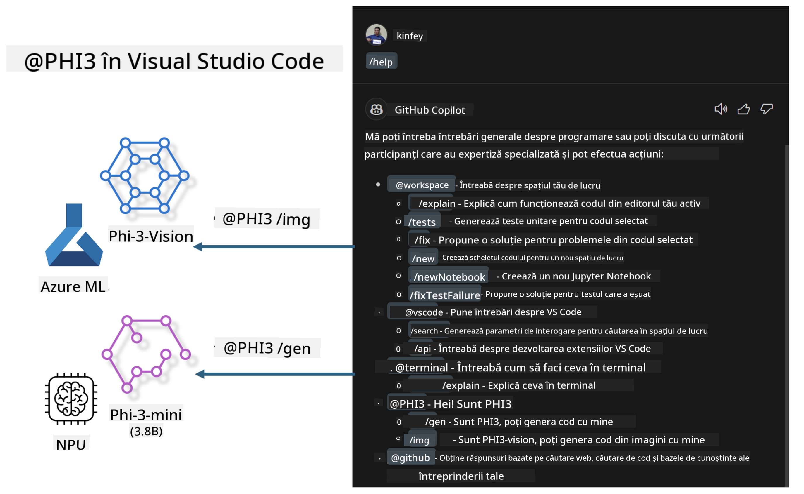

<!--
CO_OP_TRANSLATOR_METADATA:
{
  "original_hash": "00b7a699de8ac405fa821f4c0f7fc0ab",
  "translation_date": "2025-07-17T03:44:50+00:00",
  "source_file": "md/02.Application/02.Code/Phi3/VSCodeExt/README.md",
  "language_code": "ro"
}
-->
# **Construiește-ți propriul Visual Studio Code GitHub Copilot Chat cu familia Microsoft Phi-3**

Ai folosit agentul de workspace în GitHub Copilot Chat? Vrei să-ți construiești propriul agent de cod pentru echipa ta? Acest laborator practic își propune să combine modelul open source pentru a crea un agent de cod la nivel enterprise.

## **Fundamente**

### **De ce să alegi Microsoft Phi-3**

Phi-3 este o serie de modele, incluzând phi-3-mini, phi-3-small și phi-3-medium, bazate pe diferiți parametri de antrenament pentru generarea de text, completarea dialogului și generarea de cod. Există și phi-3-vision, bazat pe Vision. Este potrivit pentru companii sau echipe diferite care doresc să creeze soluții AI generative offline.

Recomandat să citești acest link [https://github.com/microsoft/PhiCookBook/blob/main/md/01.Introduction/01/01.PhiFamily.md](https://github.com/microsoft/PhiCookBook/blob/main/md/01.Introduction/01/01.PhiFamily.md)

### **Microsoft GitHub Copilot Chat**

Extensia GitHub Copilot Chat îți oferă o interfață de chat care îți permite să interacționezi cu GitHub Copilot și să primești răspunsuri la întrebări legate de programare direct în VS Code, fără să fie nevoie să cauți în documentație sau pe forumuri online.

Copilot Chat poate folosi evidențierea sintaxei, indentarea și alte funcții de formatare pentru a face răspunsul generat mai clar. În funcție de tipul întrebării utilizatorului, rezultatul poate conține linkuri către contextul folosit de Copilot pentru generarea răspunsului, cum ar fi fișiere sursă sau documentație, sau butoane pentru accesarea funcționalităților VS Code.

- Copilot Chat se integrează în fluxul tău de dezvoltare și îți oferă asistență acolo unde ai nevoie:

- Pornește o conversație de chat inline direct din editor sau terminal pentru ajutor în timp ce scrii cod

- Folosește vizualizarea Chat pentru a avea un asistent AI alături, disponibil oricând

- Lansează Quick Chat pentru a pune o întrebare rapidă și a reveni imediat la ce faci

Poți folosi GitHub Copilot Chat în diverse scenarii, cum ar fi:

- Răspunsuri la întrebări de programare despre cea mai bună soluție pentru o problemă

- Explicarea codului altcuiva și sugestii de îmbunătățire

- Propuneri de corecții de cod

- Generarea de teste unitare

- Generarea documentației pentru cod

Recomandat să citești acest link [https://code.visualstudio.com/docs/copilot/copilot-chat](https://code.visualstudio.com/docs/copilot/copilot-chat?WT.mc_id=aiml-137032-kinfeylo)

### **Microsoft GitHub Copilot Chat @workspace**

Referința **@workspace** în Copilot Chat îți permite să pui întrebări despre întregul tău cod. În funcție de întrebare, Copilot caută inteligent fișiere și simboluri relevante, pe care le include în răspuns sub formă de linkuri și exemple de cod.

Pentru a răspunde, **@workspace** caută în aceleași surse pe care un dezvoltator le-ar folosi când navighează un cod în VS Code:

- Toate fișierele din workspace, cu excepția celor ignorate printr-un fișier .gitignore

- Structura directoarelor cu foldere și fișiere imbricate

- Indexul de căutare al codului GitHub, dacă workspace-ul este un depozit GitHub indexat de code search

- Simboluri și definiții din workspace

- Textul selectat sau vizibil în editorul activ

Notă: .gitignore este ignorat dacă ai un fișier deschis sau ai selectat text în interiorul unui fișier ignorat.

Recomandat să citești acest link [[https://code.visualstudio.com/docs/copilot/copilot-chat](https://code.visualstudio.com/docs/copilot/workspace-context?WT.mc_id=aiml-137032-kinfeylo)]

## **Află mai multe despre acest laborator**

GitHub Copilot a îmbunătățit semnificativ eficiența programării în companii, iar fiecare companie dorește să personalizeze funcțiile relevante ale GitHub Copilot. Multe companii au creat extensii personalizate similare cu GitHub Copilot, bazate pe propriile scenarii de business și modele open source. Pentru companii, extensiile personalizate sunt mai ușor de controlat, dar acest lucru poate afecta experiența utilizatorului. La urma urmei, GitHub Copilot are funcții mai puternice pentru scenarii generale și profesionalism. Dacă experiența poate rămâne consecventă, ar fi mai bine să se personalizeze propria extensie a companiei. GitHub Copilot Chat oferă API-uri relevante pentru ca firmele să extindă experiența de chat. Menținerea unei experiențe consistente și având funcții personalizate oferă o experiență mai bună utilizatorului.

Acest laborator folosește în principal modelul Phi-3 combinat cu NPU local și Azure hibrid pentru a construi un agent personalizat în GitHub Copilot Chat ***@PHI3*** care să asiste dezvoltatorii enterprise în generarea de cod ***(@PHI3 /gen)*** și generarea de cod pe baza imaginilor ***(@PHI3 /img)***.

### ***Notă:***

Acest laborator este implementat în prezent pe AIPC cu Intel CPU și Apple Silicon. Vom continua să actualizăm versiunea Qualcomm a NPU.

## **Laborator**

| Nume | Descriere | AIPC | Apple |
| ------------ | ----------- | -------- |-------- |
| Lab0 - Instalări(✅) | Configurarea și instalarea mediilor și uneltelor necesare | [Go](./HOL/AIPC/01.Installations.md) |[Go](./HOL/Apple/01.Installations.md) |
| Lab1 - Rulare flux Prompt cu Phi-3-mini (✅) | Combinat cu AIPC / Apple Silicon, folosind NPU local pentru generare de cod prin Phi-3-mini | [Go](./HOL/AIPC/02.PromptflowWithNPU.md) |  [Go](./HOL/Apple/02.PromptflowWithMLX.md) |
| Lab2 - Implementare Phi-3-vision pe Azure Machine Learning Service(✅) | Generare de cod prin implementarea Model Catalog din Azure Machine Learning Service - imagine Phi-3-vision | [Go](./HOL/AIPC/03.DeployPhi3VisionOnAzure.md) |[Go](./HOL/Apple/03.DeployPhi3VisionOnAzure.md) |
| Lab3 - Creare agent @phi-3 în GitHub Copilot Chat(✅)  | Crearea unui agent Phi-3 personalizat în GitHub Copilot Chat pentru generare de cod, generare de grafice, RAG etc. | [Go](./HOL/AIPC/04.CreatePhi3AgentInVSCode.md) | [Go](./HOL/Apple/04.CreatePhi3AgentInVSCode.md) |
| Cod exemplu (✅)  | Descarcă cod exemplu | [Go](../../../../../../../code/07.Lab/01/AIPC) | [Go](../../../../../../../code/07.Lab/01/Apple) |

## **Resurse**

1. Phi-3 Cookbook [https://github.com/microsoft/Phi-3CookBook](https://github.com/microsoft/Phi-3CookBook)

2. Află mai multe despre GitHub Copilot [https://learn.microsoft.com/training/paths/copilot/](https://learn.microsoft.com/training/paths/copilot/?WT.mc_id=aiml-137032-kinfeylo)

3. Află mai multe despre GitHub Copilot Chat [https://learn.microsoft.com/training/paths/accelerate-app-development-using-github-copilot/](https://learn.microsoft.com/training/paths/accelerate-app-development-using-github-copilot/?WT.mc_id=aiml-137032-kinfeylo)

4. Află mai multe despre GitHub Copilot Chat API [https://code.visualstudio.com/api/extension-guides/chat](https://code.visualstudio.com/api/extension-guides/chat?WT.mc_id=aiml-137032-kinfeylo)

5. Află mai multe despre Azure AI Foundry [https://learn.microsoft.com/training/paths/create-custom-copilots-ai-studio/](https://learn.microsoft.com/training/paths/create-custom-copilots-ai-studio/?WT.mc_id=aiml-137032-kinfeylo)

6. Află mai multe despre Model Catalog din Azure AI Foundry [https://learn.microsoft.com/azure/ai-studio/how-to/model-catalog-overview](https://learn.microsoft.com/azure/ai-studio/how-to/model-catalog-overview)

**Declinare de responsabilitate**:  
Acest document a fost tradus folosind serviciul de traducere AI [Co-op Translator](https://github.com/Azure/co-op-translator). Deși ne străduim pentru acuratețe, vă rugăm să rețineți că traducerile automate pot conține erori sau inexactități. Documentul original în limba sa nativă trebuie considerat sursa autorizată. Pentru informații critice, se recomandă traducerea profesională realizată de un specialist uman. Nu ne asumăm răspunderea pentru eventualele neînțelegeri sau interpretări greșite rezultate din utilizarea acestei traduceri.