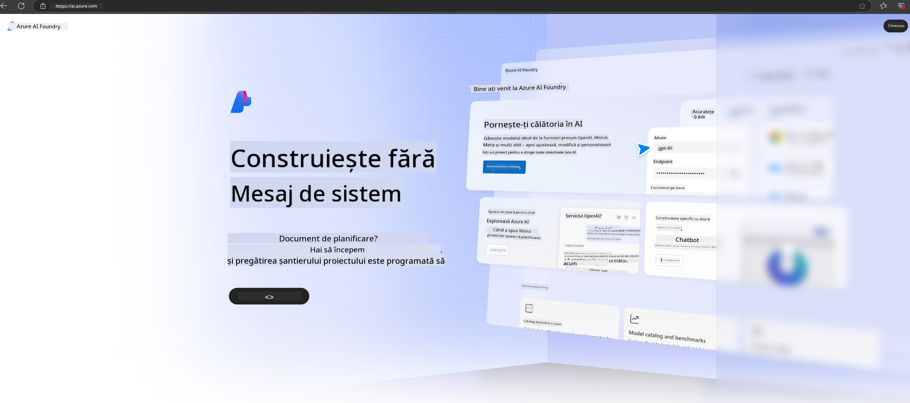

<!--
CO_OP_TRANSLATOR_METADATA:
{
  "original_hash": "3a1e48b628022485aac989c9f733e792",
  "translation_date": "2025-05-09T20:14:52+00:00",
  "source_file": "md/02.QuickStart/AzureAIFoundry_QuickStart.md",
  "language_code": "ro"
}
-->
# **Folosirea Phi-3 în Azure AI Foundry**

Odată cu dezvoltarea AI Generativ, ne dorim să folosim o platformă unificată pentru a gestiona diferite LLM și SLM, integrarea datelor enterprise, operațiuni de fine-tuning/RAG și evaluarea diverselor afaceri enterprise după integrarea LLM și SLM, astfel încât aplicațiile inteligente bazate pe AI generativ să fie implementate mai eficient. [Azure AI Foundry](https://ai.azure.com) este o platformă de aplicații AI generative la nivel enterprise.

Cu Azure AI Foundry, poți evalua răspunsurile modelelor mari de limbaj (LLM) și poți orchestra componentele aplicațiilor de tip prompt folosind prompt flow pentru performanțe mai bune. Platforma facilitează scalabilitatea, transformând cu ușurință prototipurile în producție completă. Monitorizarea și rafinarea continuă susțin succesul pe termen lung.

Putem implementa rapid modelul Phi-3 pe Azure AI Foundry prin pași simpli și apoi folosim Azure AI Foundry pentru a realiza Playground/Chat, fine-tuning, evaluare și alte activități legate de Phi-3.

## **1. Pregătire**

Dacă ai deja instalat [Azure Developer CLI](https://learn.microsoft.com/azure/developer/azure-developer-cli/overview?WT.mc_id=aiml-138114-kinfeylo) pe mașina ta, folosirea acestui template este la fel de simplă ca rularea acestei comenzi într-un director nou.

## Creare Manuală

Crearea unui proiect și a unui hub în Microsoft Azure AI Foundry este o metodă excelentă de a organiza și gestiona activitatea ta AI. Iată un ghid pas cu pas pentru a începe:

### Crearea unui Proiect în Azure AI Foundry

1. **Accesează Azure AI Foundry**: Conectează-te în portalul Azure AI Foundry.
2. **Creează un Proiect**:
   - Dacă ești deja într-un proiect, selectează „Azure AI Foundry” în partea stângă sus a paginii pentru a merge la pagina principală.
   - Selectează „+ Create project”.
   - Introdu un nume pentru proiect.
   - Dacă ai un hub, acesta va fi selectat implicit. Dacă ai acces la mai multe hub-uri, poți alege altul din lista derulantă. Dacă dorești să creezi un hub nou, selectează „Create new hub” și oferă un nume.
   - Selectează „Create”.

### Crearea unui Hub în Azure AI Foundry

1. **Accesează Azure AI Foundry**: Conectează-te cu contul tău Azure.
2. **Creează un Hub**:
   - Selectează centrul de Management din meniul din stânga.
   - Selectează „All resources”, apoi săgeata în jos de lângă „+ New project” și alege „+ New hub”.
   - În dialogul „Create a new hub”, introdu un nume pentru hub-ul tău (de ex. contoso-hub) și modifică celelalte câmpuri după preferință.
   - Selectează „Next”, revizuiește informațiile și apoi selectează „Create”.

Pentru instrucțiuni mai detaliate, poți consulta documentația oficială [Microsoft](https://learn.microsoft.com/azure/ai-studio/how-to/create-projects).

După ce ai creat cu succes, poți accesa studio-ul creat prin [ai.azure.com](https://ai.azure.com/)

Pe un singur AI Foundry pot exista mai multe proiecte. Creează un proiect în AI Foundry pentru a te pregăti.

Creează Azure AI Foundry [QuickStarts](https://learn.microsoft.com/azure/ai-studio/quickstarts/get-started-code)

## **2. Implementarea unui model Phi în Azure AI Foundry**

Apasă pe opțiunea Explore a proiectului pentru a intra în Catalogul de Modele și selectează Phi-3

Selectează Phi-3-mini-4k-instruct

Apasă pe 'Deploy' pentru a implementa modelul Phi-3-mini-4k-instruct

> [!NOTE]
>
> Poți selecta puterea de calcul în timpul implementării

## **3. Playground Chat Phi în Azure AI Foundry**

Accesează pagina de implementare, selectează Playground și poartă o conversație cu Phi-3 din Azure AI Foundry

## **4. Implementarea modelului din Azure AI Foundry**

Pentru a implementa un model din Catalogul de Modele Azure, urmează acești pași:

- Conectează-te în Azure AI Foundry.
- Alege modelul pe care vrei să îl implementezi din catalogul de modele Azure AI Foundry.
- Pe pagina de Detalii a modelului, selectează Deploy și apoi alege Serverless API cu Azure AI Content Safety.
- Selectează proiectul în care dorești să implementezi modelele. Pentru a folosi Serverless API, workspace-ul trebuie să fie în regiunea East US 2 sau Sweden Central. Poți personaliza numele implementării.
- În wizard-ul de implementare, selectează Pricing and terms pentru a afla detalii despre prețuri și termeni de utilizare.
- Selectează Deploy. Așteaptă până când implementarea este gata și vei fi redirecționat către pagina Deployments.
- Selectează Open in playground pentru a începe interacțiunea cu modelul.
- Poți reveni la pagina Deployments, selecta implementarea și nota URL-ul țintă al endpoint-ului și cheia secretă, pe care le poți folosi pentru a apela implementarea și a genera completări.
- Detaliile endpoint-ului, URL-ul și cheile de acces pot fi găsite oricând în fila Build, secțiunea Components, sub Deployments.

> [!NOTE]
> Reține că contul tău trebuie să aibă permisiunile rolului Azure AI Developer pe Resource Group pentru a putea efectua acești pași.

## **5. Folosirea Phi API în Azure AI Foundry**

Poți accesa https://{Numele proiectului tău}.region.inference.ml.azure.com/swagger.json prin Postman cu metoda GET și combina cu Key pentru a explora interfețele oferite

Poți obține foarte comod parametrii cererii, precum și parametrii răspunsului.

**Declinare a responsabilității**:  
Acest document a fost tradus folosind serviciul de traducere automată AI [Co-op Translator](https://github.com/Azure/co-op-translator). Deși ne străduim pentru acuratețe, vă rugăm să rețineți că traducerile automate pot conține erori sau inexactități. Documentul original în limba sa nativă trebuie considerat sursa autorizată. Pentru informații critice, se recomandă traducerea profesională realizată de un specialist uman. Nu ne asumăm răspunderea pentru eventualele neînțelegeri sau interpretări greșite care pot rezulta din utilizarea acestei traduceri.