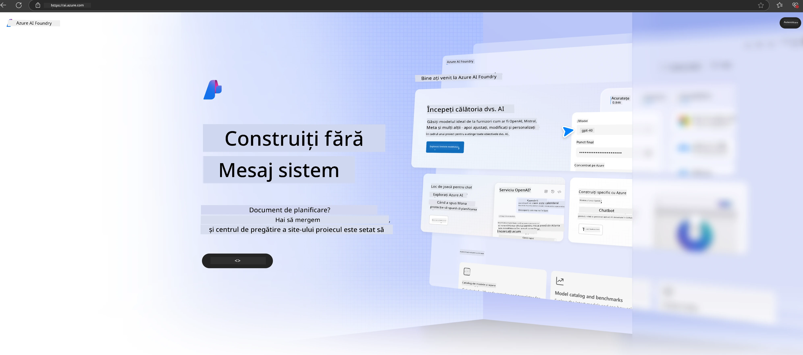

# **Folosirea Phi-3 în Microsoft Foundry**

Odată cu dezvoltarea AI Generativ, ne dorim să folosim o platformă unificată pentru a gestiona diferite LLM și SLM, integrarea datelor enterprise, operațiuni de fine-tuning/RAG și evaluarea diferitelor afaceri enterprise după integrarea LLM și SLM, etc., astfel încât aplicațiile inteligente bazate pe AI generativ să fie implementate mai eficient. [Microsoft Foundry](https://ai.azure.com) este o platformă de aplicații AI generative la nivel enterprise.

Cu Microsoft Foundry, poți evalua răspunsurile modelelor mari de limbaj (LLM) și poți orchestra componentele aplicațiilor de prompturi folosind prompt flow pentru performanțe mai bune. Platforma facilitează scalabilitatea pentru transformarea conceptelor demonstrative în producție completă cu ușurință. Monitorizarea continuă și rafinarea susțin succesul pe termen lung.

Putem implementa rapid modelul Phi-3 pe Microsoft Foundry prin pași simpli, apoi folosi Microsoft Foundry pentru a finaliza activități legate de Phi-3 precum Playground/Chat, Fine-tuning, evaluare și altele.

## **1. Pregătire**

Dacă ai deja instalat [Azure Developer CLI](https://learn.microsoft.com/azure/developer/azure-developer-cli/overview?WT.mc_id=aiml-138114-kinfeylo) pe calculatorul tău, folosirea acestui template este la fel de simplă ca rularea acestei comenzi într-un director nou.

## Creare manuală

Crearea unui proiect și a unui hub Microsoft Foundry este o metodă excelentă de a organiza și gestiona munca ta AI. Iată un ghid pas cu pas pentru a începe:

### Crearea unui proiect în Microsoft Foundry

1. **Accesează Microsoft Foundry**: Autentifică-te în portalul Microsoft Foundry.
2. **Creează un proiect**:
   - Dacă ești deja într-un proiect, selectează „Microsoft Foundry” în partea stângă sus a paginii pentru a merge la pagina principală.
   - Selectează „+ Create project”.
   - Introdu un nume pentru proiect.
   - Dacă ai un hub, acesta va fi selectat implicit. Dacă ai acces la mai multe hub-uri, poți alege altul din lista derulantă. Dacă dorești să creezi un hub nou, selectează „Create new hub” și oferă un nume.
   - Selectează „Create”.

### Crearea unui hub în Microsoft Foundry

1. **Accesează Microsoft Foundry**: Autentifică-te cu contul tău Azure.
2. **Creează un hub**:
   - Selectează Management center din meniul din stânga.
   - Selectează „All resources”, apoi săgeata în jos de lângă „+ New project” și alege „+ New hub”.
   - În dialogul „Create a new hub”, introdu un nume pentru hub-ul tău (ex: contoso-hub) și modifică celelalte câmpuri după preferință.
   - Selectează „Next”, verifică informațiile și apoi selectează „Create”.

Pentru instrucțiuni mai detaliate, poți consulta documentația oficială [Microsoft](https://learn.microsoft.com/azure/ai-studio/how-to/create-projects).

După crearea cu succes, poți accesa studio-ul creat prin [ai.azure.com](https://ai.azure.com/)

Pe un singur AI Foundry pot exista mai multe proiecte. Creează un proiect în AI Foundry pentru a te pregăti.

Creează Microsoft Foundry [QuickStarts](https://learn.microsoft.com/azure/ai-studio/quickstarts/get-started-code)

## **2. Implementarea unui model Phi în Microsoft Foundry**

Apasă pe opțiunea Explore a proiectului pentru a intra în Model Catalog și selectează Phi-3

Selectează Phi-3-mini-4k-instruct

Apasă pe „Deploy” pentru a implementa modelul Phi-3-mini-4k-instruct

> [!NOTE]
>
> Poți selecta puterea de calcul în timpul implementării

## **3. Playground Chat Phi în Microsoft Foundry**

Accesează pagina de implementare, selectează Playground și discută cu Phi-3 din Microsoft Foundry

## **4. Implementarea modelului din Microsoft Foundry**

Pentru a implementa un model din Azure Model Catalog, urmează acești pași:

- Autentifică-te în Microsoft Foundry.
- Alege modelul pe care dorești să îl implementezi din catalogul de modele Microsoft Foundry.
- Pe pagina de Detalii a modelului, selectează Deploy, apoi alege Serverless API cu Azure AI Content Safety.
- Selectează proiectul în care vrei să implementezi modelele. Pentru a folosi oferta Serverless API, spațiul tău de lucru trebuie să aparțină regiunii East US 2 sau Sweden Central. Poți personaliza numele implementării.
- În wizard-ul de implementare, selectează Pricing and terms pentru a afla detalii despre prețuri și condițiile de utilizare.
- Selectează Deploy. Așteaptă până când implementarea este gata și vei fi redirecționat către pagina Deployments.
- Selectează Open in playground pentru a începe interacțiunea cu modelul.
- Poți reveni oricând la pagina Deployments, selecta implementarea și nota URL-ul țintă al endpoint-ului și Secret Key, pe care le poți folosi pentru a apela implementarea și a genera completări.
- Detaliile endpoint-ului, URL-ul și cheile de acces pot fi găsite oricând navigând la fila Build și selectând Deployments din secțiunea Components.

> [!NOTE]
> Reține că contul tău trebuie să aibă permisiunile rolului Azure AI Developer pe Resource Group pentru a putea efectua acești pași.

## **5. Folosirea Phi API în Microsoft Foundry**

Poți accesa https://{Numele proiectului tău}.region.inference.ml.azure.com/swagger.json prin Postman GET și să îl combini cu Key pentru a afla detalii despre interfețele oferite

Poți obține foarte ușor parametrii cererii, precum și parametrii răspunsului.

**Declinare de responsabilitate**:  
Acest document a fost tradus folosind serviciul de traducere AI [Co-op Translator](https://github.com/Azure/co-op-translator). Deși ne străduim pentru acuratețe, vă rugăm să rețineți că traducerile automate pot conține erori sau inexactități. Documentul original în limba sa nativă trebuie considerat sursa autorizată. Pentru informații critice, se recomandă traducerea profesională realizată de un specialist uman. Nu ne asumăm răspunderea pentru eventualele neînțelegeri sau interpretări greșite rezultate din utilizarea acestei traduceri.